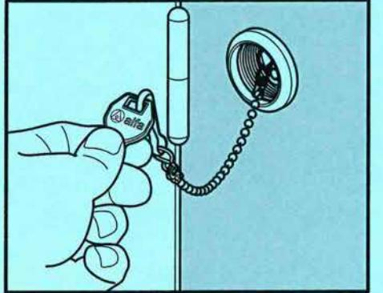
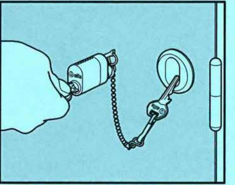
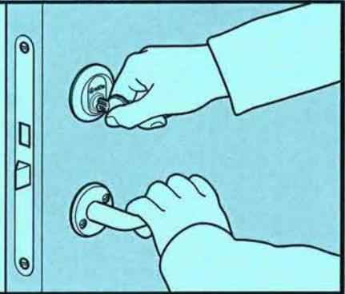

## Rationell fastighetsservice utan huvudnyckelproblem 20069 Gege Dörrnyckeltub

- 1. När fastighetens servicepersonal behöver tillträde till lägenheten, informeras den boende om anledning och tidpunkt. Om hyresgästen föredrar att inte vara hemma, hängs nyckeln till lägenhetslåset på en karbinhake på insidan av dörrnvckeltuben.

- 2. Servicepersonal öppnar dörrnyckeltuben med sin för fastigheten speciella tubnyckel, går in i lägenheten och utför arbetet.
OBS! Endast nyckeln/nvcklarna till dörren ska fästas i kedjan. Häng inte nyckelknippen i kedjan.

- 3. När arbetet är slutfört, låses lägenhetsdörren och den lånade nyckeln hängs tillbaka i dörrnyckeltuben som låses.
- 4. När den boende kommer hem tar denne bort nyckeln från dörrnyckeltuben. Utifrån kan ingen se om det finns en nyckel i tuben eller ej.

## Installationsanvisning för 20069 Gege Dörrnyckeltub

- 1. Kontrollera att dörrbladet är i sådan kondition att tuben kan monteras på ett tillfredsställande sätt.
- 2. För val av tub mät dörrbladets tjocklek. Tuben finns för 40-70 mm alt. 70-105 mm dörrtjocklek.
- 3. Markera ett centrumläge c:a 100 mm in på dörrens gångjärnssida och c:a 300 mm ned från överkant.
- 4. Borra ett genomgående hål på 47-48 mm med hålsåg "Starret" eller motsvarande.
- 5. Sätt in ytterdelen från utsidan med cvlinderurtaget i lod och med PAT till vänster.
- 6. Vid metalldörrar filas fyra hack i hålperiferien för ytterdelens fixeringsnabbar. Vid trädörrar slås ytterdelen plant mot dörrbladet med en plasthammare.
- 7. Applicera några droppar gängsäkring typ Locktite 275 eller motsvarande ytterst i innerdelens gänga.
- 8. Håll fast ytterdelen och gänga för hand på innerdelen så långt möjligt.
- 9. Slutgiltig åtdragning sker med Ventigrip 1 % " eller motsvarande (finns att beställa hos Kaba AB).
- 10. Kontrollera att ytterdelen fortfarande sitter i lod och att PAT är till vänster samt att cylindern går lätt att föra in, låsa, låsa upp och ta ut.
- 11. Sätt på plastlocket på insidan.

dormakaba

Kaba AB, Box 353, 631 05 Eskilstuna Tel. 016-16 15 00, Fax 016-16 15 73 info.se@kaba.com, www.kaba.se