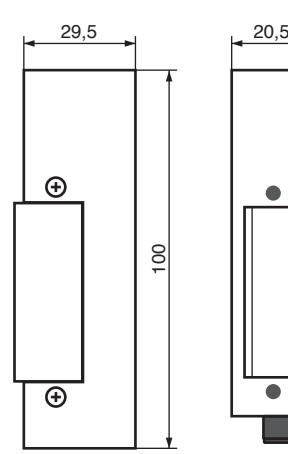
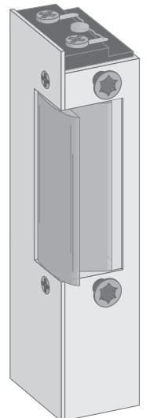

## Elslutbleck serie 100

Elslutbleck 100-serien.

Elslutbleck för fallås som passar dörrar med låga säkerhetskrav. T.ex. intern låsning i bostadsfastighet, kontor och industri. Brythållfastheten är 600 kg och elslutblecken har inbyggt transientskydd (skyddsdiod). Polfri anslutning. Används tillsammans med enkel- eller dubbelfallås beroende på val av monteringsstolpe. Passar ihop med monteringsstolpar serie S-.

Observera att 100-serien inte får användas som dörrigenhållande beslag i brandklassad dörr. 300-serien är för brandklassade dörrar.

- Rättvänd funktion, 150- & 160- (låst strömlöst)
- Omvänd funktion, 151- & 161- (öppet strömlöst)
- Impuls funktion, 152- & 162- (öppet efter kort strömimpuls)
- Finns med indikering, låskolvskontakt
- Inbyggt transientskydd (skyddsdiod)
- Polfri anslutning

| Modell | Funktion                    | Spänning | Strömförbrukning |  |
|--------|-----------------------------|----------|------------------|--|
| 150-12 | rättvänd                    | 12V DC   | 170 mA           |  |
| 150-24 | rättvänd                    | 24V DC   | 100 mA           |  |
| 160-12 | rättvänd m. låskolvskontakt | 12V DC   | 170 mA           |  |
| 160-24 | rättvänd m. låskolvskontakt | 24V DC   | 100 mA           |  |
| 151-12 | omvänd                      | 12V DC   | 170 mA           |  |
| 151-24 | omvänd                      | 24V DC   | 100 mA           |  |
| 161-12 | omvänd m. låskolvskontakt   | 12V DC   | 170 mA           |  |
| 161-24 | omvänd m. låskolvskontakt   | 24V DC   | 100 mA           |  |
| 152-12 | impuls                      | 12V AC   | 330 mA           |  |
| 152-24 | impuls                      | 24V AC   | 210 mA           |  |
| 162-12 | impuls m. låskolvskontakt   | 12V AC   | 330 mA           |  |
| 162-24 | impuls m. låskolvskontakt   | 24V AC   | 210 mA           |  |

47

| Tekniska data för elslutbleck, 100-serien:    |                                                        |                                                                                                                                          | Elslutbleck serie 100 |  |  |
|-----------------------------------------------|--------------------------------------------------------|------------------------------------------------------------------------------------------------------------------------------------------|-----------------------|--|--|
|                                               |                                                        |                                                                                                                                          |                       |  |  |
| Brythållfasthet på vridfall:                  |                                                        | 600 kg                                                                                                                                   |                       |  |  |
| Anslutning:                                   |                                                        | Polfri, +/- spelar ingen roll. Inbyggt transientskydd (skyddsdiod).                                                                      |                       |  |  |
| Funktion:                                     | Omvänd - Impuls -                                   | Rättvänd - Låst i spänningslöst läge. Öppet i spänningslöst läge. Öppnas med kort spänningsimpuls och är öppet till dörren öppnas. |                       |  |  |
| Montagestolpar:                               |                                                        | ROBUST montagestolpar serie S-.                                                                                                          |                       |  |  |
| Kopplingsschema:                              |                                                        |                                                                                                                                          |                       |  |  |
| Inbyggt transientskydd, polfri anslutning. |                                                        | 150- 151- 152-                                                                                                                     |                       |  |  |
| Inbyggt transientskydd, polfri anslutning. |                                                        | 160-                                                                                                                                     |                       |  |  |
| växlande kontakt, 2A.                         | Låskolvskontakt, polfri                                | 161- 162-                                                                                                                             |                       |  |  |
| Monteringstips:                               |                                                        |                                                                                                                                          |                       |  |  |
|                                               | Montagestolpens glidplös Elslutbleckets vridfall | Glappavstånd A B Dörrspringa                                                                                                    |                       |  |  |
| Justera vridfallet så det stoppar innan       |                                                        | Mellan vridfall (A) och låskolv (B) ska Vid behov, låsfett (sparsamt) på                                                              |                       |  |  |

Justera vridfallet så det stoppar innan kanten på montagestolpens glidplös. Låskolven ska glida av vridfallet och ner på montagestolpens glidplös.

Mellan vridfall (A) och låskolv (B) ska det vara 0,5-1,5 mm. Låskolven får inte spänna mot vridfallet. Dörrspringan skall vara 2-5 mm.

Vid behov, låsfett (sparsamt) på låskolv, vridfall och glidplös. Borr- och filspån är skadligt. Elslutblecket är inte vattentätt.

