# Manual ASSA ABLOY Eltryckeslås

#### 813C-50, 815C-50, 820C-50, 825C-50, 835C-50

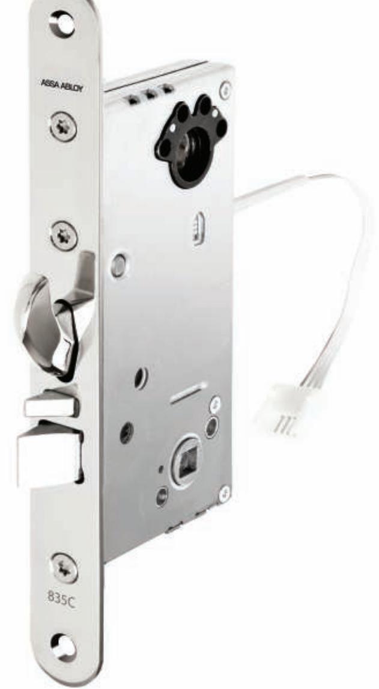

# Innehåll

#### Inkoppling

Inställning tryckesfunktion Vända fall 813C-50 – 835C-50 Fabriksåterställning Tekniska data Tillbehör Underhåll av Eltryckeslås Klass 3 SSF 3522 Mode Tillbehör SSF 3522

## Installation

- 1. Markera ut centrumlinje A (stolpe) när låshusets position i dörren har bestämts.
- 2. Märk ut B och C.
- 3. Borra 82 mm djupt med en Ø20 mm träborr för dorndjup 50. Hugg med stämjärn rent i hålet så att låshuset lätt går in. Borra genom dörren med en Ø42 mm borr för cylinderhålet och tryckeshålet (B + C ).

Hugg med stämjärn ut för låsstolpen – 3 mm djupt för, stolpens bredd är 22 mm Mät ut vart slutbleck ska sitta. Borra 6 st Ø22 mm hål 26 mm djupt för 1487-X. Hugg rent med stämjärn så att slutblecket går i urtaget. Hugg med stämjärn ur ytterkonturen. 4 mm för 1487-X. Förborra fästhålen för skruvarna (4st Ø3 mm borr).

Om den interna dörrlägesgivaren ska användas monteras magneten i slutblecket. Magneten ska sitta i samma höjd som datummärkningen på låsstolpen.

**Assa rekommenderar 3 mm mellan låsstolpe och slutbleck. Dörren ska justeras så att det inte uppstår listtryck på hakregeln.**

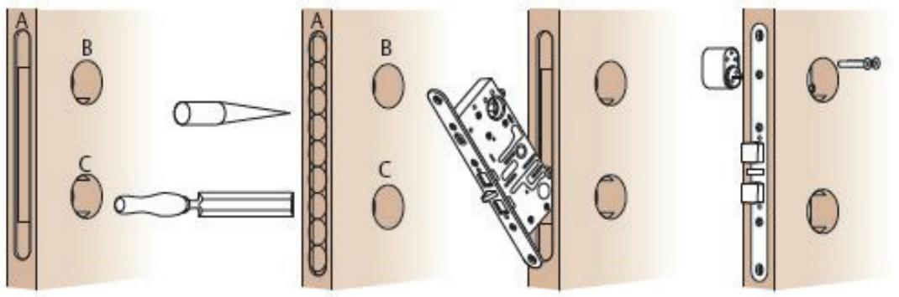

# Inkoppling

Inkoppling till Hi-O bussen sker med fyra kablar, två för spänning, två för kommunikation. Använd färdig kontakterad kabel EA226 (10 m) vid installation. Kabeln kopplas in på valfritt ställe på Hi-O bussen.

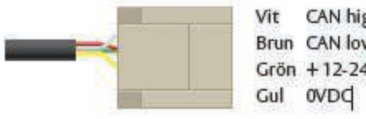

#### Vända fall 813C-50, 815C-50, 820C-50, 825C-50, 835C-50

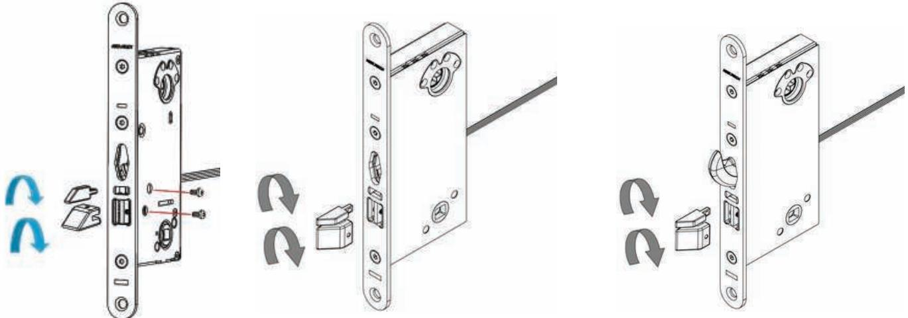

- 1. Tryck in fallkolv och förreglingsfall så långt att torxskruvarna blir synlig i hålen i täckplåt på låskista. (Torxskruv TX5)
- 2. Skruva ut torxskruven för fallkolv och förreglingsfall.
- 3. Dra fallkolv och förreglingsfall framåt ur låskistan.
- 4. Vänd fallkolv och förreglingsfall 180 grader för att anpassa efter hängning på dörrblad
- 5. Tryck in fallkolv och förreglingsfall så långt att gängade hålen för torxskruvarna blir synlig i hålen i täckplåt på låskista
- 6. Dra fast skruvarna

# Inställning rättvänd/omvänd funktion 813C-50, 815C-50, 820C-50, 825C-50, 835C-50

Justering av rättvänd/omvänd funktion. Denna funktion justeras via DIP switch på ovansidan utav låshuset.

Ställ switch enligt önskad funktion,

- Rättvänd funktion = låst spänning av

- Omvänd = låst spänning på.

Detta utförs med låset i handen och inställningen kommer att aktiveras när låset strömsätts.

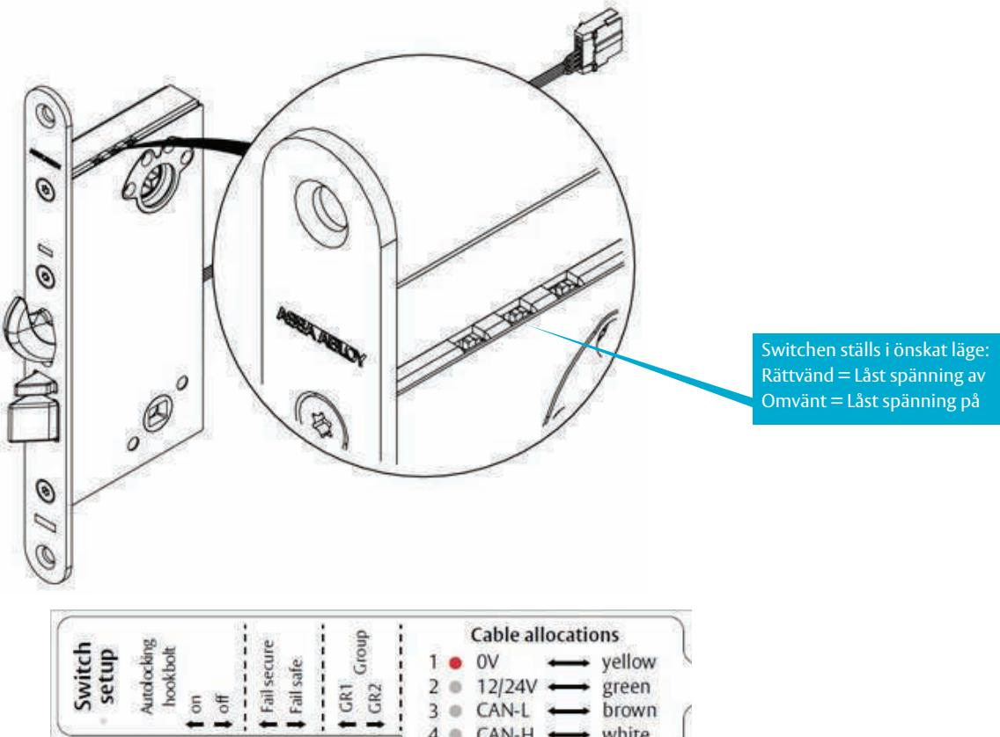

# Inställning tryckesfunktion 813C-50, 815C-50, 820C-50, 825C-50, 835C-50

För att kunna justera mekanisk och elektrisk sida måste låset stå i fail safe läge. Efter man har ställt låset i fail safe läge stäng av strömmen. Då kommer skruvarna att synas i hålet.

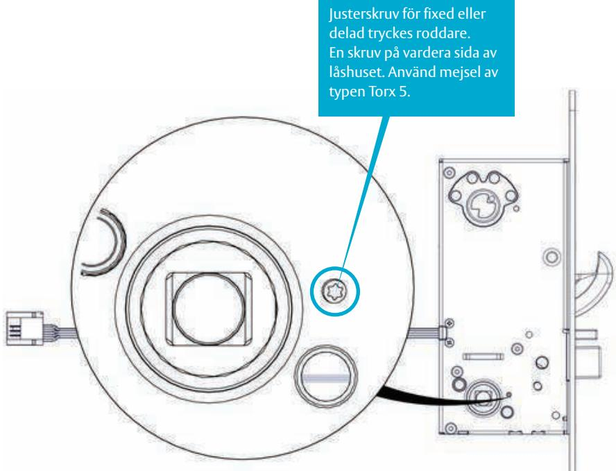

**Justering av skruvar för önskad funktion** För att ställa in låset som split- eller fixed spindle ställs Torx 5 skruvarna i följande läge. Obs! dra till stoppläge:

#### **Fixed Spindle**

Låst elektrisk in- och utsida. Dra skruvarna till ytterläge. OBS! dra till stoppläge.

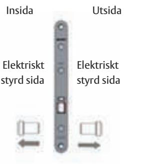

#### **Split Spindle låst utsida**

Låst utsida mekaniskt aktiv insida skruva in den sidan som ska vara mekaniskt inkopplad. OBS! dra till stoppläge.

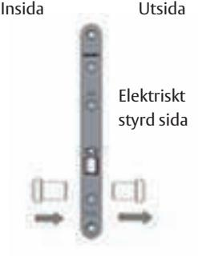

#### **Split Spindle låst insida**

Låst insida, mekaniskt aktiv utsida skruva in den skruven som ska vara mekaniskt inkopplad. OBS! dra till stoppläge.

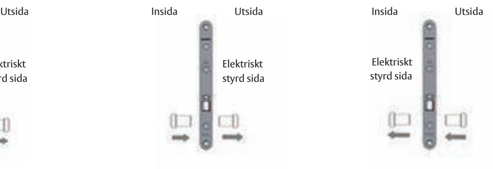

# Dörrlägesgivaren

Sensorn är placerad i höjd med datummärkningen på stolpen.

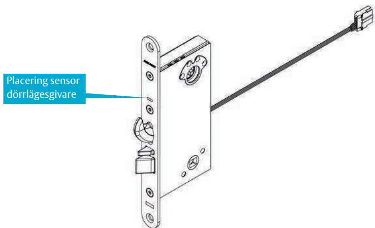

## Initiering utav låshus och I/O Box

- 1. Anslut låshuset till I/O boxen
- 2. Ställ in funktionsdippar på låshuset i önskad funktion
- 3. Spänningssätt I/O boxen, LED dioden blinkar grönt/rött det indikerar att strömmen är på.
- 4. Ställ DIP 1 i on läge. Ställ konfigurationsdip 2 enligt önskad funktion.
- 5. När den röda lysdioden lyser fast är Hi-O bussen säker och krypterad.

#### Initiering utav låshus och DAC564/DAC530

- 1. Anslut låshuset och DAC.
- 2. Se till att termineringsbygeln i DAC sitter i lägen ON.
- 3. Ingången "Door monitor" ska vara byglad och Button ingången öppen, i de flesta fall. (För mer information, se Initieringsmatris).
- 4. Ställ samtliga DIP-omkopplare i läge OFF, gäller i de flesta fall. (För mer information, se initieringsmatris.)
- 5. Slå på spänningen. (DWG blå LED börjar blinka. Vänta till dess blå DWG blinkar fort, kan max ta upp till 3 minuter. BRYT INTE spänningen under initieringen.
- 6. När Gul PWR LED lyser och blå LED blinkar fort är initieringen klar. (Om blå LED blinkar fort och gul PWR LED inte har tänts har initieringen misslyckats).
- 7. Bryt spänningen
- 8. Sätt DIP8 i läge ON för Stand alone läge. Se även sidan 12 för olika drift/funktionslägen.
- 9. Sätt på spänningen och kontrollera funktionen

### Fabriksåterställning

- 1. Håll låset i handen med regel inne för modeller 820, 825 och 835 (olåst).
- 2. Slå av spänningen till låset.
- 3. Se till att dörrsensorn inte är aktiverad. Dip 2 ska vara i off läge.
- 4. Slå på spänningen.
- 5. Inom 30 sekunder, toggla/växla gruppswitchen 6 gånger fram och tillbaka.
- 6. När lysdioden lyser med fast sken är låset oinitierat.

#### **Förklaring till lysdiod**

Fast sken = Oinitierad Släckt = Initierad

Blink 2Hz (blinkning) = Initierad mot annan DAC eller I/O Box Blink 20Hz (flimrar) = Timeout vänta 240 sek innan upplåsning.

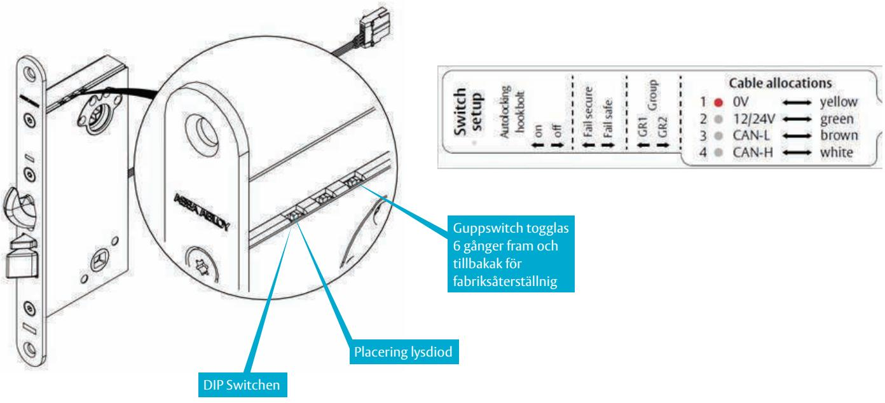

#### **Villkor för deadlock 820C/825C**

För 820C/825C kan man ändra villkoret när låset ska rapportera deadlock. Den funktionen kan man använda till om man vill hindra upplåsning utifrån när det är mekaniskt låst inifrån. Villkorsändringen görs vid DIP switchen för hookbolt deadlock på låshuset.

När dippen är OFF är villkoret för deadlock förreglingsfallen. När man sätter dippen On är villkoret regel låst.

## Tekniska data

Låstyper: ASSA Eltryckeslås 813C, 815C, 820C, 825C, 835C

#### **Strömförbrukning**

|                                                                       | Matningsspänning (V)                                                                               | Ström (A)                                                                                           | Effekt (W) |                                                                         |  |  |  |  |
|-----------------------------------------------------------------------|----------------------------------------------------------------------------------------------------|-----------------------------------------------------------------------------------------------------|------------|-------------------------------------------------------------------------|--|--|--|--|
| Operating (vilande)                                                   | 12,0 / +20 grader                                                                                  | 0,081                                                                                               | 0,97       |                                                                         |  |  |  |  |
| Operating (vilande)                                                   | 24,0 / +20 grader                                                                                  | 0,044                                                                                               | 1,06       |                                                                         |  |  |  |  |
| Inkopp-ling/urkoppling trycke                                         | 12,0 / +20 grader                                                                                  | 0,22                                                                                                | 2,64       |                                                                         |  |  |  |  |
| Inkopp-ling/urkoppling trycke                                         | 24,0 / +20 grader                                                                                  | 0,095                                                                                               | 2,28       |                                                                         |  |  |  |  |
| Utlåsning hakregel                                                    | 12,0 / +20 grader                                                                                  | 0,58                                                                                                | 6,96       |                                                                         |  |  |  |  |
| Utlåsning hakregel                                                    | 24,0 / +20 grader                                                                                  | 0,33                                                                                                | 7,9        |                                                                         |  |  |  |  |
| Kablage:                                                              | typ EA226 längd 10m max längd 50m                                                            |                                                                                                     |            |                                                                         |  |  |  |  |
| Kabellängd Kabelarea vid 12V:                                         | 20m 0,3 mm2 30m 0,4 mm2 40m 0,5 mm2 50m 0,6 mm2                                           |                                                                                                     |            |                                                                         |  |  |  |  |
| Förpackningar:                                                        |                                                                                                    |                                                                                                     |            |                                                                         |  |  |  |  |
| Låshus:                                                               | Låshus, borrskydd (835C-50). Manualen finns via QR kod                                             |                                                                                                     |            |                                                                         |  |  |  |  |
| Komplett sats:                                                        |                                                                                                    | Låshus, borrskydd, I/O box 350, kabel EA226, slutbleck, magnet, träskruv, kabelöverföring EA281. |            |                                                                         |  |  |  |  |
| ARX sats:                                                             |                                                                                                    | Låshus, anslutningskabel EA226 och magnet för slutbleck.                                            |            |                                                                         |  |  |  |  |
| POE:                                                                  |                                                                                                    |                                                                                                     |            | Låshus 835C ska inte används tillsammans med POE och undercentral 9101. |  |  |  |  |
| Tillbehör                                                             | 813C-50 815C-50 825C-50 820C-50 825C-50 835C-50                                     |                                                                                                     |            |                                                                         |  |  |  |  |
| Cylindertyp                                                           | Rund, oval                                                                                         |                                                                                                     |            |                                                                         |  |  |  |  |
| Slutbleck                                                             | 1487-1, -2, -3, -4,-5                                                                              |                                                                                                     |            |                                                                         |  |  |  |  |
| Kabel                                                                 | EA226                                                                                              |                                                                                                     |            |                                                                         |  |  |  |  |
| Kabelöverföring                                                       | EA281                                                                                              |                                                                                                     |            |                                                                         |  |  |  |  |
| Vred                                                                  | 256 vred, dubbel cylinder rund/oval, magnetvred                                                    |                                                                                                     |            |                                                                         |  |  |  |  |
| Cylinderbehör Öppningsbeslag Trycke Std / Förstärkningsbehör | 256 alt 3212 beroende på konfiguration 8065 till rund vredcylinder alt 179 handtag – 4292 |                                                                                                     |            |                                                                         |  |  |  |  |

# Viktig information och underhåll

Det viktigaste är att följa monteringsanvisningen och inte avvika från den utan att först rådfråga oss på ASSA ABLOY.

#### **Garantin förfaller om:**

- Produkten är felaktigt monterad.
- Produkten är öppnad (sigillet brutet) eller om kablar/kontakter klippts av.
- Installerad med tillbehör eller delar som inte rekommenderats av ASSA ABLOY.

#### **Underhåll:**

- Se till att monterade cylindrar, vred och trycken fungerar tillfredsställande.
- Smörj och/eller justera vid behov med ASSA ABLOYs rekommenderade låsfett.
- Elektriska delar behöver inget underhåll.
- Fallen på låshuset bör smörjas minst två gånger om året. Högfrekvent användning av låsen kräver underhåll med tätare intervall.
- Det är också viktigt att underhålla och vid behov, justera dörrstängare och gångjärn för att säkerställa en korrekt stäng-ning av dörren. En bra dörrfunktion är en viktig förutsättning för en bra låsfunktion.

#### **Viktig information**

- Använd inte smörjmedel med grafit eller lösningsmedel, använd endast smörj-medel för elektriska lås från ASSA ABLOY.
- Säkerhetsegenskaperna på denna produkt är avgörande för dess överensstämmelse med EN 14846 och SSF3522-1093.
- Ingen modifiering eller ändring av något slag annat än de som beskrivs i denna instruktion är tillåtna.
- Låshuset är avsett att sitta i enkel eller pardörr**, trä, aluminium eller ståldörr. Dörren får inte väga mer än 200 Kg
- Beroende på dörrtyp kan olika infästningsskruvar behövas.
- * Brandprovet utfördes på glasad oisolerad dörr bestående utav stålprofiler. Låset som testades var ett 835C-50.

** Om låset används i en pardörr ska man använda en koordinator

# Certifikat och Boxning

| Låshus    | Kort beskrivning                                            | CE cert    | SSF 3522 klass 3 | SS-EN 14846 |
|-----------|-------------------------------------------------------------|------------|------------------|-------------|
| 813C-50   | Manual latch bolt                                           | CPR 21-524 |                  |             |
| 815C-50   | Manual latch bolt                                           | CPR 21-524 |                  |             |
| 820C-50   | Manual hook bolt and manual latch bolt                      | CPR 21-524 | 21-525           |             |
| 825C-50   | Manual hook bolt, single hand opening, cylinder override | CPR 21-524 | 21-525           |             |
| 835C-50   | Auto hook bolt, single hand opening, cylinder override   | CPR 21-524 | 21-525           |             |
| 835C      | 3 X 8 F 0 L 5 1 3                                           |            |                  |             |
| 820C,825C | 3 X 8 F 0 L 3 1 3                                           |            |                  |             |
| 815C,813C | 3 X 8 F 0 L 1 1 3                                           |            |                  | SBSC 21-563 |

#### Klass 3

För att uppfylla klass 3 ska följande var uppfyllt. För klass 3 krävs att styrenheten DAC 564 eller I/O Box 350 är installerad i ett skyddat utrymme med minst klass 3 låsning.

Styrenheten DAC564 eller I/O Box 350 ska vara installerad i SSF 3522 mode.

#### SSF 3522 Mode

För att installera ett 835C-50 i SSF 3522 mode ska man göra så här.

1. Initiera låshuset

2. Stäng av strömmen

3. Sätt Dip switch 3 i On läge

4. Sätt på strömmen

I SSF 3522 mode kommer reläet då att få följande egenskaper:

Relä "Deadlock" Låsindikering, aktiv i 15 sekunder vid låst.

Relä "Inside handle" Aktiveras när det inre handtaget är nere.

Relä "Error" aktiveras för samma fel men faller efter 120 se-kunder.

Relä "forced" Indikerar olåst dörr, utgången faller efter 120 sekunder.

## Tillbehör SSF 3522

Samtliga komponenter tillhörande låsenheten (såsom låshus, slutbleck och dörrförstärkningsbehör) skall minst ha samma klassning för att hela låsenheten skall kunna klassas enligt SSF 3522.

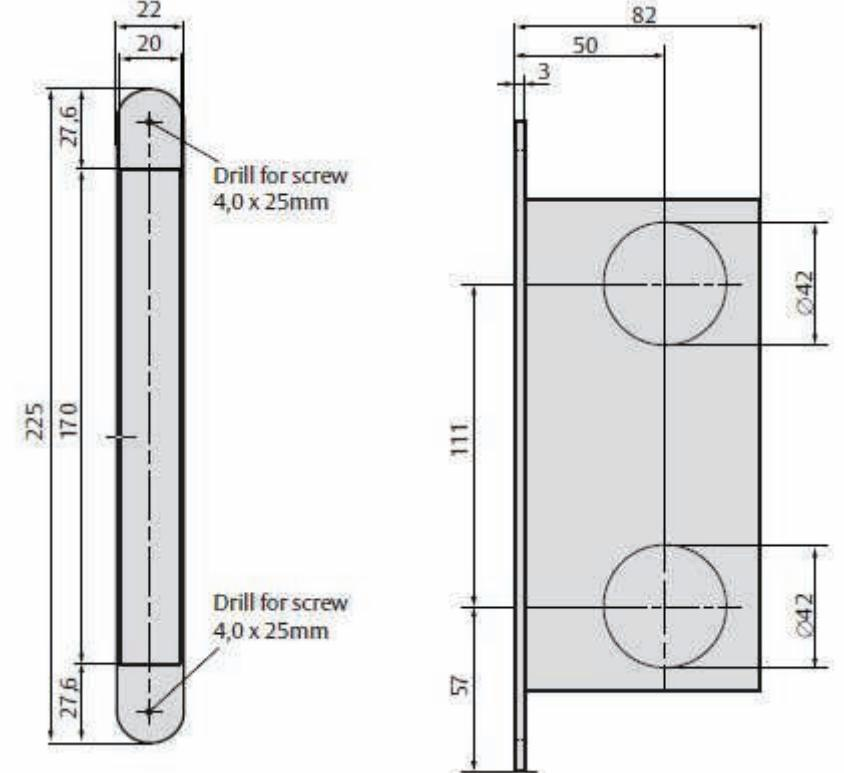

#### DAC564

#### **Inkoppling** 813C, 815C, 820C, 825C, 835C med DAC564

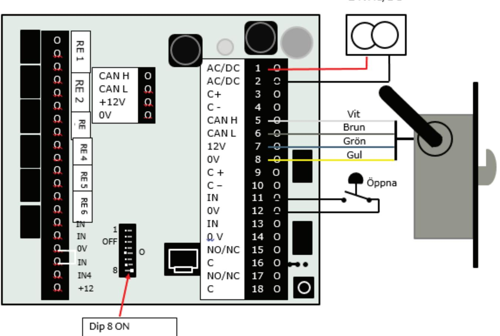

#### **Initiering**

- 1. Koppla in låset i DACen på plint 5-8.
- 2. Se till att alla dippar är off.
- 3. Slå på strömmen.
- 4. Den blåa leden börjar blinka.
- 5. När den gula PWR tänds och den blåa leden börjar flimmra är låset initierat.
- 6. Stäng av strömmen.
- 7. Sätt dip 8 i onläge.
- 8. Sätt på strömmen.

# Inkoppling spärrad öppnarknapp 825C med I/O Box

#### **Koppling**

- 1. Se till att DIPen på låshuset är satt till off för Auto hookbolt.
- 2. Koppla in en kabel från C på dead lock relät. Till unlock ingången.
- 3. Koppla från NO på deadlock relät till öppnar knappen.
- 4. Från öppnar knappen dra kabeln till unlock ingången.

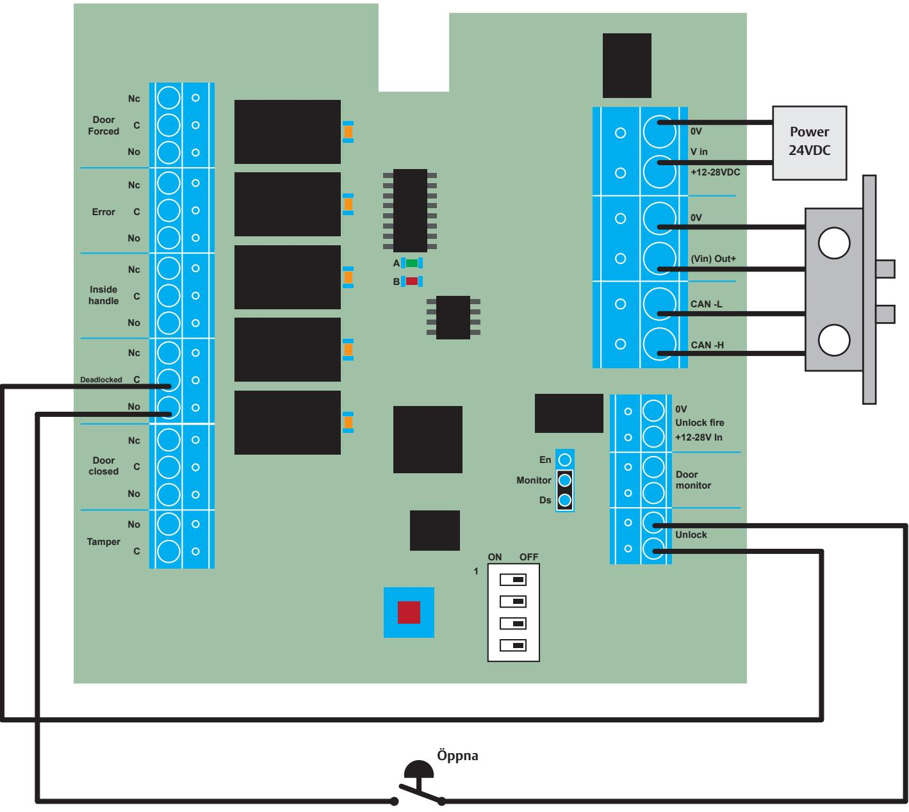

# Inkoppling stand alone med I/O Box

Initiering

- 1. Ställ funktions dipparna på låshuset i önskad funktion.
- 2. Anslut låset.
- 3. Spänningsätt I/O box 350.
- 4. Sätt Dip 1 i ON. Ställ övriga dippar enligt tabell.
- 5. Grön börjar blinka när initieringen börjar.
- 6. Röd lyser konstant när initeringen är klar.

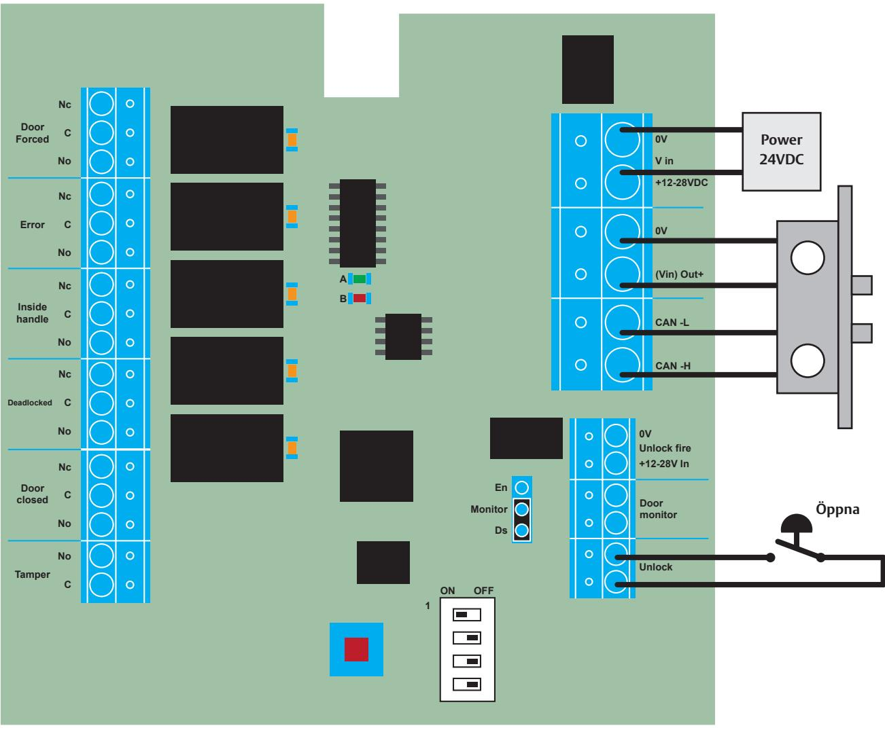

| Tekniska specifikationer       |                                                                 |
|--------------------------------|-----------------------------------------------------------------|
| Artikelnummer                  | S55665710085                                                    |
| Matningsspänning               | 12-24 V DC (min 11V,max27,8V DC)                                |
| Strömförbrukning               | 12: Medel 40mA Max 66mA                                         |
| vid                            | 27,8V Medel 20mA Max 30mA                                       |
| märk ström begränsad till ≤ 2A | Använd en low Voltage (SELV) kompatibel strömkälla (LPS) med en |
| Kabel                          | 3 m AWG26                                                       |
| Hi-O Kabellängd                | Kabelgren längd: Max 10 m Totalt: Max 50m                    |
| Temperatur drift               | - 30°C till + 70°C                                              |
|                                | Under -30°C måste läsaren värmas externt                     |
| Luftfuktighet drift            | 5% till 95%                                                     |
| Dimension                      | 9x12x4cm                                                        |
| IP                             | 34                                                              |
| Lagring och transport          | Temperatur: -50°C till 70°C (-58°F to 158°F)                 |
|                                | Luftfuktighet 5 % to 95 %                                       |
|                                |                                                                 |

**0V**

**V in**

| Vit  | CAN-H      | Anslutning till Hi-O buss |
|------|------------|---------------------------|
| Brun | CAN-L      |                           |
| Grön | +12-24 VDC | Matning lås via avsäkrad  |
| Gul  | 0V         | enhet                     |
|      |            |                           |

# **Parningssekvensbeskrivning Para ihop lås til l I/O Box350 på Hi-O-bussen**

- 
- 1. Ställ in funktionsdippar på låshuset i önskad funktion
	- 2. Anslut Hi-O-låset till I/O Box350 3. Spänningsätt I/O Box350, blinkande grön & röd LED
		- indikerar att strömmen är på
			- 4. Ställ DIP 1 på ON. Ställ konfigurations DIP2 beroende på önskad funktion. Se tabell 5. Grön börjar blinka när initieringen startar!
				-
- 6. Röd lyser konstant när initieringen är klar 7. När den gröna lysdioden släcks och den röda lysdioden lyser fast är

# Hi-O-bussen säker och krypterad.

 I låsets överkant vid DIP omkopplarna finns en röd LED, denna LED lyser när låset är oparat och släcker när låset är parat och krypterat.

lngångama Unlock och Unlock fire arbetar parallellt. Det innebär att båda

ingångarna måste vara opåverkade för att låset ska låsa.

| När ingången är spänningssatt låser låset upp på samma sätt Extern magnet och låshusets dörrbladsgivare arbetar i serie. Båda måste vara påverkade för att dörren ska betraktas som OBS! för att ingången ska vara aktiv, flytta jumpern från läge Ingången styrs med en extern spänning mellan 12-28VDC. Dörren betraktas som stängd när ingången är sluten. som om man sluter ingången Unlock. Öppnar låset när ingången sluts Dis till läge En. stängd. |
|---------------------------------------------------------------------------------------------------------------------------------------------------------------------------------------------------------------------------------------------------------------------------------------------------------------------------------------------------------------------------------------------------------------------------------------------------------------------------------------|
|                                                                                                                                                                                                                                                                                                                                                                                                                                                                                       |
| Unlock fire Ingångar monitor Unlock Nc C No No C Door Tamper closed Door !                                                                                                                                                                                                                                                                                                                                                                     |

|    |                           |                  | A B   |                             |                       |    | Monitor En             | Ds       | OFF ON 1 |  |
|----|---------------------------|------------------|----------|-----------------------------|-----------------------|----|---------------------------|----------|----------------|--|
|    |                           |                  |          |                             |                       |    |                           |          |                |  |
| Nc | C No Forced Door | Nc C Error | No Nc | C No handle Inside | Nc C Deadlocked | No | Nc C closed Door | No No | C Tamper    |  |
|    |                           |                  |          |                             |                       |    |                           |          |                |  |

| 16 |  |
|----|--|

|               | I/O Box350 är en kopplingsplint som passar till 813C,815C |                |
|---------------|-----------------------------------------------------------|----------------|
| Om I/0 Box350 |                                                           | 820C,825C,835C |

# Hi-O installation

 Hi-O enheter är enkla att installera, alla en heter ansluts parallellt med hjä lp av fyra trådar. En heter på Hi-O bussen får sin matningsspänning via 1/0 Box350

# Indikeringar På I/O Box350

 Enheten har en grön samt en röd LED. Funktionen för dessa beskrivs i tabellen nedan för de olika faserna vid konfiguration samt i drift.

| Indikeringar vid uppstart |                                                                            |
|---------------------------|----------------------------------------------------------------------------|
| Grön LED                  | enheten väntar på ett att para låset Blinkar i en sekundersintervaller, |
|                           | Hi-O-enheter hittade på Hi-O-bussen Lyser stadigt:                      |
| Röd LED                   | Enheten är inte initialiserad på Hi                                        |
| Lyser inte vid uppstart   | O-buss                                                                     |
| Röd LED                   | Enheter är låst till en specifik Hi-O                                      |
| Lyser vid uppstart        | buss, röd indikerar att Iåshuset är                                        |
|                           | parat och krypterat.                                                       |
|                           |                                                                            |

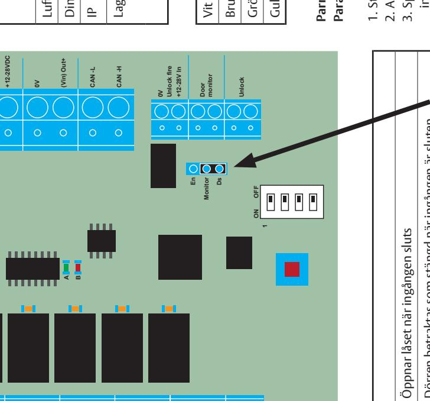

| System EAC                                                                                                                                                                         |  |
|---------------------------------------------------------------------------------------------------------------------------------------------------------------------------------------|--|
|                                                                                                                                                                                       |  |
| 24VDC door unlocked Power Power in = +12-28VDC (Vin) Out+ CAN -H Unlock fire CAN -L +12-28V In monitor V in Unlock 0V 0V Door 0V      |  |
| Monitor Ds En OFF ON 1                                                                                                                                                 |  |
| A B                                                                                                                                                                                |  |
| Nc C No Nc C No Nc C No Nc C No Nc C No No C Deadlocked Tamper Forced handle closed Inside Error Door Door |  |
| m AC Syste E                                                                                                                                                                 |  |

Dörr forcerad Nc

Dörr forcerad C

Dörr forcerad No

Error Nc

Error C

Error No

Trycke Nc

Trycke C

Trycke No

Deadlocked Nc

Deadlocked C

Deadlocked No

Stängd dörr Nc

Stängd dörr C

Stängd dörr No

Sabotage No

Sabotage C

| Funktion SSF3522          |                                                       | Reläet faller efter 15 sekunder                                                                                             |                                                                   | SSF3522: reläet drar för samma typ av fel men faller efter 120 sekunder.                                                                                                                                                                                                        | utgången faller efter 120Sekunder funktion och indikerar olåst dörr, I SSF3522 mode byter utgången Door Forced:                                                                                 |
|---------------------------|-------------------------------------------------------|-----------------------------------------------------------------------------------------------------------------------------|-------------------------------------------------------------------|------------------------------------------------------------------------------------------------------------------------------------------------------------------------------------------------------------------------------------------------------------------------------------|----------------------------------------------------------------------------------------------------------------------------------------------------------------------------------------------------------|
| Funktion Standard Relä | Reläet är draget när dörren är stängd Stängd dörr: | Deadlock: Speglar regelns läge:                                                                                             | Reläet aktiveras när det inre handtaget är nere Insidestrycke: | Röd LED blinkar med ensekunders blink 1Hz, vid kommunikations fel. Error: Aktiveras om låset inte lyckas låsa eller om det är kommunika Samtliga övriga reläer faller vid kommunikationsfel och återtar det gällande läget vid kommunikation. tionsfel på Hi-O bussen. | Se beskrivning vid DIP 4 Door Forced:                                                                                                                                                                 |
| Funktion                  | Para Hi-O-enheterna                                   | Om DIP2 är ON under parningen: Deaktiveras Aktiverar/Deaktiverar dörrlägesgivaren i låset dörrlägesgivaren i låshuset | DIP = OFF normal mode:                                            | DIP = ON, Utgångar verkar enligt kraven i SSF3522                                                                                                                                                                                                                               | DIP = ON: Utgången forcerad dörr kommer att aktiv efter att dörren har forcerats. Utgången DIP = OFF: Utgången Dörr forcerad, förbli återställs via Unlock-ingången. falla när dörren stängs |
| DIP                       | 1                                                     | 2                                                                                                                           | 3                                                                 |                                                                                                                                                                                                                                                                                    | 4                                                                                                                                                                                                        |

ASSA ABLOY Opening Solutions Sweden P.O. Box 371 SE-631 05 Eskilstuna Sweden Phone +46 (0)16 17 70 00 Fax +46 (0)16 17 70 40

Customer support: Phone intl. +46 16 17 71 00 Phone nat. 0771 640 640 Fax +46 (0)16 17 73 72 e-mail: helpdesk.se.openingsolutions@assaabloy.com www.assaabloyopeningsolutions.se