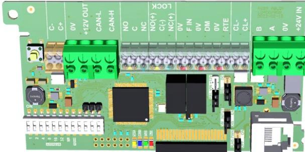
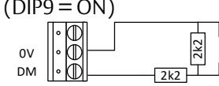
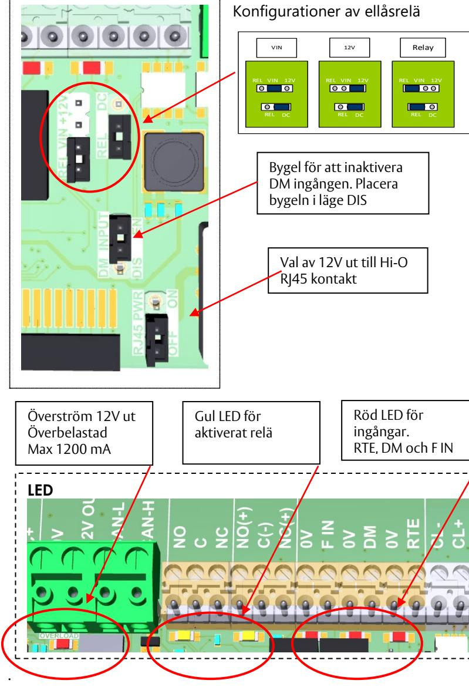
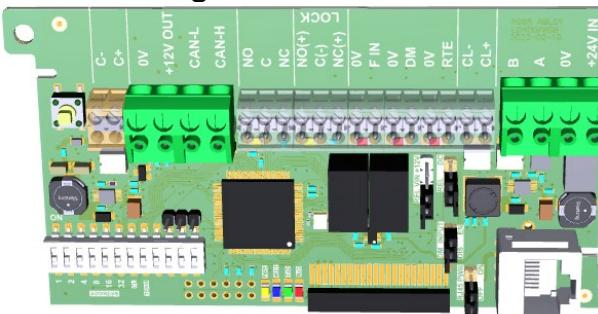
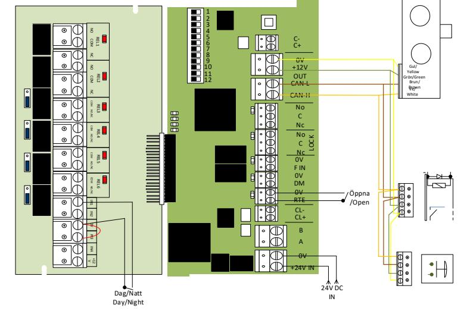
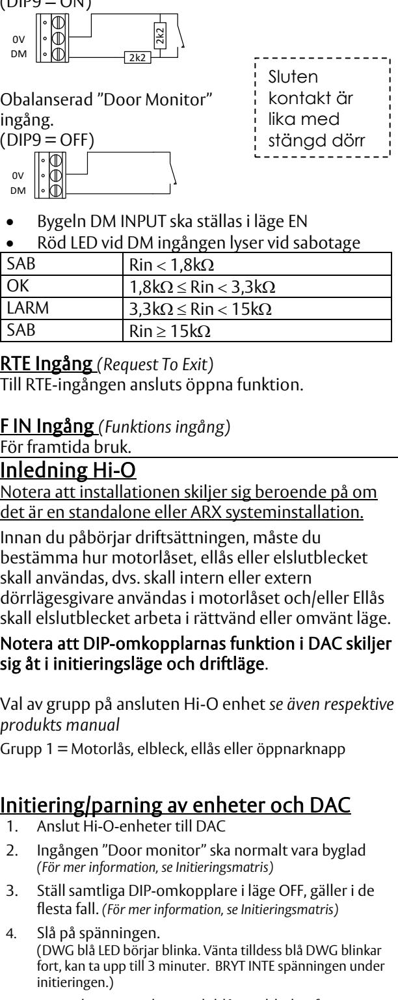
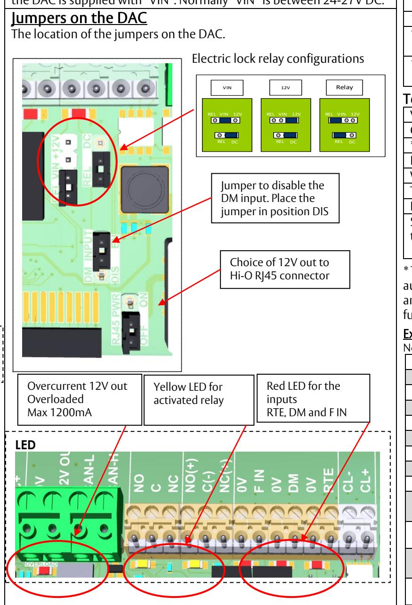
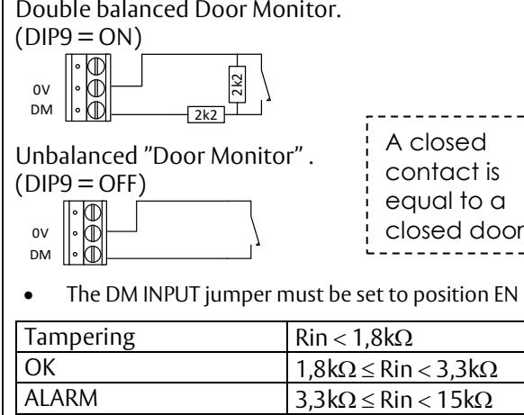

D001307040-001/2 (*IS55666300940B*)

## DAC630 installation med ARX system

## Ingångar

DAC630 har tre ingångar. DM "Door Monitor", RTE "Öppnaknappsingång" och F IN för framtida funktion. "DM" Door-Monitor ingången kan arbeta obalanserade eller dubbelbalanserat.

DM ingångens LED lyser vid stängd dörr och blinkar vid sabotage. Motståndsvärdet på motstånden är 2k2 ohm. Balanseringen aktiveras med DIP9 i läge ON.

## DM Ingång

ingång. (DIP9 = OFF)

> DM 0V

- Bygeln DM INPUT ska ställas i läge EN när DM-ingången används.
- Röd LED vid DM ingången lyser vid stängd dörr och blinkar vid sabotage när balanseradingång är vald.

| SAB  | Rin < 1,8kΩ         |
|------|---------------------|
| OK   | 1,8kΩ ≤ Rin < 3,3kΩ |
| LARM | 3,3kΩ ≤ Rin < 15kΩ  |
| SAB  | Rin ≥ 15kΩ          |

## RTE Ingång *(Request To Exit)*

Till RTE-ingången ansluts öppnaknapp. LED vid RTE-ingången lyser när ingången sluts.

## Utgångar

DAC630 har två utgångar via reläer. Ett relä för konventionella ellås och ett för temporär larmförbikoppling. Reläerna har No C Nc på plint. Ellås reläet kan väljas till 12V DC ut eller den spänning som DAC matas med "VIN", VIN normalt 24-27V DC.

## Byglar på kortet

Placeringen av byglarna på kortet bakom kopplingsplint i DAC.

## Installation och initiering Hi-O

Notera att installationen skiljer sig beroende på om det är en standalone eller ARX systeminstallation.

Innan du påbörjar driftsättningen, måste du bestämma hur motorlåset, ellås eller elslutblecket ska användas, dvs. skall intern eller extern dörrlägesgivare användas i motorlåset och/eller Ellås skall elslutblecket arbeta i rättvänt eller omvänt läge.

## Notera att DIP-omkopplarnas funktion i DAC skiljer sig åt i initieringsläge och driftläge.

Val av grupp på ansluten Hi-O enhet.

*se även respektive produkts manual*

Grupp 1 = Yttre läsare, motorlås, elbleck eller öppnarknapp

Grupp 2 = Inre läsare

## Initiering/parning av enheter och DAC

- 1. Anslut Hi-O-enheter till DAC
- 2. Ingången "Door monitor" ska vara byglad *(För mer information, se Initieringsmatris)*
- 3. Ställ samtliga DIP-omkopplare i läge OFF, gäller i de flesta fall. *(För mer information, se Initieringsmatris)*
- 4. Slå på spänningen. (DWG blå LED börjar blinka.

Obalanserad "Door Monitor" Sluten kontakt är lika med

| 1–5                                                | DIP nummer                               |                                                             |           |                                                         |  |  |  |
|----------------------------------------------------|------------------------------------------|-------------------------------------------------------------|-----------|---------------------------------------------------------|--|--|--|
|                                                    | Adress                                   |                                                             |           |                                                         |  |  |  |
| 6–8                                                |                                          | För framtida funktion Dubbelbalanserad DM-ingång i drift |           |                                                         |  |  |  |
| 9                                                  |                                          |                                                             |           |                                                         |  |  |  |
|                                                    |                                          | (Se även Initiering Hi-O)                                   |           |                                                         |  |  |  |
| 10                                                 |                                          | För framtida funktion                                       |           |                                                         |  |  |  |
| 11                                                 |                                          |                                                             |           | I standalone läge utökad funktion                       |  |  |  |
|                                                    |                                          | (Se även Initiering Hi-O)                                   |           |                                                         |  |  |  |
| 12                                                 |                                          |                                                             |           | I läge ON = Standalone mode                             |  |  |  |
|                                                    | DAC fungerar enbart som motorlåsstyrning |                                                             |           |                                                         |  |  |  |
|                                                    |                                          |                                                             |           |                                                         |  |  |  |
| Tekniska specifikationer Spänningsmatning       |                                          |                                                             |           |                                                         |  |  |  |
|                                                    |                                          |                                                             |           | 24-28V DC                                               |  |  |  |
|                                                    | Strömförbrukning                         |                                                             |           | 30-35 mA                                                |  |  |  |
|                                                    | * Max belastning 12V                     |                                                             | 1,2 A     |                                                         |  |  |  |
| ut                                                 |                                          |                                                             |           |                                                         |  |  |  |
| IP                                                 |                                          |                                                             | 20        |                                                         |  |  |  |
| Vikt                                               |                                          |                                                             |           | 0.41kg                                                  |  |  |  |
|                                                    | Temperatur                               |                                                             |           | -10° C to +40° C                                        |  |  |  |
|                                                    | Luftfuktighet drift                      |                                                             |           | 5 % to 95 %                                             |  |  |  |
|                                                    | Lagring och                              |                                                             |           | Temperatur: -50 ºC to 70 ºC                             |  |  |  |
| transport                                          |                                          |                                                             |           | Luftfuktighet 5 % to 95 %                               |  |  |  |
|                                                    |                                          |                                                             |           | * 12V-utgången på DAC630 är försedd med                 |  |  |  |
|                                                    |                                          |                                                             |           | automatsäkring som bryter vid 1,2 A. DAC630 i sig själv |  |  |  |
|                                                    |                                          |                                                             |           | samt eventuellt anslutet SIO6-4-kort berörs inte av     |  |  |  |
|                                                    | denna automatsäkring.                    |                                                             |           |                                                         |  |  |  |
|                                                    |                                          |                                                             |           |                                                         |  |  |  |
|                                                    | Exempel strömförbrukning                 |                                                             |           |                                                         |  |  |  |
|                                                    |                                          |                                                             |           | Nominell strömförbrukning vid olika konfigurationer     |  |  |  |
|                                                    | Spänning in till DAC                     |                                                             | 27,4V DC  |                                                         |  |  |  |
|                                                    |                                          |                                                             |           |                                                         |  |  |  |
| DAC630                                             |                                          |                                                             |           |                                                         |  |  |  |
|                                                    | Strömförbrukning                         |                                                             | 30-35 mA  | Medel: 32mA                                             |  |  |  |
|                                                    | DAC630 med SIO6-4 kort anslutet          |                                                             |           |                                                         |  |  |  |
|                                                    | Strömförbrukning                         |                                                             | 35-50 mA  | Medel: 40mA                                             |  |  |  |
|                                                    | DAC630 med SIO6-4 och Pando Secure       |                                                             |           |                                                         |  |  |  |
|                                                    | Strömförbrukning                         |                                                             | 65 -75 mA | Medel: 70mA                                             |  |  |  |
|                                                    | DAC630 med SIO6-4 och Pando Display      |                                                             |           |                                                         |  |  |  |
|                                                    | Strömförbrukning                         |                                                             |           | 75 - 100 mA Medel: 85mA                              |  |  |  |
|                                                    |                                          |                                                             |           | DAC630 med SIO6-4, Pando läsare och 815C50 eller        |  |  |  |
| 835C50                                             |                                          |                                                             |           |                                                         |  |  |  |
| Strömförbrukning 120 - 150 mA Medel: 140 mA  |                                          |                                                             |           |                                                         |  |  |  |
| DAC630 med SIO6-4, Pando läsare, 835C50 och 850C50 |                                          |                                                             |           |                                                         |  |  |  |
| Strömförbrukning 145 - 160 mA Medel: 155 mA  |                                          |                                                             |           |                                                         |  |  |  |
| Strömförbrukningen ovan är på 27,4V sidan av DAC,  |                                          |                                                             |           |                                                         |  |  |  |
| backupsidan.                                       |                                          |                                                             |           |                                                         |  |  |  |
|                                                    |                                          |                                                             |           |                                                         |  |  |  |
| Plint                                              |                                          |                                                             |           |                                                         |  |  |  |
|                                                    | C-                                       |                                                             |           | Kommunikation CL läsare                              |  |  |  |
|                                                    |                                          | C+                                                          |           |                                                         |  |  |  |
|                                                    |                                          | 0V                                                          |           |                                                         |  |  |  |
|                                                    |                                          | 12V OUT                                                     |           | Matning ut till läsare                                  |  |  |  |
|                                                    |                                          | CAN-L                                                       |           | Kommunikation med                                       |  |  |  |
|                                                    |                                          | CAN-H                                                       |           | Hi-O-enheter                                            |  |  |  |
|                                                    |                                          |                                                             |           |                                                         |  |  |  |
|                                                    | NO                                       |                                                             |           |                                                         |  |  |  |
|                                                    |                                          | C                                                           |           | Temporär LFK-relä                                       |  |  |  |
|                                                    |                                          | NC                                                          |           |                                                         |  |  |  |
|                                                    |                                          |                                                             |           |                                                         |  |  |  |

- Vänta till blå DWG blinkar fort, kan ta upp till 3 minuter. BRYT INTE spänningen under initieringen.
- 5. När gul PWR LED lyser och blå LED blinkar fort, är initieringen klar. *(Om blå LED blinkar fort och gul PWR LED inte har tänt har initieringen misslyckats)*
- 6. Sätt adressera och starta om DAC.

## Avparning av Hi-O enheter och DAC 1. Ställ samtliga DIP-omkopplare i läge OFF i DAC

- 
- 2. Håll sabotagebrytaren sluten
- *3.* Slå på spänningen *När blå WDG-LED blinkar kan man släppa sabotagebrytaren*
- 4. När gul PWR-LED lyser och blå LED blinkar fort, Hi-O-bussen avparad

| Hi-O Initieringsmatris vid parning av Hi-O bussen Lägena kan kombineras med varandra vid initieringen |                   |                               |  |  |
|----------------------------------------------------------------------------------------------------------|-------------------|-------------------------------|--|--|
| Motorlås                                                                                                 | Aktiv givare      | DM ingång Sluten              |  |  |
|                                                                                                          | Inaktiv givare    | DM ingång Öppen               |  |  |
| Eltryckeslå 815C/835C, Elbleck                                                                        | Aktiv givare      | DIP 9 i läge OFF vid parning  |  |  |
|                                                                                                          | Inaktiv givare    | DIP 9 i läge On vid parning   |  |  |
| Elbleck                                                                                                  | Rättvänd funktion | DIP 11 i läge OFF vid parning |  |  |
|                                                                                                          | Omvänd funktion   | DIP 11 i läge On vid parning  |  |  |
| Minimum firmware-version på Pando-läsare för att kunna anslutas till DAC630                           |                   |                               |  |  |

| 1.06.08        |
|----------------|
| 1.06.15        |
| 1.00.12        |
| Alla versioner |
| Alla versioner |
| Alla versioner |
|                |

## LED indikeringar

| LED PWR | (Spänning) – Gul indikering, visar att det finns spänning, samt att Hi-O-enheter är funna och låsta på Hi-O-bussen under initieringens sekvens. |
|---------|-------------------------------------------------------------------------------------------------------------------------------------------------------|
| LED WDG | (OK) – Blå indikering, normal blink ca 1 Hz (1 blink/sek.) Master reset klar – ca 20 Hz = snabb blink (20 blink/sek.) Fast sken – Fel     |
| TxD LED | (Transmit) – Grön indikering, blinkar när DAC svarar på kommandon från central.                                                                    |
| RxD LED | Röd indikering, blinkar snabbt vid all kommunikation från centralenheten                                                                           |
|         |                                                                                                                                                       |

## Anslutning av tilläggskort

För att få tillgång till alla utgångar och ingångar måste ett tilläggskort anslutas. För att ansluta ett tilläggskort, gör följande:

- 1. Slå av strömmen till DAC630
- 2. Snäpp loss DAC630 från kapslingen
- 3. Rikta in kontaktdelarna mot varandra
- 4. Se till att korten ligger i plan med varandra
- 5. Tryck ihop korten och knäpp fast korten i kapslingen

## Exempel på tilläggskort

- 400RC64: Fyra ingångar med fasta funktioner och sex konfigurerbara reläer
- 500RW22: Anslutning av Wiegand-läsare, två ingångar och två reläutgångar
- SIO6-4: Sex konfigurerbara ingångar och fyra konfigurerbara utgångar

|  | C+      | läsare                 |  |
|--|---------|------------------------|--|
|  | 0V      | Matning ut till läsare |  |
|  | 12V OUT |                        |  |
|  | CAN-L   | Kommunikation med      |  |
|  | CAN-H   | Hi-O-enheter           |  |
|  | NO      | Temporär LFK-relä      |  |
|  | C       |                        |  |
|  | NC      |                        |  |
|  | NO (+)  |                        |  |
|  | C (-)   | Ellåsrelä              |  |
|  | NC (+)  |                        |  |
|  | 0V      |                        |  |
|  | F IN    | För framtida funktion  |  |
|  | 0V      | Dörrlägesgivare        |  |
|  | DM      |                        |  |
|  | 0V      | Öppnaknappingång       |  |
|  | RTE     |                        |  |
|  | CL-     | Anslutning             |  |
|  | CL+     | kommunikation till     |  |
|  |         | ARX LCU                |  |
|  | B       |                        |  |
|  | A       | För framtida funktion  |  |

| 0V   | Spänningsmatning in |
|------|---------------------|
| +24V | från LCU            |

| Kabelbeskrivning för Hi-O Motorlås/Ellås |         |  |
|------------------------------------------|---------|--|
| Vit                                      | (CAN H) |  |
| Brun                                     | (CAN L) |  |
| Grön                                     | (+12V)  |  |
| Gul                                      | (0V)    |  |

| Info sheet |
|------------|
|            |
|            |
|            |
|            |
|            |

stängd dörr

D001307040-001/2 (*IS55666300940B*)

## Standalone läge DIP12 = ON

## Ingångar

DAC630 har tre ingångar DM: "Door Monitor" och RTE "Öppnaingång" och F IN: För framtida funktion. "DM" Door Monitor-ingången kan arbeta obalanserade eller dubbelbalanserat. DM-ingången har en LED som lyser vid sabotage. Motståndsvärdet på motstånden är 2k2 ohm. Balanseringen aktiveras med DIP9 i läge ON.

## DM Ingång

Dubbelbalanserad "Door Monitor" ingång. (DIP9 = ON)

DM 0V

DM 0V

# Utgångar, Byglar på kortet och Tekniska specifikationer se första sidan. DIP nummer

| 1–2                                                                                                                                      | Olåst tid (4–16 sekunder)                                                   |     |     |  |
|------------------------------------------------------------------------------------------------------------------------------------------|-----------------------------------------------------------------------------|-----|-----|--|
| 3-4                                                                                                                                      | Funktions val av relä funktioner                                            |     |     |  |
| 5                                                                                                                                        | Funktion Dag/Natt ingång (På reläkort In 1) OFF = Första giltiga passage |     |     |  |
| 5                                                                                                                                        | Funktion Dag/Natt ingång (På reläkort In 1) ON = Omedelbart              |     |     |  |
| 6–8, 10                                                                                                                               | För framtida funktion                                                       |     |     |  |
| 9                                                                                                                                        | Dubbelballanserad DM ingång i drift (Se även Initiering Hi-O)            |     |     |  |
| 11                                                                                                                                       | Utökad funktion (Se även Initiering Hi-O)                                |     |     |  |
| 12                                                                                                                                       | I läge ON = Standalone mode                                                 |     |     |  |
| Med DIP12 & 11 = ON Sätts olåsttiden med DIP1 – 2                                                                                        |                                                                             |     |     |  |
| Sec./DIP                                                                                                                                 |                                                                             | 1   | 2   |  |
| 4                                                                                                                                        |                                                                             | OFF | OFF |  |
| 8                                                                                                                                        |                                                                             | ON  | OFF |  |
| 12                                                                                                                                       |                                                                             | OFF | ON  |  |
| 16                                                                                                                                       |                                                                             | ON  | ON  |  |
| 12V utgången på DAC630 är försedd med automatsäkring som bryter vid 1,2 A. DAC630 i sig själv berörs inte av denna automatsäkring. |                                                                             |     |     |  |
| Exempel strömförbrukning Nominell strömförbrukning vid olika konfigurationer                                                          |                                                                             |     |     |  |

| Nominell strömförbrukning vid olika konfigurationer     |                           |  |
|---------------------------------------------------------|---------------------------|--|
| Spänning in till DAC                                    | 27,4V DC                  |  |
| DAC630                                                  |                           |  |
| Strömförbrukning                                        | 30-35 mA Average: 32mA |  |
| DAC630 850C50 Eller 840C50                              |                           |  |
| Strömförbrukning                                        | 45 - 130 mA Average: 50mA |  |
| DAC630 och 815C50 eller 835C50                          |                           |  |
| Strömförbrukning                                        | 65 - 130 mA Average: 70mA |  |
| DAC630 835C50 och 850C50                                |                           |  |
| Strömförbrukning                                        | 85 - 140 mA Average: 90mA |  |
| Strömförbrukningen ovan är på 27,4V sidan, backupsidan. |                           |  |

| Kabelbeskrivning för Hi-O Motorlås/Ellås |         |  |
|------------------------------------------|---------|--|
| Vit                                      | (CAN H) |  |
| Brun                                     | (CAN L) |  |
| Grön                                     | (+12V)  |  |
| Gul                                      | (0V)    |  |

## Driftkonfiguration av DAC som styrenhet

|             | Plint DAC630                                        |                              |
|-------------|-----------------------------------------------------|------------------------------|
| 0V          | Matning ut till motorlås                            |                              |
| 12V OUT     |                                                     |                              |
| CAN-L       | Hi-O kommunikation Hi-O motorlås                    |                              |
| CAN-H       |                                                     |                              |
| NO          | Temporär LFK-relä                                   |                              |
| C           |                                                     |                              |
| NC          |                                                     |                              |
| NO (+)      | Ellåsrelä                                           |                              |
| C (-)       |                                                     |                              |
| NC (+)      |                                                     |                              |
| 0V          |                                                     |                              |
| DM          | Dörrlägesgivare                                     |                              |
| 0V          |                                                     |                              |
| RTE         | Öppnaingång                                         |                              |
| 0V          |                                                     |                              |
| +24V        | Spänningsmatning in 24 – 28V                        |                              |
|             | Plint Reläkort 400RC64                              |                              |
| IN1         | Dag/Natt ingång för motorlås. Funktions val DIP5    |                              |
| 0V          |                                                     |                              |
| IN3         | Blockerings ingång. Blockerar dörr när ingången     |                              |
| 0V          | bryts. Har prioritet över IN1 och RTE ingång        |                              |
|             |                                                     |                              |
|             | Hi-O Initieringsmatris vid parning av Hi-O bussen   |                              |
|             | Lägena kan kombineras med varandra vid initieringen |                              |
| Motorlås    | Aktiv givare                                        | DM-ingång Sluten             |
|             | Inaktiv givare                                      | DM-ingång Öppen              |
| Eltryckeslå | Aktiv givare                                        | DIP 9 i läge OFF vid parning |
|             |                                                     |                              |

- 5. När gul PWR LED lyser och blå LED blinkar fort, är initieringen klar. *(Om blå LED blinkar fort och gul PWR LED inte har tänt har initieringen misslyckats)*
- 6. Sätt DIP12 i läge ON, driftlägen i funktions matris. Starta om DAC.

## Avparning av Hi-O enheter och DAC 1. Ställ samtliga DIP-omkopplare i läge OFF i DAC

- 
- 2. Håll sabotage brytaren sluten
- *3.* Slå på spänningen *När WDG blå LED blinkar kan man släppa sabotagebrytaren*
- 4. När Gul PWR LED lyser och blå LED blinkar fort, Hi-O bussen avparad

| 815C/835C, Elbleck | Inaktiv givare                                                                                           | DIP 9 i läge On vid parning                                                                                                                        |  |  |
|-----------------------|----------------------------------------------------------------------------------------------------------|----------------------------------------------------------------------------------------------------------------------------------------------------|--|--|
| Elbleck               | Rättvänd funktion                                                                                        | DIP 11 i läge OFF vid parning                                                                                                                      |  |  |
|                       | Omvänd funktion                                                                                          | DIP 11 i läge On vid parning                                                                                                                       |  |  |
| RTE                   | Nivå triggad (Standard)                                                                               | RTE-ingång Öppen                                                                                                                                   |  |  |
|                       | Flank triggad                                                                                            | RTE-ingång Sluten                                                                                                                                  |  |  |
|                       | Nivå/flanktriggad öppnaimpulsingång slutning finns mellan (RTE & 0V). När DAC styra av annat system.  | Öppnaimpulsingången är normalt nivåtriggad, dvs. låset är olåst så länge en                                                                        |  |  |
|                       | ingången sluts och låset låser när tiden går ut oavsett om ingången fortfarande är sluten eller inte. | Om initiering genomförs när ingången är sluten kommer den istället att arbeta flanktriggat, dvs. öppethållandetiden börjar räkna direkt när RTE |  |  |
|                       |                                                                                                          |                                                                                                                                                    |  |  |
| LED indikeringar DAC  |                                                                                                          |                                                                                                                                                    |  |  |
|                       | (Spänning) – Gul indikering, visar att det finns spänning,                                               |                                                                                                                                                    |  |  |
|                       |                                                                                                          |                                                                                                                                                    |  |  |

| LED indikeringar DAC |                                                                                                                                                       |  |
|----------------------|-------------------------------------------------------------------------------------------------------------------------------------------------------|--|
| LED PWR              | (Spänning) – Gul indikering, visar att det finns spänning, samt att Hi-O enheter är funna och låsta på Hi-O bussen under initieringens sekvens. |  |
| LED                  | (OK) – Blå indikering, normal blink ca 1 Hz (1 blink/sek.) Master reset klar – ca 20 Hz = snabb blink                                           |  |

WDG (20 blink/sek.) Fast sken – Fel

| Funktionsmatris (DAC630 med reläkort 400RC64) |                                                 |  |
|-----------------------------------------------|-------------------------------------------------|--|
| DIP12 ON Stand alone, 11 OFF, 3 OFF, 4 OFF    |                                                 |  |
| Relä "Lock"                                   | Styrning av ellås                               |  |
| Relä "Alarm"                                  | Temporär LFK                                    |  |
| Relä1                                         | Säkerhetslåst (Regel ute och dörren stängd)     |  |
| Relä2                                         | Regel inne                                      |  |
| Relä3                                         | Olåst med 0,5 sek fördröjt efter "Lock"-reläet  |  |
| Relä4                                         | Stängd dörr                                     |  |
| Relä5                                         | Motorlåsproblem Vid låsning & upplåsning        |  |
| Relä6                                         | Dörr forcerad, med återställning via "RTE"      |  |
|                                               | DIP12 ON Stand alone, 11 ON, 3 OFF, 4 OFF       |  |
| Relä "Lock"                                   | Styrning av ellås                               |  |
| Relä "Alarm"                                  | Temporär LFK                                    |  |
| Relä1                                         | Säkerhetslåst (Regel ute och dörren stängd)     |  |
| Relä2                                         | Regel inne                                      |  |
| Relä3                                         | Olåst med 1 sek fördröjt efter "Lock"-reläet    |  |
| Relä4                                         | Stängd dörr                                     |  |
| Relä5                                         | Forcerad dörr / Hindrad regel vid låsning och   |  |
|                                               | upplåsning                                      |  |
| Relä6                                         | DAC-sabotage (Reläet drar vid larm)             |  |
|                                               | DIP12 ON Stand alone, 11 ON, 3 ON, 4 OFF        |  |
| Relä "Lock"                                   | Låsindikering, aktiv i 15 sekunder              |  |
| Relä "Alarm"                                  | Olåst indikering, aktiv i 60 sekunder vid olåst |  |
| Relä1                                         | Säkerhetslåst (Regel ute och dörren stängd)     |  |
| Relä2                                         | Regel inne                                      |  |
| Relä3                                         | Olåst med 1 sek fördröjt efter "Lock"-reläet    |  |
| Relä4                                         | Stängd dörr                                     |  |
|                                               |                                                 |  |

| Relä5 Forcerad dörr / Samt drar vid kommunikationsfel Hi-O Relä6 DAC sabotage (Reläet drar vid larm) Kommunikationsfel motorlås Reläer för: Låst, olåst samt dörrens läge faller efter ca 10–15 sekunder DIP12 ON Stand alone, 11 ON, 3 ON, 4 ON Relä "Lock" Låsindikering, aktiv i 15 sekunder Relä "Alarm" Relä1 Relä2 Regel inne Relä3 Relä4 Stängd dörr (Reläet drar vid stängd dörr) Relä5 (aktiv i ca 2 minuter) Relä6 DAC-sabotage (Reläet drar vid larm) Kommunikationsfel motorlås |                                                                 |                                                 |  |
|---------------------------------------------------------------------------------------------------------------------------------------------------------------------------------------------------------------------------------------------------------------------------------------------------------------------------------------------------------------------------------------------------------------------------------------------------------------------------------------------------------------------------------------------------------------|-----------------------------------------------------------------|-------------------------------------------------|--|
|                                                                                                                                                                                                                                                                                                                                                                                                                                                                                                                                                               |                                                                 |                                                 |  |
|                                                                                                                                                                                                                                                                                                                                                                                                                                                                                                                                                               |                                                                 |                                                 |  |
|                                                                                                                                                                                                                                                                                                                                                                                                                                                                                                                                                               |                                                                 |                                                 |  |
|                                                                                                                                                                                                                                                                                                                                                                                                                                                                                                                                                               |                                                                 |                                                 |  |
|                                                                                                                                                                                                                                                                                                                                                                                                                                                                                                                                                               |                                                                 |                                                 |  |
|                                                                                                                                                                                                                                                                                                                                                                                                                                                                                                                                                               |                                                                 |                                                 |  |
|                                                                                                                                                                                                                                                                                                                                                                                                                                                                                                                                                               |                                                                 |                                                 |  |
|                                                                                                                                                                                                                                                                                                                                                                                                                                                                                                                                                               |                                                                 | Olåst indikering, aktiv i 60 sekunder vid olåst |  |
|                                                                                                                                                                                                                                                                                                                                                                                                                                                                                                                                                               |                                                                 | Säkerhetslåst (Regel ute och dörren stängd)     |  |
|                                                                                                                                                                                                                                                                                                                                                                                                                                                                                                                                                               |                                                                 |                                                 |  |
|                                                                                                                                                                                                                                                                                                                                                                                                                                                                                                                                                               |                                                                 | Olåst med 0,2 sek fördröjt efter "Lock"-reläet  |  |
|                                                                                                                                                                                                                                                                                                                                                                                                                                                                                                                                                               |                                                                 |                                                 |  |
|                                                                                                                                                                                                                                                                                                                                                                                                                                                                                                                                                               |                                                                 | Hindrad regel vid låsning samt upplåsning       |  |
|                                                                                                                                                                                                                                                                                                                                                                                                                                                                                                                                                               |                                                                 |                                                 |  |
|                                                                                                                                                                                                                                                                                                                                                                                                                                                                                                                                                               |                                                                 |                                                 |  |
|                                                                                                                                                                                                                                                                                                                                                                                                                                                                                                                                                               |                                                                 |                                                 |  |
|                                                                                                                                                                                                                                                                                                                                                                                                                                                                                                                                                               | Reläer för: Låst, olåst samt dörrens läge faller efter ca 10–15 |                                                 |  |
|                                                                                                                                                                                                                                                                                                                                                                                                                                                                                                                                                               | sekunder                                                        |                                                 |  |

## Teknisk dokumentation och support

*Vi förbehåller oss rätten att korrigera eventuella tryckfel och uppdatera informationen efter utskrift. På hemsidan finns utförliga manualer tillgängliga för ARX passersystem. Om du inte hittar svar på dina frågor i manualen hänvisar vi till tekniska support, de nås på +46 (0)8 775 16 60 alternativt:* 

<https://technicalsupport.assaabloyopeningsolutions.se/>

| Tampering | Rin < 1,8kΩ         |
|-----------|---------------------|
| OK        | 1,8kΩ ≤ Rin < 3,3kΩ |
| ALARM     | 3,3kΩ ≤ Rin < 15kΩ  |
| Tampering | Rin ≥ 15kΩ          |

RTE Input (Request To Exit)

The exit button is connected to the RTE input. The LED at the RTE input lights up when the input is closed.

## Outputs

DAC630 has two outputs via relays. One relay for conventional electric lock and the other one is for temporary alarm bypass. The voltage for the electric lock relay can be selected to 12V DC or the voltage that the DAC is supplied with "VIN". Normally "VIN" is between 24-27V DC.

DIP number 1–5 Address

## Installation and initialization Hi-O

Note that the installation differs depending on whether it is a standalone or an ARX-system installation.

Before you start commissioning, decide how to use the motor lock, electric lock, or electric strikes. Should an internal or external door monitor sensor be used in the motor lock and/or Electric lock. How the electric strikes should work in failsafe or fail secure mode.

Note that the operation of the DIP switches in the DAC differs in initialization mode and operation mode.

Selection of group on connected Hi-O unit see also the respective product's manual.

Group 1 = External reader, motor lock, electric locks or exit button

Group 2 = Inner reader

## Initialization/pairing of devices and DAC 1. Connect Hi-O devices to the DAC

- 
### 2. The "Door monitor" input must be jumpered *For more information, see Initiation Matrix*

- 3. Set all DIP switches to the OFF position, applies in
most cases. *For more information, see Initiation Matrix*

- 4. Switch on the power. DWG blue LED starts flashing. Wait until blue DWG flashes fast, may take up to 3 minutes. DO NOT BREAK voltage during initialization.
- 5. When the Yellow PWR LED is lit and the Blue LED flashes rapidly, the initialization is complete. *If the blue LED is flashing fast and the yellow PWR LED has not lit, the initialization has failed*
- 6. Set address and restart the DAC.

| 6–8       |                      | For future use             |                                                        |  |  |
|-----------|----------------------|----------------------------|--------------------------------------------------------|--|--|
| 9         |                      |                            | Dual balanced DM input in operation                    |  |  |
|           |                      |                            | (See also Initialization Hi-O)                         |  |  |
| 10        |                      | For future use             |                                                        |  |  |
| 11        |                      |                            | In standalone mode extended function                   |  |  |
|           |                      | (See also Initialize Hi-O) |                                                        |  |  |
| 12        |                      |                            | In position ON = Standalone mode.                      |  |  |
|           |                      |                            | (Functions only as motor lock control)                 |  |  |
|           |                      |                            |                                                        |  |  |
|           |                      | Technical specifications   |                                                        |  |  |
|           | Voltage supply       |                            | 24-28V DC                                              |  |  |
| Current   |                      |                            | 30-35 mA                                               |  |  |
|           |                      | * Max load 12V out         | 1,2 A                                                  |  |  |
| IP        |                      |                            | 20                                                     |  |  |
| Weight    |                      |                            | 0.41kg                                                 |  |  |
|           | Temperature          |                            | -10° C to +40° C                                       |  |  |
|           |                      | Humidity operation         | 5 % to 95 %                                            |  |  |
|           | Storage and          |                            | Temperature: -50 ºC to 70                              |  |  |
| transport |                      |                            | ºC (-58 ºF to 158 ºF)                                  |  |  |
|           |                      |                            | Humidity 5 % to 95 %                                   |  |  |
|           |                      |                            |                                                        |  |  |
|           |                      |                            | * The 12V output on the DAC630 is equipped with an     |  |  |
|           |                      |                            | automatic fuse that breaks at 1.2 A. The DAC630 itself |  |  |
|           |                      |                            | and any connected SIO6-4 card are not affected by this |  |  |
| fuse.     |                      |                            |                                                        |  |  |
|           |                      | Example power consumption  |                                                        |  |  |
|           |                      |                            | Nominal power consumption in different configurations  |  |  |
| Voltage   |                      |                            | 27,4V DC                                               |  |  |
| DAC630    |                      |                            |                                                        |  |  |
|           |                      | Power consumption          | 30-35 mA Average: 32mA                              |  |  |
|           |                      |                            | DAC630 with SIO6-4 kort anslutet                       |  |  |
|           |                      | Power consumption          | 35-50 mA Average: 40mA                              |  |  |
|           |                      |                            |                                                        |  |  |
|           |                      |                            | DAC630 with SIO6-4 and Pando Secure                    |  |  |
|           |                      | Power consumption          | 65 -75 mA Average: 70mA                                |  |  |
|           |                      |                            | DAC630 with SIO6-4 and Pando Display                   |  |  |
|           |                      | Power consumption          | 75 - 100 mA Average: 85mA                              |  |  |
|           |                      |                            | DAC630 with SIO6-4, Pando läsare and 815C50 /          |  |  |
| 835C50    |                      |                            |                                                        |  |  |
|           |                      | Power consumption          | 120 - 150 mA                                           |  |  |
|           |                      |                            | Average: 140 mA                                        |  |  |
|           |                      |                            | DAC630 with SIO6-4, Pando läsare, 835C50 and           |  |  |
| 850C50    |                      |                            |                                                        |  |  |
|           |                      | Power consumption          | 145 - 160 mA                                           |  |  |
|           |                      |                            | Average: 155 mA                                        |  |  |
|           |                      |                            |                                                        |  |  |
|           | Terminals            |                            |                                                        |  |  |
|           |                      |                            |                                                        |  |  |
|           |                      | C-                         | Communication CL reader                             |  |  |
|           |                      | C+                         |                                                        |  |  |
|           |                      | 0V 12V OUT              | Power to reader                                        |  |  |
|           |                      | CAN-L                      | Communication with                                     |  |  |
|           |                      | CAN-H                      | Hi-O devices                                           |  |  |
|           |                      | NO                         |                                                        |  |  |
|           |                      | C                          | Temporary alarm                                        |  |  |
|           |                      | NC                         | bypass                                                 |  |  |
|           |                      | NO (+)                     |                                                        |  |  |
|           |                      | C (-)                      | Conventional electric                                  |  |  |
|           |                      | NC (+)                     | lock                                                   |  |  |
|           |                      | 0V                         |                                                        |  |  |
|           | F IN                 |                            | For future use                                         |  |  |
|           | 0V                   |                            |                                                        |  |  |
| DM        |                      |                            | Door monitor                                           |  |  |
|           | 0V                   |                            |                                                        |  |  |
|           | RTE                  |                            | Exit button                                            |  |  |
| CL-       |                      |                            | Communication to ARX                                   |  |  |
|           | CL+                  |                            | LCU                                                    |  |  |
|           |                      | B                          |                                                        |  |  |
|           |                      | A                          | For future use                                         |  |  |
| 0V        |                      |                            |                                                        |  |  |
|           | Power supply +24V |                            |                                                        |  |  |
|           |                      |                            |                                                        |  |  |
|           |                      |                            | Hi-O motor locks / Readers cable description           |  |  |

- Unpairing devices and DAC 1. Set all DIP-switches to the OFF-position in the DAC
- 2. Keep the tamper switch closed
- *3.* Switch the power on. *When the WDG blue LED flashes, release the tamper switch.*
- 4. When the Yellow PWR LED lights up and the blue LED flashes quickly, the Hi-O bus is unpaired

|                                                        |                                                                                          | Hi-O Initialization matrix when pairing the Hi-O bus     |                                   |  |  |
|--------------------------------------------------------|------------------------------------------------------------------------------------------|----------------------------------------------------------|-----------------------------------|--|--|
|                                                        |                                                                                          | Combined the modes with each other during initialization |                                   |  |  |
|                                                        | Door Monitor enabled                                                                     |                                                          | DM Input closed                   |  |  |
| Motor lock                                             | Door monitor disabled                                                                    |                                                          | DM Input open                     |  |  |
| Electric lock                                          | Door Monitor enabled                                                                     |                                                          | DIP 9 in OFF position at pairing  |  |  |
| 815C/835C,                                             | Door monitor disabled                                                                    |                                                          | DIP 9 in ON position at pairing   |  |  |
| Electric                                               | Fail secure                                                                              |                                                          | DIP 11 in OFF position at pairing |  |  |
| strike                                                 | Fail safe                                                                                |                                                          | DIP 11 in ON position at pairing  |  |  |
| Minimum firmware version on Pando reader to be able to |                                                                                          |                                                          |                                   |  |  |
| connect to DAC630                                      |                                                                                          |                                                          |                                   |  |  |
| Pando Mini Go                                          |                                                                                          | 1.06.08                                                  |                                   |  |  |
| Pando Secure Go                                        |                                                                                          | 1.06.15                                                  |                                   |  |  |
| Pando Display Go                                       |                                                                                          | 1.00.12                                                  |                                   |  |  |
| Pando Mini                                             |                                                                                          | All version                                              |                                   |  |  |
| Pando Secure                                           |                                                                                          | All version                                              |                                   |  |  |
| Pando Display                                          |                                                                                          | All version                                              |                                   |  |  |
| LED indikeringar                                       |                                                                                          |                                                          |                                   |  |  |
|                                                        | (Power) - Yellow indicator, shows that there is supply, as well as                       |                                                          |                                   |  |  |
| LED PWR                                                | Hi-O units are found and locked on the Hi-O bus during initialization / master reset. |                                                          |                                   |  |  |
|                                                        | (OK) - Blue indicator, normally flash about 2 Hz (2 flashes / sec.)                      |                                                          |                                   |  |  |
| LED WDG                                                | Master reset ready - about 20 Hz = fast flashing (20 flashes / sec.)                     |                                                          |                                   |  |  |
|                                                        | Solid - Error                                                                            |                                                          |                                   |  |  |
| TxD LED                                                | (Transmit) - Green indicator flashes when the DAC responds to                            |                                                          |                                   |  |  |
|                                                        | commands from the central unit.                                                          |                                                          |                                   |  |  |

RxD LED Red indicator flashes rapidly in all communications from the central unit

Connection of addon board To get access to all outputs and inputs you must connect a addon board. Connection of addon board is made as follows:

- 1. Turn off the power of for DAC630
- 2. Dislocate DAC630 from the box
- 3. Align the contact pieces toward each other
- 4. Make sure that the boards are in level with each other
- 5. Push the boards together and snap the boards to the box

## Example of add-on card

- 400RC64: Four inputs with fixed functions and six configurable relays
- 500RW22: Connection of Wiegand reader, two inputs and two relays
- SIO6-4: Six configurable inputs and four configurable outputs

| Hi-O motor locks / Readers cable description |         |  |
|----------------------------------------------|---------|--|
| White                                        | (CAN H) |  |
| Brown                                        | (CAN L) |  |
| Green                                        | (+12V)  |  |
| Yellow                                       | (0V)    |  |

D001307040-001/2 (*IS55666300940B*)

## Inputs

DAC630 has three inputs "Door Monitor", "Button" and F-IN. The "Door Monitor" input can work as unbalanced or double balanced, the resistance value of the resistors is 2k2 ohms. The DM input's LED lights up when the door is closed and flashes in case of tampering

When DIP9 is in position ON the balancing is activated.

## DM Input

Tampering Rin ≥ 15kΩ

RTE Input (Request to Exit) The opening function is connected to the RTE input. The LED at the RTE input lights up when the input is closed.

| 1–2      | unlock time (4-16 seconds)                                         |                                                                             |                                                          |  |  |
|----------|--------------------------------------------------------------------|-----------------------------------------------------------------------------|----------------------------------------------------------|--|--|
| 3-4      |                                                                    | Function selection of relay functions                                       |                                                          |  |  |
| 5        |                                                                    | Function Day/Night input (On relay board In 1) OFF = First valid passage |                                                          |  |  |
| 5        | Function Day/Night input (On relay board In 1) ON = Immediately |                                                                             |                                                          |  |  |
| 6–8,     |                                                                    | For future use                                                              |                                                          |  |  |
| 10       |                                                                    |                                                                             |                                                          |  |  |
| 9        | Dual balanced DM input in operation                                |                                                                             |                                                          |  |  |
|          |                                                                    | (See also Initialization Hi-O)                                              |                                                          |  |  |
| 11       |                                                                    | Extended function                                                           |                                                          |  |  |
|          |                                                                    | (See also Initiation Hi-O)                                                  |                                                          |  |  |
| 12       | ON = Standalone mode                                               |                                                                             |                                                          |  |  |
|          |                                                                    |                                                                             | With DIP 12 and 11 = ON Set unlocked time with DIP 1 – 2 |  |  |
| Sec./DIP |                                                                    | 1                                                                           | 2                                                        |  |  |
| 4        |                                                                    | OFF                                                                         | OFF                                                      |  |  |
| 8        |                                                                    | ON                                                                          | OFF                                                      |  |  |
| 12       |                                                                    | OFF                                                                         | ON                                                       |  |  |
| 16       |                                                                    | ON                                                                          | ON                                                       |  |  |

Outputs, Jumpers on the card and technical specifications see the first page. DIP number Driftkonfiguration av DAC som styrenhet

> The 12V output on the DAC630 is equipped with an automatic fuse that breaks at 1.2 A. The DAC630 itself and any connected SIO6-4 card are not affected by this fuse.

## Example power consumption

### NC COM NO NC COM NO COM NO /NC COM NO /NC COM NO /NC COM NO /NC IN1 IN2 IN3 IN4 +12 V 0V REL1 REL2 REL3 REL4 REL5 REL6 +12V OUT 0V CAN-L CAN-H No C Nc No C Nc LOCK RTE 0V DM 0V F IN 0V +24V IN 0V 1 12 11 2 3 4 5 6 7 8 9 10 C-C+ CL-CL+ B A Öppna /Open Dag/Natt Day/Night - Vit/ White Brun/ Brown Grön/Green Gul/ Yellow 24V DC IN

| Terminal DAC630                     |                                                         |  |
|-------------------------------------|---------------------------------------------------------|--|
| 0V                                  |                                                         |  |
| 12V OUT                             | Power to motor lock                                     |  |
| CAN-L                               | communication Hi-O motor lock                           |  |
| CAN-H                               |                                                         |  |
| NO                                  |                                                         |  |
| C                                   | Temporary alarm bypass relay                            |  |
| NC                                  |                                                         |  |
| NO (+)                              |                                                         |  |
| C (-)                               | Conventional electric lock relay                        |  |
| NC (+)                              |                                                         |  |
| 0V                                  |                                                         |  |
| DM                                  | Door monitor input                                      |  |
| 0V                                  |                                                         |  |
| RTE                                 | Exit button                                             |  |
| 0V                                  |                                                         |  |
| +24V                                | Power supply 24 – 28V                                   |  |
| Terminal on the relay board 400RC64 |                                                         |  |
| IN1                                 |                                                         |  |
| 0V                                  | Day/Night input for motor lock. Function selection DIP5 |  |
| IN3                                 | Blocking input. Blocks door when the input is open. Has |  |
| 0V                                  | priority over IN1 and RTE input.                        |  |
|                                     |                                                         |  |

| Example power consumption |                                                                    |
|---------------------------|--------------------------------------------------------------------|
|                           | Nominal power consumption in different configurations              |
| Power supply              | 27,4V DC                                                           |
| DAC630                    |                                                                    |
| Power consumption         | 30-35 mA Average: 32mA                                          |
| DAC630 840C50 or 850C50   |                                                                    |
| Power consumption         | 45 - 130 mA Average: 50mA                                          |
|                           | DAC630 and 815C50 or 835C50                                        |
| Power consumption         | 65 - 130 mA Average: 70mA                                          |
| DAC630 835C50 and 850C50  |                                                                    |
| Power consumption         | 85 - 140 mA Average: 90mA                                          |
|                           | The power consumption above is on the 27.4V side, the backup side. |
|                           |                                                                    |
|                           | Function matrix (DAC630 with relay board 400RC64)                  |
|                           | DIP12 ON Stand alone, 11 OFF, 3 OFF, 4 OFF                         |
| Relay "Lock"              | Control of electric lock                                           |
| Relay "Alarm"             | Temporary alarm bypass                                             |
| Relay 1                   | Safety locked (hook out and door closed)                           |
| Relay 2                   | Hook in                                                            |
| Relay 3                   | Unlocked with 0.5 sec delay after the "Lock"                       |
|                           | relay                                                              |
| Relay 4                   | Door closed                                                        |
| Relay 5                   | Motor lock problem. Locking & unlocking                            |
| Relay 6                   | Door forced, with reset via "RTE"                                  |
|                           |                                                                    |
|                           | DIP12 ON Stand alone, 11 ON, 3 OFF, 4 OFF                          |
| Relay "Lock"              | Control of electric lock                                           |
| Relay "Alarm"             | Temporary alarm bypass                                             |
| Relay 1                   | Safety locked (hook out and door closed)                           |
| Relay 2                   | Hook in                                                            |
| Relay 3                   | Unlocked with 1 sec delay after the "Lock"                         |
|                           | relay                                                              |
| Relay 4                   | Door closed                                                        |
| Relay 5                   | Motor lock problem. Locking & unlocking                            |
| Relay 6                   | DAC tamper (Relay pulls on alarm)                                  |
|                           | DIP12 ON Stand alone, 11 ON, 3 ON, 4 OFF                           |
| Relay "Lock"              | Lock indicator, active for 15 seconds                              |
| Relay "Alarm"             | Unlocked indication, active for 60 seconds when unlocked        |
| Relay 1                   | Safety locked (Hook out and door closed)                           |
| Relay 2                   | Hook in                                                            |
| Relay 3                   | Unlocked with 1 sec delay after the "Lock"                         |
|                           | relay                                                              |
| Relay 4                   | Door closed                                                        |
| Relay 5                   | Active at forced door and Com error on Hi-O                        |
|                           |                                                                    |

|  | Relay 6                                                        | DAC tamper (Relay pulls on alarm)                                         |  |
|--|----------------------------------------------------------------|---------------------------------------------------------------------------|--|
|  | Communication error motor lock                                 |                                                                           |  |
|  | Relays for: Locked, unlocked and the position of the door fall |                                                                           |  |
|  | after approx. 10–15 seconds                                    |                                                                           |  |
|  | DIP12 ON Stand alone, 11 ON, 3 ON, 4 ON                        |                                                                           |  |
|  | Relay "Lock"                                                   | Lock indicator, active for 15 seconds                                     |  |
|  | Relay "Alarm"                                                  | Unlocked indication, active for 60 seconds when unlocked               |  |
|  | Relay 1                                                        | Safety locked (Hook out and door closed)                                  |  |
|  | Relay 2                                                        | Hook in                                                                   |  |
|  | Relay 3                                                        | Unlocked with 0,2 sec delay after the "Lock"                              |  |
|  |                                                                | relay                                                                     |  |
|  | Relay 4                                                        | Door closed                                                               |  |
|  | Relay 5                                                        | Blocked hook when locking and unlocking (active for approx. 2 minutes) |  |
|  | Relay 6                                                        | DAC tamper (Relay pulls on alarm)                                         |  |
|  | Communication error motor lock                                 |                                                                           |  |
|  | Relays for: Locked, unlocked and the position of the door fall |                                                                           |  |
|  | after approx. 10–15 seconds                                    |                                                                           |  |
|  |                                                                |                                                                           |  |
|  |                                                                |                                                                           |  |

### Installation and initialization Hi-O

Note that the installation differs depending on whether it is a standalone or ARX system installation.

Before you start commissioning, decide how to use the motor lock, electric lock, or electric strikes. Should an internal or external door monitor sensor be used in the motor lock and/or Electric lock. How the electric strikes should work in failsafe or fail secure mode.

Note that the operation of the DIP switches in the DAC differs in initialization mode and operation mode.

Selection of group on connected Hi-O unit see also the respective product's manual. Group 1 = Motor lock, electric locks or exit button

# Initialization/pairing of devices and DAC 1. Connect Hi-O devices to the DAC

- 
- 2. The "Door monitor" input must be jumpered *For more information, see Initiation Matrix*
- 3. Set all DIP switches to the OFF position, applies in most cases. *(For more information, see Initiation Matrix)*

- 4. Switch on the voltage. DWG blue LED starts flashing. Wait until blue DWG flashes fast, may take up to 3 minutes. DO NOT BREAK voltage during initialization.
- 5. When the Yellow PWR LED is lit and the Blue LED flashes rapidly, the initialization is complete. If the blue LED is flashing fast and the yellow PWR LED has not lit, the initialization has failed
- 6. Set DIP 12 to ON and restart the DAC.

- Unpairing devices and DAC 1. Set all DIP-switches to the OFF-position in the DAC
- 2. Keep the tamper switch closed
- 3. Switch the power on *When the WDG blue LED flashes, release the tamper switch.*
- 4. When the Yellow PWR LED lights up and the blue LED flashes quickly, the Hi-O bus is unpaired

|                                                          | Hi-O Initialization matrix when pairing the Hi-O bus |                                   |  |  |
|----------------------------------------------------------|------------------------------------------------------|-----------------------------------|--|--|
| Combined the modes with each other during initialization |                                                      |                                   |  |  |
|                                                          | Door Monitor enabled                                 | DM Input closed                   |  |  |
| Motor lock                                               | Door monitor disabled                                | DM Input open                     |  |  |
| Electric lock                                            | Door Monitor enabled                                 | DIP 9 in OFF position at pairing  |  |  |
| 815C/835C,                                               | Door monitor disabled                                | DIP 9 in ON position at pairing   |  |  |
| Electric                                                 | Fail secure                                          | DIP 11 in OFF position at pairing |  |  |
| strike                                                   | Fail safe                                            | DIP 11 in ON position at pairing  |  |  |
| RTE                                                      | Level triggered (Default)                         | RTE input Open                    |  |  |
|                                                          | Flank triggered                                      | RTE input Closed                  |  |  |
|                                                          |                                                      |                                   |  |  |

Level/triggered open impulse input The open impulse input is normally level-triggered, i.e. the lock is unlocked as long as a short exists between (RTE & 0V). When DAC control by other system.

If initialization is carried out when the input is closed, it will instead work flank-triggered, i.e. the hold-open time starts counting immediately when the RTE-input is closed and the lock locks when the time expires regardless of whether the input is still closed or not.

| LED indikeringar |                                                                                                                                                              |  |  |  |
|------------------|--------------------------------------------------------------------------------------------------------------------------------------------------------------|--|--|--|
| LED PWR          | (Voltage) - Yellow indicator, shows that there is supply, as well as Hi-O units are found and locked in Hi-O bus during initialization / master reset. |  |  |  |
| LED WDG          | (OK) - Blue indicator, normally flash about 2 Hz (2 flashes / sec.) Master reset ready - about 20 Hz = fast flashing (20 flashes / sec.) Solid - Error |  |  |  |

## Technical documentation and support

*We reserve the right to correct printing errors and update the information after printing. At the website [(https://technicalsupport.assaabloyopeningsolutions.se/)](https://technicalsupport.assaabloyopeningsolutions.se/) technical support can you find detailed manuals available for the ARX access control system. If you cannot find answers to your questions in the manuals, we refer to the technical support in your country.*