# ASSA ABLOY motor locks installation guide ASSA ABLOY motor locks 813C -50, 815C-50, 820C-50, 825C-50, 835C-50 Installation guide

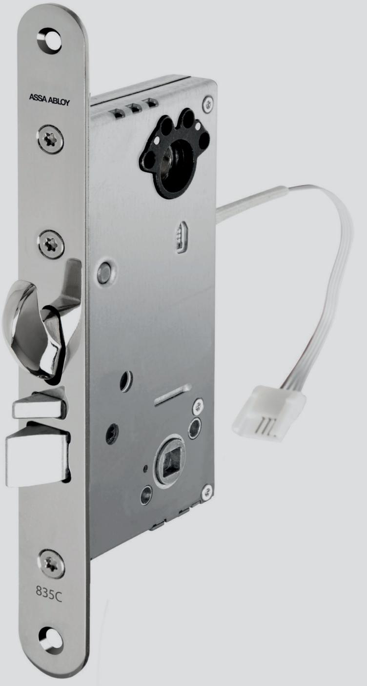

### **Contents**

| Installation                          | Page 3       |
|---------------------------------------|--------------|
| Reversing the latch                   | Page 4       |
| Setting handle operation              | Page 5       |
| Door position sensor                  | Page 6       |
| Setting up the lockcase               | Page 7       |
| Factory reset                         | Page 8       |
| Technical data                        | Page 9       |
| Important information and maintenance | Page 10      |
| Class 3                               | Page 11      |
| DAC564                                | Page 12      |
| Connecting override open button       | Page 13      |
| Connecting standalone with I/O Box    | Page 14 - 16 |

### Installation

- **1.** Mark the centre line A (edge of door stile) when the position of the lock has been decided.
- **2.** Mark locations B and C.
- **3.** Using a Ø20 mm wood drill bit, drill a series of holes 82 mm deep for a spindle offset of 50 mm. Clean out the recess with a chisel so that the lock fits easily. Using a Ø42 mm drill bit, drill through the door for the cylinder hole and handle hole (B + C).

Using a chisel, cut a rebate 3 mm deep and 22 mm wide for the lock face plate. Mark out where the striking plate should sit. Drill six Ø22 mm holes 26 mm deep for 1487-X. Clean out with a chisel so that the striking plate fits the recess.

Chisel out a rebate for the face of the striking plate, 4 mm deep for 1487-X. Pre-drill the fixing holes for the screws (4 x Ø3 mm holes).

If you intend to use the internal door position sensor, fit the magnet to the striking plate. The magnet should sit at the same height as the datum mark on the lock face plate.

**ASSA ABBLOY recommends a gap of 3 mm between the lock stile and the striking plate. Adjust the door so that the door seal does not press on the hook bolt.**

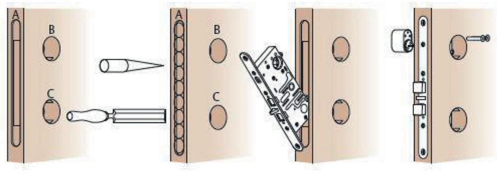

### Connection

Connection to the Hi-O Bus is made using four cables: two for power and two for communication. For installation, use EA226 (10 m) cable with pre-installed connectors. The cable can be connected to any location on the Hi-O bus.3

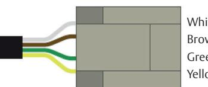

White CAN high Brown CAN low Green +12-24 VDC stab Yellow 0 VDC

### Reversing the latch 813C-50, 815C-50, 820C-50, 825C-50, 835C-50

- **1** Push in the latch and dead-latching snib until you can see the Torx screws through the holes in the lock case (Torx screws TX5). Reversing the latch 813C-50, 815C-50, 820C-50,
	- **2** Unscrew the Torx screws from the latch and dead-latching snib. 825C-50, 835C-50
	- **3** Withdraw the latch and dead-latching snib from the lock case.
- **4** Rotate the latch and dead-latching snib through 180 degrees to suit the direction the door will open.
- **5** Push in the latch and dead-latching snib until you can see the threaded holes for the Torx screws through the holes in the lock case.
- **6** Insert and tighten the screws.

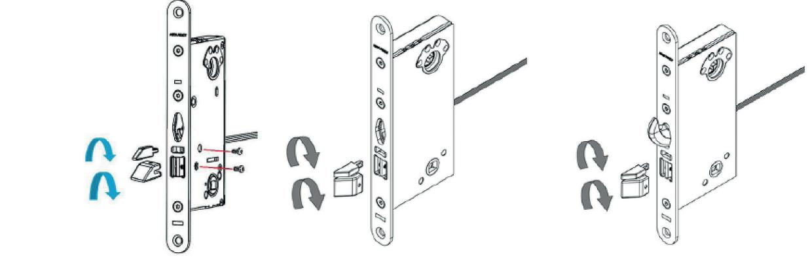

#### Setting fail locked/fail unlocked operation 813C-50, 815C-50, 820C-50, 825C-50, 835C-50 through the holes in the lock case. 6. Insert and tighten the screws.

This setting is made before the lock is installed and is activated when power is connected to the lock.

4. Rotate the latch and dead-latching snib through 180 degrees to suit the direction the door will open. 5. Push in the latch and dead-latching snib until you can see the threaded holes for the Torx screws

Setting fail locked/fail unlocked operation. This operation is set using the DIP switch on top of the lock casing. Set the switch for the desired operation. Setting fail locked/fail unlocked operation 813C-50, 815C-50, 820C-50, 825C-50, 835C-50 Setting fail locked/fail unlocked operation. This operation is set using the DIP switch on top of the lock

- Fail locked = door is locked if power is cut. casing. Set the switch for the desired operation.
- Fail unlocked = door is unlocked if power is cut. - Fail locked = door is locked if power is cut. - Fail unlocked = door is unlocked if power is cut.

This setting is made before the lock is installed and is activated when power is connected to the lock.

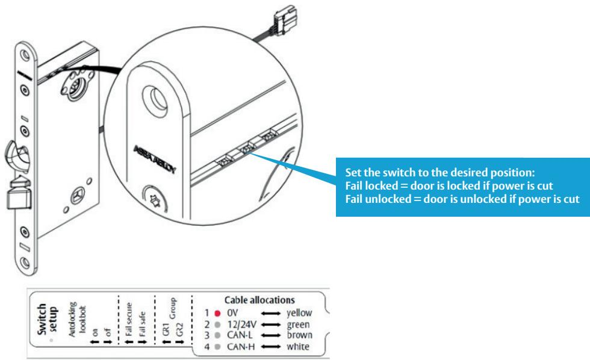

825C-50, 835C-50

the hole.

#### Setting handle operation 813C-50, 815C-50, 820C-50, 825C-50, 835C-50 The lock must be in fail safe (fail unlocked) mode before making mechanical or electrical adjustments. Set the lock to fail safe mode, then turn off the power. You will then be able to see the screws through

The lock must be in fail safe (fail unlocked) mode before making mechanical or electrical adjustments. Set the lock to fail safe mode, then turn off the power. You will then be able to see the screws through the hole.

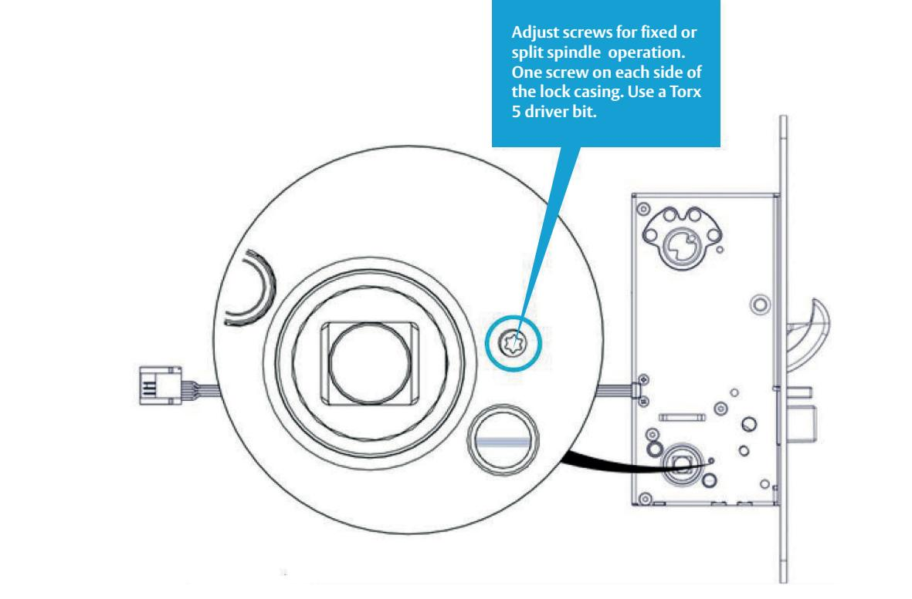

Split Spindle locked outside

the stop position.

#### **Adjusting screws for desired operation**  Electrically controlled inside and outside. Unscrew the Locked outside, manually operated inside: tighten

To set the lock for split or fixed spindle operation, adjust the Torx 5 screws to the following positions. Note! Adjust each screw to the stop position: screws to their outer positions. Note! Adjust each screw to the stop position. screw on the side that will be manually operated. Note! Adjust each screw to

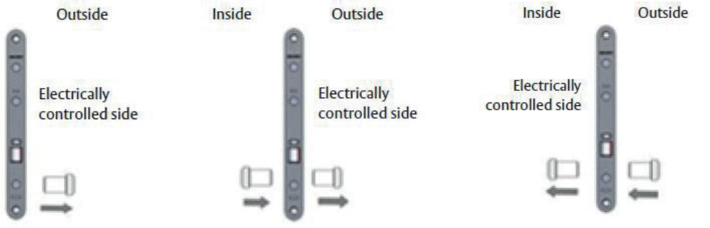

#### **Fixed Spindle**

Fixed Spindle

Electrically controlled inside and outside. Unscrew the screws to their outer positions. Note! Adjust each screw to the stop position.

#### **Split Spindle locked outside**

Locked outside, manually operated inside: tighten screw on the side that will be manually operated. Note! Adjust each screw to the stop position.

**Split Spindle locked inside**  Locked inside, manually operated outside: tighten screw on the side that will be manually operated. Note! Adjust each screw to the stop position.

Locked inside, manually operated outside: tighten screw on the side that will be manually operated. Note! Adjust each screw to the stop position.

### Door position sensor

The sensor is located in-line with the datum mark on the lock face plate.

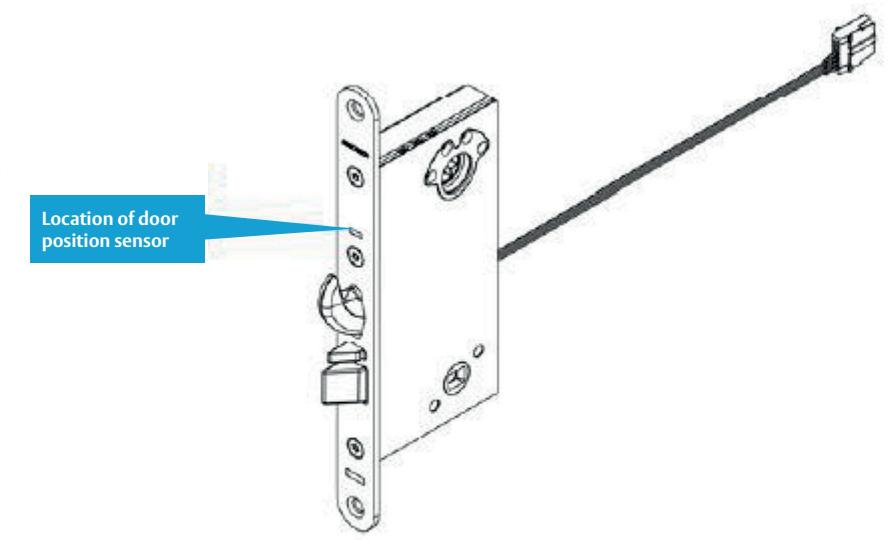

### Magnet position

If using the internal door position sensor, fit the magnet to the striking plate. The magnet should sit at the same height as the datum mark on the lock face plate. Magnet position

same height as the datum mark on the lock face plate.

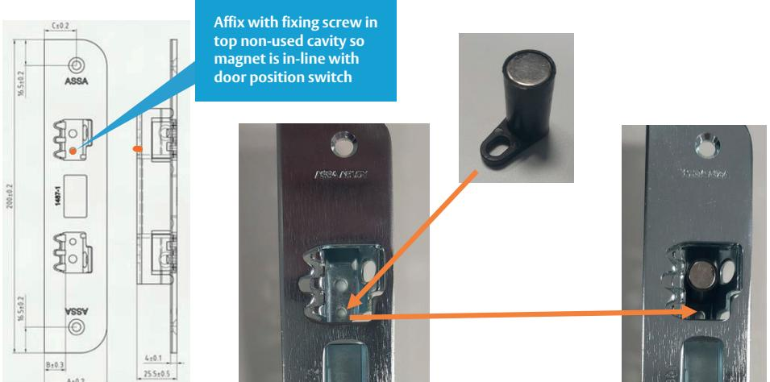

If using the internal door position sensor, fit the magnet to the striking plate. The magnet should sit at the

### Setting up lock case and I/O Box

- **1** Connect the lock case to the I/O Box.
- **2** Set the function DIP switches on the lock case to the desired settings.
- **3** Connect power to the I/O Box; the LED will flash green/red to show that the power is on.
- **4** Set DIP switch 1 to ON. Set the configuration DIP switch 2 for the desired operation.
- **5** When the red LED glows steadily the Hi-O bus is secure and encrypted.

### Setting up lock case and DAC564/DAC530

- **1** Connect the lock case and DAC.
- **2** Make sure the termination jumper in DAC is in the ON position.
- **3** In most cases the Door monitor input should be fitted with a jumper and the Button input should be open. (For more information, see the setting-up table.)
- **4** Set all DIP switches to the OFF position for most applications. (For more information, see the setting-up table.)
- **5** Turn on the power. (Blue DWG LED starts flashing. Wait until blue DWG LED flashes rapidly, which can take up to 3 minutes. Do NOT turn off the power during setting up.)
- **6** Setting up is complete when the yellow PWR LED lights up and the blue LED flashes rapidly. (If the blue LED flashes rapidly and the yellow PWR LED does not light up then setting up has failed.)
- **7** Turn off the power.
- **8** Set DIP switch 8 to ON for standalone mode. Also see page 12 for different operating modes.
- **9** Turn the power back on and check operation.

### Factory reset

- **1** Hold the lock case and push the bolt in, for models 820, 825 and 835 (unlocked).
- **2** Turn off the power to the lock.
- **3** Check that the door sensor is not activated. DIP switch 2 should be OFF.
- **4** Turn on the power.
- **5** Toggle the group switch 6 times ON/OFF within 30 seconds.
- **6** When the LED glows steadily the lock has been reset to factory settings.

#### **LED operation**

Steady glow = Not set up; LED off = Set up. Flashing at 2 Hz = Set up for different DAC, or I/O Box flashing at 20 Hz (flickering) = Timeout, wait 240 seconds before unlocking.

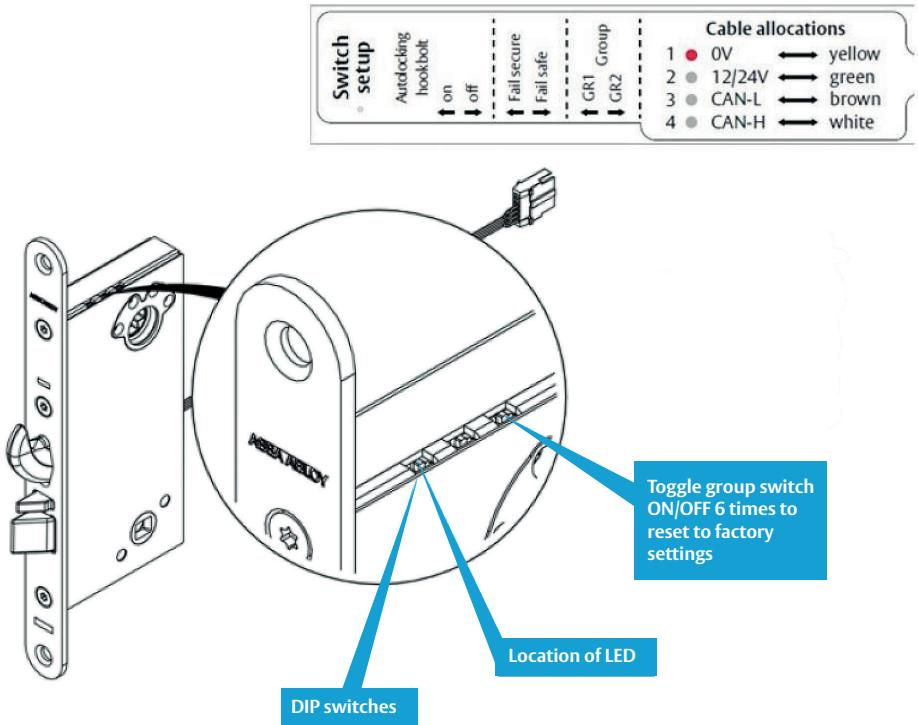

#### **Conditions for deadlocking 820C/825C**

For 820C/825C you can set the condition for the lock to report deadlocking. This function can be used if you want to prevent unlocking from outside when the door is manually locked from inside. The condition is set using the DIP switch for hookbolt deadlock on the lock casing.

When the DIP switch is OFF the condition for deadlocking is the dead-latching snib. When the dip switch is ON the condition for deadlocking is latch locked.

## Technical data

Lock types: ASSA motor lock 813C, 815C, 820C, 825C, 835C

#### **Power consumption**

| Indications on start-up | Supply voltage     | Current (A) | Power (W) |
|-------------------------|--------------------|-------------|-----------|
| Operating (standby)     | 12.0 / +20 degrees | 0.081       | 0.97      |
| Operating (standby)     | 24.0 / +20 degrees | 0.044       | 1.06      |
| Switching on/off handle | 12.0 / +20 degrees | 0.22        | 2.64      |
| Switching on/off handle | 24.0 / +20 degrees | 0.095       | 2.28      |
| Locking hook bolt       | 12.0 / +20 degrees | 0.58        | 6.96      |
| Locking hook bolt       | 24.0 / +20 degrees | 0.33        | 7.9       |

|                          | EA226              |  |
|--------------------------|--------------------|--|
| Cable                    | Length 10m         |  |
|                          | Maximum length 50m |  |
| Cable length, cable area | 20 m 0.3 mm2       |  |
|                          | 30 m 0.4 mm2       |  |
| at 12 V                  | 40 m 0.5 mm2       |  |
|                          | 50 m 0.6 mm2       |  |

#### **Package contents**

| Lock case                                                                         | Lock case, drill protection (835C-50). Manual accessible using QR code.                                                           |
|-----------------------------------------------------------------------------------|-----------------------------------------------------------------------------------------------------------------------------------|
| Complete set                                                                      | Lock case, drill protection, I/O Box 350, cable EA226, striking plate c/w contact magnet, wood screws, cable transition EA281. |
| ARX set                                                                           | Lock case, connecting cable EA226 and striking plate c/w contact magnet.                                                          |
| PoE                                                                               | Lock case 835C should not be used with PoE & local control unit 9101.                                                             |
|                                                                                   |                                                                                                                                   |
| Accessories                                                                       | 813C-50 815C-50 825C-50 820C-50 825C-50 835C-50                                                                    |
| Cylinder type                                                                     | Round, oval                                                                                                                       |
| Striking plate                                                                    | 1487-1, -2, -3, -4, -5 (c/w contact magnet)                                                                                       |
| Cable                                                                             | EA226                                                                                                                             |
| Cable transition                                                                  | EA281                                                                                                                             |
| Thumb turn                                                                        | 256 thumb turn, double round oval cylinder, solenoid thumb turn.                                                                  |
| Cylinder accessories Opening hardware Handle Std. / Stiffening accessory | 256 or 3212 depending on configuration 8065 for round thumb turn cylinder or 179 handle – 4292                           |

### Important information and maintenance

The most important advice is to follow the installation instructions and not to deviate from them without first consulting us at ASSA ABLOY.

#### **The guarantee is invalidated if:**

- The product is incorrectly installed.
- The product is opened (seal is broken) or if cables/ connectors are cut off.
- The product is installed with accessories or parts that are not recommended by ASSA ABLOY.

#### **Maintenance:**

- Make sure that the fitted cylinders, thumb turns and handles work satisfactorily.
- Lubricate and/or adjust as needed with ASSA ABLOY's recommended lock grease.
- Electrical parts do not require any maintenance.
- Lubricate the bolt and latch in the lock case at least twice a year. Locks that are used very frequently require more frequent maintenance.
- It is also important to maintain and, if necessary, adjust the door closer and hinges to ensure the door closes properly. Correct maintenance of doors is essential for effective operation of locks.

#### **Important information**

- **•** Do not use lubricants that contain graphite or solvents; only use lock lubricant from ASSA ABLOY.
- The safety features of this product are vital for its compliance with EN 14846 and SSF3522-1093.
- No modification or alteration of any kind other than described in these instructions is permitted.
- The lock case is intended for installation in a single or double door **, made from wood, aluminium or steel. The door must not weigh more than 200 kg.
- Depending on the type of door, different mounting screws may be needed.
- * The fire test was performed on a glazed uninsulated door constructed from steel profiles. The lock tested was an 835C-50 model.
- ** If the lock is used in a double door, a door coordinator must be fitted.

### **Certification**

| Lock case  | Brief description                                        | CE cert.   | SSF 3522 class 3 | SS-EN 14846 |
|------------|----------------------------------------------------------|------------|------------------|-------------|
| 813C-50    | Manual latch bolt                                        | CPR 21-524 | 0.97             |             |
| 815C-50    | Manual latch bolt                                        | CPR 21-524 | 1.06             |             |
| 820C-50    | Manual hook bolt and manual latch bolt                   | CPR 21-524 | 21-640 640       |             |
| 825C-50    | Manual hook bolt, single hand opening, cylinder override | CPR 21-524 | 21-640 640       |             |
| 835C-50    | Auto hook bolt, single hand opening, cylinder override   | CPR 21-524 | 21-640 640       |             |
| 835C       | 3 X 8 F 0 L 5 1 3                                        |            |                  |             |
| 820C, 825C | 3 X 8 F 0 L 3 1 3                                        |            |                  |             |
| 815C, 813C | 3 X 8 F 0 L 1 1 3                                        |            |                  | SBSC 21-563 |

### Class 3

The following requirements must be met to comply with class 3. To meet class 3 the DAC564 control unit or I/O Box 350 must be installed in a protected area that meets class 3 locking requirements or better. The DAC564 control unit or I/O Box 350 must be installed in SSF 3522 mode.

### SSF 3522 Mode

To configure 835C-50 in SSF 3522 mode, proceed as follows:

- **1** Set up the lock case
- **2** Turn off the power
- **3** Set DIP switch 3 to the ON position
- **4** Turn on the power

In SSF 3522 mode the relay will operate as follows:

- Deadlock relay lock indication is active for 15 seconds after locking.
- Inside handle relay is activated when the inside handle is down.
- Error relay is activated by the same fault, but is deactivated after 120 seconds.
- Forced relay indicates that door is unlocked; output is deactivated after 120 seconds.

### Accessories SSF 3522

All components that form part of the lock unit (including lock case, striking plate and door stiffening accessories) must meet the same classification or better in order for the lock unit to be classed as SSF 3522.

### ASSA ABLOY motor locks installation guide

### DAC564

#### **Connection**

813C, 815C, 820C, 825C, 835C with DAC564

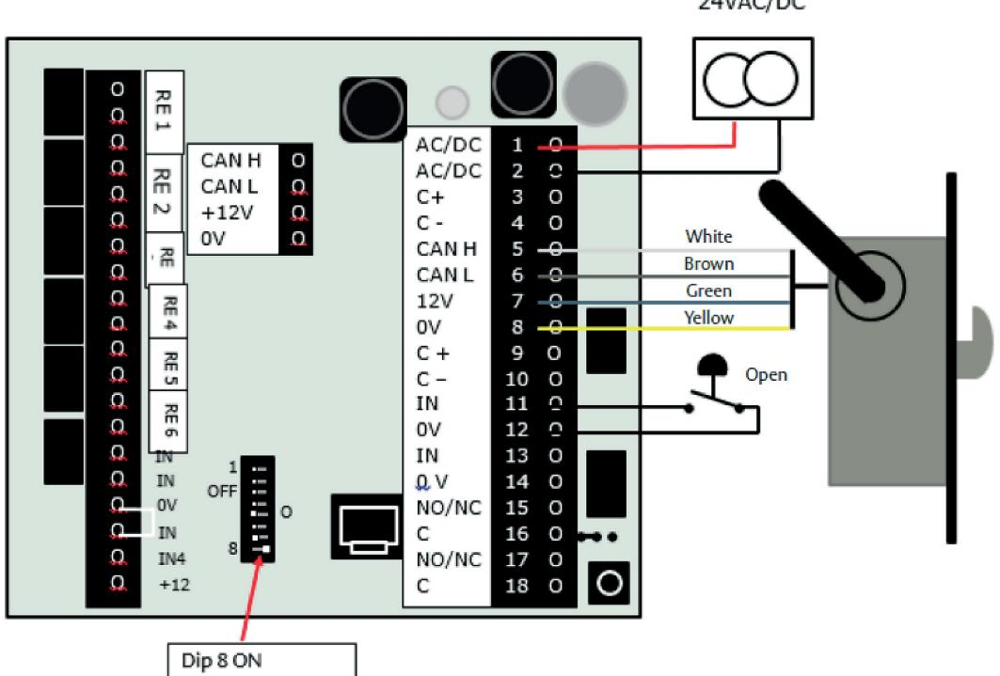

#### **Setting up**

- **1** Connect the lock to terminals 5–8 in the DAC.
- **2** Make sure all DIP switches are OFF.
- **3** Turn on the power.
- **4** The blue LED will start flashing.
- **5** The lock is correctly set up when the yellow PWR LED lights up and the blue LED starts to flicker.
- **6** Turn off the power.
- **7** Set DIP switch 8 to the ON position.
- **8** Turn on the power.

### Connecting override open button 825C with I/O Box

#### **Connection**

- **1** Make sure the auto hook bolt DIP switch on the lock case is set to OFF.
- **2** Connect a cable from C on the deadlock relay to the unlock input.
- **3** Connect from NO on the deadlock relay to the open button.
- **4** Run the cable from the open button to the unlock input.

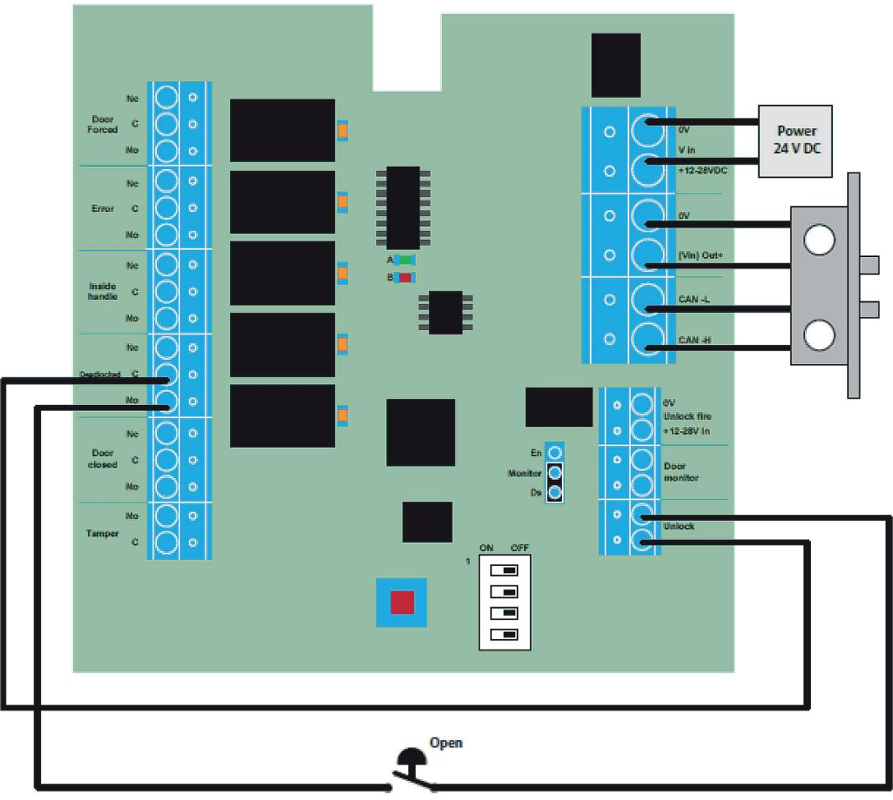

### Connecting standalone with I/O Box

- Setting up.
- Set the function DIP switches on the lock case to the desired settings.
- Connect the lock.
- Turn on power to the I/O Box 350
- Set DIP switch 1 to the ON position. Set the other DIP switches as shown in the table.
- The green LED will start flashing when set-up begins.
- The red LED will glow steadily when set-up is complete.

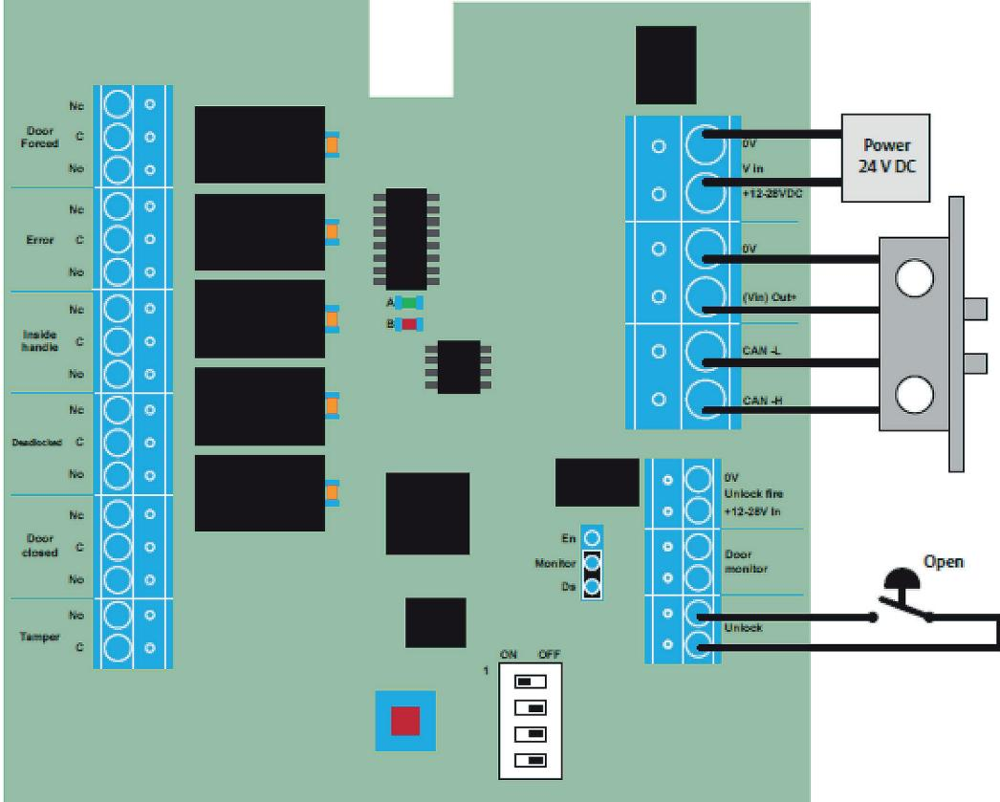

#### **About I/O Box 350**

I/O Box 350 is a terminal that is compatible with 813C, 815C, 820, 825 and 835.

#### **Hi-O installation**

Hi-O units are easy to install; all units are connected in parallel using four wires. Units on the Hi-O bus recieve their supply voltage from I/O Box 350.

#### **Indications on I/O Box 350**

The unit has one green and one red LED. The operation of these is described in the table below for ther various configuration stages and during operation.

| Indications on start-up                     |                                                                                                   |  |
|---------------------------------------------|---------------------------------------------------------------------------------------------------|--|
| Green LED                                   | Flashes at one-second intervals: unit waits for lock to be paired                              |  |
|                                             | Glows steadily: HI-O units detected on Hi-O bus                                                   |  |
| Red LED Does not light up on start-up | Unit is not set up on Hi-O bus                                                                    |  |
| Red LED Lights up on start-up         | Units are locked to a specific Hi-O bus; red indicates that lock case is paired and encrypted. |  |

| DIP |                                                                                                                                                                                                                                           |  |  |
|-----|-------------------------------------------------------------------------------------------------------------------------------------------------------------------------------------------------------------------------------------------|--|--|
| 1   | Used when Hi-O units are to be paired or unpaired. For more information see Description of pairing sequence.                                                                                                                           |  |  |
| 2   | Used to deactivate door monitor in lock during pairing: Set DIP switch to ON if door position sensor in lock should be deactivated, and connect external sensor to I/O Box. Must be set before lock case is paired with I/O Box. |  |  |
| 3   | DIP = OFF, normal mode:                                                                                                                                                                                                                   |  |  |
|     | DIP = ON, outputs operate according to requirements of SSF3522.                                                                                                                                                                        |  |  |
| 4   | DIP = OFF: Door forced output will remain active after door has been forced. Output is reset via Unlock input.                                                                                                                         |  |  |
|     | DIP = ON: Door forced output will be deactivated when door is closed.                                                                                                                                                                  |  |  |

| Technical specifications                                                             |                                                                       |  |  |  |  |  |
|--------------------------------------------------------------------------------------|-----------------------------------------------------------------------|--|--|--|--|--|
| Part number                                                                          | S55665710085                                                          |  |  |  |  |  |
| Supply voltage                                                                       | 12-24 V DC (min 11V, max 27.8 V DC)                                   |  |  |  |  |  |
| Current consumption at                                                            | 12 V: Mean 40 mA, max 30 mA 27.8 V: Mean 20 mA, max 30 mA          |  |  |  |  |  |
| Use a low-voltage (SELV) compatible power source (LPS) with a current rating ≤ 2A |                                                                       |  |  |  |  |  |
| Cable                                                                                | 3 m AWG26                                                             |  |  |  |  |  |
| Hi-O cable length                                                                    | Total: Max 50 m Cable branch length: Max 10 m                      |  |  |  |  |  |
| Operating temperature range                                                       | -30°C to +70°C Below -30°C the reader must be heated externally |  |  |  |  |  |
| Operating humidity range                                                          | 5% to 95%                                                             |  |  |  |  |  |
| Dimensions                                                                           | 9 x 12 x 4 cm                                                         |  |  |  |  |  |
| IP                                                                                   | 34                                                                    |  |  |  |  |  |
|                                                                                      | Temperature: -50°C to +70°C                                           |  |  |  |  |  |
| Storage and transport                                                                | (-58°F to +158°F)                                                     |  |  |  |  |  |

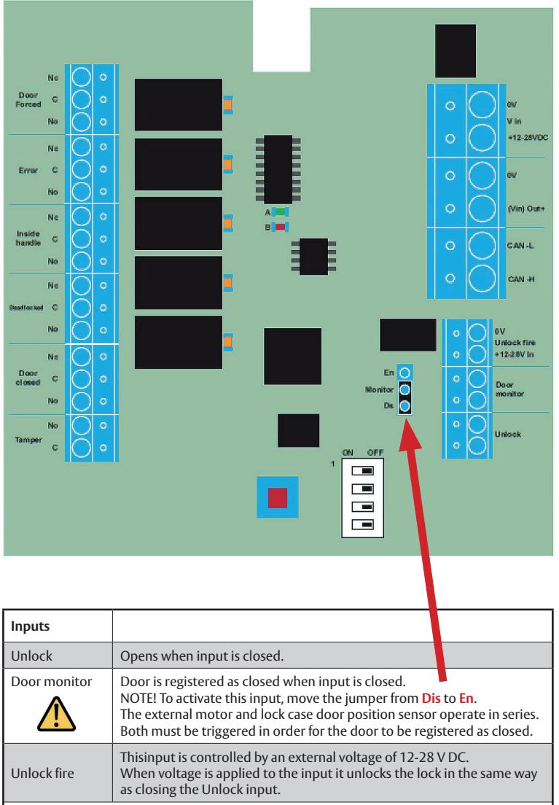

The Unlock and Unlock fire inputs operate in parallel. This means that the door will only lock if both inputs are not activated.

| White  | CAN-H      | Connection to Hi-O bus        |  |
|--------|------------|-------------------------------|--|
| Brown  | CAN-L      |                               |  |
| Green  | +12-24 VDC | Supply to lock via fused unit |  |
| Yellow | 0 V        |                               |  |

#### **Description of pairing sequence Pairing lock with I/O Box 350 on Hi-O bus**

- **1** Set the function DIP switches on the lock case to the desired settings.
- **2** Connect the Hi-O lock to I/O Box 350.
- **3** Turn on the power to I/O Box 350, flashing green and red LEDs indicate that power is on.
- **4** Set DIP switch 1 to the ON position. Set configuration. DIP switch 2 to suit the desired position. See the table.
- **5** The green LED will start flashing when set-up begins.
- **6** The red LED will glow steadily when set-up is complete.
- **7** When the green LED turns off and the red LED glows steadily the Hi-O bus is secure and encrypted.

At the top edge of the lock next to the DIP switches is a red LED which lights up when the lock is unpaired and turns off when the lock is paired and encrypted.

### ASSA ABLOY motor locks installation guide

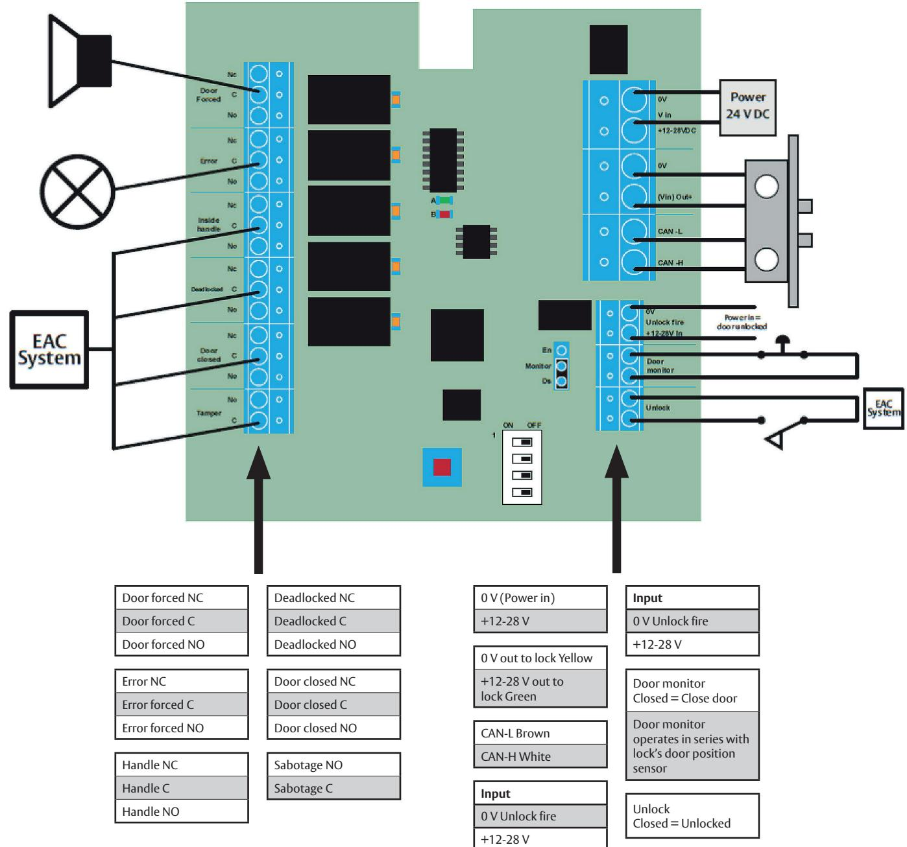

| DIP | Operation                                                                                                                                          | Relay                                                                | Standard operation                                                                                                                                                                                                                                                                          | Operation for SSF3522                                                                              |
|-----|----------------------------------------------------------------------------------------------------------------------------------------------------|----------------------------------------------------------------------|---------------------------------------------------------------------------------------------------------------------------------------------------------------------------------------------------------------------------------------------------------------------------------------------|----------------------------------------------------------------------------------------------------|
| 1   | Pair Hi-O units                                                                                                                                    | Door closed:                                                         | Relay is activated when door is closed.                                                                                                                                                                                                                                                     |                                                                                                    |
| 2   | Activates/deactivates door position sensor in lock case. If DIP 2 is ON during pairing: Door position sensor in lock case is deactivated. | Deadlock: Mirrors latch position:                                    |                                                                                                                                                                                                                                                                                             | Relay is deactivated after 15 seconds                                                              |
| 3   | DIP = OFF, normal mode:                                                                                                                            | Inside handle: Relay is activated when the inside handle is down. |                                                                                                                                                                                                                                                                                             |                                                                                                    |
|     | DIP = ON: Outputs operate according to requirements of SSF3522.                                                                                 | on the Hi-O bus. communication on fault.                          | Error: Activated if the lock fails to lock or if there is a communication fault Red LED flashes at one-second intervals (1 Hz) if there is a All other relays are deactivated if there is a communication fault and return to their original state when communication is restored. | SSF3522: Relay is activated for the same type of fault but is deactivated after 120 seconds. |
| 4   | DIP = OFF: Door forced output remains active after door has been forced. Output is reset via Unlock input.                                   | Door forced: See description for DIP 4.                           |                                                                                                                                                                                                                                                                                             | Door forced: In SSF3522 mode the output switches function and indicates when                 |
|     | DIP = ON: Forced door output is deactivated when door is closed.                                                                                |                                                                      |                                                                                                                                                                                                                                                                                             | the door is unlocked; the output is deactivated after 120 seconds.                              |

The ASSA ABLOY Group is the global leader in access solutions. Every day we help people feel safe, secure and experience a more open world.

ASSA ABLOY Opening Solutions UK & Ireland Door Hardware Group School Street Willenhall West Midlands WV13 3PW

**17**

+44 (0)845 223 2124 csdcomm@assaabloy.com