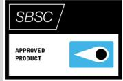
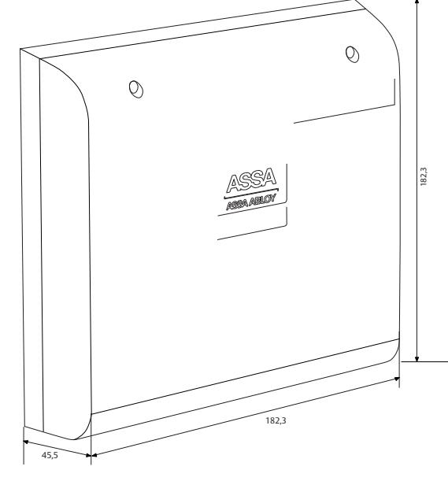

# ASSA DAC530III

ASSA ABLOY, the global leader in door opening solutions

## Door Control Unit

The DAC530III is a communication unit and an intelligent connection terminal block designed to be fitted next to each door environment. An electric lock, reader, exit button and so on are connected to each unit.

The DAC530III is a Hi-O™ unit that can be connected to a Hi-O bus, but it can also be used as a traditional DAC and connected to non-Hi-O units, such as a reader, electric lock and exit button.

Hi-O means that the units have a built-in processor and communicate with each other for plug-and-play installation. Hi-O enables intelligent supervision of door behavior, in real time.

The DAC530III has built-in function for Hi-O motor locks.

# ASSA DAC530III

ASSA ABLOY, the global leader in door opening solutions

## Door Control Unit

#### **Casing**

- Impact-resistant PC/ABS plastic
- Halogen/Halon free Relay functions DAC530 II (with relay card)
- Time-controlled exit
- Buzzer
- Temporary alarm bypass
- Automatic door controls
- Door leaf position
- Electric strike plate
- Temporary alarm bypass connection that falls if the door is open too long
- Sabotage
- Reflects blocking input in zone
- Prealarm for alarm by-pass
- Balanced UT/SAB
- Balanced UT/ALARM
- Disabled exit
- Unconditional buzzer output
- Door automatic controls with IR/Radar
- Exit
- Entry
- Invalid card/code
- Permanent alarm bypass connected via relay card
- Complies with EN 50131-3:2009, Security grade 4, and EN 50130-5:2011, environmental class II

#### **Data**

- Voltage supply: 12 24 V AC/DC
- Maximum power consumption: 12 V DC 55 mA 24 V DC 40 mA
- Weight: 200 g
- Volume: 0.0832 m³
- Temperature range: +5°C to +40°C (non-condensing)
- Number of intputs: 2 (1 for exit button, 1 for door monitoring)
- Number of outputs: 2 (1for alarm by-pass, 1 for electric lock control)

### **Compatible reader technologies**

- EM4102, Mifare, CL/DATA ( Magnetic) and Wigand
#### **Accessories**

- Relay card 400RC64 Relay card with 4 inputs (3 double balanced, 1 as blocking input) and 6 outputs (4 is configurable, 1 for alarm control, 1 for schedule control)
- Relay card 500RW22 Relay card/interface with 2 relays and 2 inputs, Weigand interface for two OEM readers, in/out

### **Article number**

- DAC530III S556 650 3085 E58 703 97 • Relay card 400RC64 S556 651 160 E58 760 12
- Relay card 500RW22 S556 652 160 E58 700 87

ASSA ABLOY is the global leader in door opening solutions, dedicated to satisfying end-user needs for security, safety and convenience

ASSA AB P.O. Box 371 SE-631 05 Eskilstuna Sweden Phone +46 (0)16 17 70 00

Fax +46 (0)16 17 70 49

Customer support: phone intl. +46 (0)16 17 71 00 Phone nat. 0771-640 640 Fax +46 (0)16 17 73 72 e-mail: helpdesk.marknad@assaabloy.com

www.assa.se

-