2022-23

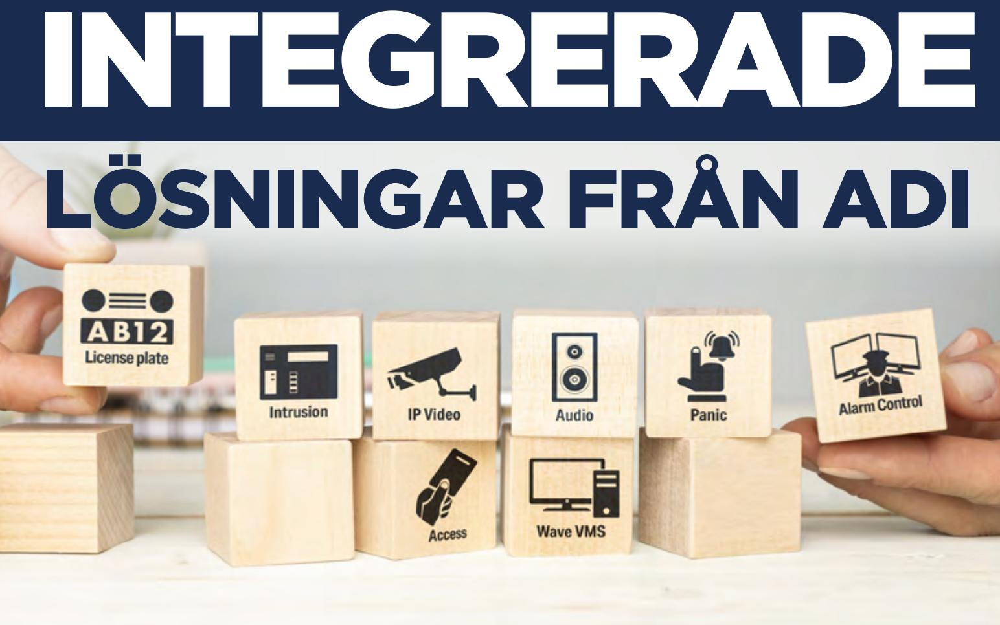

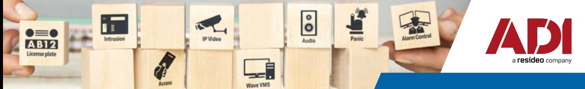

# **ADI erbjuder integrerade säkerhetslösningar med Wave VMS-plattform, Galaxy inbrottslarm, Inovonics**

#### **och ASSA ARX passagesystem.**

Detta kan enkelt övervakas och styras via en och samma smartphone app eller klientmjukvara för dator.

Gå igenom stegen på följande sidor för att sätta ihop just din lösning.

| Sida |         |                        |
|------|---------|------------------------|
| 3-5  | Steg 1. | Välj kameralösning     |
| 5-6  | Steg 2. | Välj Wave plugin       |
| 6-7  | Steg 3. | Välj Galaxy-lösning    |
| 7    | Steg 4. | Välj Inovonics-lösning |
| 7-10 | Steg 5. | Välj ASSA ARX-lösning  |

**Självklart finns det större lösningar än de exempel nedan, kontakta oss då så hjälper vi er.**

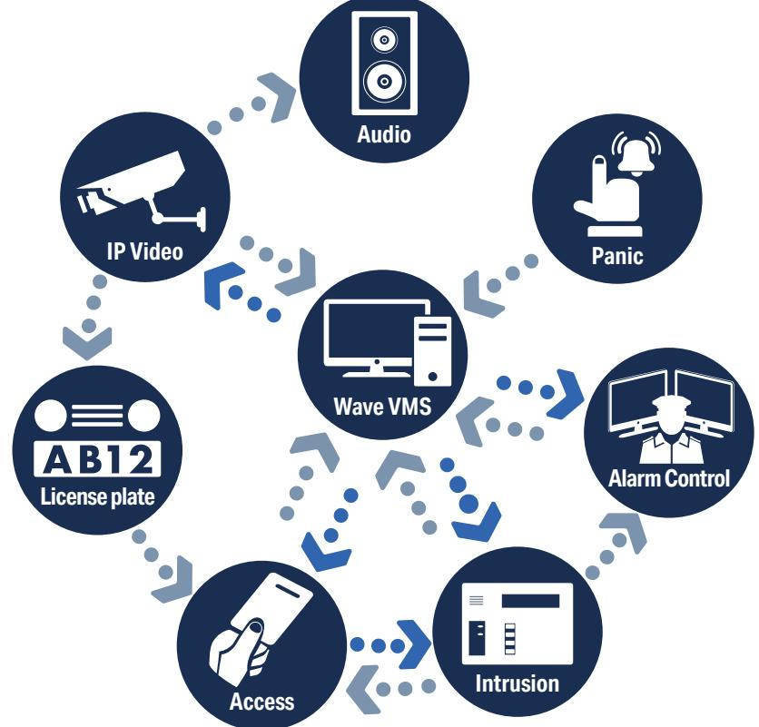

## **1. VÄLJ KAMERALÖSNING**

| Välj Wave-kamerasystem |                                                                                                                                                         | Hur många kameror skall systemt klara av? Letar du efter en större lösning? Kontakta oss.                                                       |      |  |
|------------------------|---------------------------------------------------------------------------------------------------------------------------------------------------------|----------------------------------------------------------------------------------------------------------------------------------------------------|------|--|
| ADI artikel            | Beskrivning                                                                                                                                             |                                                                                                                                                    |      |  |
| HRS1-G2-4T-U           | Mini Wave-VMS Recorder inkl 4TB HDD, förinstallerad Wave VMS mjukvara, upp till 12 kameror. VÄLJ Köp till licenser WAVE-PRO-xx/EU och PoE Switch. |                                                                                                                                                    |      |  |
| WRN-1610S-8CH-8TB      | Recorder 16 kanaler PoE+ portar, 8TB, inkl 8st Wave inspelningslicenser                                                                                 |                                                                                                                                                    |      |  |
| Birdy box M2           |                                                                                                                                                         | Klientdator för uppkoppling till en recorder W10, i5 CPU, 16 GB RAM, 1GB LAN, 250GB SSD, för flera skärmar välj till BB-LP-GTX1050i grafikkort. |      |  |
| Birdy box M3           | för flera skärmar välj till BB-LP-GTX1050i grafikkort.                                                                                                  | Klientdator för uppkoppling till en recorder W10, i7 CPU, 16 GB RAM, 1GB LAN, 250GB SSD,                                                           | VÄLJ |  |

| Välj switch      |                                                      | Tänk på hur mycket kamerorna förbrukar totalt så du inte överskrider PoE-budgeten.      |      |
|------------------|------------------------------------------------------|--------------------------------------------------------------------------------------------|------|
| ADI artikel      | Beskrivning                                          |                                                                                            |      |
|                  |                                                      |                                                                                            |      |
| 0E-8P4POEGIG-EU  | Gigabit PoE Switch 8 portar varav 4 st PoE (max 62W) |                                                                                            | VÄLJ |
| 0E-9P8POEGIG-EU  |                                                      | Gigabit PoE Switch, 8 PoE portar (max130w), 1st uplink port                                | VÄLJ |
| PFS3010-8ET-96   | 10/100 Switch 8 portar PoE+ (max96W), 2 Gb uplink    |                                                                                            | VÄLJ |
| PFS3220-16GT-240 | port 19–20: 2 × SFP 1000 M (uplink)                  | Gigabit PoE Switch 16 Port PoE+ (max 240W), port 1-2 kan leverera 90W 2 × RJ45 Gb (uplink) | VÄLJ |

| Välj skärm  |                           | Många fler skärmar finns att välja på. |
|-------------|---------------------------|----------------------------------------|
| ADI artikel | Beskrivning               |                                        |
|             |                           |                                        |
| WBXML24     | Skärm 23,6", FHD 24/7 LCD | VÄLJ                                   |

| Tillbehör, skärm |                                                                                                                        |      |
|------------------|------------------------------------------------------------------------------------------------------------------------|------|
| ADI artikel      | Beskrivning                                                                                                            |      |
| WBXHDMI03V2      | HDMI kabel 3 meter                                                                                                     | VÄLJ |
| WBXMB1330TM      | Väggfäste Vesa max 100 x 100, tilt: 0 to 12 grader                                                                     | VÄLJ |
| WBXMB1342TSD     | Väggfäste 2-ledat Vesa max 200 x 200, Tilt: -15 to +15 grader, swivel -90 to +90 grader, förlängning 50 mm - 382 mm | VÄLJ |

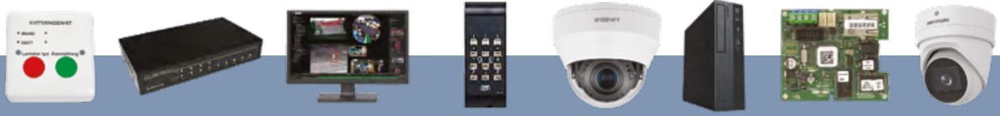

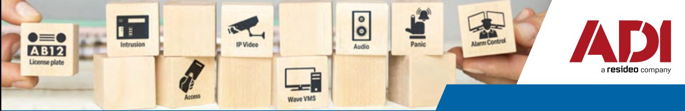

| Välj inspelningslicens |  |                                                       | Det finns större licensförpackningar om så önskas           |      |
|------------------------|--|-------------------------------------------------------|-------------------------------------------------------------|------|
| ADI artikel            |  | Beskrivning                                           |                                                             |      |
| WAVE-PRO-01/EU         |  | Wave 1x Recording License                             |                                                             | VÄLJ |
| WAVE-PRO-04/EU         |  | Wave 4x Recording License                             |                                                             | VÄLJ |
| WAVE-PRO-08/EU         |  | Wave 8x Recording License                             |                                                             | VÄLJ |
| WAVE-ENC-04/EU         |  | Wave Encoder inspelningslicens för 4x analoga kanaler |                                                             | VÄLJ |
| WAVE-IO-01/EU          |  |                                                       | Wave 1x lic I/O Device License för ADAM eller AXIS IO Modul | VÄLJ |

**Välj efter märke eller blanda efter funktion.** 

**[IPC-HDBW5442E-ZE](https://www.adiglobal.se/Product/IPCDashHDBW5442EDashZE?utm_source=any&utm_medium=pdf&utm_content=ipc-hdbw5442e-ze-product-19&utm_campaign=SE-Q322-Integrated_Solutions_booklet_V2)** Utomhus/inomhus domekamera 4MP varifocal lins 2,7-12mm, AI,IR 40 m, WDR140, IK10, PoE (max 12.4W). Junction box PFA138 (beställs separat). **ADI artikel Beskrivning [SD5A445XA-HNR](https://www.adiglobal.se/Product/SD5A445XADashHNR?utm_source=any&utm_medium=pdf&utm_content=sd5a445xa-hnr-product-20&utm_campaign=SE-Q322-Integrated_Solutions_booklet_V2)** Utomhus/inomhus PTZ 4MP 45X. Optisk Zoom, Starlight, PoE+, Deep-learning-baserad auto tracking och IVS, 150m IR, IK10. Väggfäste medföljer **[IPCHDW3549HASPV28](https://www.adiglobal.se/Product/IPCHDW3549HASPV28?utm_source=any&utm_medium=pdf&utm_content=ipc-hdw3549h-as-pv-0280b-product-21&utm_campaign=SE-Q322-Integrated_Solutions_booklet_V2)** Utomhus/inomhus TIOC Eyeballkamera, 5MP, 2,8 mm fast lins (horisontell vy 103°), vitt ljus, WDR, full-color, blixtljus-larm (rött och blått), inbyggd mik och högtalare. Junction box PFA137 (beställs separat)  **[IPCHDW3549HASPV36B](https://www.adiglobal.se/Product/IPCHDW3549HASPV36B?utm_source=any&utm_medium=pdf&utm_content= ipc-hdw3549h-as-pv-0360b-product-22&utm_campaign=SE-Q322-Integrated_Solutions_booklet_V2)** Utomhus/inomhus TIOC Eyeballkamera, 5MP, 3,6mm fast lins (horisontell vy 81°), vitt ljus, WDR, full-color, blixtljus-larm (rött och blått), inbyggd mik och högtalare. Junction box PFA137 (beställs separat) **Välj kameramärke och modell [VÄLJ](https://www.adiglobal.se/Product/IPCDashHDBW5442EDashZE?utm_source=any&utm_medium=pdf&utm_content=ipc-hdbw5442e-ze-product-19&utm_campaign=SE-Q322-Integrated_Solutions_booklet_V2) [VÄLJ](https://www.adiglobal.se/Product/SD5A445XADashHNR?utm_source=any&utm_medium=pdf&utm_content=sd5a445xa-hnr-product-20&utm_campaign=SE-Q322-Integrated_Solutions_booklet_V2) [VÄLJ](https://www.adiglobal.se/Product/IPCHDW3549HASPV28?utm_source=any&utm_medium=pdf&utm_content=ipc-hdw3549h-as-pv-0280b-product-21&utm_campaign=SE-Q322-Integrated_Solutions_booklet_V2) [VÄLJ](https://www.adiglobal.se/Product/IPCHDW3549HASPV36B?utm_source=any&utm_medium=pdf&utm_content= ipc-hdw3549h-as-pv-0360b-product-22&utm_campaign=SE-Q322-Integrated_Solutions_booklet_V2) Glöm inte viktiga tillbehör. Detta är endast några exempel på tillbehör, saknar du något så kontakta oss.**

| ADI artikel | Beskrivning                                                                                                                                                                     |      |
|-------------|---------------------------------------------------------------------------------------------------------------------------------------------------------------------------------|------|
|             |                                                                                                                                                                                 |      |
| 02328-001   | AXIS P3265-LVE P32 Series, WDR IP66 2MP 3.4-8.9mm varifocal lins IR 40M IP domekamera, vit                                                                                      | VÄLJ |
| 01708-001   | Inomhus AXIS M3066-V mini dome 4MP,2,4 mm fast lins (horisontell vy 131°), HDMI ut, WDR, IK08                                                                                   | VÄLJ |
| 01592-001   | AXIS P3245-LVE P32 Series, Zipstream 2MP 3.44-8.9mm motor-lins IR 40M IP domekamera, vit                                                                                        | VÄLJ |
| 01958-002   | Utomhus/inomhus PTZ Q6135-LE 2MP 32X Optisk Zoom, WDR, High Poe, IR, IK10, Autotracking, Axis Object Analytics, IK08. Vägg och stolpfäste 5801-721 T91L61 (beställs separat) | VÄLJ |

| ADI artikel | Beskrivning                                                                                                                               |      |
|-------------|-------------------------------------------------------------------------------------------------------------------------------------------|------|
| QND-8011    | Inomhus mini dome 5MP,2,8 mm fast lins (Horisontell vy 104,4°), PoE, HDMI ut, WDR.                                                        | VÄLJ |
| QND-8080R   | Domekamera 5MP 3.2-10mm varifocal lins 20m IR IP PoE                                                                                      | VÄLJ |
| PNV-A9081R  | Utomhus/inomhus domekamera 8MP varifocal lins4.5-10 mm, Video Analytics based AI,IR, IK10 , WDR, Occupancy Monitoring                  | VÄLJ |
| QNP-6230RH  | Utomhus/inomhus PTZ 2MP 23X Optisk Zoom, WDR 120,High Poe,IR 100m, IK10, Intelligent Analytics.Väggfäste SBP-300WM1 (beställs separat) | VÄLJ |

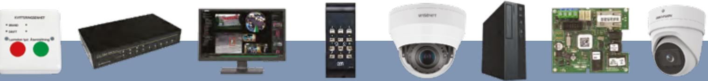

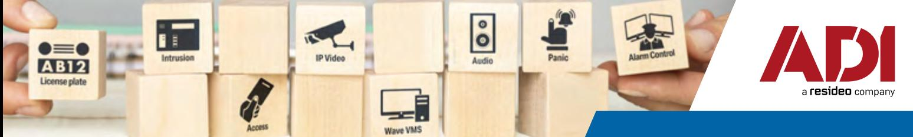

| ADI artikel        | Beskrivning                                                                                                                                                                                                     |
|--------------------|-----------------------------------------------------------------------------------------------------------------------------------------------------------------------------------------------------------------|
| DS-2CD2347G2-LU 28 | Utomhus/inomhus turretkamera, 4MP, 2,8 mm fast lins (horisontell vy 109°), WDR, full-color, Deep learning, VÄLJ vitt ljus 30 m. Passande backbox DS-1280ZJ-PT6 väggfäste DS-1273ZJ-140 (beställs separat) |
| DS2CD2H46G2IZS28   | Utomhus/inomhus domekamera 4MP varifocal lins 2,8-12mm, Accusense, Kontakta sälj IR 40 m, WDR140, IK10, PoE. Passande wallmount DS-1273ZJ-135 (beställs separat)                                          |
| S2CD2646G2IZSUSL2  | Pro Series, AcuSense IP66 4MP 2.8-12mm motoriserad varifocal lins, IR 60M IP bullet- kamera, vit VÄLJ                                                                                                        |

| Välj tillval till kameran |                                                                                                |               |
|---------------------------|------------------------------------------------------------------------------------------------|---------------|
| ADI artikel               | Beskrivning                                                                                    |               |
| 01564-001                 | D2110-VE Security Radar 180° täckning 24/7, PoE-out för strömsättning av andra enheter, HiPoE. | VÄLJ          |
| 01916-001                 | Minihögtalare C1410 PoE, PIR sensor för rörelseavkänning, minne för meddelande uppspelning     | VÄLJ          |
| 01796-001                 | C1310-E Horn högtalare utomhus 121dB, PoE, inbyggd mik                                         | VÄLJ          |
| WBXC6EGY3MP1              | CAT6E patchkabel 3 m, RJ45 grå                                                                 | VÄLJ          |
| WBXC6EGY5MP1              | CAT6E patchkabel 5 m RJ45 grå                                                                  | Kontakta sälj |
| 003-3B5-100-01C           | CAT6 RJ45 patchkabel 10 m grå                                                                  | VÄLJ          |
| EZ-CRIMP                  | Crimpverktyg RJ45                                                                              | VÄLJ          |
| EZ-C6-UTP                 | CAT6 UTP kontakt 100-pack                                                                      | VÄLJ          |
| 001-003-005-10            | CAT6 UTP EXT - nätverkskabel                                                                   | VÄLJ          |

### **2. WAVE-PLUGIN**

| Välj Wave-brygga till Galaxy och ASSA ARX |  |                        | För ASSA integration behövs en import/export licens för att få t ex in dörr namn etc in i Wave. ARX Advanced (Innehåller ARX XML Import/Export). |  |
|-------------------------------------------|--|------------------------|-----------------------------------------------------------------------------------------------------------------------------------------------------|--|
| ADI artikel                               |  | Beskrivning            |                                                                                                                                                     |  |
|                                           |  |                        |                                                                                                                                                     |  |
| ANWAP05                                   |  | WaveARXPlugin 5 dörrar | VÄLJ                                                                                                                                                |  |

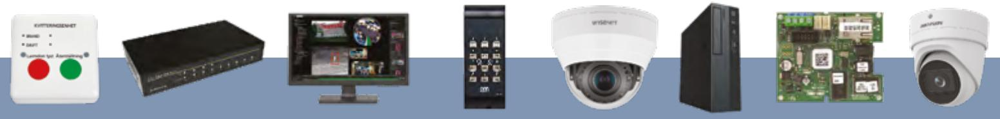

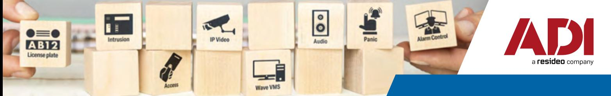

**För en Galaxy-integration behövs en TCP/IP Modul**

| ADI artikel | Beskrivning                                                                               |      |
|-------------|-------------------------------------------------------------------------------------------|------|
| ANWGP1      | Wave Galaxy Plugin för Flex och Dimension                                                 | VÄLJ |
|             | Idag finns det flera larmcentraler i Sverige som tar emot Wave-larm för videoverifiering. |      |
| ADI artikel | Beskrivning                                                                               |      |
| ANWST1      | Wave Sia Transmitter (för att skicka larm till ex larmcentral från Wave)                  | VÄLJ |
| INT-QUADIP  | IP Interface modul                                                                        | VÄLJ |

## **3. GALAXY-LÖSNING IP-INTERFACE MODUL**

| Välj Galaxy-lösning |                                                 | (OBS! E080-10 IP-modul krävs för att fungera med Wave-integrationen) |  |
|---------------------|-------------------------------------------------|----------------------------------------------------------------------|--|
| ADI artikel         | Beskrivning                                     |                                                                      |  |
|                     |                                                 |                                                                      |  |
| C005-E3-K11I        | Galaxy Flex-20 V.3 inkl MK7 Keypad och IP modul | VÄLJ                                                                 |  |
| C006-E3-K11I        | Galaxy Flex-50 V.3 inkl.MK7 Keypad och IP modul | VÄLJ                                                                 |  |
| C007-E3-K11I        | Galaxy Flex-100V.3 inkl.MK7 Keypad och IP modul | VÄLJ                                                                 |  |
| C0520-D-E3          | Galaxy Dimension 520 Zone Control Panel         | VÄLJ                                                                 |  |
| E080-10             | Galaxy TCP/IP modul E080-10 Cloud               | VÄLJ                                                                 |  |
| 460-6310            | Batteri 12V / 17Ah                              | VÄLJ                                                                 |  |

| Välj detektor |                           |      |
|---------------|---------------------------|------|
| ADI artikel   | Beskrivning               |      |
| IS3016        | IR Detektor IS3016        | VÄLJ |
| DT8016F4      | DT8016F4 kombi PIR        | VÄLJ |
| MC 440-2X1K   | MC 440 2x1K magnetkontakt | VÄLJ |

| Välj sirén  |                            |      |
|-------------|----------------------------|------|
| ADI artikel | Beskrivning                |      |
|             |                            |      |
| 20.302.209  | Siren SP203 inomhus        | VÄLJ |
| SPL-2010 O  | SPL-2010 org. utomhussirén | VÄLJ |

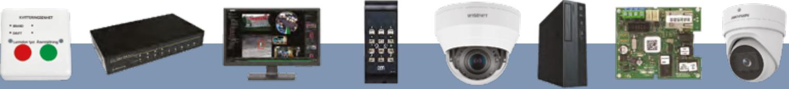

| Välj smart tillbehör |                                                 |               |
|----------------------|-------------------------------------------------|---------------|
| ADI artikel          | Beskrivning                                     |               |
| 110648               | Galaxy FRIO för integration mot branddetektorer | VÄLJ          |
| 485 179-90           | Kvitteringsenhet RS485                          | Kontakta sälj |
| 10009                | Kvitteringsenhet standard                       | Kontakta sälj |
| 21043                | Indikeringsenhet Smart                          | Kontakta sälj |
| YY0-0010             | Galaxy USB Dongel för programmering             | VÄLJ          |

#### **4. INOVONICS-LÖSNING**

| Välj Inovonics-lösning |  |                                                           | För att Inovonics skall fungera i Wave VMS behövs en I/O enhet t ex AXIS A9161  |      |  |
|------------------------|--|-----------------------------------------------------------|------------------------------------------------------------------------------------|------|--|
| ADI artikel            |  | Beskrivning                                               |                                                                                    |      |  |
| EE-4216MR              |  | 16-zoner multifunktionsmottagare med reläutgångar         |                                                                                    | VÄLJ |  |
| EE-4232MR              |  | 32-zoner multifunktionsmottagare med reläutgångar VÄLJ |                                                                                    |      |  |
| EE-5000                |  |                                                           | Repeater EE5000 högeffektsförstärkare förstärker alla sändare i EchoStream-serien. | VÄLJ |  |
| EE-1223 D              |  | Bråklarm liten storlek batteritid upp till 4 år           |                                                                                    | VÄLJ |  |
| EE-1223 S              |  | Bråklarm batteritid upp till 7 år                         |                                                                                    | VÄLJ |  |
| ACC605-BK10            |  | Bältesclip och halsband till 1223                         |                                                                                    | VÄLJ |  |
| 0821-001               |  | AXIS A9161 Network I/O enhet 6 in eller ut, PoE           |                                                                                    | VÄLJ |  |

## **5. ASSA ARX-LÖSNING**

| Välj öppna-knapp |                                                      |  |               |
|------------------|------------------------------------------------------|--|---------------|
| ADI artikel      | Beskrivning                                          |  |               |
| S5115603085      | Öppnaknapp TKN01 III utanpåliggande                  |  | VÄLJ          |
| S5115613085      | Öppnaknapp TKN02 III infälld                         |  | VÄLJ          |
| S515000185       | Hi-O öppnaknapp Pando Touch Hi-O utanpåliggande/slim |  | Kontakta sälj |

| Välj magnetkontakt |                          |                                                                                      |      |
|--------------------|--------------------------|--------------------------------------------------------------------------------------|------|
| ADI artikel        | Beskrivning              |                                                                                      |      |
|                    |                          |                                                                                      |      |
| MC 440             |                          | MC 440 Utanpåliggande magnetkontakt för dörravkänning.                               | VÄLJ |
| MC 240             | behövs art nr MC 200-S11 | MC 240 Infälld magnetkontakt. Kan skruvas i trädörr. Vid montering i metalldörr      | VÄLJ |
| MC 200-S11         |                          | Plastadapter för infällning av magnetkontakter i omagnetiska dörr- och fönsterkarmar | VÄLJ |

| Välj kortläsare |                                                                                                                                                       |      |
|-----------------|-------------------------------------------------------------------------------------------------------------------------------------------------------|------|
| ADI artikel     | Beskrivning                                                                                                                                           |      |
| S559685N084     | Pando Secure generisk läsare med knappsats som hanterar 13,56 MHz teknologier: MIFARE Classic, MIFARE Plus, MIFARE DESFire EV1 & EV2, iCLASS, SEOS | VÄLJ |
| S5596832084     | Pando Mini generisk läsare UTAN knappsats som hanterar 13,56 MHz teknologier: MIFARE Classic, MIFARE Plus, MIFARE DESFire EV1 & EV2, iCLASS, SEOS  | VÄLJ |
| S559685984      | Pando Secure vandalskydd                                                                                                                              | VÄLJ |
| S559683984      | Pando Mini vandalskydd                                                                                                                                | VÄLJ |
| S556545084      | PCR 45. Kortläsare med knappsats och inbyggd DAC. Lämplig som springskydd. Svart                                                                      | VÄLJ |
| S556553000      | PCI-15 USB. Bordläsare för inläsning av Mifare kort                                                                                                   | VÄLJ |
| LT143           | Skyddshuv för Pando Secure                                                                                                                            | VÄLJ |

| Välj trådlös kortläsare |                                                       | För en trådlös lösning krävs även LCU9101IV, 9101R4850, AG30, H100S, radio dongel, PAP mjukvara och Key License file                            |               |
|-------------------------|-------------------------------------------------------|----------------------------------------------------------------------------------------------------------------------------------------------------|---------------|
| ADI artikel             | Beskrivning                                           |                                                                                                                                                    |               |
|                         |                                                       |                                                                                                                                                    |               |
| H100A8L-SC              |                                                       | H100S Kortläsare i handtagform med inbyggd trådlös online eller offline läsare inklusive batterier och monteringsskruvar. För VÄNSTERHÄNGD dörr | Kontakta sälj |
| H100A8R-SC              | batterier och monteringsskruvar. För HÖGERHÄNGD dörr. | H100S Kortläsare i handtagform med inbyggd trådlös online eller offline läsare inklusive                                                           | VÄLJ          |

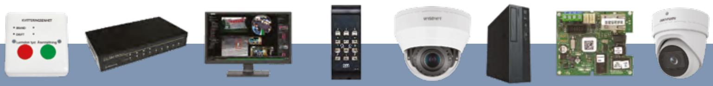

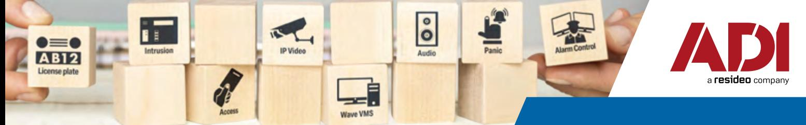

#### **Välj trådlösa systemprodukter**

| ADI artikel         | Beskrivning                                                                                                                    |               |
|---------------------|--------------------------------------------------------------------------------------------------------------------------------|---------------|
| AH100-010           | USB adapter till H100 handtagsläsare när du vill koppla upp en dator för att exempelvis uppdatera läsarens firmware.        | VÄLJ          |
| 5004000             | Aperio hub AH30 1-8 RS485. Kopplas till LCU 9101 485-bus och sköter kommunikationen trådlöst mellan H100S och ARX systemet. | Kontakta sälj |
| S559048994          | Aperio Key License file. För säker radiokommunikation mellan Aperio läsare, hub och PAP programvara. En unik licens/kund.   | VÄLJ          |
| S559047994          | Aperio Radio Dongel. Verktyg för trådlös kommunikation med Radio-HUB och lås                                                   | VÄLJ          |
| Aperio PAP-mjukvara | Aperio PAP-mjukvara. Gratis mjukvara för programmering av Radio-HUB och lås                                                    | VÄLJ          |

| Välj ARX-mjukvara |                                                 |               |
|-------------------|-------------------------------------------------|---------------|
| ADI artikel       | Beskrivning                                     |               |
|                   |                                                 |               |
| S559900000996     | ARX Bas                                         | VÄLJ          |
| S559901000996     | ARX Standard                                    | Kontakta sälj |
| S559902000996     | ARX Advanced (innehåller ARX XML Import/Export) | VÄLJ          |

| Välj dörrlicens |                |  |
|-----------------|----------------|--|
| ADI artikel     | Beskrivning    |  |
|                 |                |  |
| S559701996      | 1 dörrlicens   |  |
| S559704996      | 4 dörrlicenser |  |
| S559708996      | 8 dörrlicenser |  |

| Välj ARX-licens |                                                                                                          |
|-----------------|----------------------------------------------------------------------------------------------------------|
| ADI artikel     | Beskrivning                                                                                              |
|                 |                                                                                                          |
| S559030000996   | ARX XML Import/Export (integration mot Wave VMS) enbart med nummerplåtsavl. Kontakta sälj             |
| S559012996      | ARX Galaxy AGA Licens. Integration mot Galaxy Dimension C096-D-E3. En licens per Galaxy-central. VÄLJ |
| S559013996      | ARX Galaxy AGV V-RIO Licens Integration mot Galaxy. En virtuel RIO per licens. Kontakta sälj          |

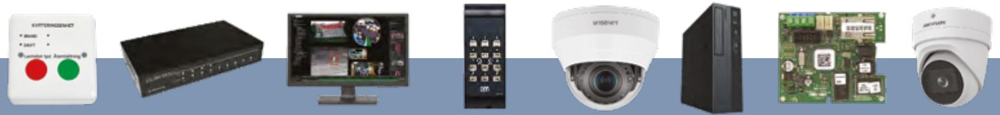

| Välj centralenhet |                                                                                                                                                                                                                                                                       |
|-------------------|-----------------------------------------------------------------------------------------------------------------------------------------------------------------------------------------------------------------------------------------------------------------------|
| ADI artikel       | Beskrivning                                                                                                                                                                                                                                                           |
| S5591014085       | LCU9101IV Centralenhet för 1-4 trådbundna dörrmiljöer eller 15st trådlösa Kontakta sälj                                                                                                                                                                            |
| S5591013160       | Loopkort 9101D3 add on kort till LCU9101 för 3 extra dörrar med DAC, PCR eller DBL VÄLJ                                                                                                                                                                            |
| S5591013161       | 9101D3A Add-on kort till LCU9101. 9101D3A ansluts till loopkort 9101D3 och ger tillgång till två RS485 portar, en för Aperio hub:ar och/eller 4585MF läsare som uppdaterare. VÄLJ Den andra RS485 porten är optoisloerad och används till Galaxy anslutning. |
| S559185160        | Loopkort 9101R4850 Loopkort till centralenhet LCU9101/RX9101. Anslutningsmöjlighet för VÄLJ Aperioläsare med Comhub. Upp till 15 stycken läsare kan anslutas.                                                                                                   |
| S559164160        | Loopkort 9101RC64. Reläkortkort till centralenhet LCU9101 med 6 reläer, varav 4 programmerbara. Två RS485 portar en för Aperio hub:ar och/eller 4585MF läsare som uppdaterare. Den andra VÄLJ är optoisloerad och används till Galaxy anslutning.            |

| Välj dörrcentral |             |                                                                                                                                                                         |      |
|------------------|-------------|-------------------------------------------------------------------------------------------------------------------------------------------------------------------------|------|
| ADI artikel      | Beskrivning |                                                                                                                                                                         |      |
|                  |             |                                                                                                                                                                         |      |
| S5566503085      |             | DAC 530 Hi-O Dörrkontrollenhet. För 1-2 st kortläsare, tryckknapp, magnetkontakt, lås.                                                                                  | VÄLJ |
| S5566563085      |             | har 4 ingångar och 6 relä utgångar. Ingångar: larmblockering, larmtillslag, dag/natt med motorlås och fri. Reläer: 4 st. funktionsstyrda, 1 schemastyrt samt ett LFK | VÄLJ |

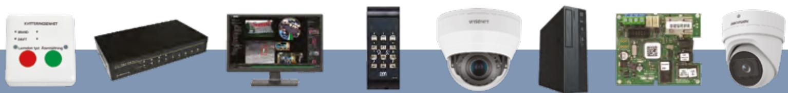

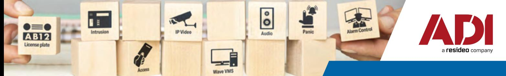

## Anteckningar

| -                                                                                                                                                                              |  |
|--------------------------------------------------------------------------------------------------------------------------------------------------------------------------------|--|
| ______________________________________________________________________________________________________________________________________________________________________________ |  |
|                                                                                                                                                                                |  |
| ______________________________________________________________________________________________________________________________________________________________________________ |  |
|                                                                                                                                                                                |  |
| ______________________________________________________________________________________________________________________________________________________________________________ |  |
|                                                                                                                                                                                |  |
| ______________________________________________________________________________________________________________________________________________________________________________ |  |
|                                                                                                                                                                                |  |
| ______________________________________________________________________________________________________________________________________________________________________________ |  |
|                                                                                                                                                                                |  |
| ______________________________________________________________________________________________________________________________________________________________________________ |  |
|                                                                                                                                                                                |  |
| ______________________________________________________________________________________________________________________________________________________________________________ |  |
|                                                                                                                                                                                |  |
| ______________________________________________________________________________________________________________________________________________________________________________ |  |
|                                                                                                                                                                                |  |

#### www.adiglobal.se

# **Integrerade lösningar från ADI 2022-23**

Ring 010 130 24 00

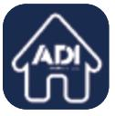

eshop [www.adiglobal.se](http://www.adiglobal.se)

Eposta [info.se@adiglobal.com](mailto:info.se%40adiglobal.com?subject=Integrerade%0Al%C3%B6sningar%20fr%C3%A5n%20ADI)

Avhämtning efter beställning i Stockholm Butik i Göteborg Stockholm - Ormbergsvägen 8 Göteborg - Tillgängligheten 3

Våra erbjudanden och leveranser görs i enlighet med våra allmänna leverans- och betalningsvillkor. Du kan hämta dem på www.adiglobal.se Med reservation för tryckfel. ADI förbehåller sig rätten att ändra priser och / eller villkor utan föregående meddelande.

