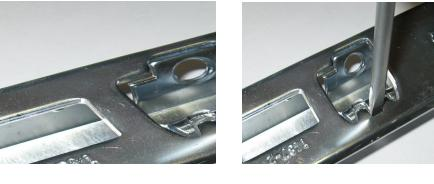
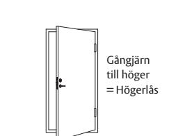
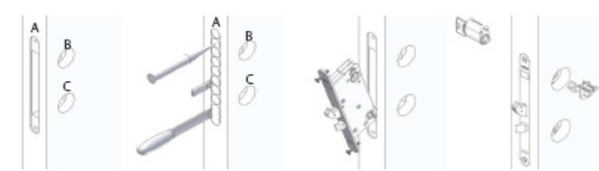
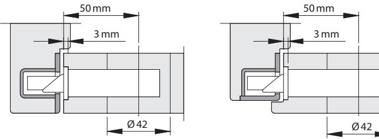
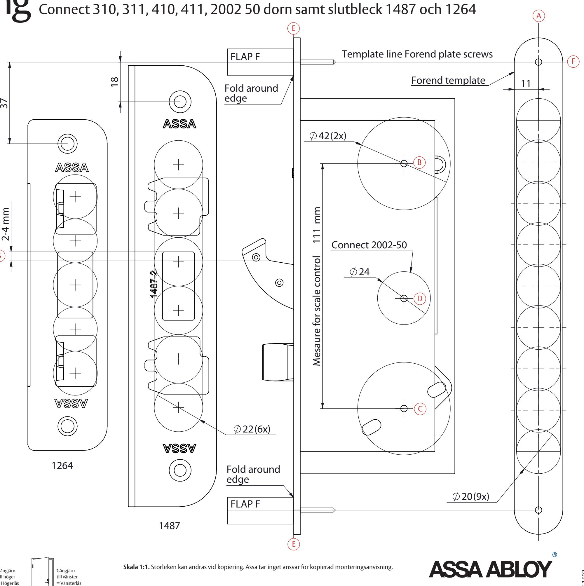
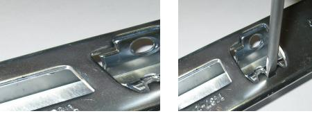
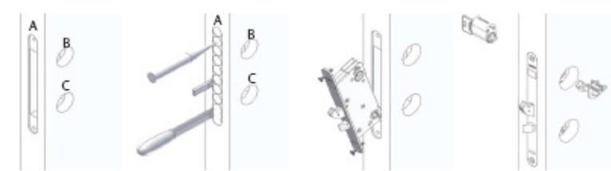
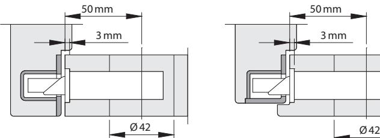
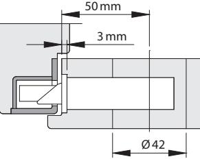
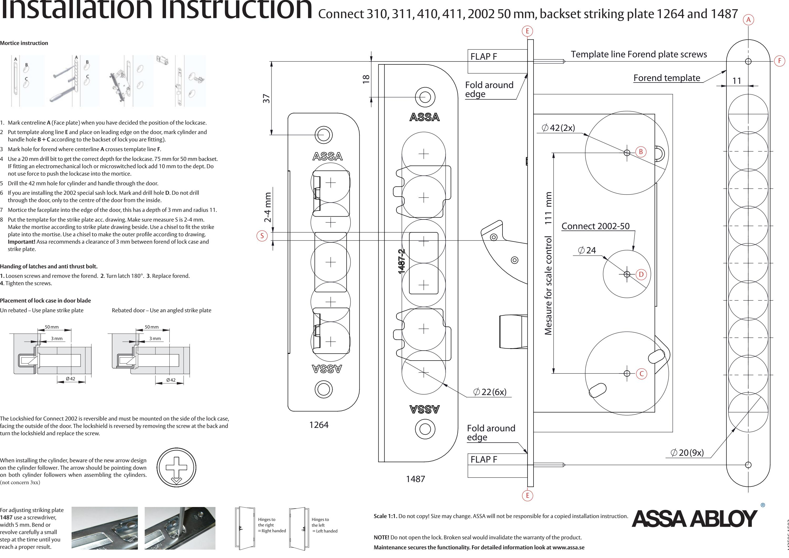

# Monteringsanvisning Connect 310, 311, 410, 411, 2002 50 dorn samt slutbleck 1487 och 1264

- 1. Markera ut centrumlinje **A** (stolpe) när låshusets position i dörren har bestämts.
- 2. Placera mallen med linje **E** mot dörrens framkant så att **B & C** kan märkas ut och vid behov även hål **D** (Connect 2002).
- 3. Markera skruvhålen för stolpen där centrumlinje **A** och mallinje "Flik **F**" korsas.
- 4. Borra enligt stolpmall med en ø 20 mm träborr. 75 mm för dorndjup 50 (lägg till 10 mm när micro/ellås används). Hugg med stämjärn rent i hålet så att låshuset lätt går in.
- 5. Borra genom dörren med en ø42 mm borr för cylinderhålet och tryckeshålet (**B+C** ) och vid behov **D ø24** mm (för 2002). **OBS! D skall inte borras igenom dörren bara från dörrens insida till mitten av dörren.**
- 6. Hugg med stämjärn ut för låsstolpen 3 mm djupt. Stolpens bredd är 22 mm.
- 7. Placera mallen för slutblecket enligt ritning. Se till att måttet **S** är 2-4 mm. Borra 6 st hål ø 22 mm hål 26 mm djupa för 1487-X och 5 st ø 20 mm hål 23 mm djupt för 1264-X. Hugg rent med stämjärn så att slutblecket går i urtaget. Hugg med stämjärn ur ytterkonturen. 4 mm djupt för 1487 och 2 mm för 1264. Förborra fästhålen för skruvarna (4 st ø 3 mm borr 1487 & 2 st ø 2,5 mm borr 1264) Rekommenderad skruv: 1487 4 st TFX 5,0 x 40 mm 1264 2 st TFX 4,5 x 25 mm.

### **Vända fall!**

**1.** Lossa skruvarna som håller stolpen på plats. **2.** Ta bort stolpen. **3.** Vrid fallet ett halvt varv. **4.** Montera dit stolpen igen. **5.** Dra åt skruvarna.

## **Placering av låshus i dörrblad**

Ofalsad dörr – använd plant slutbleck Överfalsad dörr – använd vinkelslutbleck

**Assa rekommenderar 3 mm mellan låsstolpe & slutbleck.**

Justering av slutbleck **1487** sker bäst med en 5 mm bred mejsel. Bänd eller vrid lite i taget och prova dig fram till önskat resultat.

**OBS!** Öppna inte låset. Vid bruten försegling av låsets täckplåt upphör garantin för produkten. **Underhåll säkrar funktionen. Se detaljerad info på www.assa.se**

### **Urtagsinstruktion**

Låsskölden på Connect 2002 är vändbar och skall vara monterad på den sida av låshuset som vetter mot dörrens utsida. Låsskölden vänds genom att ta bort skruven i bakkant och vända låsskölden och sätta dit skruven igen.

Vid montering av cylinder, var uppmärksam på pilens nya utförande på roddartallriken. Pilen skall vara riktad nedåt på båda roddartallrikarna vid cylindermontage. (gäller ej 3xx)

S

M2586.1502

## Installation Instruction Connect 310, 311, 410, 411, 2002 50 mm, backset striking plate 1264 and 1487

- 1. Mark centreline **A** (Face plate) when you have decided the position of the lockcase.
- 2 Put template along line **E** and place on leading edge on the door, mark cylinder and handle hole **B + C** according to the backset of lock you are fitting).
- 3 Mark hole for forend where centerline **A** crosses template line **F**.
- 4 Use a 20 mm drill bit to get the correct depth for the lockcase. 75 mm for 50 mm backset. IF fitting an electromechanical loch or microswitched lock add 10 mm to the dept. Do not use force to push the lockcase into the mortice.
- 5 Drill the 42 mm hole for cylinder and handle through the door.
- 6 If you are installing the 2002 special sash lock. Mark and drill hole **D**. Do not drill through the door, only to the centre of the door from the inside.
- 7 Mortice the faceplate into the edge of the door, this has a depth of 3 mm and radius 11.
- 8 Put the template for the strike plate acc. drawing. Make sure measure S is 2-4 mm. Make the mortise according to strike plate drawing beside. Use a chisel to fit the strike plate into the mortise. Use a chisel to make the outer profile according to drawing. **Important!** Assa recommends a clearance of 3 mm between forend of lock case and strike plate.

### **Handing of latches and anti thrust bolt.**

- **1.** Loosen screws and remove the forend. **2**. Turn latch 180°. **3**. Replace forend. **4**. Tighten the screws.
### **Placement of lock case in door blade**

Un rebated – Use plane strike plate Rebated door – Use an angled strike plate

For adjusting striking plate **1487** use a screwdriver, width 5 mm. Bend or revolve carefully a small step at the time until you

## **Mortice instruction**

The Lockshied for Connect 2002 is reversible and must be mounted on the side of the lock case, facing the outside of the door. The lockshield is reversed by removing the screw at the back and turn the lockshield and replace the screw.

When installing the cylinder, beware of the new arrow design on the cylinder follower. The arrow should be pointing down on both cylinder followers when assembling the cylinders. (not concern 3xx)

S