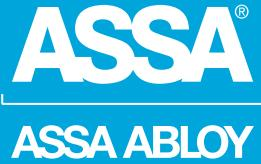
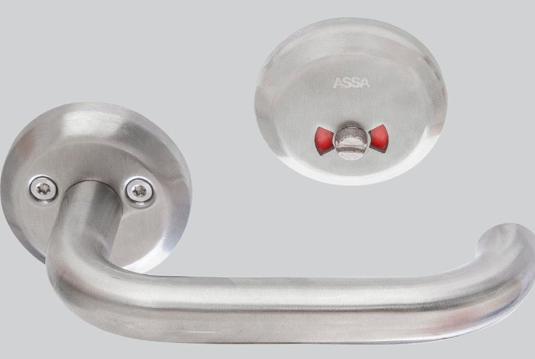
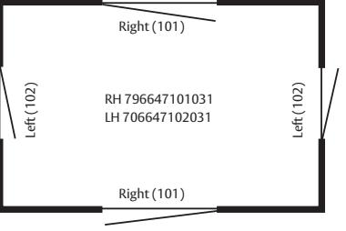

# ASSA WC-behör 9567T

ASSA ABLOY, the global leader in door opening solutions

## Rostfritt WC-behör med flip-up funktion

#### **Användningsområde**

**Egenskaper**

För institutioner och offentlig miljö. Tillgänglighetsanpassat WC-behör med Flip-up funktion. Låses eller öppnas från insidan genom att det invändiga trycket förs uppåt eller nedåt "flip-up". Uppställnigsmagnet säkerställer tryckets position och avlastar låshusets spärrmekanism. Syrafast rostfritt stål för maximalt korrosionsskydd och tuffa dörrmiljöer med hög trafik. Utvändigt trycke (8639) är utrustat med rostfria nållager för närmast friktionsfri gång.

ASSA ABLOY is the global leader in door opening solutions, dedicated to satisfying end-user needs for security, safety and convenience

ASSA AB P.O. Box 371 SE-631 05 Eskilstuna Sweden Phone +46 (0)16 17 70 00

Fax +46 (0)16 17 70 49 Customer support: phone intl. +46 (0)16 17 71 00 Phone nat. 0771-640 640 Fax +46 (0)16 17 73 72

e-mail: helpdesk.marknad@assaabloy.com

Material: Rostfritt stål AISI 316L // EN 1.4404 Passar ASSAs låshus typ: 565- och 310-50/70 Beroende av dörrtjocklek väljs längd på skruv och fyrkantspinne Dörrtjocklek 38 - 60 mm Vid C-mått < 20 mm används täckskylt typ 4256 RF och 40 - 60 mm används lång roddarpinne (Vä 817725, Hö 817726)

Tryckesmodell 8639. Testad enligt EN 1906 Grade 4

### **Funktion**

Låses eller öppnas från insidan genom att trycket förs uppåt eller nedåt "flip-up" Röd / vit markering från utsidan Öppningsbart från utsidan med skruvmejsel

**Artikelnummer**

Hö: 706647101031 Vä: 706647102031

#### **Välj rätt beslag**

www.assa.se