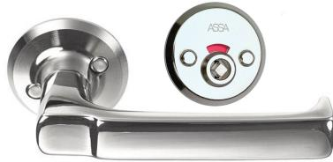

## **RWC-BEHÖR ASSA 9565T-2 HÖ KROM MATT**

22020254

**ASSA ABLOY**| RWC-behör med Flip-Up funktion. Låses eller öppnas från insidan genom att trycket förs uppåt eller nedåt. Passar till låshus 565 och 310 med dorndjup 50 eller 70 mm. För höger- alternativt vänsterhängd dörr.

## Egenskaper

- Öppningsbart från utsidan med paniknyckel 451283
- Passar till låshus 565 och 310-50/70, trycke 6647 på utsida dörr
- Dörrtjocklek 38-60 mm
- Max C-mått = 40 mm
- Max C-mått med lång medbringare, beställes separat = 60 mm
- Klisterdekal insida dörr låst/olåst ingår Funktion
- Låses eller öppnas från insidan genom att trycket förs uppåt eller nedåt "Flip-up"
- Röd/vit markering från utsidan
- Öppningsbart från utsidan med paniknyckel 451283
- Vid C-mått mindre än 20 mm ska täckskylt användas, t ex 4291

BVB Undviks 1

## **Specifikation**

| Varumärke:    | ASSA ABLOY |
|---------------|------------|
| Ytbeh/Färg:   | Krom matt  |
| Material:     | Mässing    |
| Hö/Vä:        | Höger      |
| Dörrtjocklek: | 38-60      |