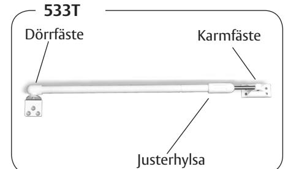
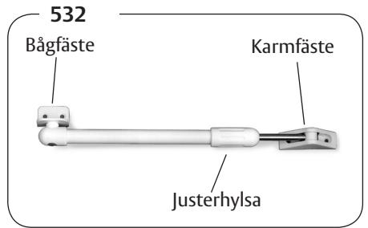
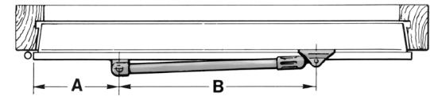
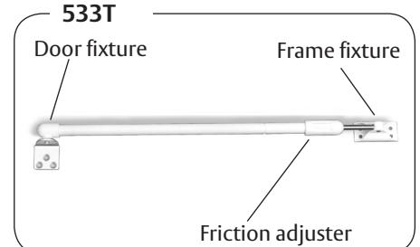
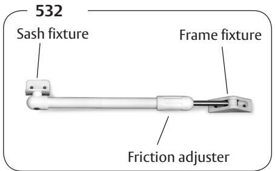
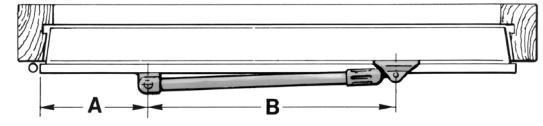

# Monteringsanvisning

Fönsterbroms ASSA 532, för inåtgående sidohängt- och överhängt fönster. Dörrbroms ASSA 533T, för inåtgående ytterdörr, fönsterdörr, förrådsdörr.

### **Montering**

Placera karmfästet med centrumavstånd A enl tabell från gångjärnsidans karm som bilden visar. Bromsen måste placeras parallellt med karmen för att fungera korrekt.

Märk ut för skruvhålen på karmen. Borra Ø 2,5 mm till 15 mm djup. Skruva fast karmfästet på karmen. Placera båg-/dörrfästet på fönsterbågen/ dörren med centrumavstånd B enl tabell. Märk ut för skruvhålen på fönsterbågen/ dörren.

Borra Ø 2,5 mm till 15 mm djup.

Skruva fast båg-/dörrfästet på fönsterbågen/dörren. Bromskraftens styrka kan nu regleras till rätt nivå med justerhylsan.

OEM9007.1112.112 / KT 533

### **ASSA OEM AB**

Box 121 99 402 42 Göteborg Tel. 031 - 704 40 00 info.gbg@assaoem.se www.assaoem.se

| Art nr | Karmdagmått bredd mm | Öppningsvinkel | Mått A mm | Mått B mm |
|--------|-------------------------|----------------|-----------|-----------|
| 533T/1 | 500-700                 | ca 95°         | 120       | 310       |
| 533T/2 | 700-910                 | ca 95°         | 160       | 450       |
| 532/1  | min 270                 | ca 90°         | 65        | 152       |
| 532/2  | min 420                 | ca 90°         | 110       | 262       |

## Fitting instructions

Casement stay ASSA 532, for inward-opening windows. Door holder ASSA 533T, for inward-opening doors

## **Fitting**

Place the frame fixture with a distance A from the hinged side of the frame as shown on the drawing.

The friction stay must be fitted parallel to the door/window to work properly. Mark the screw holes on the door/window.

Drill Ø 2,5 mm to the depth of 15 mm. Fit the friction stay with the enclosed screws. Place the friction stay with a distance B as shown on the drawing. Mark the screw holes on the door/ window.

Drill Ø 2,5 mm to the depth of 15 mm.

Fit the friction stay with the enclosed screws.

The breaking force is then possible to adjust with the friction adjuster to the right resistance.

OEM9007.1112.112 / KT 533

### **ASSA OEM AB**

Box 121 99 402 42 Göteborg +46 (0)31-704 40 00 info.gbg@assaoem.se www.assaoem.se

| Part no | Frame sight with mm | Opening angel | Dim A mm | Dim B mm |
|---------|------------------------|---------------|----------|----------|
| 533T/1  | 500-700                | approx 95°    | 120      | 310      |
| 533T/2  | 700-910                | approx 95°    | 160      | 450      |
| 532/1   | min 270                | approx 90°    | 65       | 152      |
| 532/2   | min 420                | approx 90°    | 110      | 262      |