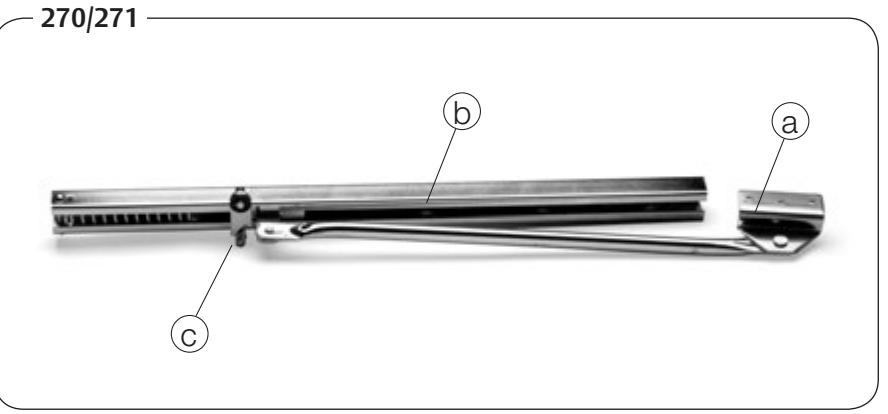
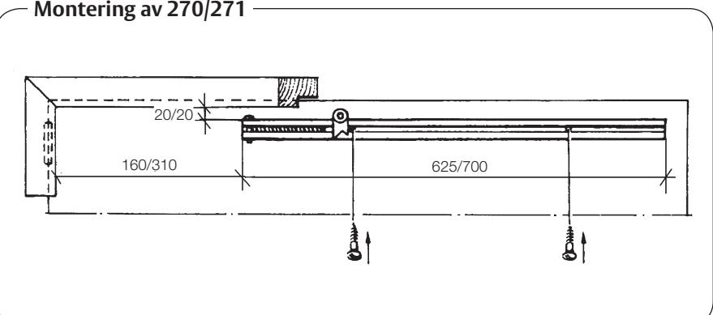
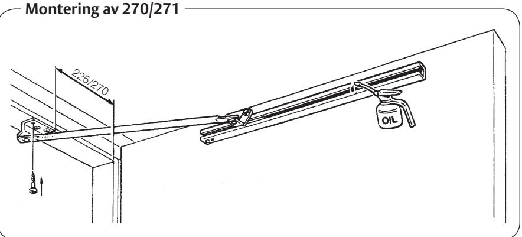

# Monteringsanvisning

Porthållare ASSA 270 och ASSA 271, används för uppställning av dörr eller port i fullt öppet läge, ca 90 grader. Max dörrvikt 125 kg.

## **ASSA 270**

För dörrbredd 800 - 1100 mm. Passar såväl höger - som vänsterhängd dörr, (bestäms vid montering ).

## **ASSA 271**

För dörrbredd 1100 - 1300 mm. För höger - eller vänsterhängd dörr.

#### **Funktion och egenskaper**

Vid fullt öppet läge ( ca 90 grader ) faller spärrhaken automatiskt till spärrläge, så att dörren hålls fast. När dörren trycks ytterligare mot öppet läge frigörs spärrhaken, så att dörren kan stängas. Stoppfjädern fungerar även som stötdämpare och skonar därmed dörr och gångjärn.

#### **Konstruktion**

a) Karmfäste med uppställningsarm och löpare b) Dörrskena c) Spärrhake

# **Material**

Stål, förzinkat eller förzinkat och pulverlackerat vitt.

# **Montering**

Utanpåliggande. Monteringsanvisning och skruv i förpackningen.

# **Drift och underhåll.**

Vid behov droppas några droppar olja i skenan och gärna på löparen (som går inuti skenan). Ingen speciell olja behövs, använd t ex någon vanlig smörjolja. Smörj vid behov.

ASSA OEM AB Box 12199 402 42 Göteborg Tel. 031-704 40 00 info.gbg@assaoem.se www.assaoem.se

