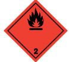

# SÄKERHETSDATABLAD Secwise Låsspray COPIAX

I enlighet med Förordning (EG) Nr 1907/2006, Bilaga II, ändrad. Kommissionens Förordning (EU) nr 2015/830 av den 28 maj 2015.

| AVSNITT 1: Namnet på ämnet/blandningen och bolaget/företaget |                                                                                                                                                                                                                 |  |
|--------------------------------------------------------------|-----------------------------------------------------------------------------------------------------------------------------------------------------------------------------------------------------------------|--|
| 1.1. Produktbeteckning                                       |                                                                                                                                                                                                                 |  |
| Produktnamn                                                  | Secwise Låsspray COPIAX                                                                                                                                                                                         |  |
| Produktnummer                                                | 11846, 11852                                                                                                                                                                                                    |  |
|                                                              | 1.2. Relevanta identifierade användningar av ämnet eller blandningen och användningar som det avråds från                                                                                                       |  |
| Identifierade användningar                                   | Smörjmedel.                                                                                                                                                                                                     |  |
|                                                              | 1.3. Närmare upplysningar om den som tillhandahåller säkerhetsdatablad                                                                                                                                          |  |
| Leverantör                                                   | sale@optimum.se Onelund & co Box 2134 183 02 Täby SVERIGE                                                                                                                                           |  |
|                                                              | 08-509 11 000 08-509 11 004                                                                                                                                                                                  |  |
| 1.4. Telefonnummer för nödsituationer                        |                                                                                                                                                                                                                 |  |
| Nationellt telefonnummer för nödsituationer               | 112 - begär giftinformation                                                                                                                                                                                     |  |
| AVSNITT 2: Farliga egenskaper                                |                                                                                                                                                                                                                 |  |
| 2.1. Klassificering av ämnet eller blandningen               |                                                                                                                                                                                                                 |  |
| Klassificering (EC 1272/2008)                                |                                                                                                                                                                                                                 |  |
| Fysikaliska faror                                            | Aerosol 1 - H222, H229                                                                                                                                                                                          |  |
| Hälsofaror                                                   | Skin Irrit. 2 - H315 Eye Irrit. 2 - H319 STOT SE 3 - H336 Asp. Tox. 1 - H304                                                                                                                                    |  |
| Miljöfaror                                                   | Aquatic Chronic 3 - H412                                                                                                                                                                                        |  |
| 2.2. Märkningsuppgifter                                      |                                                                                                                                                                                                                 |  |
| Faropiktogram                                                |                                                                                                                                                                                                                 |  |
| Signalord                                                    | Fara                                                                                                                                                                                                            |  |
| Faroangivelser                                               | H222 Extremt brandfarlig aerosol. H229 Tryckbehållare: Kan sprängas vid uppvärmning. H315 Irriterar huden. H319 Orsakar allvarlig ögonirritation. H336 Kan göra att man blir dåsig eller omtöcknad. |  |

H412 Skadliga långtidseffekter för vattenlevande organismer.

| Skyddsangivelser                   | P102 Förvaras oåtkomligt för barn. P210 Får inte utsättas för värme, heta ytor, gnistor, öppen låga eller andra antändningskällor. Rökning förbjuden. P211 Spreja inte över öppen låga eller andra antändningskällor. P251 Får inte punkteras eller brännas, gäller även tömd behållare. P271 Används endast utomhus eller i väl ventilerade utrymmen. P410+P412 Skyddas från solljus. Får inte utsättas för temperaturer över 50°C/122°F. P501 Innehållet/ behållaren lämnas i enlighet med nationella bestämmelser.                                                                                                                                                                                                                          |
|------------------------------------|---------------------------------------------------------------------------------------------------------------------------------------------------------------------------------------------------------------------------------------------------------------------------------------------------------------------------------------------------------------------------------------------------------------------------------------------------------------------------------------------------------------------------------------------------------------------------------------------------------------------------------------------------------------------------------------------------------------------------------------------------------------------|
| Innehåller                         | Kolväten, c9 - c11 n-alkaner, isoalkaner, cykliska, <2% aromatiska (Nafta (petroleum), vätebehandlad tung), Kolväten, C7, N-Alkaner, Isoalkaner, Cykliska (Heptan), 1-Decene, homopolymer, hydrogenated                                                                                                                                                                                                                                                                                                                                                                                                                                                                                                                                                       |
| Kompletterande skyddsangivelser | P261 Undvik att inandas ångor/ sprej. P264 Tvätta nedstänkt hud grundligt efter användning. P273 Undvik utsläpp till miljön. P280 Använd skyddshandskar/ skyddskläder/ ögonskydd/ ansiktsskydd. P302+P352 VID HUDKONTAKT: Tvätta med mycket vatten. P304+P340 VID INANDNING: Flytta personen till frisk luft och se till att andningen underlättas. P312 Vid obehag, kontakta GIFTINFORMATIONSCENTRALEN/ läkare. P321 Särskild behandling (se medicinskt råd på etiketten). P332+P313 Vid hudirritation: Sök läkarhjälp. P362+P364 Ta av nedstänkta kläder och tvätta dem innan de används igen. P391 Samla upp spill. P403+P233 Förvaras på väl ventilerad plats. Behållaren ska vara väl tillsluten. P405 Förvaras inlåst. |

### 2.3. Andra faror

Asp. Tox. 1 - H304

Innehåller: Isobutan. Produkten innehåller inte något ämne som är klassificerat som PBT eller vPvB.

### AVSNITT 3: Sammansättning/information om beståndsdelar

| 3.2. Blandningar                                                                                              |                      |                                                      |
|---------------------------------------------------------------------------------------------------------------|----------------------|------------------------------------------------------|
| Kolväten, c9 - c11 n-alkaner, isoalkaner, cykliska, <2% aromatiska (Nafta (petroleum), vätebehandlad tung) |                      | 40-60%                                               |
| CAS-nummer: —                                                                                                 | EG-nummer: 919-857-5 | REACH-registreringsnummer: 01- 2119463258-33-0000 |
| Klassificering                                                                                                |                      |                                                      |
| Flam. Liq. 3 - H226 STOT SE 3 - H336                                                                       |                      |                                                      |

| Kolväten, C7, N-Alkaner, Isoalkaner, Cykliska (Heptan) 15-24.9%                                                                  |                      |                                                      |
|-------------------------------------------------------------------------------------------------------------------------------------|----------------------|------------------------------------------------------|
| CAS-nummer: —                                                                                                                       | EG-nummer: 927-510-4 | REACH-registreringsnummer: 01- 2119475515-33-0000 |
| Klassificering Flam. Liq. 2 - H225 Skin Irrit. 2 - H315 STOT SE 3 - H336 Asp. Tox. 1 - H304 Aquatic Chronic 2 - H411 |                      |                                                      |
| BUTAN                                                                                                                               |                      | 10-15%                                               |
| CAS-nummer: 106-97-8                                                                                                                | EG-nummer: 203-448-7 | REACH-registreringsnummer: 01- 2119474691-32      |
| Klassificering Flam. Gas 1 - H220                                                                                                |                      |                                                      |
| PROPAN                                                                                                                              |                      | 10-15%                                               |
| CAS-nummer: 74-98-6                                                                                                                 | EG-nummer: 200-827-9 | REACH-registreringsnummer: 01- 2119486944-21      |
| Klassificering Flam. Gas 1 - H220                                                                                                |                      |                                                      |
| 1-Decene, homopolymer, hydrogenated                                                                                                 |                      | 2.5-4.99%                                            |
| CAS-nummer: 68037-01-4                                                                                                              | EG-nummer: 500-183-1 | REACH-registreringsnummer: 01- 2119486452-34-0000 |
| Klassificering Asp. Tox. 1 - H304                                                                                                |                      |                                                      |
| Sarkosyl O                                                                                                                          |                      | 0.1-0.99%                                            |
| CAS-nummer: 110-25-8                                                                                                                | EG-nummer: 203-749-3 | REACH-registreringsnummer: 01- 2119488991-20-0000 |
| M-faktor (akut) = 1                                                                                                                 |                      |                                                      |
| Klassificering Acute Tox. 4 - H332 Skin Irrit. 2 - H315 Eye Dam. 1 - H318 Aquatic Acute 1 - H400                        |                      |                                                      |

# PENTAN 0.1-0.99% CAS-nummer: 109-66-0 EG-nummer: 203-692-4 REACH-registreringsnummer: 01- 2119459286-30-0000 Klassificering Flam. Liq. 1 - H224 STOT SE 3 - H336 Asp. Tox. 1 - H304 Aquatic Chronic 2 - H411 Calcium bis(di C8-C10, branched, C9 rich, alkylnaphthalenesulphonate) 0.1-0.99% CAS-nummer: — EG-nummer: 939-717-7 REACH-registreringsnummer: 01- 2119980985-16-0000 Klassificering Skin Irrit. 2 - H315 Eye Irrit. 2 - H319

Alla faroangivelser anges i klartext i avsnitt 16.

Sammansättningskommentare r Naftorna innehåller mindre än 0,1 % Bensen, vilket gör att de inte är klassade som mutagena eller cancerframkallande.

### AVSNITT 4: Åtgärder vid första hjälpen

| 4.1. Beskrivning av åtgärder vid första hjälpen                                               |                                                                                                                                                                            |  |
|-----------------------------------------------------------------------------------------------|----------------------------------------------------------------------------------------------------------------------------------------------------------------------------|--|
| Generell information                                                                          | Sök läkarhjälp om besvär kvarstår.                                                                                                                                         |  |
| Inandning                                                                                     | Flytta den skadade personen till frisk luft och håll denne varm och i stillhet i en position som underlättar andningen.                                                 |  |
| Förtäring                                                                                     | FRAMKALLA EJ KRÄKNING! Kontakta genast läkare.                                                                                                                             |  |
| Hudkontakt                                                                                    | Tvätta huden noggrant med tvål och vatten.                                                                                                                                 |  |
| Kontakt med ögonen                                                                            | Skölj med vatten. Sök läkarhjälp om besvär kvarstår.                                                                                                                       |  |
| 4.2. De viktigaste symptomen och effekterna, både akuta och fördröjda                         |                                                                                                                                                                            |  |
| Generell information                                                                          | Lösningsmedelsmissbruk kan leda till dödsfall.                                                                                                                             |  |
| Inandning                                                                                     | Kan göra att man blir dåsig eller omtöcknad. Ångor kan orsaka huvudvärk, trötthet, yrsel och illamående.                                                                |  |
| Förtäring                                                                                     | Om produkten kommer ned i lungorna efter förtäring eller kräkning kan kemisk lunginflammation uppkomma. Kan vara dödligt vid förtäring om det kommer ner i luftvägarna. |  |
| Hudkontakt                                                                                    | Irriterar huden.                                                                                                                                                           |  |
| Kontakt med ögonen                                                                            | Orsakar allvarlig ögonirritation.                                                                                                                                          |  |
| 4.3. Angivande av omedelbar medicinsk behandling och särskild behandling som eventuellt krävs |                                                                                                                                                                            |  |
| Anmärkningar för läkaren                                                                      | Inga specifika rekommendationer.                                                                                                                                           |  |
| AVSNITT 5: Brandbekämpningsåtgärder                                                           |                                                                                                                                                                            |  |
| 5.1. Släckmedel                                                                               |                                                                                                                                                                            |  |

Lämpliga släckmedel Släck med skum, koldioxid eller pulver.

### 5.2. Särskilda faror som ämnet eller blandningen kan medföra

| Särskilda faror                                                                                                                                                       | Behållare kan brisera eller explodera vid upphettning, beroende på häftig tryckstegring. Extremt brandfarligt.                         |  |
|-----------------------------------------------------------------------------------------------------------------------------------------------------------------------|-------------------------------------------------------------------------------------------------------------------------------------------|--|
| 5.3. Råd till brandbekämpningspersonal                                                                                                                                |                                                                                                                                           |  |
| Skyddsåtgärder vid brandbekämpning                                                                                                                                 | Behållare i närheten av brand ska flyttas eller kylas med vatten.                                                                         |  |
| Särskild skyddsutrustning för brandbekämpningspersonal                                                                                                             | Använd kemskyddsdräkt. Använd andningsapparat med lufttillförsel (SCBA) och lämpliga skyddskläder.                                     |  |
| AVSNITT 6: Åtgärder vid oavsiktliga utsläpp                                                                                                                           |                                                                                                                                           |  |
|                                                                                                                                                                       | 6.1. Personliga skyddsåtgärder, skyddsutrustning och åtgärder vid nödsituationer                                                          |  |
| Personliga skyddsåtgärder                                                                                                                                             | För personligt skydd, se Avsnitt 8.                                                                                                       |  |
| 6.2. Miljöskyddsåtgärder                                                                                                                                              |                                                                                                                                           |  |
| Miljöskyddsåtgärder                                                                                                                                                   | Släpp inte ut i avlopp eller vattendrag eller på marken.                                                                                  |  |
| 6.3. Metoder och material för inneslutning och sanering                                                                                                               |                                                                                                                                           |  |
| Metoder för sanering                                                                                                                                                  | Spill samlas upp i täta behållare och lämnas för destruktion enligt gällande lokala föreskrifter.                                         |  |
| 6.4. Hänvisning till andra avsnitt                                                                                                                                    |                                                                                                                                           |  |
| Hänvisning till andra avsnitt                                                                                                                                         | För personligt skydd, se Avsnitt 8. Angående avfallshantering, se punkt 13.                                                               |  |
| AVSNITT 7: Hantering och lagring                                                                                                                                      |                                                                                                                                           |  |
| 7.1. Skyddsåtgärder för säker hantering                                                                                                                               |                                                                                                                                           |  |
| Skyddsåtgärder vid användning                                                                                                                                      | Får inte utsättas för värme, gnistor och öppen låga. Skyddas mot direkt solljus. Ät inte, drick inte eller rök inte under hanteringen. |  |
|                                                                                                                                                                       | 7.2. Förhållanden för säker lagring, inklusive eventuell oförenlighet                                                                     |  |
| Skyddsåtgärder vid lagring                                                                                                                                            | Aerosolburkar: Får inte utsättas för direkt solljus eller temperaturer över 50°C. Förpackningen förvaras torrt.                        |  |
| 7.3. Specifik slutanvändning                                                                                                                                          |                                                                                                                                           |  |
| Specifik slutanvändning                                                                                                                                               | De identifierade användningarna för produkten finns beskrivna i Avsnitt 1.2.                                                              |  |
| AVSNITT 8: Begränsning av exponeringen/personligt skydd                                                                                                               |                                                                                                                                           |  |
| 8.1. Kontrollparametrar                                                                                                                                               |                                                                                                                                           |  |
| Gränsvärden för exponering på arbetsplatsen                                                                                                                           |                                                                                                                                           |  |
| Produkten innehåller följande ämnen på listan med hygieniska gränsvärden, Arbetsmiljöverkets föreskrifter och allmänna råd om hygieniska gränsvärden (AFS 2018:1): |                                                                                                                                           |  |
| Kolväten, c9 - c11 n-alkaner, isoalkaner, cykliska, <2% aromatiska (Nafta (petroleum), vätebehandlad tung)                                                            |                                                                                                                                           |  |
| Dekaner och andra högre alifatiska kolväten                                                                                                                           |                                                                                                                                           |  |

Nivågränsvärde (8 timmar NGV): HGV 350 mg/m3 Korttidsgränsvärde (15 minuter KGV): 500 mg/m3 V V = Vägledande korttidsgränsvärde H

### Kolväten, C7, N-Alkaner, Isoalkaner, Cykliska (Heptan)

Nivågränsvärde (8 timmar, NGV): AFS 200 ppm 800 mg/m³ Korttidsvärde (15 minuter, KTV): AFS 300 ppm 1200 mg/m³

### BUTAN

Nivågränsvärde (8 timmar, NGV): Ingen standard. Ingen standard. Korttidsvärde (15 minuter, KTV): Ingen standard. Ingen standard.

### PROPAN

Korttidsvärde (15 minuter, KTV): Ingen standard.

### PENTAN

Nivågränsvärde (8 timmar, NGV): AFS 600 ppm 1800 mg/m³ Korttidsvärde (15 minuter, KTV): AFS 750 ppm 2000 mg/m³ AFS = Arbetsmiljöverkets Författningssamling. HGV = Hygieniskt gränsvärde H = Ämnet kan lätt upptas genom huden.

### Kolväten, c9 - c11 n-alkaner, isoalkaner, cykliska, <2% aromatiska (Nafta (petroleum), vätebehandlad tung)

| DNEL                                  | Arbetare - Dermalt; Långtids- systemiska effekter: 300 mg/kg kroppsvikt/dygn Arbetare - Inandning; Långtids- systemiska effekter: 1500 mg/m³ Konsument - Dermalt; Långtids- systemiska effekter: 300 mg/kg kroppsvikt/dygn Konsument - Inandning; Långtids- systemiska effekter: 900 mg/m³ Konsument - Oral; Långtids- systemiska effekter: 300 mg/kg/dag |
|---------------------------------------|-----------------------------------------------------------------------------------------------------------------------------------------------------------------------------------------------------------------------------------------------------------------------------------------------------------------------------------------------------------------------|
|                                       | Kolväten, C7, N-Alkaner, Isoalkaner, Cykliska (Heptan)                                                                                                                                                                                                                                                                                                                |
| DNEL                                  | Arbetare - Dermalt; kortvarig systemiska effekter: 300 mg/kg/dag Arbetare - Inandning; Långtids- systemiska effekter: 2085 mg/m³ Konsument - Dermalt; Långtids- systemiska effekter: 149 mg/kg/dag Konsument - Inandning; Långtids- systemiska effekter: 447 mg/m³                                                                                           |
|                                       | PENTAN (CAS: 109-66-0)                                                                                                                                                                                                                                                                                                                                                |
| DNEL                                  | Arbetare - Dermalt; Långtids- systemiska effekter: 432 mg/kg/dag Arbetare - Inandning; Långtids- systemiska effekter: 300 mg/m³ Konsument - Dermalt; Långtids- systemiska effekter: 214 mg/kg/dag Konsument - Inandning; Långtids- systemiska effekter: 214 mg/kg/dag                                                                                        |
| PNEC                                  | sötvatten; 0,23 mg/l Saltvatten; 0,23 mg/l Successiv frisättning; 0,88 mg/l STP; 3,6 mg/l Sediment (Sötvatten); 1,2 mg/kg/dag Jord; 0,55 mg/kg                                                                                                                                                                                                         |
| 8.2. Begränsning av exponeringen      |                                                                                                                                                                                                                                                                                                                                                                       |
| Skyddsutrustning                      |                                                                                                                                                                                                                                                                                                                                                                       |
| Lämpliga tekniska kontrollåtgärder | All hantering ska bara ske i välventilerade utrymmen.                                                                                                                                                                                                                                                                                                                 |
| Ögonskydd/ansiktsskydd                | Använd tättsittande, korgglasögon eller visir.                                                                                                                                                                                                                                                                                                                        |

Handskydd Det rekommenderas att kemikalieresistenta, ogenomträngliga handskar används. Använd skyddshandskar av följande material: Nitril/Viton.

Annat skydd för hud och kropp Använd lämplig skyddsutrustning vid långvarig exponering och/eller hög koncentration av ångor, sprej eller dimma.

| Hygienåtgärder                      | Tvätta händerna vid slutet på varje arbetspass och innan måltider, rökning och toalettbesök.                                                          |
|-------------------------------------|-------------------------------------------------------------------------------------------------------------------------------------------------------|
| Andningsskydd                       | Andningsskydd som uppfyller en godkänd standard ska användas om en riskbedömning visar att inandning av föroreningar är möjlig. Gasfilter, typ A2. |
| Begränsning av miljöexponeringen | Rester och tomma behållare ska omhändertas som farligt avfall enligt lokala och nationella bestämmelser.                                           |

#### AVSNITT 9: Fysikaliska och kemiska egenskaper

| 9.1. Information om grundläggande fysikaliska och kemiska egenskaper |                                          |  |  |  |
|----------------------------------------------------------------------|------------------------------------------|--|--|--|
| Utseende                                                             | Aerosol.                                 |  |  |  |
| Färg                                                                 | Färglös till svagt gul.                  |  |  |  |
| Lukt                                                                 | Petroleum.                               |  |  |  |
| Lukttröskel                                                          | Ej fastställt.                           |  |  |  |
| pH                                                                   | Ej fastställt.                           |  |  |  |
| Smältpunkt                                                           | Ej fastställt.                           |  |  |  |
| Initial kokpunkt och kokpunktsintervall                           | Ej fastställt.                           |  |  |  |
| Flampunkt                                                            | Tekniskt omöjligt att ta fram uppgifter. |  |  |  |
| Avdunstningshastighet                                                | Ej fastställt.                           |  |  |  |
| Avdunstningsfaktor                                                   | Ej fastställt.                           |  |  |  |
| Brandfarlighet (fast form, gas)                                      | Ej fastställt.                           |  |  |  |
| Övre/undre brännbarhetsgräns eller explosionsgräns             | Ej fastställt.                           |  |  |  |
| Annan brandfarlighet                                                 | Ej fastställt.                           |  |  |  |
| Ångtryck                                                             | 345 kPa @ 20°C                           |  |  |  |
| Ångdensitet                                                          | Ej fastställt.                           |  |  |  |
| Relativ densitet                                                     | ~ 0.69                                   |  |  |  |
| Bulkdensitet                                                         | Ej fastställt.                           |  |  |  |
| Löslighet                                                            | Organiska lösningsmedel.                 |  |  |  |
| Fördelningskoefficient                                               | Ej fastställt.                           |  |  |  |
| Självantändningstemperatur                                           | Ej fastställt.                           |  |  |  |
| Sönderfallstemperatur                                                | Ej fastställt.                           |  |  |  |
| Viskositet                                                           | Kinematisk viskositet ≤ 20.5 mm2/s.      |  |  |  |
| Explosiva egenskaper                                                 | Ej fastställt.                           |  |  |  |
| Explosiv under inverkan av låga                                   | Ja                                       |  |  |  |
| Oxiderande egenskaper                                                | Ej fastställt.                           |  |  |  |
| 9.2. Annan information                                               |                                          |  |  |  |
| Annan information                                                    | Inte relevant.                           |  |  |  |

| Brytningsindex                                                              | Ej fastställt.                                                                                                                                   |  |  |  |
|-----------------------------------------------------------------------------|--------------------------------------------------------------------------------------------------------------------------------------------------|--|--|--|
| Partikelstorlek                                                             | Ej fastställt.                                                                                                                                   |  |  |  |
| Molekylvikt                                                                 | Ej fastställt.                                                                                                                                   |  |  |  |
| Flyktighet                                                                  | Mycket flyktig.                                                                                                                                  |  |  |  |
| Mättnadskoncentration                                                       | Ej fastställt.                                                                                                                                   |  |  |  |
| Kritisk temperatur                                                          | Ej fastställt.                                                                                                                                   |  |  |  |
| Flyktig organisk förening                                                   | Ingen information krävs.                                                                                                                         |  |  |  |
| AVSNITT 10: Stabilitet och reaktivitet                                      |                                                                                                                                                  |  |  |  |
| 10.1. Reaktivitet                                                           |                                                                                                                                                  |  |  |  |
| Reaktivitet                                                                 | Det finns inga kända reaktivitetsdata associerade med produkten.                                                                                 |  |  |  |
| 10.2. Kemisk stabilitet                                                     |                                                                                                                                                  |  |  |  |
| Stabilitet                                                                  | Stabil vid normal omgivningstemperatur och avsedd användning.                                                                                    |  |  |  |
| 10.3. Risken för farliga reaktioner                                         |                                                                                                                                                  |  |  |  |
| Risken för farliga reaktioner                                               | Okänd.                                                                                                                                           |  |  |  |
| 10.4. Förhållanden som ska undvikas                                         |                                                                                                                                                  |  |  |  |
| Förhållanden som ska undvikas                                            | Undvik värme, lågor och andra antändningskällor.                                                                                                 |  |  |  |
| 10.5. Oförenliga material                                                   |                                                                                                                                                  |  |  |  |
| Material som ska undvikas                                                   | Det är inte troligt att något specifikt material eller grupp av material kommer att reagera med produkten så att en farlig situation uppstår. |  |  |  |
| 10.6. Farliga sönderdelningsprodukter                                       |                                                                                                                                                  |  |  |  |
| Farliga sönderdelningsprodukter                                          | Okänd.                                                                                                                                           |  |  |  |
| AVSNITT 11: Toxikologisk information                                        |                                                                                                                                                  |  |  |  |
| 11.1. Information om de toxikologiska effekterna                            |                                                                                                                                                  |  |  |  |
| Toxikologiska effekter                                                      | Ingen data finns tillgänglig för produkten som sådan.                                                                                            |  |  |  |
| Akut toxicitet - oral Anmärkningar (oralt LD₅₀)                          | Kriterierna för klassificering kan på grundval av tillgängliga data inte anses vara uppfyllda.                                                   |  |  |  |
| Akut toxicitet - dermalt Anmärkningar (dermalt LD₅₀)                     | Kriterierna för klassificering kan på grundval av tillgängliga data inte anses vara uppfyllda.                                                   |  |  |  |
| Akut toxicitet - inandning Anmärkningar (inandning LC₅₀)              | Kriterierna för klassificering kan på grundval av tillgängliga data inte anses vara uppfyllda.                                                   |  |  |  |
|                                                                             |                                                                                                                                                  |  |  |  |
| Frätande/irriterande på huden Frätande/irriterande på huden              | Irriterar huden.                                                                                                                                 |  |  |  |
| Allvarlig ögonskada/ögonirritation Allvarlig ögonskada/ögonirritation | Orsakar allvarlig ögonirritation.                                                                                                                |  |  |  |

| Luftvägssensibilisering                                          | Kriterierna för klassificering kan på grundval av tillgängliga data inte anses vara uppfyllda.                                                                                                                                                               |  |  |  |
|------------------------------------------------------------------|--------------------------------------------------------------------------------------------------------------------------------------------------------------------------------------------------------------------------------------------------------------|--|--|--|
| Hudsensibilisering Hudsensibilisering                         | Kriterierna för klassificering kan på grundval av tillgängliga data inte anses vara uppfyllda.                                                                                                                                                               |  |  |  |
| Mutagenitet i könsceller Genotoxicitet - in vitro             | Innehåller inga ämnen som är känt mutagena.                                                                                                                                                                                                                  |  |  |  |
| Cancerogenitet Cancerogenitet                                 | Innehåller inte något ämne som är känt cancerframkallande.                                                                                                                                                                                                   |  |  |  |
| Reproduktionstoxicitet Reproduktionstoxicitet - fertilitet | Innehåller inget ämne som är känt reproduktionstoxiskt.                                                                                                                                                                                                      |  |  |  |
| Specifik organtoxicitet – enstaka exponering                     |                                                                                                                                                                                                                                                              |  |  |  |
| STOT - enstaka exponering                                        | Kan göra att man blir dåsig eller omtöcknad.                                                                                                                                                                                                                 |  |  |  |
| Specifik organtoxicitet – upprepad exponering                    |                                                                                                                                                                                                                                                              |  |  |  |
| STOT - upprepad exponering                                       | Kriterierna för klassificering kan på grundval av tillgängliga data inte anses vara uppfyllda.                                                                                                                                                               |  |  |  |
| Fara vid aspiration Fara vid aspiration                       | Fara för aspiration vid förtäring.                                                                                                                                                                                                                           |  |  |  |
| Generell information                                             | Långvarig och upprepad kontakt med lösningsmedel över en lång period kan leda till bestående hjärtbesvär.                                                                                                                                                 |  |  |  |
| Inandning                                                        | Kan göra att man blir dåsig eller omtöcknad.                                                                                                                                                                                                                 |  |  |  |
| Förtäring                                                        | Om produkten kommer ned i lungorna efter förtäring eller kräkning kan kemisk lunginflammation uppkomma. Kan vara dödligt vid förtäring om det kommer ner i luftvägarna.                                                                                   |  |  |  |
| Hudkontakt                                                       | Hudirritation.                                                                                                                                                                                                                                               |  |  |  |
| Kontakt med ögonen                                               | Irritation av ögon och slemhinnor.                                                                                                                                                                                                                           |  |  |  |
| Akuta och kroniska hälsofaror                                    | Långvarig och upprepad kontakt med lösningsmedel över en lång period kan leda till bestående hjärtbesvär. Långvarig eller upprepad exponering för ångor i höga koncentrationer kan orsaka följande negativa effekter: Illamående, kräkning. Huvudvärk. |  |  |  |

### Toxikologisk information om beståndsdelar

### Kolväten, c9 - c11 n-alkaner, isoalkaner, cykliska, <2% aromatiska (Nafta (petroleum), vätebehandlad tung)

| Akut toxicitet - oral                         |         |
|-----------------------------------------------|---------|
| Akut toxicitet oral (LD₅₀ mg/kg)           | 2 000,0 |
| Djurslag                                      | Råtta   |
| Akut toxicitet - dermalt                      |         |
| Akut toxicitet dermalt (LD₅₀ mg/kg)        | 2 000,0 |
| Djurslag                                      | Kanin   |
| Akut toxicitet - inandning                    |         |
| Akut toxicitet inandning (LC₅₀ gaser ppmV) | 3 400,0 |

| Djurslag                                      | Råtta                                                  |
|-----------------------------------------------|--------------------------------------------------------|
| ATE inandning (gaser ppmV)                 | 3 400,0                                                |
|                                               | Kolväten, C7, N-Alkaner, Isoalkaner, Cykliska (Heptan) |
| Akut toxicitet - oral                         |                                                        |
| Akut toxicitet oral (LD₅₀ mg/kg)           | 58 400,0                                               |
| Djurslag                                      | Råtta                                                  |
| ATE oral (mg/kg)                              | 58 400,0                                               |
| Akut toxicitet - dermalt                      |                                                        |
| Akut toxicitet dermalt (LD₅₀ mg/kg)        | 29 200,0                                               |
| Djurslag                                      | Råtta                                                  |
| ATE dermalt (mg/kg)                           | 29 200,0                                               |
| Akut toxicitet - inandning                    |                                                        |
| Akut toxicitet inandning (LC₅₀ ångor mg/l) | 23,3                                                   |
| Djurslag                                      | Råtta                                                  |
| ATE inandning (ångor mg/l)                 | 23,3                                                   |
|                                               | BUTAN                                                  |
| Akut toxicitet - oral                         |                                                        |
| Anmärkningar (oralt LD₅₀)                     | Inte tillämpligt.                                      |
| Akut toxicitet - dermalt                      |                                                        |
| Anmärkningar (dermalt LD₅₀)                | Inte tillämpligt.                                      |
| Akut toxicitet - inandning                    |                                                        |
| Akut toxicitet inandning (LC₅₀ ångor mg/l) | 20,0                                                   |
| Anmärkningar (inandning LC₅₀)              |                                                        |
|                                               | PROPAN                                                 |
| Akut toxicitet - oral                         |                                                        |
| Anmärkningar (oralt LD₅₀)                     | Inte tillämpligt.                                      |
| Akut toxicitet - dermalt                      |                                                        |
| Anmärkningar (dermalt LD₅₀)                | Inte tillämpligt.                                      |
| Akut toxicitet - inandning                    |                                                        |

Akut toxicitet inandning (LC₅₀ ångor mg/l) 20,0

Anmärkningar (inandning LC₅₀)

PENTAN

| Akut toxicitet - oral                         |         |
|-----------------------------------------------|---------|
| Akut toxicitet oral (LD₅₀ mg/kg)           | 400,0   |
| Djurslag                                      | Råtta   |
| Akut toxicitet - dermalt                      |         |
| Akut toxicitet dermalt (LD₅₀ mg/kg)        | 3 000,0 |
| Djurslag                                      | Kanin   |
| Akut toxicitet - inandning                    |         |
| Akut toxicitet inandning (LC₅₀ ångor mg/l) | 364,0   |
| Djurslag                                      | Råtta   |
| ATE inandning (ångor mg/l)                 | 364,0   |

### AVSNITT 12: Ekologisk information

Ekotoxicitet Det finns inga ekotoxicitetsdata för produkten. Giftigt för vattenlevande organismer med långtidseffekter.

### 12.1. Toxicitet

Toxicitet Det finns inga data om produkten som sådan.

#### Ekologisk information om beståndsdelar

| Kolväten, c9 - c11 n-alkaner, isoalkaner, cykliska, <2% aromatiska (Nafta (petroleum), vätebehandlad tung) |                                                                            |  |
|------------------------------------------------------------------------------------------------------------|----------------------------------------------------------------------------|--|
| Akut toxicitet i vattenmiljön                                                                              |                                                                            |  |
| Akut toxicitet - fisk                                                                                      | LC50, 96 timmar: > 100 mg/l,                                               |  |
| Akut toxicitet - vattenlevande ryggradslösa djur                                                     | EC₅₀, 48 timmar: > 100 mg/l, Daphnia magna                                 |  |
|                                                                                                            | Akut toxicitet - vattenväxter EC₅₀, 72 timmar: > 100 mg/l, Sötvattensalger |  |

### Kolväten, C7, N-Alkaner, Isoalkaner, Cykliska (Heptan)

| Akut toxicitet i vattenmiljön                          |                                                                  |
|--------------------------------------------------------|------------------------------------------------------------------|
| Akut toxicitet - fisk                                  | LC50, 96 timmar: >13,4 mg/l, Oncorhynchus mykiss (Regnbågsöring) |
| Akut toxicitet - vattenlevande ryggradslösa djur | EC₅₀, 48 timmar: 3 mg/l, Daphnia magna                           |

### BUTAN

### Akut toxicitet i vattenmiljön

| Akut toxicitet - fisk                                  | Mycket flyktig. LC50, 96 timmar: 24.11 mg/l,               |
|--------------------------------------------------------|---------------------------------------------------------------|
| Akut toxicitet - vattenlevande ryggradslösa djur | Mycket flyktig. EC₅₀, 48 timmar: 14.22 mg/l, Daphnia magna |

### PROPAN

### Akut toxicitet i vattenmiljön

| Akut toxicitet -  | Mycket flyktig.              |
|-------------------|------------------------------|
| vattenlevande     | EC₅₀, 48 timmar: 27.14 mg/l, |
| ryggradslösa djur |                              |

Akut toxicitet - vattenväxter , : ,

### Sarkosyl O

### Akut toxicitet i vattenmiljön

| L(E)C₅₀                                                | 0.1 < L(E)C50 ≤ 1                                     |
|--------------------------------------------------------|-------------------------------------------------------|
| M-faktor (akut)                                        | 1                                                     |
| Akut toxicitet - fisk                                  | LC₅₀, 96 timmar: 1-10 mg/l,                           |
| Akut toxicitet - vattenlevande ryggradslösa djur | EC₅₀, 48 timmar: 0,43 mg/l, Daphnia magna OECD 202 |

Akut toxicitet - vattenväxter EC₅₀, 72 timmar: 6,3 mg/l, Alger

### PENTAN

### Akut toxicitet i vattenmiljön

| Akut toxicitet - fisk                                  | LC50, 96 timmar: 4,26 mg/l, Oncorhynchus mykiss (Regnbågsöring) |
|--------------------------------------------------------|-----------------------------------------------------------------|
| Akut toxicitet - vattenlevande ryggradslösa djur | EC₅₀, 48 timmar: 2,7-9,1 mg/l, Daphnia magna                    |

Akut toxicitet - vattenväxter IC₅₀, 72 timmar: 7,51 mg/l, Selenastrum capricornutum

### 12.2. Persistens och nedbrytbarhet

Persistens och nedbrytbarhet Det finns inga data gällande nedbrytbarheten av produkten.

### Ekologisk information om beståndsdelar

### BUTAN

Persistens och nedbrytbarhet

Produkten är biologiskt lättnedbrytbar.

### PROPAN

Persistens och nedbrytbarhet

Produkten är biologiskt lättnedbrytbar.

|                          | Biologisk nedbrytning                       | Vatten - :                                                                                                 |
|--------------------------|---------------------------------------------|------------------------------------------------------------------------------------------------------------|
|                          |                                             | Sarkosyl O                                                                                                 |
|                          | Persistens och nedbrytbarhet             | Produkten är biologiskt lättnedbrytbar.                                                                    |
|                          | Biologisk nedbrytning                       | - Nedbrytning 85: 28 dagar                                                                                 |
|                          | 12.3. Bioackumuleringsförmåga               |                                                                                                            |
|                          | Bioackumuleringsförmåga                     | Inga data tillgängliga om bioackumulering.                                                                 |
| Fördelningskoefficient   | Ej fastställt.                              |                                                                                                            |
|                          | Ekologisk information om beståndsdelar      |                                                                                                            |
|                          |                                             | Kolväten, c9 - c11 n-alkaner, isoalkaner, cykliska, <2% aromatiska (Nafta (petroleum), vätebehandlad tung) |
|                          | Bioackumuleringsförmåga                     | Kan ansamlas i jord och vattensystem.                                                                      |
|                          | Fördelningskoefficient                      | log Pow: ~ 2-7                                                                                             |
|                          |                                             | BUTAN                                                                                                      |
|                          | Bioackumuleringsförmåga                     | Produkten är inte bioackumulerande.                                                                        |
|                          |                                             | PROPAN                                                                                                     |
|                          | Bioackumuleringsförmåga                     | Produkten är inte bioackumulerande.                                                                        |
|                          | Fördelningskoefficient                      | :                                                                                                          |
|                          |                                             | PENTAN                                                                                                     |
|                          | Bioackumuleringsförmåga                     | BCF: 171,                                                                                                  |
|                          | Fördelningskoefficient                      | log Pow: 3,4                                                                                               |
| 12.4. Rörligheten i jord |                                             |                                                                                                            |
| Rörlighet                |                                             | Ingen information tillgänglig                                                                              |
|                          | Ekologisk information om beståndsdelar      |                                                                                                            |
|                          |                                             | Kolväten, c9 - c11 n-alkaner, isoalkaner, cykliska, <2% aromatiska (Nafta (petroleum), vätebehandlad tung) |
|                          | Rörlighet                                   | Produkten innehåller flyktiga ämnen vilka kan spridas i atmosfären.                                        |
|                          |                                             | BUTAN                                                                                                      |
|                          | Rörlighet                                   | Produkten innehåller flyktiga organiska föreningar (VOCs) som lätt kan avdunsta från alla ytor.         |
|                          |                                             | PROPAN                                                                                                     |
|                          | Rörlighet                                   | Produkten innehåller flyktiga organiska föreningar (VOCs) som lätt kan avdunsta från alla ytor.         |
|                          | 12.5. Resultat av PBT- och vPvB-bedömningen |                                                                                                            |

Resultat av PBT- och vPvBbedömningen Produkten innehåller inte något ämne som är klassificerat som PBT eller vPvB.

| 12.6. Andra skadliga effekter             |                                                                                                                                                                                                                                                                                                                                      |
|-------------------------------------------|--------------------------------------------------------------------------------------------------------------------------------------------------------------------------------------------------------------------------------------------------------------------------------------------------------------------------------------|
| Andra skadliga effekter                   | Ingen information krävs.                                                                                                                                                                                                                                                                                                             |
| AVSNITT 13: Avfallshantering              |                                                                                                                                                                                                                                                                                                                                      |
| 13.1. Avfallsbehandlingsmetoder           |                                                                                                                                                                                                                                                                                                                                      |
| Generell information                      | Tillverkaren av denna produkt uppfyller kraven om producentansvar enligt miljöbalken och dess förordning om producentansvar (SFS 2014:1073) genom att betala förpackningsavgift för omhändertagande och återvinning av förpackningsavfallet.                                                                                   |
| Avfallshanteringsmetoder                  | Rester och tomma behållare sorteras som FARLIGT AVFALL och skall tas om hand enligt Avfallsförordningen (SFS 2011:927). Kontakta kommunens miljöförvaltning för lokala bestämmelser.                                                                                                                                           |
| Avfallsslag                               | Avfallskod 14 06 03*                                                                                                                                                                                                                                                                                                                 |
| AVSNITT 14: Transportinformation          |                                                                                                                                                                                                                                                                                                                                      |
| Generell                                  | Aerosoler får transporteras på väg (ADR) som begränsad mängd ( 1L ) om varje kolli väger högst 30 kg i kartong eller 20 kg på brickor med sträck- eller krympfilm. Varje kolli skall märkas med en kvadrat, ställt på ett hörn (diamantformad), den övre och undre delen skall vara svart, med en sidlängd av minst 100 mm. |
| 14.1. UN-nummer                           |                                                                                                                                                                                                                                                                                                                                      |
| UN Nr. (ADR/RID)                          | 1950                                                                                                                                                                                                                                                                                                                                 |
| UN Nr. (IMDG)                             | 1950                                                                                                                                                                                                                                                                                                                                 |
| UN Nr. (ICAO)                             | 1950                                                                                                                                                                                                                                                                                                                                 |
| UN Nr. (ADN)                              | 1950                                                                                                                                                                                                                                                                                                                                 |
| 14.2. Officiell transportbenämning        |                                                                                                                                                                                                                                                                                                                                      |
| Officiell transportbenämning (ADR/RID) | AEROSOLS                                                                                                                                                                                                                                                                                                                             |
| Officiell transportbenämning (IMDG)    | AEROSOLS                                                                                                                                                                                                                                                                                                                             |
| Officiell transportbenämning (ICAO)    | AEROSOLS                                                                                                                                                                                                                                                                                                                             |
| Officiell transportbenämning (ADN)     | AEROSOLS                                                                                                                                                                                                                                                                                                                             |
| 14.3. Faroklass för transport             |                                                                                                                                                                                                                                                                                                                                      |
| ADR/RID klass                             | 2.1                                                                                                                                                                                                                                                                                                                                  |
| ADR/RID klassificeringskod                | 5F                                                                                                                                                                                                                                                                                                                                   |
| ADR/RID etikett                           | 2.1                                                                                                                                                                                                                                                                                                                                  |
| IMDG klass                                | 2.1                                                                                                                                                                                                                                                                                                                                  |
| ICAO klass/riskgrupp                      | 2.1                                                                                                                                                                                                                                                                                                                                  |
| ADN klass                                 | 2.1                                                                                                                                                                                                                                                                                                                                  |

### Transportetiketter

### 14.4. Förpackningsgrupp

Inte tillämpligt.

#### 14.5. Miljöfaror

14.6. Särskilda skyddsåtgärder

EmS F-D, S-U ADR transportkategori 2

Tunnelrestriktionskod (D)

### 14.7. Bulktransport enligt bilaga II till MARPOL 73/78 och IBC-koden

#### Bulktransport enligt bilaga II till MARPOL 73/78 och IBC-Inte relevant.

koden

### AVSNITT 15: Gällande föreskrifter

| 15.1. Föreskrifter/lagstiftning om ämnet eller blandningen när det gäller säkerhet, hälsa och miljö |                                                                                                                                                                                                                                                                                    |  |  |
|-----------------------------------------------------------------------------------------------------|------------------------------------------------------------------------------------------------------------------------------------------------------------------------------------------------------------------------------------------------------------------------------------|--|--|
| Nationella föreskrifter                                                                             | Myndigheten för samhällsskydd och beredskaps föreskrifter om aerosolbehållare: MSBFS 2018:1                                                                                                                                                                                     |  |  |
|                                                                                                     | Arbetsmiljöverkets föreskrifter och allmänna råd om hygieniska gränsvärden AFS 2018:1                                                                                                                                                                                              |  |  |
| EU-förordning                                                                                       | Europaparlamentets och Rådets Förordning (EG) nr 1907/2006 av den 18 december 2006 om registrering, utvärdering, godkännande och begränsning av kemikalier (REACH) (med ändringar). Europaparlamentets och Rådets Förordning (EG) nr 1272/2008 av den 16 december 2008 om |  |  |
|                                                                                                     | klassificering, märkning och förpackning av ämnen och blandningar (med ändringar).                                                                                                                                                                                                 |  |  |

### 15.2. Kemikaliesäkerhetsbedömning

Ingen kemikaliesäkerhetsbedömning har genomförts.

### AVSNITT 16: Annan information

| Generell information | Genomgång av säkerhetsdatablad med personal som skall hantera produkten rekommenderas. |
|----------------------|-------------------------------------------------------------------------------------------|
| Utgiven av           | Björkstedt                                                                                |
| Revisionsdatum       | 2019-04-29                                                                                |
| Revision             | 5                                                                                         |
| Ersätter datum       | 2015-12-10                                                                                |
| SDS nummer           | 20627                                                                                     |

| Faroangivelser i fulltext | H220 Extremt brandfarlig gas.                                        |
|---------------------------|----------------------------------------------------------------------|
|                           | H222 Extremt brandfarlig aerosol.                                    |
|                           | H224 Extremt brandfarlig vätska och ånga.                            |
|                           | H225 Mycket brandfarlig vätska och ånga.                             |
|                           | H226 Brandfarlig vätska och ånga.                                    |
|                           | H229 Tryckbehållare: Kan sprängas vid uppvärmning.                   |
|                           | H304 Kan vara dödligt vid förtäring om det kommer ner i luftvägarna. |
|                           | H315 Irriterar huden.                                                |
|                           | H318 Orsakar allvarliga ögonskador.                                  |
|                           | H319 Orsakar allvarlig ögonirritation.                               |
|                           | H332 Skadligt vid inandning.                                         |
|                           | H336 Kan göra att man blir dåsig eller omtöcknad.                    |
|                           | H400 Mycket giftigt för vattenlevande organismer.                    |
|                           | H411 Giftigt för vattenlevande organismer med långtidseffekter.      |
|                           | H412 Skadliga långtidseffekter för vattenlevande organismer.         |
|                           |                                                                      |

Denna information gäller endast det specifika materialet och är möjligen inte relevant för sådant material som används i kombination med andra material eller i annan process. Denna information är, enligt företagets kunskap och övertygelse, korrekt och pålitlig vid angivet datum. Ingen garanti, försäkran eller framställning görs emellertid för dess korrekthet, pålitlighet eller fullständighet. Det är användarens ansvar att försäkra sig om användbarheten av sådan information för det egna särskilda användningsområdet.