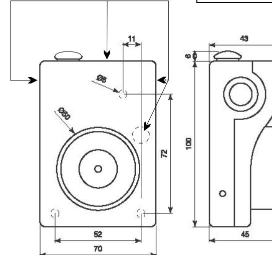
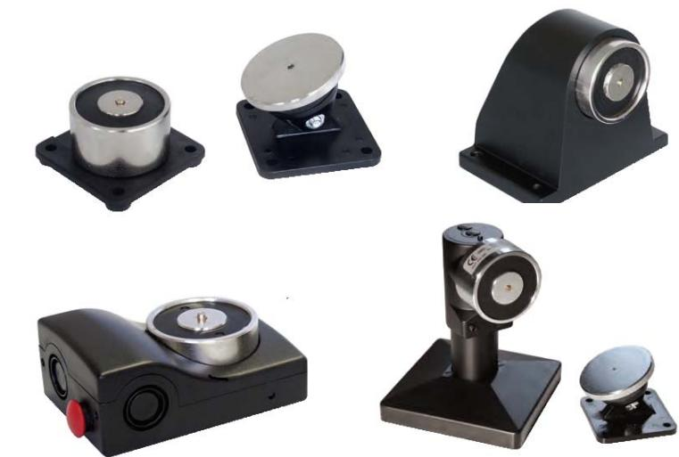
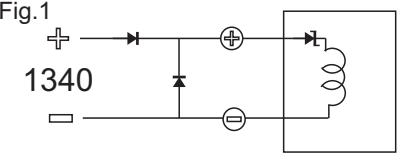
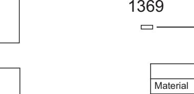
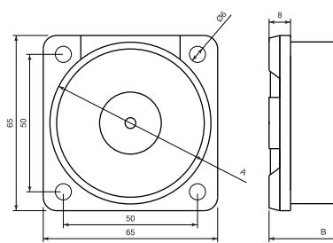
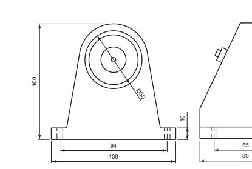
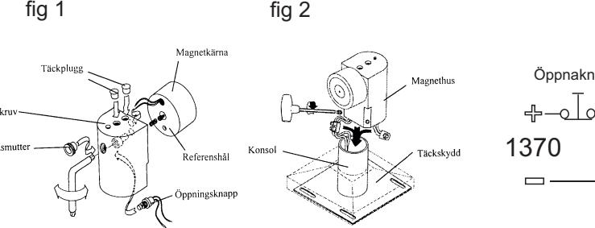
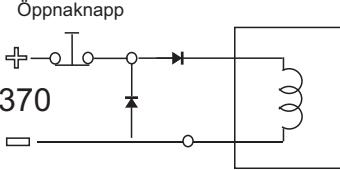
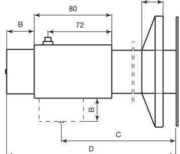
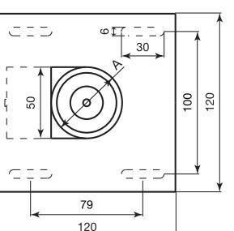

## Plint anslutning

24 Vdc

Kabelingångar

|                                          | 1 3 0 5 0 ( 4 8 )- ( S P )   |
|------------------------------------------|------------------------------------------------------------------|
| M ia l ate r                 | A B S P las U L 9 4- V O t – |
| Sp än ing n                     | 2 4 V                                                      |
| Str öm f ör bru kn ing | 4 0 A m                                                 |
| å H l l kra ft            | 5 0 Kg                                                     |
| ing M än ax sp n          | ( ) 3 0 V A C- D C                       |
| "re d " ko kt nta e    |                                                                  |
| ka M öm str sty ax r   | 1 0 0 A m                                            |
| "re d " ko kt nta e    |                                                                  |
| M be las ing tn ax        | 1 W                                                           |
| "re d " ko kt nta e    |                                                                  |

Safetron AB Kolvgatan 7 653 41 Karlstad Tel. 054-190245

# Monteringsanvisning Elektromagneter

1330 1340 1369 13050 1370/15 1370/30

# **1. Beskrivning**

Elektromagneter typ 1330,1340,1369 används för uppställning av brand och passagedörrar samt automatisk frigörning av dessa vid brandfara. Magneten består av två delar själva elektromagneten och ankaret. 1330 och 1340 magneterna är avsedda att monteras på väggen och ankaret på dörren. 1369 magneten är avsedd att monteras i tak golv eller vägg, 1369 magneten är försedd med frisläppnings knapp.

# **2. Montering**

 2,1 Använd de två ingående delarna som mallar. Se till att själva centrum hos magnet och ankare kommer mitt för varandra.

2,2 Borra hålen på den plats som elektromagneten skall monteras.

2,3 Fäst de två enheterna och se till att ankaret monteras med den sida som är märkt "TOP" vänt uppåt för att undvika böjning vilken med tiden kan orsaka skada eller brott.

2,4 För att göra inkopplingen använd isolerade kopplingsplintar. Koppla medföljande dioder enligt fig 1.

OBS. Smuts liksom små ojämnheter orsakade av oavsiktliga slag mot magnetens och ankarets kontaktytor kan orsaka betydande försvagning av magnetens angivna hållkraft.

## **3. Provning**

Tillför spänning till elektromagneten och applicera ett lätt tryck så att elektromagneten kommer i linje med ankaret. Dragkraften mellan dessa två skall nu märkas. Tryck på öppnaknappen för att sära på de två enheterna.

( 1369 ). För optimal funktion rengör regelbundet med mjuk trasa. Använd vatten ! INTE

1369

| 1 3 3 0 |  |  |
|------------------|--|--|
|                  |  |  |

1330, 1340

Öppnaknapp

Strömförbrukning

Spänning

Hållkraft

1330,1340,1369

50 /100/50 Kg

60/100/60 mA

24 Vdc

Stål, Plast

12

69

5

# 1370/15/30

# **1. Beskrivning**

Elektromagnet typ 1370 används för uppställning av brand och passagedörrar samt automatisk frigörning av dessa vid brandfara. Konsolen möjliggör montering på golv, tak eller vägg såväl vertikalt som horisontellt. Elektromagneten är försedd med frisläppnings knapp.

# **2. Montering**

2,1 Använd ankare och stödplatta som mallar. Se till att själva centrum hos magnetens resp ankarets fästytor kommer mitt för varandra.

2,2 Borra hålen och fäst de två enheterna på plats och se till att ankaret monteras med ordet "TOP" vänt uppåt för att undvika böjning vilket med tiden kan orsaka skada eller brott.

2,3 För att montera elektromagneten fäst bottenstödet i golv eller tak och träd kablarna genom röret. 2,4 Sätt täckskyddet på plats.

2,5 Beroende på typ av installation ( horisontellt eller vertikalt mot ankaret ). Ta bort öppnarknappen genom att skruva bort låsmuttern av aluminium från magnethuset ,med den medföljande 6mm insex verktyget, ta bort själva magneten ( fig 1 ) . Var försiktig så att spiralfjädern och centrumtappen inte kommer bort. 2,6 Fäst magneten på magnethuset och kontrollera att hålen stämmer överens med motsvarande centrumtapp. En felaktig montering kan skada enheten och resultera i att garantin inte längre gäller. 2,7 Dra fast magnetkärnan på magnethuset och sätt tillbaka öppningsknappen i sitt läge.

 2,8 Sätt magnethuset på konsolen och lås fast det på önskad höjd genom att dra åt skruvarna med 3mm nyckeln.( fig 2 )

OBS smuts liksom små ojämnheter orsakade av oavsiktliga slag mot magnetens och ankarets kontaktytor kan orsaka betydande försvagning av magnetens angivna hållkraft.

## **3. Provning**

Tillför spänning till elektromagneten och applicera ett lätt tryck så att elektromagneten kommer i linje med ankaret. Dragkraften mellan dessa två skall nu märkas. Tryck på öppnaknappen för att sära på de två enheterna. För optimal funktion rengör regelbundet med en mjuk trasa. Använd vatten. INTE

|                                      | 137 0                      |
|--------------------------------------|-------------------------------|
| Ma ial ter                     | Alu min ium Stå l |
| Str för bru kni öm ng | 60 mA                      |
| Sp ing änn                     | 24 Vd c                 |
| Hå llkr aft                    | 50 Kg                      |