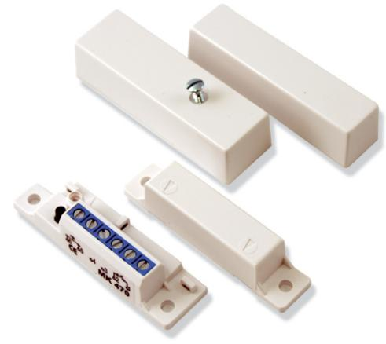

# **MK470 Högsäkerhetskontakt för utanpåliggande montage**

- ▶ **Förspänd växlande kontakt**
- ▶ **Utanpåliggande montage**
- ▶ **Arbetsavstånd <20mm**
- ▶ **Skruvplintsanslutning**

### **Funktioner**

MK470 är en magnetkontakt för utanpåliggande montage och av högsta kvalitet. En magnetkontakt består av två delar, kontakt- och magnetdelen. Kontaktdelens tungelement är av mycket hög kvalitet och består av Ruthenium som sprutats på guld. Detta kontaktämne garanterar hög driftsäkerhet vid såväl mycket låga som höga strömmar. Magneten består av legeringen "Alnico V" (aluminium, nickel, kobolt), som garanterar mycket lång livslängd. De förspända kontakterna har dubbelt tungelement i larmslingan. Dessa är monterade på ett kretskort som gör att magneten som förspänner alltid kommer exakt rätt. En förspänd kontakt ger hög säkerhet mot sabotage och löser ut larm om en yttre magnet placeras vid kontakten.

#### **Certifikat och godkännanden**

Listor och godkännanden: X

## **Installations-/konfigurationsanteckningar**

Magnetkontakten kan monteras på trä- eller metallkarmar till dörrar och fönster. Vid montage på metall finns det distansbrickor bipackat. Dessutom finns det montagevinklar och extra starka magneter som tillbehör. Tack vare den unika konstruktionen med skruvplint för inkopplingen sparas dyrbar installationstid.

#### **Delar som medföljer**

| Antal | Komponent      |
|-------|----------------|
| 1     | Kontakt        |
| 1     | Magnet         |
| 2     | Distansbrickor |
| 4     | Skruvar        |
| 1     | Buntband       |

### **Tekniska specifikationer**

# **Miljöspecifikationer**

| Temperatur (vid drift): | -40°C till 70°C |
|-------------------------|-----------------|
| Temperatur (förvaring): | -40°C till 70°C |
| Relativ luftfuktighet:  | 95%             |

| Arbetsavstånd        |                       |
|----------------------|-----------------------|
| Arbetsavstånd:       | <20 mm                |
| Fysiska egenskaper   |                       |
| Mått (H x B x D)     |                       |
| Kontakt:             | 64,6 x 19 x 15 mm     |
| Magnet:              | 64,6 x 15 x 15 mm     |
| Färg:                | Vit                   |
| Strömspecifikationer |                       |
| Kontakttyp:          | Förspänd / NC/NO      |
| Kontaktdata:         | 200VDC / 500mA / 10VA |
|                      |                       |
|                      |                       |

| Beställningsinformation                                 |        |  |
|---------------------------------------------------------|--------|--|
| MK470 Högsäkerhetskontakt för utanpåliggande montage | 05-160 |  |
| Hårdvarutillbehör                                       |        |  |
| MK400-2 Extra stark magnet till MK400- serien        | 05-165 |  |

**Represented by**

© Bosch Security Systems 2008 | data kan ändras utan föregående meddelande T4500098827 | Cur: sv-SE, V1, 9 Jan 2008