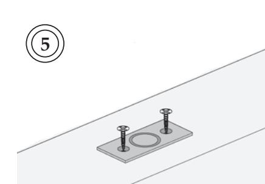
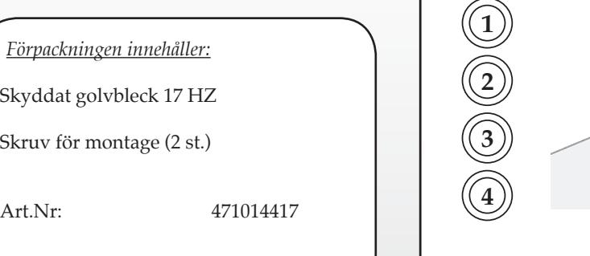
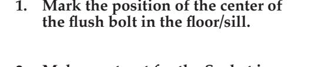
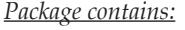
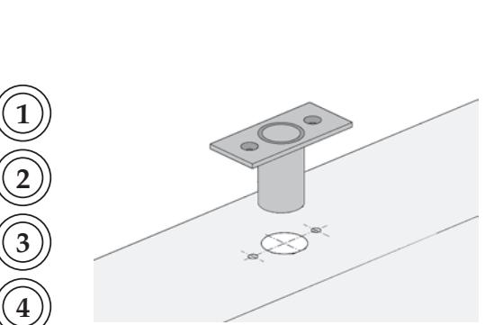
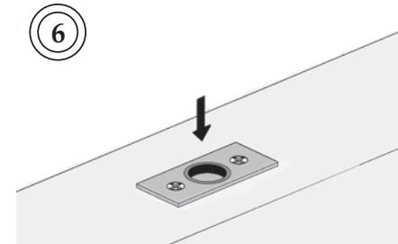

*Monteringsanvisning 17 HZ :*

- **1. Markera positionen för kantregelns centrum i golv/tröskel.**
- **2. Gör urtag för golvblecket i golv/tröskel. Om nödvändigt, gör också urtag för plattan (60x20 mm).**
- **3. För in golvblecket i urtaget och markera skruvhålens placering (2x).**
- **4. Tag ur golvblecket och borra för montering enligt gjord markering.**
- **5. Montera golvblecket. Dra skruvar.**
- **6. Kontrollera golvbleckets funktion tillsammans med kantregeln.**

## 35Ø18

60

3

*®*

INNOVATION AB

OLDA Innovation AB, Vagnmakaregatan 14, 415 07 Göteborg tel: 031-26 68 92 fax: 031-26 68 67 e-post: info@olda.com webb: www.olda.com

*Mounting instructions 17 HZ :*

3 x 45°

60

## Dust-excluding floor socket 17 HZ

- **2. Make a cut-out for the Socket in floor/sill. If necessary, also make a cut-out for the plate (60x20 mm).**
- **3. Insert the Socket in the cut-out and mark the attachment points (2x).**
- **4. Remove the Socket and drill for mounting according to the marks.**
- **5. Mount the Socket. Tighten the screws.**
- **6. Check the function of the floor socket together with the flush bolt.**

Dust-excluding floor socket 17 HZ

Screws for mounting (2 pcs.)

Art.No: 471014417

40

35

20

3

Ø18

Ø13

OLDA Innovation AB, Vagnmakaregatan 14, SE-415 07 Göteborg, Sweden tel: +46 (0)31-26 68 92 fax: +46 (0)31-26 68 67 e-mail: info@olda.com web: www.olda.com