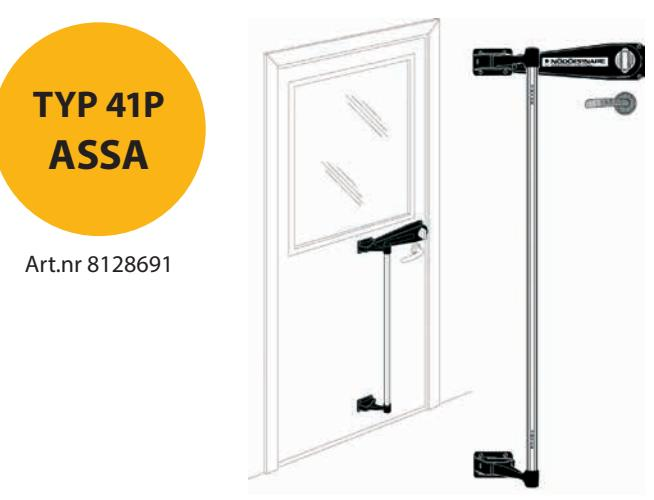
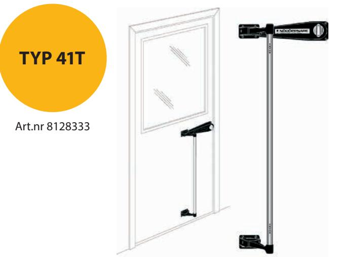
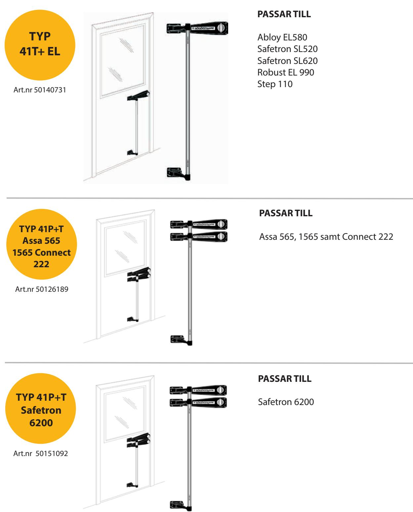

Art.nr 50151091

**TYP 41P Abloy**

**Nödöppnare - Guide** 

Snabbhjälp att para ihop rätt produkter

## **PASSAR TILL**

Assa 560, 562, 564, 566, 1560, 1760, 5584, 5784, 6580, 6780, 6585, 8561, 8761, 8562 och 8762

## **PASSAR TILL**

Abloy 4180, 8180, 4560, EL580 och EL582.

Kan anpassas för 8164 - 8165 med specialtillbehör. Vid order på det kontakta Copiax.

## **PASSAR TILL**

Assa 1498, Abloy 4598 samt Trioving 5130.

Nödöppnaren kan naturligtvis monteraspå trycket på de flesta lås på marknaden. Dörren får då inte vara låsbar.

