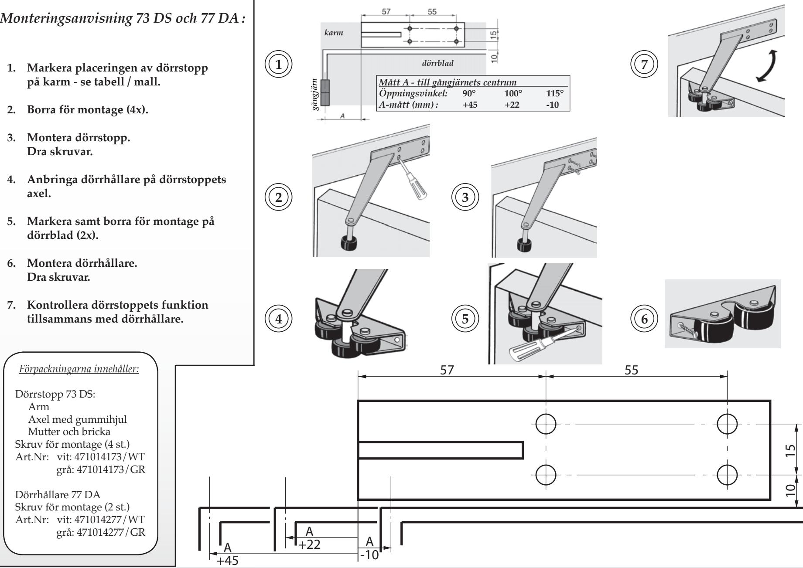
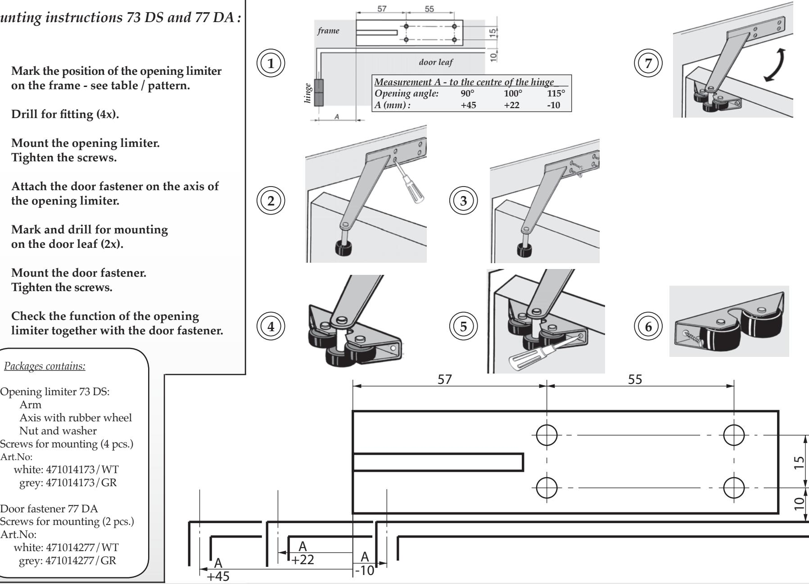

## Dörrstopp 73 DS och Dörrhållare 77 DA

OLDA Innovation AB, Vagnmakaregatan 14, 415 07 Göteborg tel: 031-26 68 92 fax: 031-26 68 67 e-post: info@olda.com web: www.olda.com

## *Mounting instructions 73 DS and 77 DA :*

- **1. Mark the position of the opening limiter on the frame - see table / pattern.**
- **2. Drill for fitting (4x).**
- **3. Mount the opening limiter. Tighten the screws.**
- **4. Attach the door fastener on the axis of the opening limiter.**
- **5. Mark and drill for mounting on the door leaf (2x).**
- **6. Mount the door fastener. Tighten the screws.**

*Packages contains:*

Arm

Art.No:

Art.No:

Opening limiter 73 DS:

Nut and washer

Door fastener 77 DA

- **7. Check the function of the opening limiter together with the door fastener.**

Opening limiter 73 DS and Door fastener 77 DA

OLDA Innovation AB, Vagnmakaregatan 14, SE-415 07 Göteborg, Sweden tel: +46 (0)31-26 68 92 fax: +46 (0)31-26 68 67 e-mail: info@olda.com web: www.olda.com