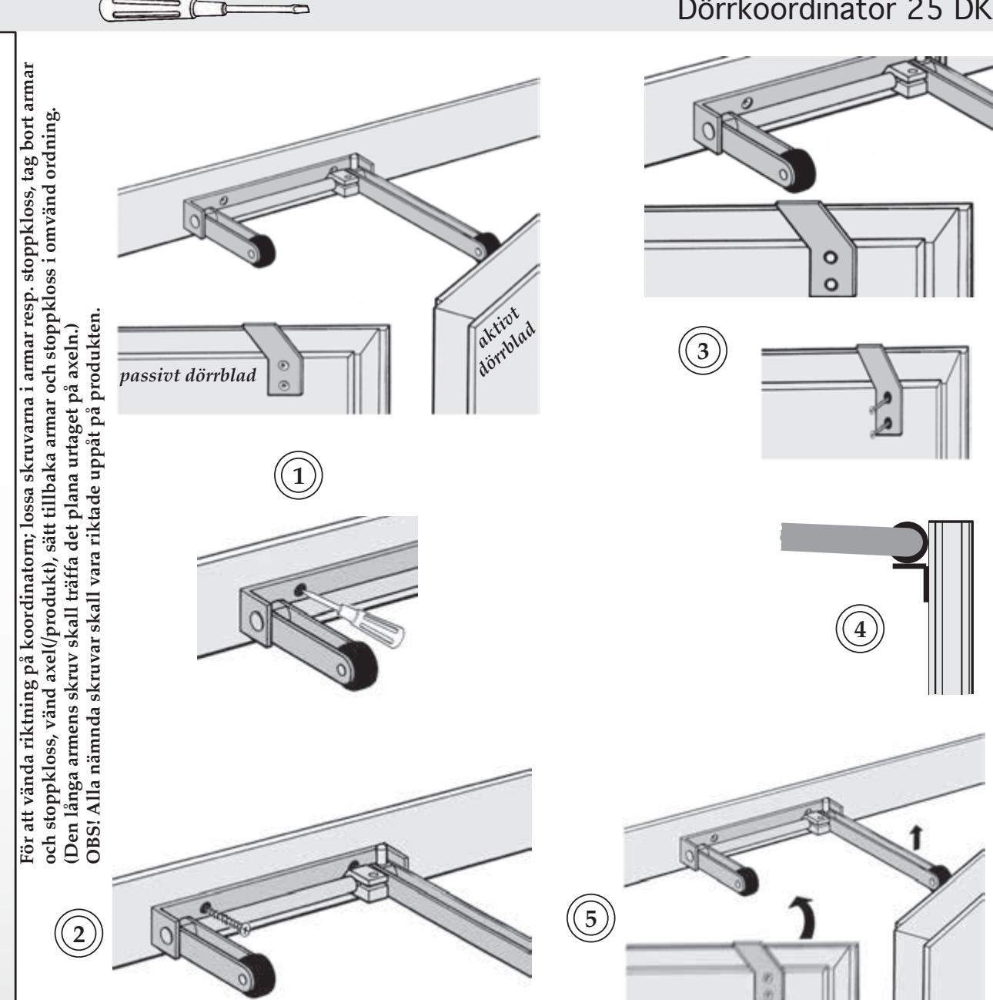
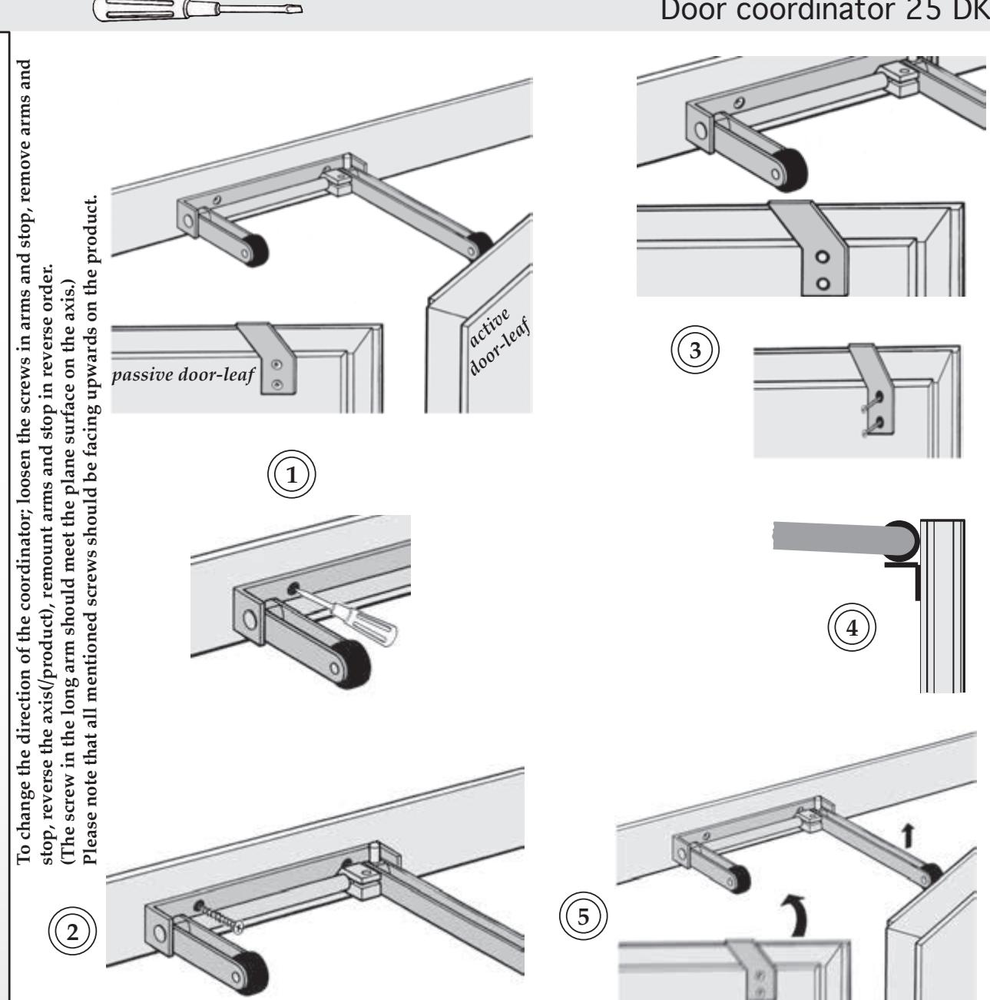

# *Monteringsanvisning 25 DK :*

- **1. Markera koordinatorns placering på karmöverstycke. Koordinatorn skall monteras så den tillser att passivt dörrblad passerar aktivt dörrblad som spärras av koordinatorn.**
- **2. Borra hål för montage (4x). Montera koordinatorn. Dra skruvar.**
- **3. Markera placering för löpkonsol på passivt dörrblad, mitt för den kortare armen på koordinatorn. Borra hål för montage (2x). Montera löpkonsol. Dra skruvar.**
- **4. Markera placering för stödvinkel på aktivt dörrblad, mitt för den längre armen på koordinatorn. Borra hål för montage (2x). Montera stödvinkel. Dra skruvar.**
- **5. Justera koordinatorns armar och kontrollera koordinatorns funktion.**

*Förpackningen innehåller:* Dörrkoordinator 25 DK Löpkonsol Stödvinkel Skruv för montage av koordinator (4 st.) Skruv för montage av löpkonsol (2 st.) Skruv för montage av stödvinkel (2 st.) Art.Nr: vit: 471014425/WT

grå: 471014425/GR

OLDA Innovation AB, Vagnmakaregatan 14, 415 07 Göteborg tel: 031-26 68 92 fax: 031-26 68 67 e-post: info@olda.com web: www.olda.com

## *Mounting instructions 25 DK :*

- **1. Mark the position of the coordinator on the top of the frame. The coordinator is fitted so that the passive door-leaf can pass the active door-leaf which is stopped by the coordinator.**
- **2. Drill holes for fitting (4x). Mount the coordinator. Tighten the screws.**
- **3. Mark the position of the running bracket on the passive door-leaf, in line with the shorter arm of the coordinator. Drill holes for fitting (2x). Mount the running bracket. Tighten the screws.**
- **4. Mark the position of the support bracket on the active door-leaf, in line with the longer arm of the coordinator. Drill holes for fitting (2x). Mount the support bracket. Tighten the screws.**
- **5. Adjust the arms of the coordinator and check the function of the coordinator.**

| Package contains:                               |  |  |
|-------------------------------------------------|--|--|
| Door coordinator 25 DK                          |  |  |
| Running bracket                                 |  |  |
| Support bracket                                 |  |  |
| Screws for mounting of coordinator (4 pcs.)     |  |  |
| Screws for mounting of running bracket (2 pcs.) |  |  |
| Screws for mounting of support bracket (2 pcs.) |  |  |
| Art.No: white: 471014425/WT                  |  |  |
| grey: 471014425/GR                              |  |  |

OLDA Innovation AB, Vagnmakaregatan 14, SE-415 07 Göteborg, Sweden tel: +46 (0)31-26 68 92 fax: +46 (0)31-26 68 67 e-mail: info@olda.com web: www.olda.com