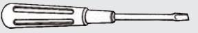
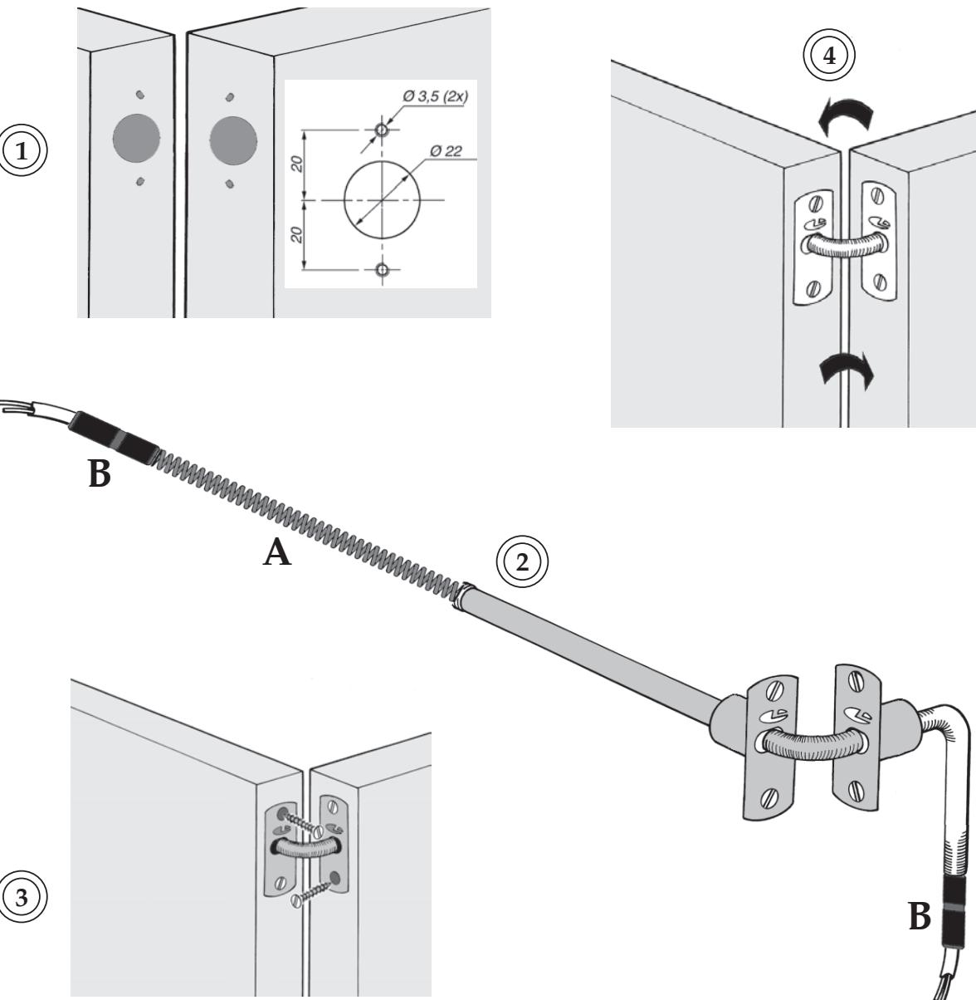
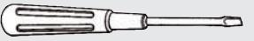

## Karmöverföring 71 KPF

- **1. Markera placeringen på dörrblad samt karm enligt hålbild.** *Var noga med att hålen centreras, i förhållande till varandra.*
**Borra för bleck Ø22 mm (1x / bleck) samt hål för skruvar (2x / bleck).**

- **2. Montera karmöverföring, returfjäder [A] och excenterlås [B] (2x) på kabel.**
- **3. Montera karmöverföring i dörr och karm. Dra skruvar.**
- **4. Kontrollera karmöverföringens funktion. Vid behov, justera returfjäderns slaglängd.**

Art.Nr: 471014871

OLDA Innovation AB, Vagnmakaregatan 14, 415 07 Göteborg tel: 031-26 68 92 fax: 031-26 68 67 e-post: info@olda.com web: www.olda.com

## Frame bridge 71 KPF

*Mounting instructions 71 KPF :*

- **1. Mark the position on the door-leaf and frame according to hole-pattern.** *Make sure that the holes is centered, in relation to each other.*
 **Drill Ø22 mm for fitting (1+1) and holes for screws (2+2).**

- **2. Mount the frame bridge, return spring [A] and eccentric locks [B] (2x) on the cable.**
- **3. Mount the frame bridge in door and frame. Tighten the screws.**
- **4. Check the function of the frame bridge. If necessary, adjust the stroke-length of the return spring.**

## *Package contains:*

Frame bridge 71 KPF Return spring Eccentric lock (2 pcs.) Screws for mounting (4 pcs.)

Art.No: 471014871

OLDA Innovation AB, Vagnmakaregatan 14, SE-415 07 Göteborg, Sweden tel: +46 (0)31-26 68 92 fax: +46 (0)31-26 68 67 e-mail: info@olda.com web: www.olda.com