**GEZE** DÖRRTEKNIK

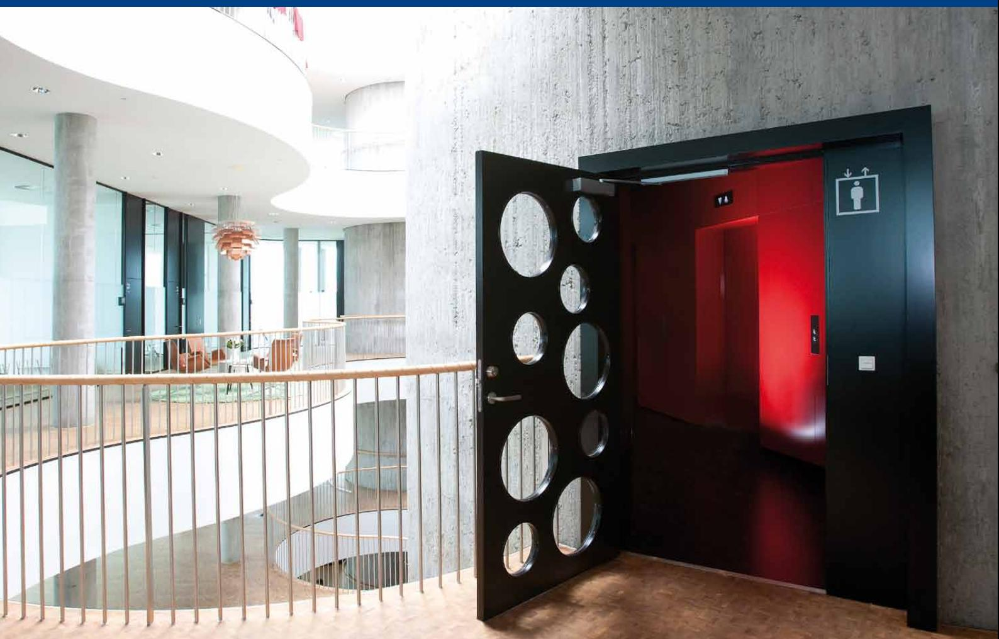

# G E Z E T S 3000 V Dörrstä nga re med gl idsken a

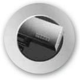

**DØRTEKNIK AUTOMATISKE** 

**Dörrteknik Automatiska**

Dørteknik

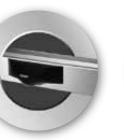

**DØRSYSTEMER**

**dörrsystem**

Dørsystemer

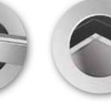

logoer 1 09/03/10 14.29

**Glassystemer**

> Røgventilation

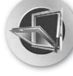

Sikkerhedsteknik

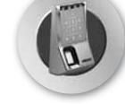

**VENTILATION OG RØGVENTILATION Komfort- och rökventilation**

**GLASSYSTEMER SIKKERHEDSTEKNIK Glassystem Säkerhetsteknik**

Glassystemer

Bewegu ng mit System

Dörrteknik

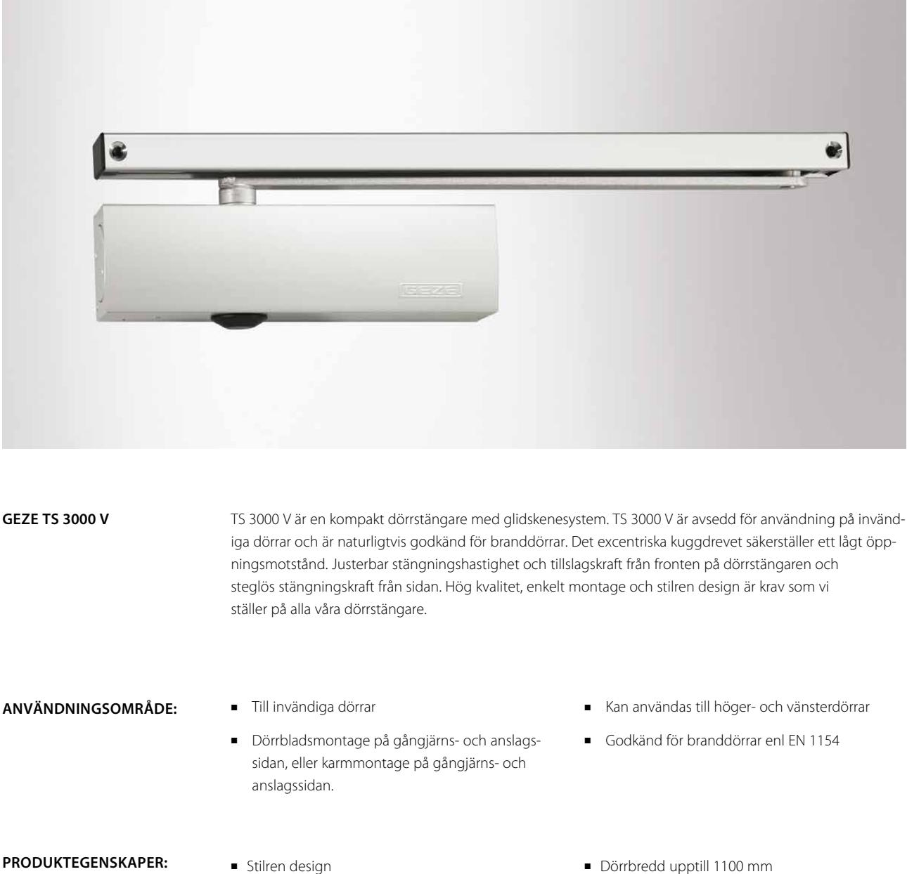

- j Termostabila ventilskruvar
- j Justerbar stängningskraft storlek 1-4
- j Justerbar stängningshastighet 180-0°
- j Justerbar tillslagskraft 10-0°
- j Dörrbredd upptill 1100 mm
- j Standardfärg: Silver vit RAL 9016
- j RAL Färger, rosftritt stål, mörk brons efter beställning

| ID nr. | Beteckning                          | Utförande    | ID nr. |
|--------|-------------------------------------|--------------|--------|
|        | GEZE Dörrstängare TS 3000V          | Silver       | 028348 |
|        | storlek 1-4, utan arm och glidskena | Vit RAL 9016 | 028350 |
|        | Glidskena med arm                   | Silver       | 068221 |
|        |                                     | Vit RAL 9016 | 015695 |

### Dörrteknik

5

33

100

38 ±1

15

44 ±0,1

## GEZE Ts 3000 V Dörr stängare med glidsken a

#### **Mått TS 3000 V**

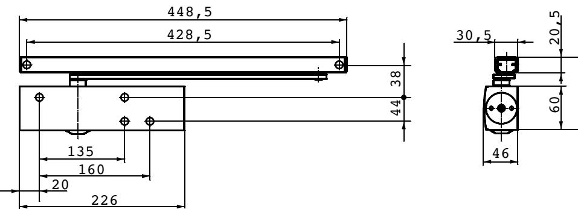

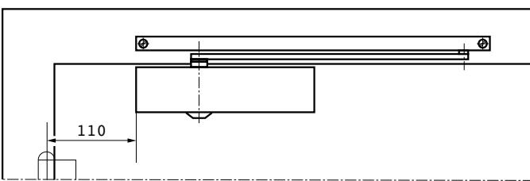

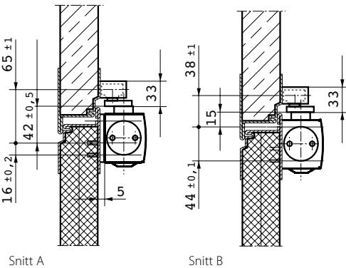

### **Montage TS 3000 V på gångjärnssidan**

Montagemått Med montageplatta

Montagemått Direktmontage (utan montageplatta)

110

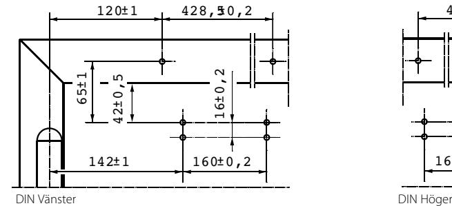

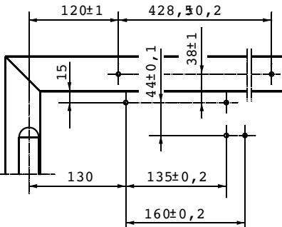

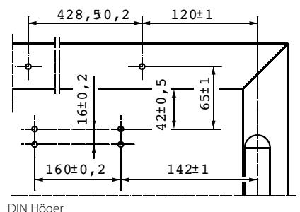

65 ±1

16 ±0,2 42 ±0,5

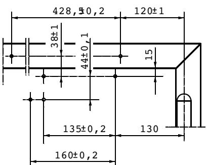

33

### Dörrteknik GEZE Ts 3000 V Dörr stängare med glidsken a

### **Tillbehör:**

- j T-Stop skena exstra kraftig glidskena med integrerad dörrstopp
- j Justerbar glidskena
- j Montageplatta til dörrstängarhus
- j Montageplatta til glidskena
- j Vinkelkonsol til glidskena
- j Mekanisk öppningsdämpning
- j Klämplatta til 10 mm helglasdörrar
- j Täckkåpa i rostfritt stål/mässing

**TS 3000 varianter:**

- j TS 3000 V kan kombineras med alla glidskene varianter i TS 5000 serien.
**OM GEZE**

GEZE Scandinavia AB är ett helägt dotterbolag till GEZE GmbH. GEZE är en världsledande tillverkare av manuella och automatiska dörr- och fönsterteknologisystem med dotterbolag och produktion runt om i världen. Sedan starten 1863 har design, funktion och innovation varit det centrala i GEZE´s filosofi. För marknaden betyder det den senaste tekniken, kvalitet, funktionalitet och formskön design.

Vi arbetar i nära samarbete med marknadens aktörer, tillsammans utvecklar vi lösningar som förvandlar ambitiösa visioner till verklighet.

### **GEZE Scandinavia**

**GEZE Sverige**

Mallsingan 10 Box 7060 S-187 11 Täby Tel. +46 (0) 8-732 34 00 Fax +46 (0) 8-732 34 99 E-mail: sverige.se@geze.com www.geze.se

### **GEZE Danmark**

Mårkærvej 13 J-K DK-2630 Taastrup Tel. +45 46 32 33 24 Fax +45 46 32 33 26 E-mail: danmark.se@geze.com www.geze.dk

### **GEZE Norge**

Industrivegen 34B NO-2072 Dal Tel. +47 63 95 72 00 Fax +47 63 95 71 73 E-mail: norge.se@geze.com www.geze.no

Bewegu ng mit System