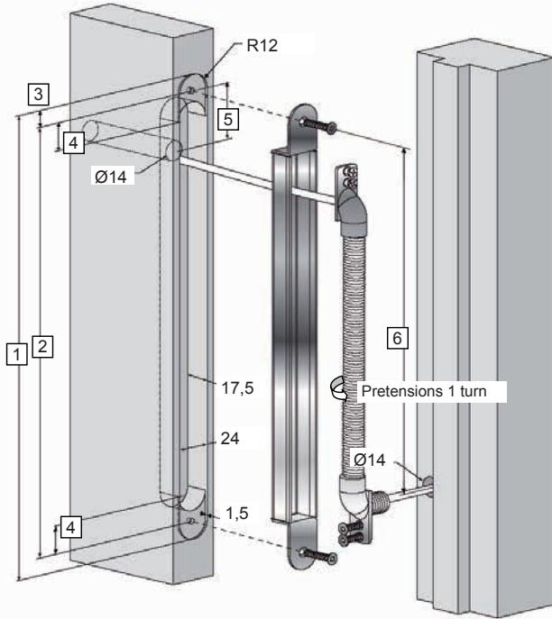
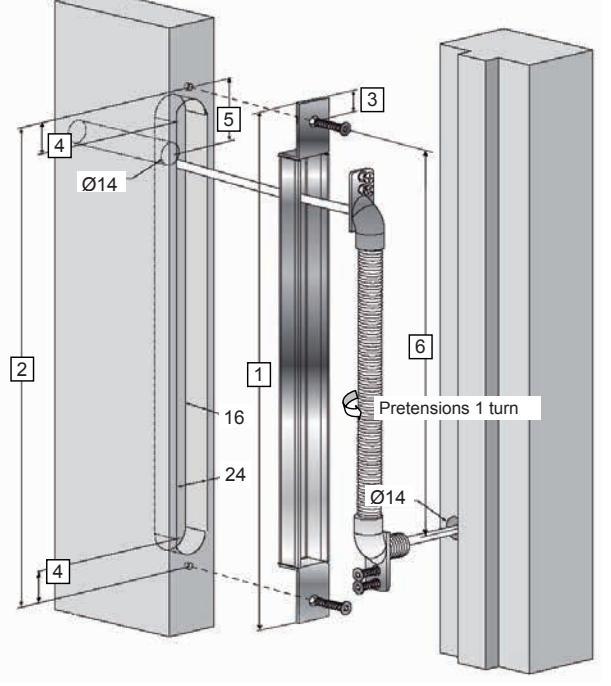
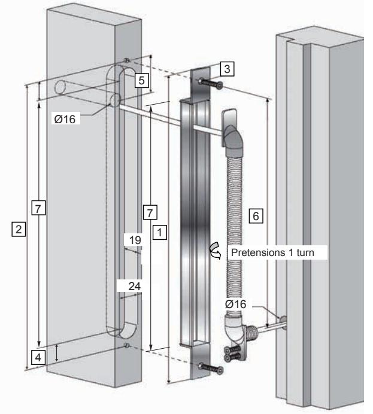

## Mounting instruction for Cable transfers:

|      | Item no  |          |  |
|------|----------|----------|--|
| Pos. | 904630   | 904637   |  |
| 1    | 324      | 546      |  |
| 2    | 299      | 519      |  |
| 3    | 12       | 12       |  |
| 4    | 20.5     | 20.5     |  |
| 5    | C-C40-57 | C-C40-57 |  |
| 6    | ~242     | ~465     |  |

|      | Item no  |          |  |
|------|----------|----------|--|
| Pos. | 904631   | 904632   |  |
| 1    | 291      | 511      |  |
| 2    | 277      | 497      |  |
| 3    | 6.5      | 6.5      |  |
| 4    | 9.5      | 9.5      |  |
| 5    | C-C34-46 | C-C34-46 |  |
| 6    | ~231     | ~454     |  |

| Item no |          |  |
|---------|----------|--|
| Pos.    | 929590   |  |
| 1       | 521      |  |
| 2       | 507      |  |
| 3       | 7        |  |
| 4       | (13,5)   |  |
| 5       | C-C 50±5 |  |
| 6       | ~455     |  |
| 7       | 477      |  |

rocaindustry.com