ABLOY® EL402, EL502 *- Solenoidilukko - Solenoidlås - Solenoid lock - Соленоидный замок* 

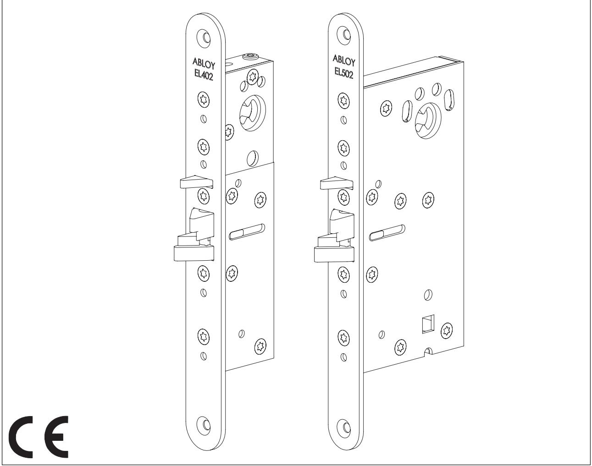

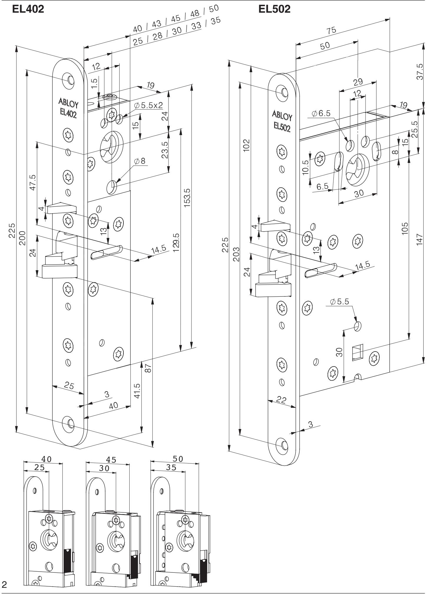

### Sisällysluettelo

### SUOMI

| TEKNISET TIEDOT                                                                                                                                                                |  |
|--------------------------------------------------------------------------------------------------------------------------------------------------------------------------------|--|
| STANDARDIT                                                                                                                                                                     |  |
| KYTKENTÄKAAVIO                                                                                                                                                                 |  |
| KARAETÄISYYDEN VAIHTAMINEN EL402 ……………………………………………………………………………………………………………………………………………………………………………………………………………………………………………………………………………………………………………………………………………………………………………………… |  |
| SOLENOIDIN TOIMINNANSUUNNAN VAIHTO                                                                                                                                          |  |
| PORAUSOHJE EL402                                                                                                                                                            |  |
| PORAUSOHJE EL502                                                                                                                                                            |  |
| ASENNUSOHJE                                                                                                                                                                    |  |

### Innehåll

### SVENSKA

| TEKNISKA DATA              |  |
|----------------------------|--|
| STANDARDS                  |  |
| INKOPPLING                 |  |
| INSTÄLLING AV DORNDJUP     |  |
| RÄTTVÄND / OMVÄND FUNKTION |  |
| URTAG EL402                |  |
| URTAG EL502                |  |
| INSTALLATION / BEHÖR    |  |

### Contents

### ENGLISH

| TECHNICAL DATA                  |  |
|---------------------------------|--|
| STANDARDS                       |  |
| WIRING DIAGRAM                  |  |
| ADJUSTING BACKSET IN EL402      |  |
| SETTING ELECTRICAL FUNCTION  |  |
| DRILLING SCHEME EL402           |  |
| DRILLING SCHEME EL502        |  |
| INSTALLATION SCHEMATIC       |  |

### Содержание

### ПО-РУССКИ

| ТЕХНИЧЕСКИЕ ДАННЫЕ                                                                                                                                                                                 |      |
|----------------------------------------------------------------------------------------------------------------------------------------------------------------------------------------------------|------|
| СТАНДАРТЫ …………………………………………………………………………………………………………………………………………………………………………………………………………………………………………………………………………………………………………………………………………………………………………………………………………………………………………………… СХЕМА СОЕДИНЕНИЙ | . 11 |
| РЕГУЛИРОВКА РАССТОЯНИЯ ОТ ПЕРЕДНЕЙ ПЛАНКИ ДО СЕРЕДИНЫ ЦИЛИНДРА В  EL402                                                                                                                         |      |
| УСТАНОВКА ЭЛЕКТРИЧЕСКОЙ ФУНКЦИИ СХЕМА СВЕРЛЕНИЯ EL402                                                                                                                                           | . 14 |
| СХЕМА СВЕРЛЕНИЯ EL502 СХЕМА МОНТАЖА 16 - 21                                                                                                                                                  |      |

### **TEKNISET TIEDOT EL402, EL502** SUOMI

| Käyttöjännite:                 | 12 - 24 V DC -10% / +15% STAB                                                                    |
|--------------------------------|--------------------------------------------------------------------------------------------------|
| Virta: 2                    | 12 V Maks. 550 mA Normaali 240 mA 4 V Maks. 270 mA Normaali 110 mA                |
| Mikrokytkin:                   | max. 0.4 A 30 V AC / V DC resist. max. 10 W                                                      |
| Käyttölämpötila:               | -20° - +60°C                                                                                     |
| Teljen ulostulo:               | 14,5 mm                                                                                          |
| Karaetäisyydet:                | EL402: 25, 28, 30, 33 , 35 mm (säädettävä) EL502: 50 mm                              |
| Rintalevy:                     | EL402: 25 mm EL502: 22 mm                                                            |
| Kiilla:                        | Symmetrinen                                                                                      |
| Lukkorungosta valittavissa: | Sähköinen toiminto - jännitteettömänä lukossa - jännitteettömänä auki                      |
| Indikointi:                    | Teljen takalukituksen tilatieto                                                                  |
| Ovivälys: 3                    | - 5 mm (Rintalevyn ja vastalevyn välillä)                                                        |
| Jatkokaapelit:                 | EA211 (6 m), EA22 1 (10 m) 9 x 0.14 mm2                                                       |
| Vastalevyt:                    | EL402: EA307, EA308, 4613, 4614 EL502: LP721, LP731 (huullettu) LP711, LP714 (huultamaton) |

Lukkoa ei suositella asennettavaksi oviin, joissa on tiivistevoima. **!**

Lukon telki ja kiila on rasvattava asennettaessa ja tarvittaessa. **!**

Lukko ei sovellu käytettäväksi palo-ovissa. **!**

### **STANDARDIT**

EN12209 Mekaaninen lujuus

## **KYTKENTÄKAAVIO EL402, EL502** SUOMI

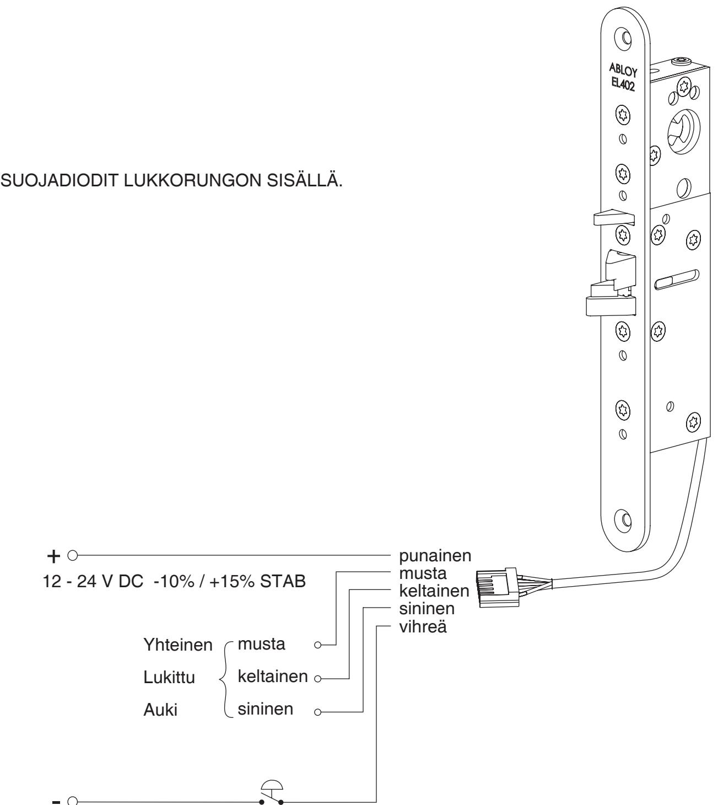

MAKSIMIARVOT MIKROKYTKIMILLE: max. 0.4 A 30 V AC / V DC resist. max. 10 W

MITÄÄN ARVOA EI SAA YLITTÄÄ.

### **TEKNISKA DATA EL402, EL502** SVENSKA

## Spänning: 12 - 24 V DC -10% / +15% STAB Ström: 12 V Max. 550 mA Normal 240 mA 24 V Max. 270 mA Normal 110 mA Mikrobrytare: max. 0.4 A 30 V AC / V DC resist. max. 10 W Temperaturområde: -20° - +60°C Fallutsprång: 14,5 mm Dorndjup: EL402: 25, 28, 30, 33, 35 mm (justerbar) EL502: 50 mm Stolpe: EL402: 25 mm EL502: 22 mm Förreglingsfall: Symetrisk Valbar elektrisk funktion: Rättvänd funktion (fabriksinställning) Omvänd funktion Indikeringar: Förregling (stängd / öppen dörr) Dörrspringa: 3-5 mm (mellan låshus och slutbleck) Anslutningskabel: EA220 (10 m) 16 x 0.14 mm2 Slutbleck: EL402: EA307, EA308, 4613, 4614 EL502: LP721, LP731 (falsad) LP711, LP714 (ofalsad)

Kan inte användas i dörrar med listtryck. **!**

- Fall och förregling ska smörjas vid installation och vid behov. **!**
Låset får inte användas i brandcellskräns. **!**

### **STANDARDS**

SS-EN 12209 Brythållfasthet 

## **INKOPPLING EL402, EL502** SVENSKA

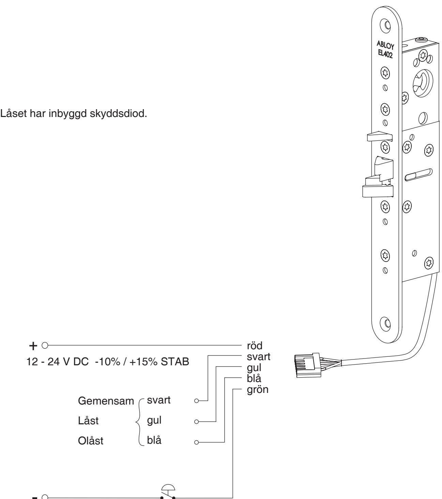

Max. belastning mikrobrytare: max. 0.4 A 30 V AC / V DC resist. max. 10 W

Värdena får inte överskridas.

### **TECHNICAL DATA EL402, EL502** ENGLISH

| Operating voltage:                      | 12 - 24 V DC -10% / +15% STAB                                                                  |
|-----------------------------------------|------------------------------------------------------------------------------------------------|
| Current: 2                           | 12 V Max. 550 mA Normal 240 mA 4 V Max. 270 mA Normal 110 mA                    |
| Micro switch:                           | max. 0.4 A 30 V AC / V DC resist. max. 10 W                                                    |
| Ambient temperature:                    | -20° - +60°C                                                                                   |
| Bolt throw:                             | 14,5 mm                                                                                        |
| Backsets:                               | EL402: 25, 28, 30, 33 , 35 mm (adjustable) EL502: 50 mm                            |
| Forend:                                 | EL402: 25 mm EL502: 22 mm                                                          |
| Trigger bolt:                           | Symmetrical                                                                                    |
| Functions selected on the lock case: | Electrical function - fail locked - fail unlocked                                        |
| Indications:                            | Deadlocking status of double action bolt                                                       |
| Door clearance: 3                       | - 5 mm (Between forend and strike)                                                             |
| Connection cable:                       | EA211 (6 m), EA22 1 (10 m) 9 x 0.14 mm2                                                     |
| Striker plates:                         | EL402: EA307, EA308, 4613, 4614 EL502: LP721, LP731 (rebated) LP711, LP714 (flush) |

Not to be installed in doors with seal force. **!**

Bolt and trigger bolt have to be lubricated during installation and when necessary. **!**

Not suitable for use in fire door. **!**

### **STANDARDS**

EN12209 Mechanical strength

### **WIRING DIAGRAM EL402, EL502** ENGLISH

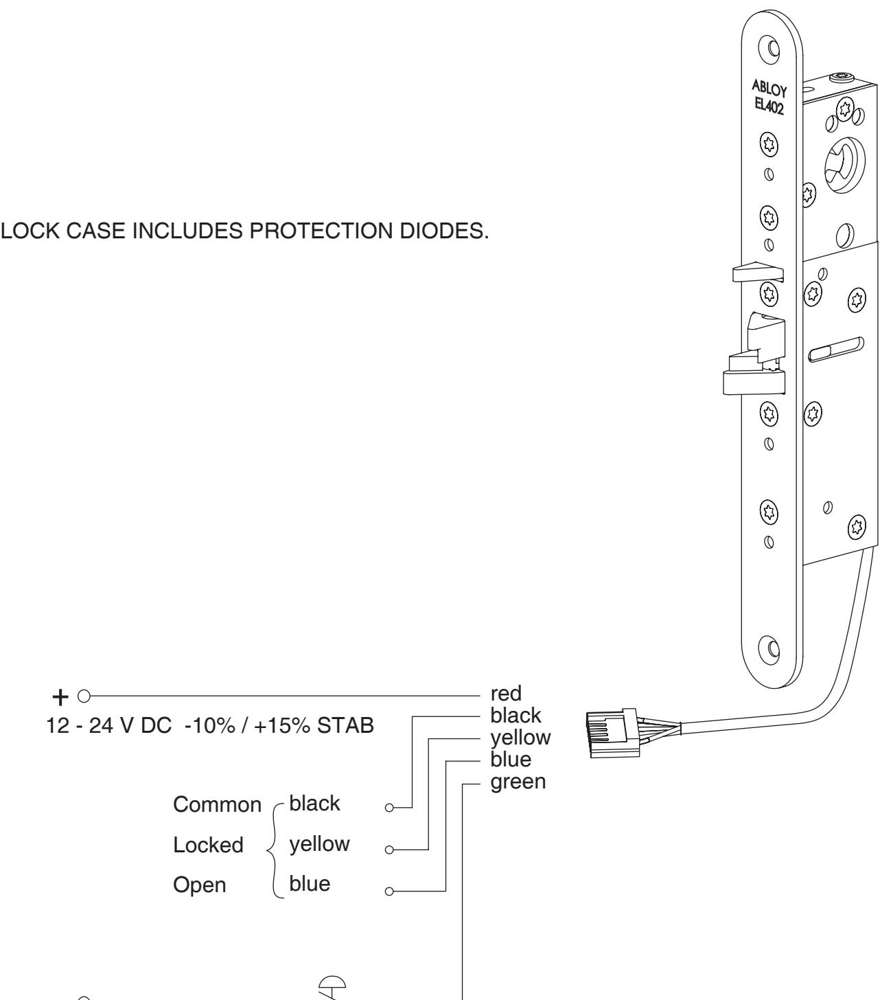

MAXIMUM VALUES FOR MICRO SWITCHES: max. 0.4 A 30 V AC / V DC resist. max. 10 W NO VALUES TO BE EXCEEDED.

### **ÒÅÕÍÈ×ÅÑÊÈÅ ÄÀÍÍÛÅ** ÏÎ ÐÓÑÑÊÈ

| Ðàáî÷åå íàïðÿæåíèå:                                                    | 12…24  ïîñò. -10% / +15% ñòàá.                                                                                |
|---------------------------------------------------------------------------|----------------------------------------------------------------------------------------------------------------------------------|
| Òîê:                                                                      | 12  Ìàêñ. 550 ìÀ Íîðì. 240 ìÀ                                                                              |
|                                                                           | 24  Ìàêñ. 270 ìÀ Íîðì. 110 ìÀ                                                                              |
| Ìèêðîïåðåêëþ÷àòåëü                                                        | ìàêñ. 0,4 À 30  ïåðåì./  ïîñò. ìàêñ. 10 Âàòò                                                     |
| Âíåøíÿÿ òåìïåðàòóðà:                                                   | -20° - +60°Ñ                                                                                                               |
| Âûõîä ðèãåëÿ:                                                          | 14,5 ìì                                                                                                                       |
| Ðàññòîÿíèå ìåæäó ñåðåäèíîé öèëèíäðà è ïåðåäíåé ïëàíêîé: | EL402: 25, 28, 30, 33, 35 ìì (ðåãóëèðóåòñÿ) EL502: 50 ìì                                           |
| Ïåðåäíÿÿ ïëàíêà:                                                       | EL402: 25 ìì EL502: 22 ìì                                                                                         |
| ßçû÷îê:                                                                   | Ñèììåòðè÷íûé                                                                                                                     |
| Ôóíêöèè, íàñòðàèâàåìûå â êîðïóñå çàìêà:                       | Ýëåêòðè÷åñêèå ôóíêöèè - çàêðûò áåç ïèòàíèÿ - îòêðûò áåç ïèòàíèÿ                                       |
| Èíäèêàöèÿ:                                                                | Çàïåðòîå ïîëîæåíèå ðèãåëÿ äâîéíîãî äåéñòâèÿ                                                                          |
| Äâåðíîé çàçîð:                                                         | 3 – 5 ìì (Ìåæäó ïåðåäíåé è çàïîðíîé ïëàíêîé)                                                             |
| Ñîåäèíèòåëüíûé êàáåëü:                                                 | EA211 (6 ì), EA221 (10 ì) 18 õ 0,14 ìì2                                                               |
| Çàïîðíàÿ ïëàíêà:                                                       | EL402: EA307, EA308, 4613, 4614 EL502: LP721, LP731 (ñ ôàëüöåì) LP711, LP714 (áåç ôàëüöà) |
|                                                                           |                                                                                                                                  |

Íåëüçÿ óñòàíàâëèâàòü â äâåðè ñ óïëîòíèòåëÿìè. **!**

Ðèãåëü è ÿçû÷îê íåîáõîäèìî ñìàçûâàòü ïðè óñòàíîâêå è ïî ìåðå íåîáõîäèìîñòè. **!**

Ýòîò çàìîê íå ïðåäíàçíà÷åí äëÿ èñïîëüçîâàíèÿ íà ïðîòèâîïîæàðíûõ äâåðÿõ. **!**

### **ÑÒÀÍÄÀÐÒÛ**

EN12209 Ìåõàíè÷åñêàÿ ïðî÷íîñòü

### СХЕМА СОЕДИНЕНИЙ EL402, EL502

ПО РУССКИ

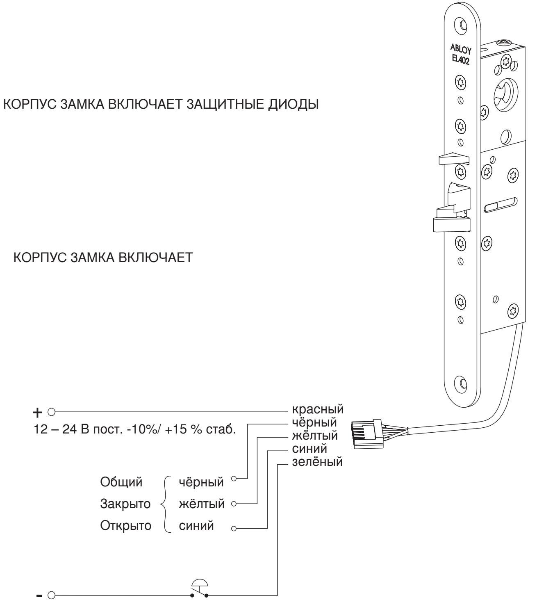

МАКСИМАЛЬНЫЕ ЗНАЧЕНИЯ ДЛЯ МИКРОПЕРЕКЛЮЧАТЕЛЕЙ: макс. 0,4 А 30 В перем. / В пост. резист. Макс. 10 Ватт.

НЕЛЬЗЯ ПРЕВЫШАТЬ НИ ОДНОГО ЗНАЧЕНИЯ.

### KARAETÄISYYDEN VAIHTAMINEN EL402 INSTÄLLNING AV DORNDJUP EL402 ADJUSTING BACKSET IN EL402 РЕГУЛИРОВКА РАССТОЯНИЯ ОТ ПЕРЕДНЕЙ ПЛАНКИ ДО СЕРЕДИНЫ ЦИЛИНДРА В EL402

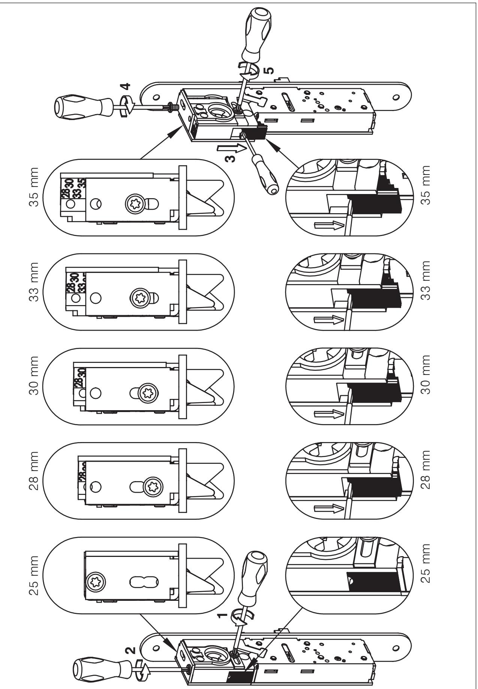

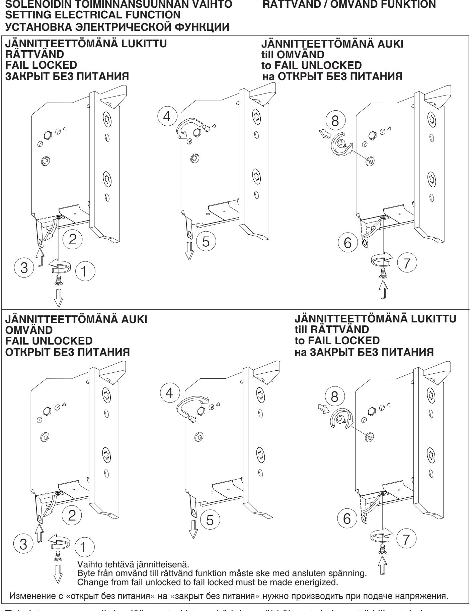

Toimintasuunnan vaihdon jälkeen tarkista sekä lukon sähköinen toiminta että kiilan toiminta. Funktionsprova efter ändring till önskad funktion.

After the change please check both the electrical function of the lock and trigger bolt function. Ïîñëå ñäåëàííîãî èçìåíåíèÿ, ïîæàëóéñòà, ïðîâåðüòå êàê ýëåêòðè÷åñêóþ ðàáîòó çàìêà, òàê è ðàáîòó îò ÿçû÷êà.

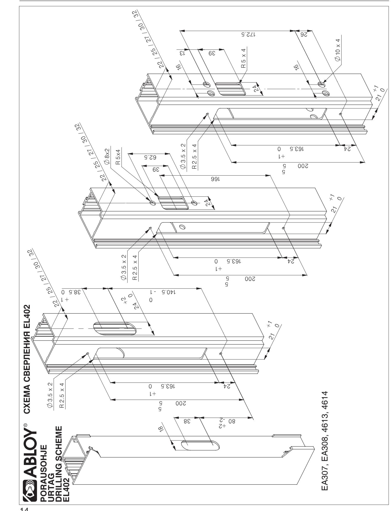

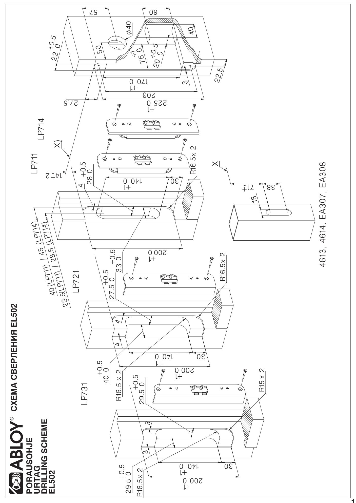

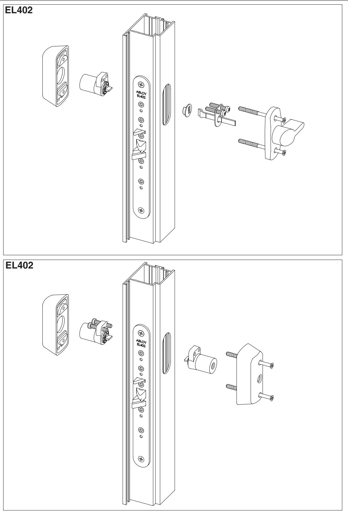

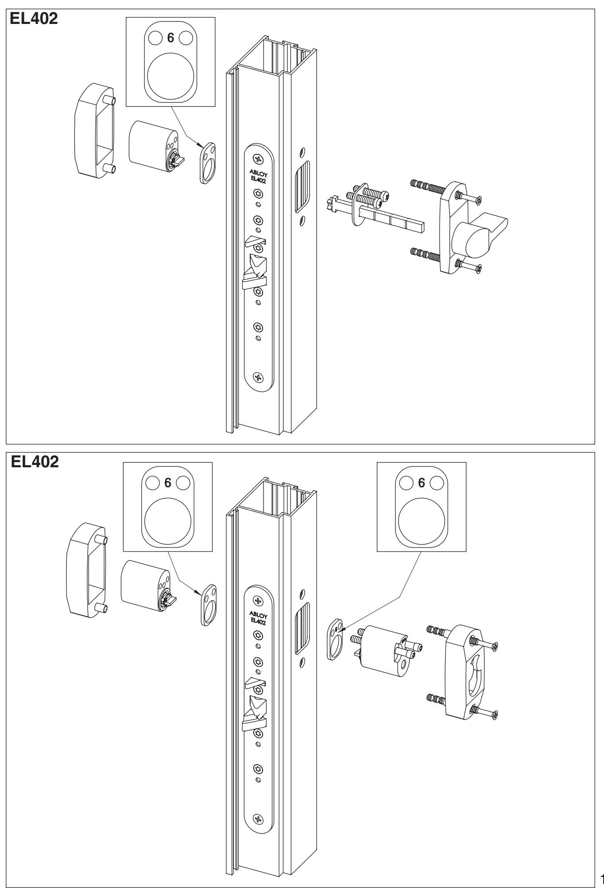

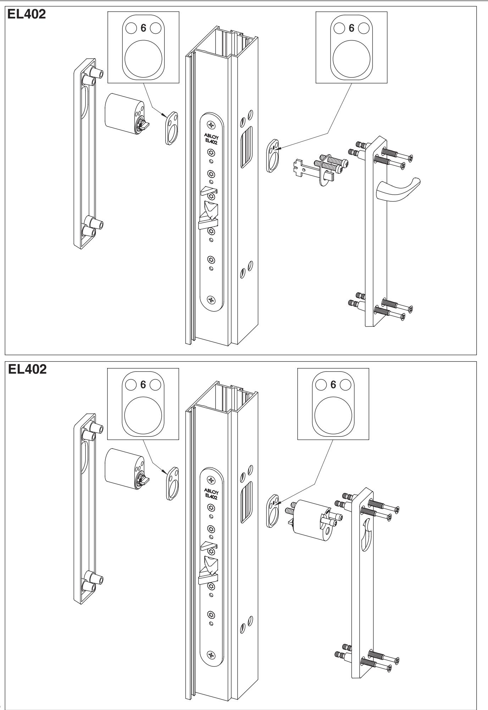

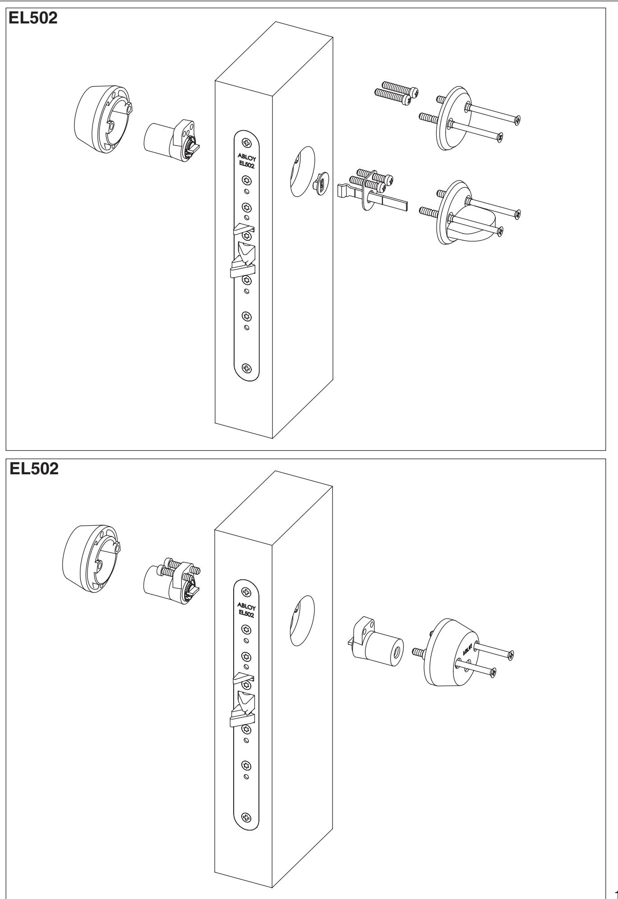

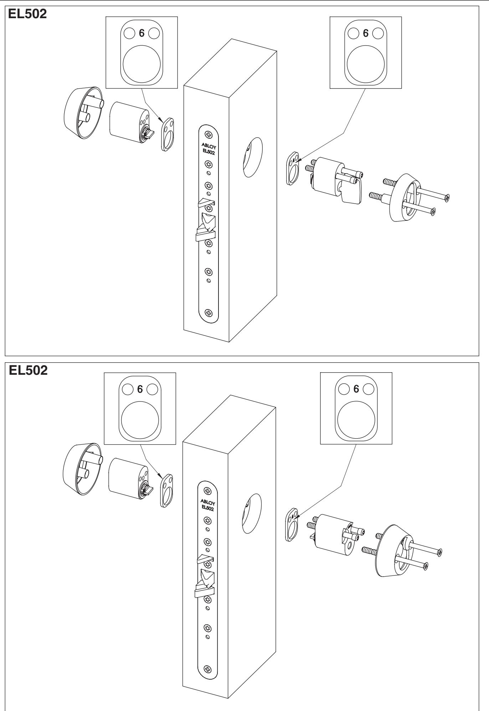

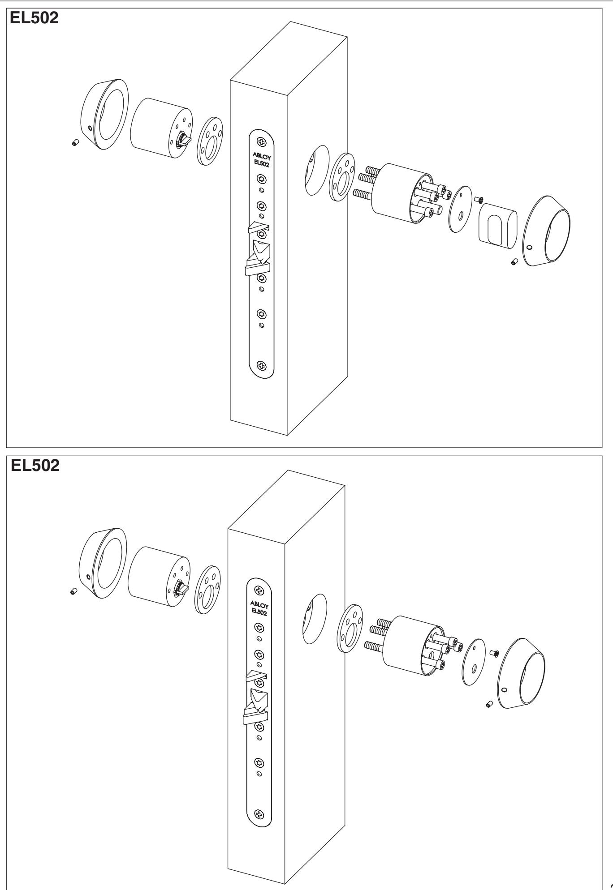

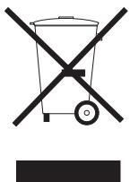

Tuote sisältää erilliskierrätystä vaativia materiaaleja mm. elektroniikkaa. Kun tuote poistetaan käytöstä, tuote on purettava osiin ja eri materiaalit on lajiteltava sekä kierrätettävä voimassa olevien kierrätysmääräysten mukaisesti.

Denna produkt innehåller material, bland annat elektronikkomponenter, som behöver specialåtervinning. När produkten avställs, demontera den och sortera och återvinn de olika material enligt den gällande återvinningsinstruktionen.

This product contains materials, such as electronics, which require specialist recycling techniques. When the product is taken out of use, disassemble it and sort and recycle the different materials as per valid recycling instructions.

Äàííîå èçäåëèå ñîäåðæèò ìàòåðèàëû, òàêèå êàê ýëåêòðîííûå êîìïîíåíòû, êîòîðûå òðåáóþò ñïåöèàëüíîé òåõíèêè óòèëèçàöèè. Êîãäà èçäåëèå ñíèìàåòñÿ ñ ýêñïëóàòàöèè, ðàçáåðèòå åãî è îòñîðòèðóéòå è ïåðåðàáîòàéòå ðàçëè÷íûå ìàòåðèàëû â ñîîòâåòñòâèè ñ äåéñòâóþùèìè èíñòðóêöèÿìè ïî èõ ïåðåðàáîòêå.

**Pidätämme oikeuden tehdä muutoksia tässä ohjeessa esitettyihin tuotteisiin.**

**Vi förbehåller oss rätten att vidareutveckla våra produkter utan föregående avisering.**

**We reserve the right to make alterations to the products described in this lealeft.**

**Ìû îñòàâëÿåì çà ñîáîé ïðàâî âíîñèòü èçìåíåíèÿ â èçäåëèå, îïèñàííûå â äàííîì ïðîñïåêòå.**

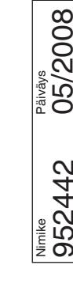

Abloy Oy Wahlforssinkatu 20 P.O.Box 108 FI-80101 JOENSUU FINLAND Tel. +358 20 599 2501 Fax +358 20 599 2209 **CERTIFIED** www.abloy.com **ORGANISATION**

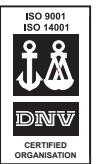

An ASSA ABLOY Group brand

Abloy Oy is one of the leading manufacturers of locks, locking systems and architectural hardware and the world's leading developer of products in the field of electromechanical locking technology. ASSA ABLOY is the global leader in door opening solutions, dedicated to satisfying end-user needs for security, safety and convenience.