# BABIOV®

# ABLOY® EL580 ja EL582

- Solenoidilukko
- Solenoidlås
- Magnetlås
- Solenoid Lock
- Соленоидный замок

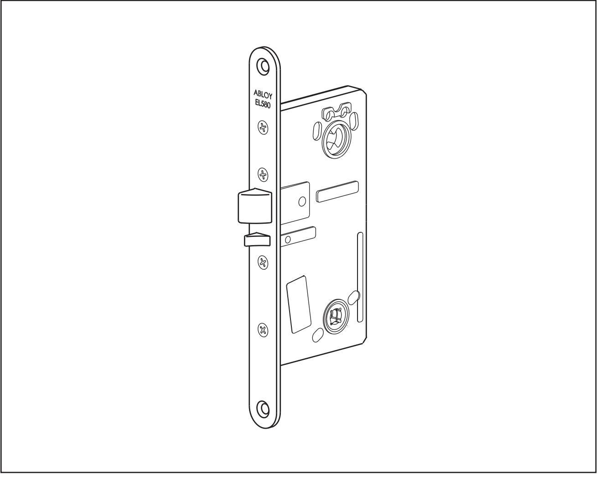

# EL580 / EL582

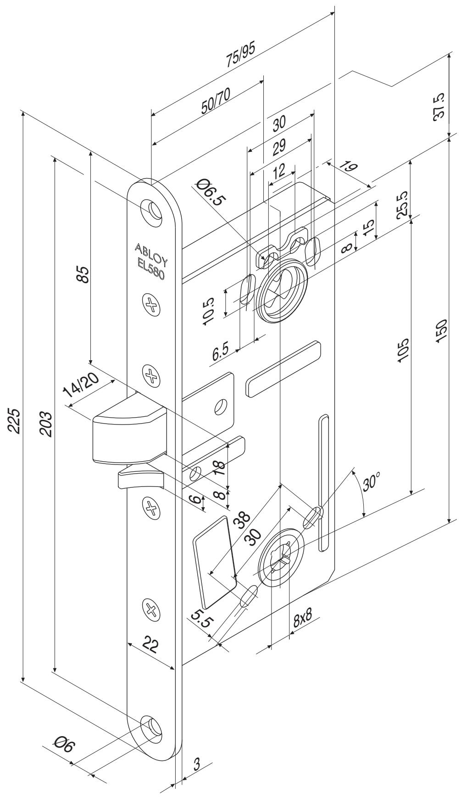

## Sisällysluettelo

## SUOMI

| TEKNISET TIEDOT                   |    |
|-----------------------------------|----|
| KYTKENTAKAAVIO                    |    |
| SOLENOIDIN TOIMINTASUUNNAN VAIHTO |    |
| KIILAN KATISYYDEN VAIHTO          |    |
| TELJEN KATISYYDEN VAIHTO          |    |
| TELJEN ULOSTULOPITUUDEN VAIHTO    |    |
| PAINIKKEEN OHJATUN PUOLEN VAIHTO  |    |
| PORAUSOHJE                        | 24 |
| ASENNUSOHJE .25-27             |    |

## Innehållsförteckning

# SVENSKA

| TEKNISK SPECIFIKATION                    |        |
|------------------------------------------|--------|
| KOPPLINGSSCHEMA                          |        |
| ANDRING AV SOLENOIDENS FUNKTIONSRIKTNING | . 1 () |
| ANDRING AV KILRIKTNINGEN                 | 10     |
| ANDRING AV KOLVRIKTNINGEN                | . 10   |
| ANDRING AV KOLVENS LOPBANA               | 11     |
| ANDRING AV TRYCKETS STYRSIDA             | 11     |
| BORRSCHEMA                               | 24     |
| MONTERINGSANVISNING                      | 25-27  |
|                                          |        |

## Indholdsfortegnelse

# DANSKA

| TEKNISK SPECIFIKATION                                     |        |
|-----------------------------------------------------------|--------|
| EL-DIAGRAM                                                | 13     |
| ÆNDRING AF ELEKTROMAGNETENS FUNKTION (Retvendt / Omvendt) |        |
| ÆNDRING AF SPÆRREFALLENS RETNING (H/V)                    |        |
| ÆNDRING AF FALLENS RETNING (H/V)                          |        |
| ÆNDRING AF FALLEFREMSPRING (14/20)mm                      | .15    |
| ÆNDRING AF DET AKTIVE GREBS ABNESIDE ( model 580 )        | 15     |
| BORESKABELON                                              | 24     |
| MONTERINGSVEJLEDNING                                      | .25-27 |
|                                                           |        |

## Contents

# ENGLISH

| TECHNICAL DATA                                     | 16  |
|----------------------------------------------------|-----|
| WIRING DIAGRAM                                     | 17  |
| CHANGING THE DIRECTION OF THE SOLENOID ACTION      | 18  |
| CHANGING THE OPENING DIRECTION OF THE TRIGGER BOLT |     |
| CHANGING THE OPENING DIRECTION OF THE LATCH BOLT   | .18 |
| CHANGING THE BOLT THROW                            | .19 |
| CHANGING THE CONTROLLED SIDE                       | 19  |
| DRILLING SCHEME                                    | 24  |
| INSTALLATION SCHEMATIC                             |     |

## Содержание

# НА РУССКОМ ЯЗЫКЕ

| ТЕХНИЧЕСКАЯ СПЕЦИФИКАЦИЯ               | .20 |
|----------------------------------------|-----|
| СХЕМА СОЕДИНЕНИЙ                       |     |
| ИЗМЕНЕНИЕ НАПРАВЛЕНИЯ ФУНКЦИОНИРОВАНИЯ |     |
| СОЛЕНОИДА                              | .22 |
| ИЗМЕНЕНИЕ СТРОННОСТИ ЯЗЫЧКА            |     |
| ИЗМЕНЕНИЕ СТОРОННОСТИ РИГЕЛЯ           |     |
| ИЗМЕНЕНИЕ ДЛИНЫ ВЫХОДА РИГЕЛЯ          |     |
| ИЗМЕНЕНИЕ СТОРОНЫ УПРАВЛЯЕМОЙ РУЧКИ    |     |
| ИНСТРУКЦИЯ ПО СВЕРЛЕНИЮ 24          |     |
| ИНСТРУКЦИЯ ПО МОНТАЖУ .25-27        |     |

## SUOMI

# TEKNISET TIEDOT

| Käyttöjännite:              | 12 (-10%) — 24 (+15 %) VDC STAB                                                                                               |  |  |
|-----------------------------|-------------------------------------------------------------------------------------------------------------------------------|--|--|
| Virta:                      | Max. 0,35 A ldle 0,12 A                                                                                                    |  |  |
| Mikrokytkin:                | Max. 0,4 A 30 VAC / VDC resist. 10 W                                                                                          |  |  |
| Käyttölämpötila:            | -20° - +60 °C                                                                                                                 |  |  |
| Teljen ulostulo:            | 14 mm / 20 mm                                                                                                                 |  |  |
| Karaetäisyys:               | 50 mm                                                                                                                         |  |  |
| Rintalevy:                  | 22 mm                                                                                                                         |  |  |
| Kara:                       | 08 mm                                                                                                                         |  |  |
| Lukkorungosta valittavissa: |                                                                                                                               |  |  |
|                             | Mekaaniset toiminnot -teljen ja kiilan kätisyydet -teljen ulostulo (14 mm / 20 mm) -ohjatun painikkeen puoli (EL580) |  |  |
|                             | Sähköinen toiminto -virta päällä -> ohjattu painike avaa lukon tai -virta päällä -> ohjattu painike ei avaa lukkoa   |  |  |
|                             | Aktiivipuolen painikkeesta lukko aina avattavissa (EL580)                                                                     |  |  |

 Indikointi: -teljen takalukituksen tilatieto
-painikekäytön tieto

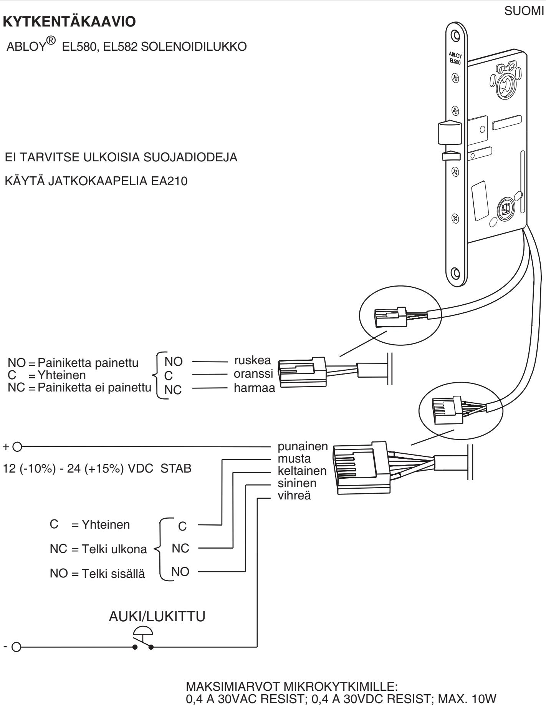

MITÄÄN ARVOJA EI SAA YLITTÄÄ.

## SUOMI

# SOLENOIDIN TOIMINTASUUNNAN VAIHTO

| Kuva A | 1.  Avaa vaihtimen kiinnitysruuvi ja vedä vaihdin ulos. 2.  Käännä vaihdin ympäri kuvan A osoittamalla tavalla. 3.  Aseta vaihdin takaisin paikalleen ja kiinnitä ruuvi. Varmista että vaihdin on suorassa ja lujasti kiinni lukkopesässä. |
|--------|-----------------------------------------------------------------------------------------------------------------------------------------------------------------------------------------------------------------------------------------------------|
| Kuva B | Kun vaihtimessa ja lukkopesässä olevat nuolikuviot ovat vastakkain kuvan B osoitaamalla tavalla, lukon painiketoiminto on seuraava: - virta päällä -> ohjattu painike avaa lukon - virta ei ole päällä -> ohjattu painike ei avaa lukkoa   |
| Kuva C | Kun nuolikuviot eivät ole vastakkain, lukon painiketoiminto on seuraava: - virta näällä -> ohjattu nainika oi avaa lukkoa                                                                                                                        |

- Virta paalla -> onjattu painike ei avaa lukkoa - virta ei ole päällä -> ohjattu painike avaa lukon
# KIILAN KÄTISYYDEN VAIHTO

### Kuva D 1. Löysää kiilapalan kiinnitysruuvi.

- 2. Vedä kiilapala ulos ja käännä ympäri.
- 3. Aseta kiilapala takaisin paikoilleen.
- 4. Kiristä kiinnitysruuvi.

# TELJEN KÄTISYYDEN VAIHTO

### Kuva D 5. Paina telki sisään.

- 6. Irrota telkipalan kiinnitysruuvi.
- 7. Vedä telkipala ulos ja käännä ympäri.
- Kuva E Telkipalan kiinnittäminen 14 mm ulostulo-asentoon:
	- 1. Aseta telkipala paikoilleen ja paina se lukkorungon sisään.

2. Kiinnitä ja kiristä telkipalan kiinnitysruuvi. Ruuvi kiinnitetään eri puolelle kuin avattaessa.

- Kuva F Telkipalan kiinnittäminen 20 mm ulostulo-asentoon:
1. Aseta telkipala paikoilleen ja paina se lukkorungon sisään. Paina painikkeella lukkorungon mekanismi "avaus"-asentoon. Tällöin 2. teljen runko vetäytyy täysin taakse ja teljen rungossa olevista kahdesta vajotuksesta ulompi asettuu telkipalan kiinnitysruuvin kohdalle. 3. Kiinnitä ja kiristä telkipalan kiinnitysruuvi. Ruuvi kiinnitetään eri puolelle kuin avattaessa. Tarkista teljen toiminta.

# TELJEN ULOSTULOPITUUDEN VAIHTO

Kuva G 20 mm teljen ulostulon vaihtaminen 14 mm ulostuloon:

- 1. Paina telki sisään.
- 2. Löysää telkipalan kiinnitysruuvia ...
- 3. ...kunnes lukkorungon sisältä kuuluu "click".
- 4. Kiristä kiinnitysruuvi ja tarkista teljen toiminta.

### Kuva H 14 mm teljen ulostulon vaihtaminen 20 mm ulostuloon:

- 1. Paina telki sisään.
- 2. Löysää telkipalan kiinnitysruuvi.

3. Paina painikkeella lukkorungon mekanismi "auki"-asentoon, jolloin teljen runko vetäytyy täysin taakse ja siinä olevista kahdesta lukitusvajotuksesta ulompi asettuu telkipalan kiinnitysruuvin reiän kohdalle.

- 4. Kiristä kiinnitysruuvi ja tarkista teljen toiminta.
# PAINIKKEEN OHJATUN PUOLEN VALINTA

- Kuva I 1. Asenna holkki karan reikään lukon sille puolelle, jonka haluat ohjatuksi. 2. Asenna messinkitulppa kuvan mukaisesti lukkorunkoon, oven ulkosivun puolelle.
### llman holkkia painikkeen kara painuu liian syvälle ja lukko avautuu ohjauksesta huolimatta!

Kuva J Jaetun karan asennus.

- 
Lukon EL580 (jaettu kara) kanssa EI VOIDA käyttää karaan kiinnitettävää painikemallia (esim. Primo /002 kilpisarjan painikkeet).

Lukkorungon kanssa suositellaan käytettävän palautusjousella varustettuja painikkeita.

SUOMI

# 23 Al

## SVENSKA

# TEKNISK SPECIFIKATION

*

| Driftspänning:        | 12 (-10%) - 24 (+15%) VDC STAB                                                                                                 |  |  |  |
|-----------------------|--------------------------------------------------------------------------------------------------------------------------------|--|--|--|
| Ström:                | Max 0.35 A Tomgång 0,12 A                                                                                                   |  |  |  |
| Mikrobrytare:         | Max 0,4 A 30 VAC/VDC resist, 10 W                                                                                              |  |  |  |
| Drifttemperatur:      | -20° - +60 °C                                                                                                                  |  |  |  |
| Fallkolvens utsprång: | 14 mm eller 20 mm                                                                                                              |  |  |  |
| Dornavstånd:          | 50 mm 70 mm                                                                                                                 |  |  |  |
| Stolpe:               | 22 mm                                                                                                                          |  |  |  |
| Tryckespinne:         | 08 mm                                                                                                                          |  |  |  |
| Ställbara funktioner: |                                                                                                                                |  |  |  |
|                       | Mekanisk funktion -höger / vänsterhängd -fallkolvutsprång (14 mm / 20 mm)* -mekaniskt / elektriskt styrd sida (EL580) |  |  |  |
|                       | Elektrisk funktion -rättvänd / omvänd funktion                                                                              |  |  |  |
|                       | Låset kan alltid öppnas med den mekaniskt styrda sidans trycke (EL580).                                                     |  |  |  |
| Indikeringar:         | -förregling (stängd / öppen dörr) -trycke (vila / rörelse)                                                                  |  |  |  |
|                       |                                                                                                                                |  |  |  |
|                       |                                                                                                                                |  |  |  |

VIKTIGT: EL580 / EL582 i brandcellsgräns För att säkerställa låsets brandigenhållande funktion, SKALL fallkolvens utsprång ställas i 14 mm förreglat
läge vid montage i brandcellsgräns (se sidan 11 Bild G). Gäller i Sverige

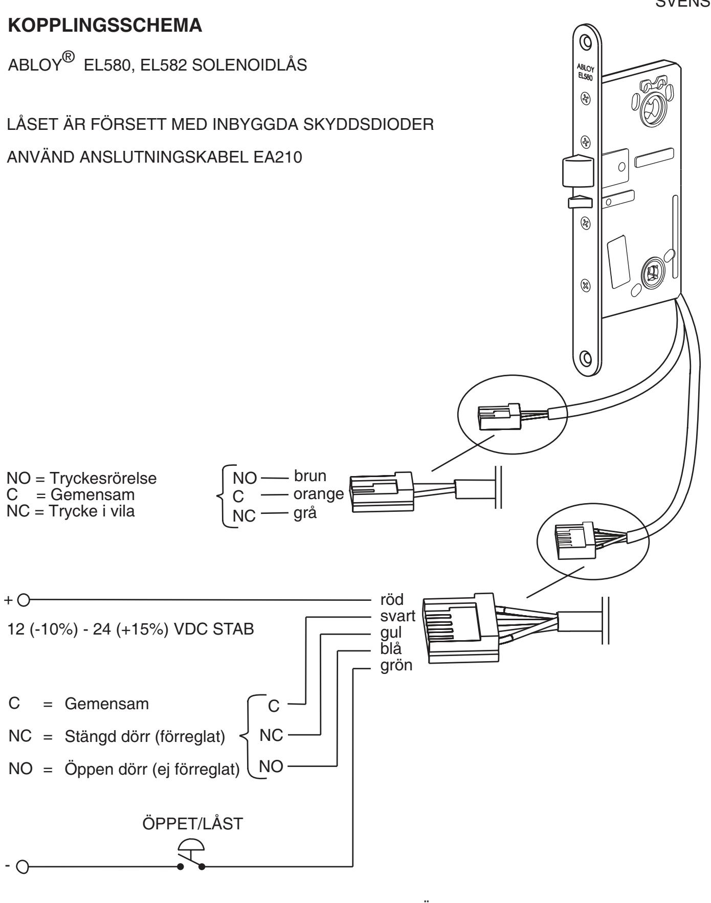

MAXBELASTNING FÖR MIKROBRYTARE: 0,4 A 30VAC RESIST; 0,4 A 30VDC RESIST; MAX. 10W INGA VÄRDEN FÅR ÖVERSKRIDAS.

### SVENSKA

## %\$

### **;*!
-
&#
 ; ! <="!**

| (3  | &I79;9@4:5=9I<@I94 %9=@I94U@I9@JAS=4@I9 SI;I@I9484;I<:5=9I<679;9@4                |
|-----|----------------------------------------------------------------------------------------------|
| (3( | 9KI94IK;I9A@I9I4=9I?2=2B5I969@4=74;4 -98A-L;9;99:;8KK4I96 -98A7964-L;9;99:;8KK4I946    |
| (3' | 9KI94IK;I97964@I9I4=9I?2=.B5I969@4=74;4 -98A-L;9;99:;8KK4I946 -98A7964-L;9;99:;8KK4I96 |

### **;*!&>;;*-*
&--\$>*;<=! 
 ;**

- &I79;9@4
- 9I<7899<4<7I4:5@4==4
- ;D47899<4<7I4<4
- 9I<679;9@4

### **;*!&---!\$>*;<=! 
 ;7**

| (3 |  | 9:;47I;@4 |
|----|--|-----------|
|    |  |           |

- &I79;9@4
	- 9I<7I;@4:5@4==4
- **(3** 444<I@7I;@4K964<AAT
	- ;D47I;@4<4

 9I<679;9@4<4?79;9@4A49I7964I4=9I =I4I@65497I;@4@4=B499II7I;@4 74<9I9K69

- **(3&** 444<I@7I;@4K964<AAT
;D47I;@4<4 \$4@4=9:;789I=9I4;@IAA4J569:;4=9:;J =9I@=@6789=DK44<I94I5IA4I9A78979;9@4 9I<679;9@4<4?79;9@4A49I7964I4=9I =I4I@65497I;@4@4=B 499II7I;@474<9I9K69

- TI4A9;44<I4<64=A4I<S9I4=:=I4==899K6=I49
SVENSKA

# ÄNDRING AV FALLKOLVENS UTSPRÅNG*

Bild G Andring av fallkolvens utsprång från 20mm till 14mm*

- 1. Tryck in fallkolven.
- 2. Lossa fixerskruven ..
- 3. .....tills det hörs ett "klick"
- 4. Drag åt fixerskruven igen.

Kontrollera att fallkolven fungerar på rätt sätt.

### Bild H Ändring av fallkolvens utsprång från 20mm till 14mm*

- 1. Tryck in fallkolven.
- 2. Lossa fixerskruven.

3. Använd trycket för att dra in kolvstammen, håll trycket nedtryckt, det yttre av de två fördjupningarna hamnar mitt för fixerskruven. 3. Drag åt fixerskruven igen. Kontrollera att fallkolven fungerar på rätt sätt.

# ÄNDRING AV MEKANISKT / ELEKTRISKT STYRD SIDA

- 1. Tryck in fyrkantmuttern från utsidan (elektriskt styrd sida) (EL580). Bild I 2. Tryck fast mässingspluggen på låskistans utsida enligt bild I.
## Fyrkantmuttern behövs för att den elektriskt styrda sidan skall fungera på rätt sätt!

- Installation av delad tryckespinne (EL580). Bild J Endast spetsen på den första insexskruven skall titta ut ur fyrkantmuttern. Den andra insexskruven skall inte dras åt hårt utan bara ligga an mot den första skruven, om problem uppstår säkra med loctite eller liknande gänglåsning.
- 

Returfjädertrycken rekommenderas.

EL580 med delad tryckespinne kan inte monteras med trycken som fästs i tryckespinnen (T.ex. ABLOY /002 - serie).

- * VIKTIGT EL580 / EL582 i brandcellsgräns För att säkerställa låsets brandigenhållande funktion, SKALL fallkolvens utsprång ställas i 14 mm förreglat läge vid montage i brandcellsgräns (se sidan 11 Bild G). Gäller i Sverige
## DANSKA

# TEKNISK SPECIFIKATION

| Driftsspænding:                   | 12 (-10%) - 24 (+15%) VDC STAB                                                                                               |  |  |  |  |
|-----------------------------------|------------------------------------------------------------------------------------------------------------------------------|--|--|--|--|
| Strømforbrug:                     | Ved indkobling maks. 0.35 A Ved kontinuerlig drift. 0.12 A                                                          |  |  |  |  |
| Mikrokontakt:                     | Max 0,4 A 30 VAC/VDC resist, 10 W ohmsk belastning                                                                           |  |  |  |  |
| Temperaturområde: - 20° - +60 °C  |                                                                                                                              |  |  |  |  |
| Fallefremspring:                  | 14 mm / 20 mm                                                                                                                |  |  |  |  |
| Dornmål:                          | 50 mm ( standard ) 70 mm ( bestillingsvare )                                                                              |  |  |  |  |
| Stolpe:                           | 22 mm                                                                                                                        |  |  |  |  |
| Dorn:                             | 08 mm                                                                                                                        |  |  |  |  |
| Funktionsmuligheder i låsekassen: |                                                                                                                              |  |  |  |  |
|                                   | Mekaniske funktioner -Falleretning (H/V) og fallefremspring (14 / 20 mm) -Ændring af den aktive håndgrebsside (EL 580) |  |  |  |  |

Elektrisk funktion

-strømmen er på = retvendt funktion – låsen åbner -strømmen er på = omvendt funktion - låsen åbner ikke

## Låsen kan altid åbnes med den aktive sides greb (EL 580)

- Indikeringer: -information om fallens position -når dørgrebet trykkes ned
# EL-DIAGRAM

### DANSKA

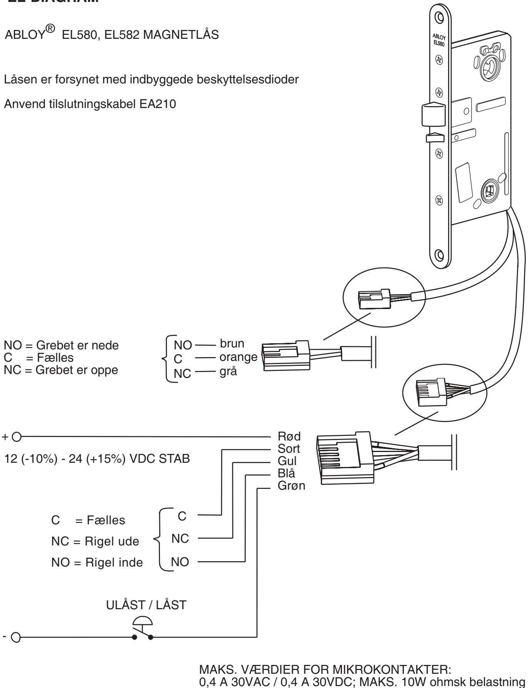

INGEN VÆRDIER MÅ OVERSKRIDES.

## DANSKA

# ÆNDRING AF ELMAGNETENS VIRKNING, RETVENDT ELLER OMVENDT FUNKTION

- Billede A 1. Fjern cylinderskruen og træk akselholderen ud. 2. Drej akselholderen som vist på billedet. 3. Sæt akselholderen på plads igen og skru skruen i. Sørg for at akselholderen er lige og korrekt placeret i låsekassen.
- Billede B Når pilene på akselholderen og låsekassen står som vist på billede B, er låsen i retvendt funktion:
	- Tændt for strømmen -> det udvendige greb åbner
	- Slukket for strømmen -> Det udvendige greb åbner ikke
- Billede C Når pilene ikke befinder sig lige over for hinanden, er låsen i omvendt funktion: - Tændt for strømmen -> det udvendige greb åbner ikke
	- Slukket for strømmen -> det udvendige greb åbner

## ÆNDRING AF SPÆRREFALLENS RETNING

- Billede D 1. Løsn umbracoskruen gennem siden af låsen.
	- 2. Træk spærrefallen og vend den om.
	- 3. Sæt spærrefallen på plads igen.
	- 4. Stram skruen.

# ÆNDRING AF FALLENS RETNING

- 5. Tryk fallen ind. Billede D
	- 6. Løsn umbracoskruen gennem siden af låsen.
	- 7. Træk fallen ud og vend den om.
- Billede E Indstilling af fallefremspring til 14 mm:

1. Læg fallen på plads og skub den ind i låsekassen. 2. Stram skruen. Skruen anbringes på den anden side af låsen, da fallen er vendt om.

- Billede F Indstilling af fallefremspring til 20 mm:
1. Læg fallen på plads og skub den ind i låsekassen. 2. Tryk grebet ned og hold det nede. Fallen bliver trukket ind og de to huller på fallen befinder sig midt for cylinderskruen. 3. Stram cylinderskruen. Skruen anbringes på den anden side af låsen, da fallen er vendt om. Kontrollér at fallen fungerer korrekt.

# ÆNDRING AF FALLEFREMSPRING

Billede G Ændring af fallefremspring fra 20 mm til 14 mm:

- 1. Tryk fallen ind i låsekassen.
- 2. Løsn cylinderskruen ...
- 3. .. til du hører et "klik".
- 4. Stram cvlinderskruen og kontrollér at fallen fungerer korrekt.
- Ændring af fallefremspring fra 14 til 20 mm: Billede H
	- 1. Tryk fallen ind i låsekassen2. Løsn cylinderskruen.
	- 3. Tryk grebet ned for at åbne låsekassemekanismen. Hold grebet nede.
	- 4. Stram cylinderskruen i yderste fordybning af falledrevet, og kontrollér
	- at fallen fungerer korrekt.

# ÆNDRING AF GREBETS FUNKTION

- Billede l 1. Anbring medbringeren i fallerøret, på den side af låsen, som du ønsker at kontrollere.
2. Montér messingproppen på ydersiden af låsekassen, som vist på tegningen.

Hvis medbringeren ikke er isat, vil dørgrebspinden blive presset for meget ind, og låsen vil åbne uanset hvilken funktion der er valgt!

Billede J Installation af todelt dørgrebspind.

EL580 Låsen med delt fallerør kan IKKE monteres med greb med gennem gående dorn, eller greb hvor grebet sidder fast på dornen. ( 408 eks.) Det SKAL være greb på rosetter.

Det anbefales at bruge dørgreb med returfjeder til denne låsekasse.

## ENGLISH

# TECHNICAL DATA

| Operating voltage:   | 12 (-10%) - 24 (+15%) VDC STAB     |
|----------------------|------------------------------------|
| Current:             | Max. 0.35 A ldel 0.12 A         |
| Micro switch:        | Max. 0.4 A 30 VAC/VDC resist, 10 W |
| Ambient temperature: | -20° - +60° C                      |
| Bolt throw:          | 14 mm / 20 mm                      |
| Backset:             | 50 mm 70 mm                     |
| Forend:              | 22 mm                              |
| Spindle:             | 08 mm                              |

Functions selected on the lock case:

Mechanical functions -opening directions of trigger bolt and latch bolt -bolt throw (14 mm / 20 mm) -controlled side (EL580)

Electrical function -power on -> controlled handle opens the lock or -power on -> controlled handle does not open the lock

### The lock can always be opened with the handle on the active side (EL580).

- Indications: -deadlock status of latch bolt -indication of handle operation
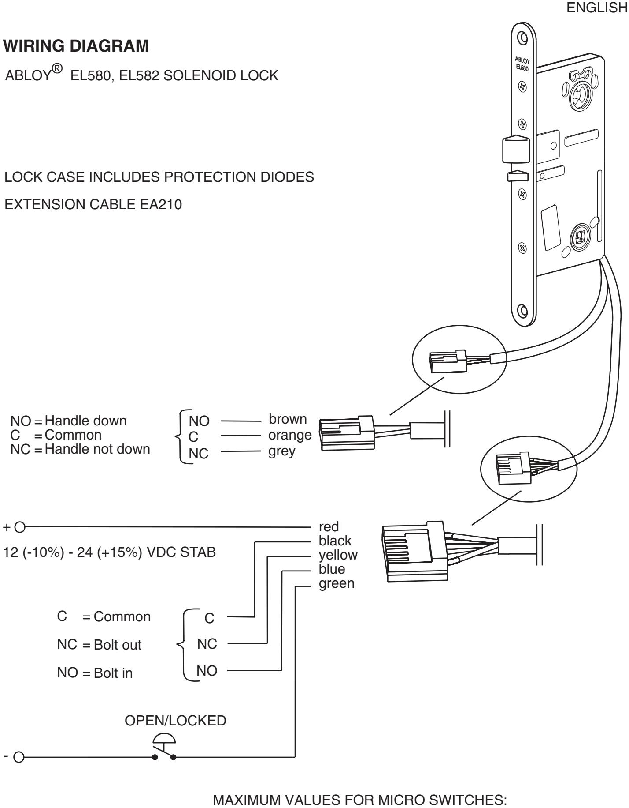

0,4 A 30VAC RESIST; 0,4 A 30VDC RESIST; MAX. 10W

NO VALUE SHOULD BE EXCEEDED.

## ENGLISH

# CHANGING THE DIRECTION OF THE SOLENOID ACTION FAIL LOCKED > FAIL UNLOCKED

1. Unscrew the fixing screw and pull out the changer. Fig. A 2. Turn the changer round as shown in the figure A. 3. Put the changer back and screw in the fixing screw. Make sure the changer is straight and fits tightly in the lock case.

- When the arrows on the changer and on the lock case are positioned Fig. B as shown in figure B, the lock is set on fail locked mode:
	- power on -> the controlled handle will open the lock
	- power off -> the controlled handle will not open the lock
- When the arrows on the changer and on the lock case are positioned Fig. C as shown in figure C, the lock is set on fail unlocked mode:
	- power on -> the controlled handle will not open the lock
	- power off ->, the controlled handle will open the lock

## CHANGING THE OPENING DIRECTION OF THE TRIGGER BOLT

- Fig. D 1. Loosen the fixing screw of the trigger bolt.
	- 2. Pull the trigger bolt out and turn it round.
		- 3. Put the trigger bolt back to place.
		- 4. Tighten the fixing screw.

# CHANGING THE OPENING DIRECTION OF THE LATCH BOLT

- Fig. D 5. Push the bolt in.
	- 6. Unscrew the fixing screw of the bolt head.
	- 7. Pull the bolt head out and turn it round.
- Fig. E Fastening the bolt at 14 mm position:

1. Put the bolt head in place and push it in the lock case. 2. Insert the fixing screw to the opposite side of where it was before and tighten it.

- Fig. F Fastening the bolt at 20 mm position:
	- 1. Put the bolt head in place and push it in the lock case.

2. Press the handle to open the lock case mechanism. The body of the bolt is withdrawn completely to the back and the outer of the two holes in the body will be located at the hole of the bolt head's fixing screw.

3. Insert the fixing screw to the opposite side of where it was before and tighten it. Check the function of the bolt.

ENGLISH

# CHANGING THE BOLT THROW

- Fig. G Bolt throw change from 20 mm to 14 mm:
	- 1. Push the bolt into the lock case.
	- 2. Loosen the fixing screw of the bolt head ...
	- 3. ... until you hear a "click" inside the lock case.
	- 4. Tighten the fixing screw and check the function of the bolt.
- Fig. H Bolt throw change from 14 mm to 20 mm:
	- 1. Push the bolt into the lock case.
	- 2. Loosen the fixing screw of the bolt head.

3. Press the handle to open the lock case mechanism. The body of the bolt is withdrawn completely to the back and the outer of the holes in the body will be located at the hole of the bolt head's fixing screw. 4. Tighten the fixing screw, and check the function of the bolt.

# SELECTION OF THE CONTROLLED SIDE

- 1. Install the sleeve inside the spindle of handle on that side of the lock that you Fig. I want to be controlled. 2. Install the brass plug on the outside of the lock case as shown in the picture.
## If the sleeve is not inserted, the spindle will be pressed in too deep and the lock will open regardless of the control function!

Installation of split spindle. Fig. J

The lock EL580 (splt spindle) cannot be used with a handle attached to the spindle (e.g. ABLOY /002 handle series).

The lock case is recommended to be used with a handle with return spring.

# НА РУССКОМ ЯЗЫКЕ

# ТЕХНИЧЕСКАЯ СПЕЦИФИКАЦИЯ

| Рабочее напряжение:                                           | 12 (-10%) - 24 (+15 %) VDC STAB                                                                                                         |
|---------------------------------------------------------------|-----------------------------------------------------------------------------------------------------------------------------------------|
| Ток:                                                          | макс. 0,35 А реактивный 0,12 А                                                                                                       |
| Микропереключатель:                                           | макс. 0,4 А 30 В переменного / В постоянного резист. 10 Вт                                                                              |
| Рабочая температура:                                          | -20° - +60 °C                                                                                                                           |
| Выход ригеля:                                                 | 14 мм / 20 мм                                                                                                                           |
| Расстояние от перед- ней планки до сере- дины шпинделя: | 50 мм 70 мм                                                                                                                          |
| Передняя планка:                                              | 22 мм                                                                                                                                   |
| Шпиндель:                                                     | 08 мм                                                                                                                                   |
| В корпусе замка можно выбрать:                                |                                                                                                                                         |
|                                                               | Механические режимы -сторонность ригеля и язычка -выход ригеля (14 мм / 20 мм) -сторону управляемой ручки (EL580)              |
| или                                                           | Электрический режим -питание включено -> управляемая ручка открывает замок -питание включено -> управляемая ручка не открывает |
|                                                               | замка                                                                                                                                   |
|                                                               | Ручкой с активной стороны замок можно всегда открывать (EL580)                                                                       |
| Индикация:                                                    | - о блокировке ригеля - об использовании ручки                                                                                       |

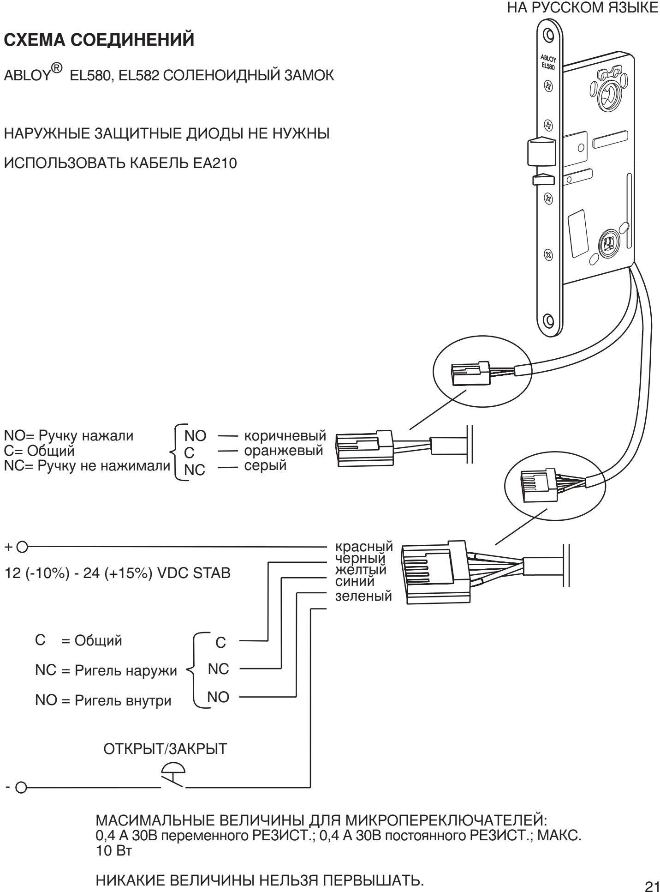

## НА РУССКОМ ЯЗЫКЕ

# ИЗМЕНЕНИЕ НАПРАВЛЕНИЯ ФУНКЦИОНИРОВАНИЯ СОЛЕНОИДА

- 1. Отвинчить крепежный винт переключателя и вынуть переключатель. Рисунок А 2. Повернуть переключатель кругом согласно рисунку.
3. Вставить переключатель на место и затянуть винт. Убедиться в том, что переключатель в прямом положении и прочно в гнезде замка.

- Рисунок В При нахождении стрелок переключателя и гнезда замка в положении согласно рисунку, функционирование замка от ручки следующее:
	- питание включено -> управляемая ручка открывает замок
	- питание отключено -> управляемая ручка не открывает замка
- Когда стрелки не друг к другу, функционирование замка от ручки Рисунок С следующее:
	- питание включено -> управляемая ручка не открывает замка
	- питание отключено -> управляемая ручка открывает замок

# ИЗМЕНЕНИЕ СТОРОННОСТИ ЯЗЫЧКА

- Рисунок D
	- 1. Отвинчить крепежный винт язычка. 2. Вынуть язычок и повернуть кругом.
		- 3. Вставить язычок на свое место.
		- 4. Затянуть крепежный винт.

# ИЗМЕНЕНИЕ СТОРОННОСТИ РИГЕЛЯ

- Рисунок D 5. Нажать ригель внутрь.
	- 6. Отвинчить крепежный винт ригеля.
	- 7. Вынуть ригель и повернуть кругом.
- Рисунок Е Крепеление ригеля в положение выхода на 14 мм:
	- 1. Вставить ригель на свое место и нажать его внутрь корпуса.

2. Прикрепить и затянуть крепежный винт ригеля. Винт прикрепить не с той стороны как он был при до отвинчивания.

- Рисунок F Крепеление ригеля в положение выхода на 20 мм:
1. Вставить ригель на свое место и нажать его внутрь корпуса. 2. Нажать ручку так, что механизм корпуса замка будет в положении "открывание". Тогда корпус ригеля убирется полностью назад и более наружный из двух пазов на ригеле расположится у крепежного винта. 3. Прикрепить и затянуть крепежный винт ригеля. Винт прикрепить не с той стороны, как он был при до отвинчивания. Проверить работу ригеля.

## НА РУССКОМ ЯЗЫКЕ

# ИЗМЕНЕНИЕ ДЛИНЫ ВЫХОДА РИГЕЛЯ

Рисунок G Изменение выхода ригеля от 20 мм на 14 мм:

- 1. Нажать ригель внутрь.
- 2. Отвинчивать крепежный винт ригеля ...
- 3. ...до того, когда внутри корпуса слышится "клик"
- 4. Затянуть крепежный винт и проверить работу ригеля.

Рисунок Н Изменение выхода ригеля от 14 мм на 20 мм:

- 1. Нажать ригель внутрь.
- 2. Отвинчивать крепежный винт ригеля.

3. Нажать ручку так, что механизм корпуса замка будет в положении "открывание". Тогда корпус ригеля убирется полностью назад и более наружный из двух пазов на ригеле расположится у отверстия крепежного винта.

4. Затянуть крепежный винт и проверить работу ригеля.

# ИЗМЕНЕНИЕ УПРАВЛЯЕМОЙ СТОРОНЫ РУЧКИ

Рисунок I 1. Вставить втулку в отверстие шпинделя с той стороны замка, которую хотите определить управляемой. 2. Согласно рисунку установить латунную втулку в корпус замка, с наружной стороны двери.

### Без втулки шпиндель ручки вставится слишком глубоко и замок открывается, несмотря на управление!

Рисунок J Установка шпинделя из двух частей.

Замком ЕЛ 580 (со шпинделем из двух частей) нельзя использовать ручку, прикрепляемую к шпинделю (например, серия ручек ABLOY/002).

С корпусом замка рекомендуется использовать ручки с пружиной возврата.

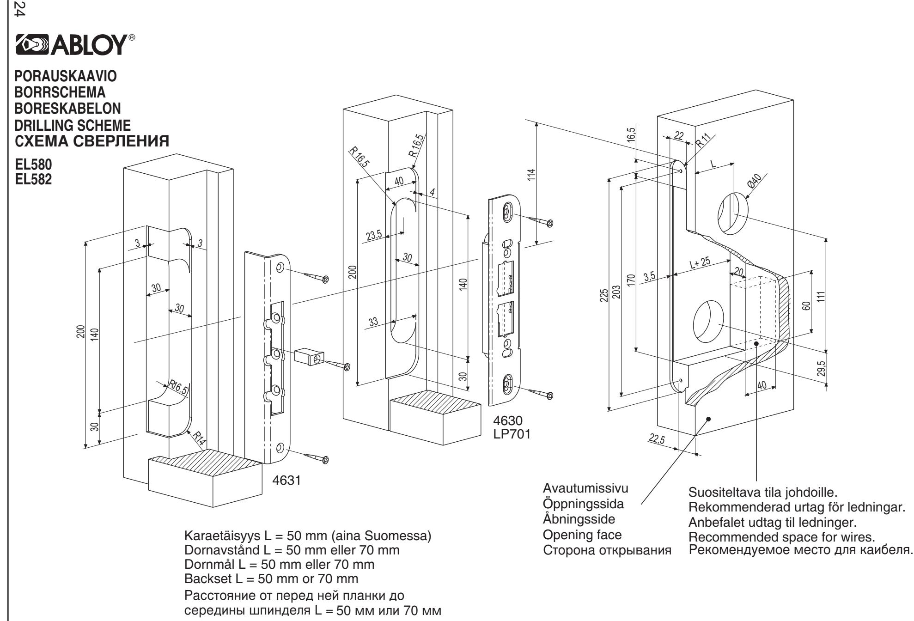

OTSA @

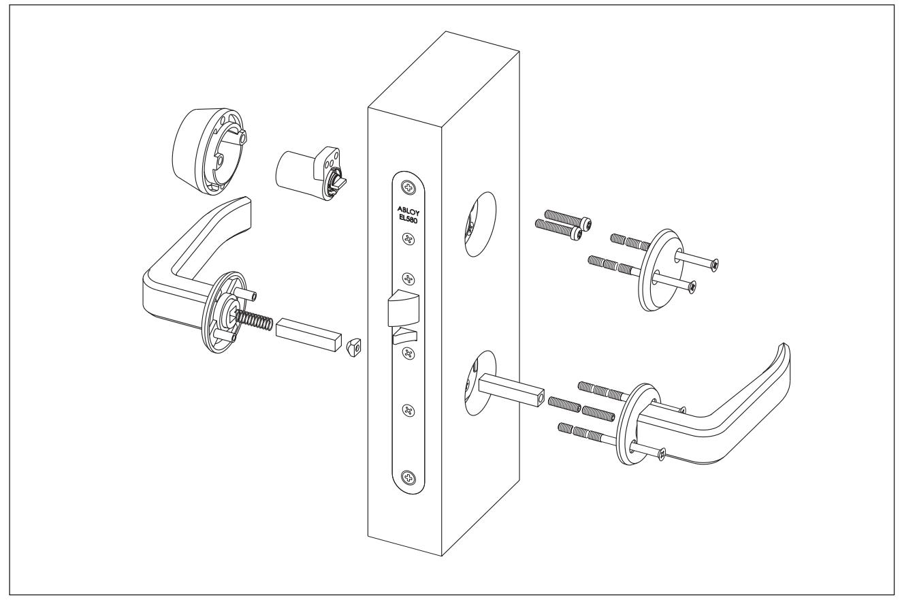

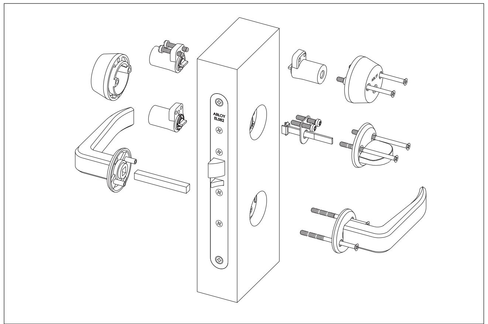

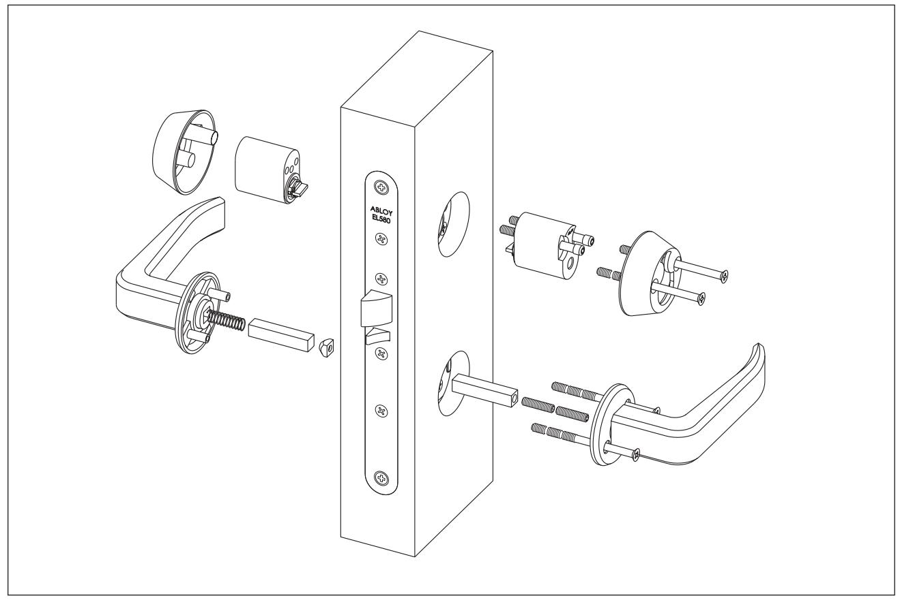

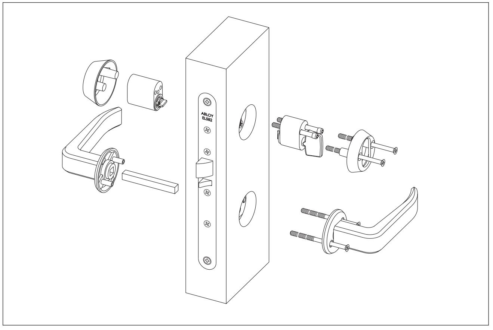

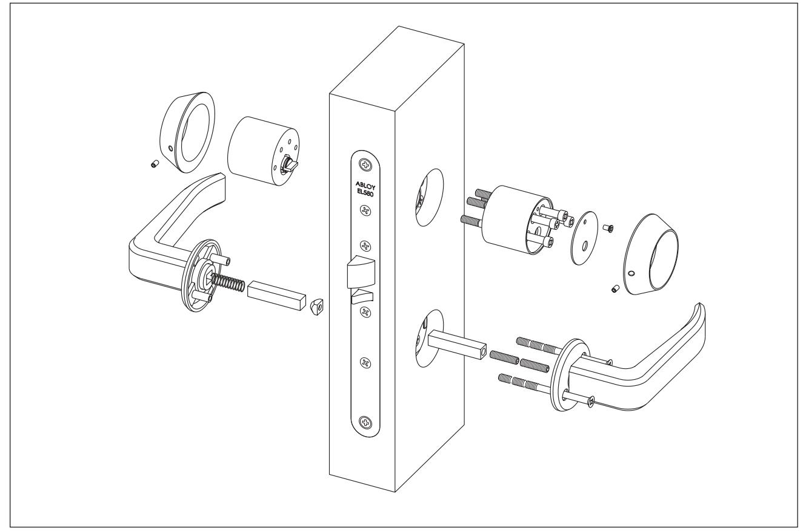

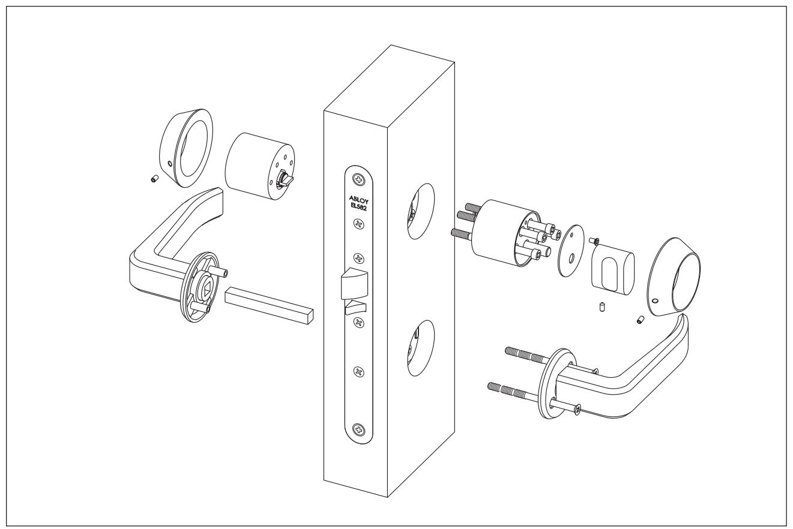

Tuote sisältää erilliskeräystä vaativia materiaaleja mm. elektroniikkaa.

Denna produkt innehåller material som behöver specialåtervinning i.e. elektronikkomponenter.

Dette produkt indeholder materialer, som skal sendes til genindvinding, f.eks. ektronikkomponenter.

Some of the materials in this product, such as electronic components, require specialist recycling techniques.

Изделия содержают материалы, в частности электронику, которые следует отправить на завод переработки спецотходов.

customersupport.technical@abloy.com http://www.abloy.com

Ablov Ov Wahlforssinkatu 20 80100 JOENSUL tel.+(358) 013-250 (358) 13-2502 209

Abloy Oy is an ASSA ABLOY Group company. The ASSA ABLOY Group is the world's leading manufacts, dedicated products, dedicated to satislying end-user need for security, safely and convenience

ASSA ABLOY

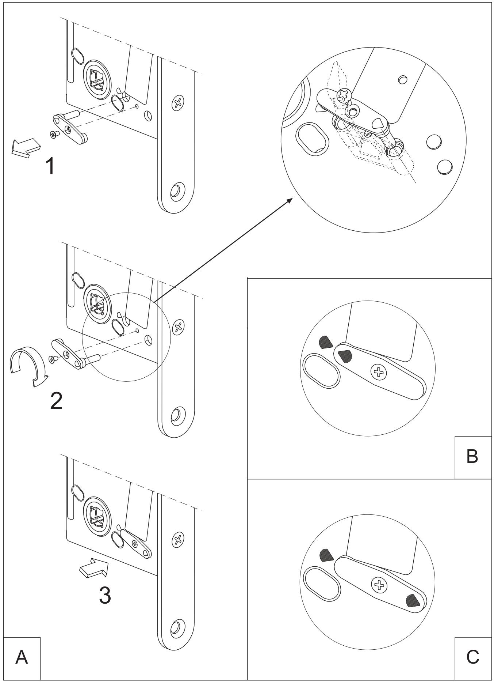

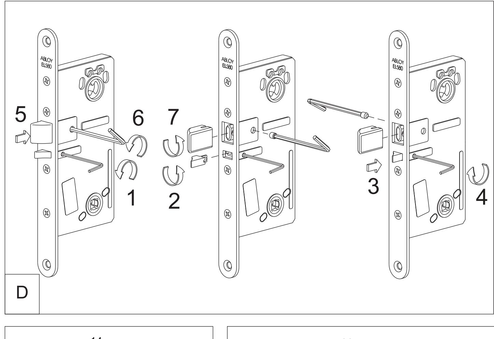

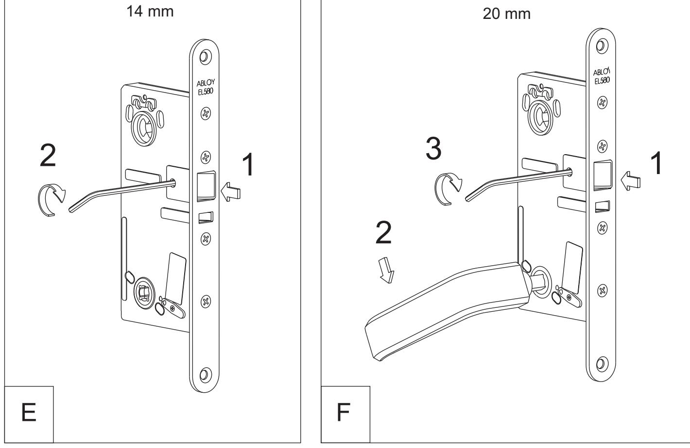

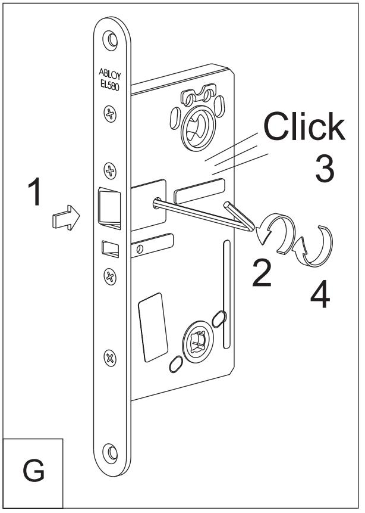

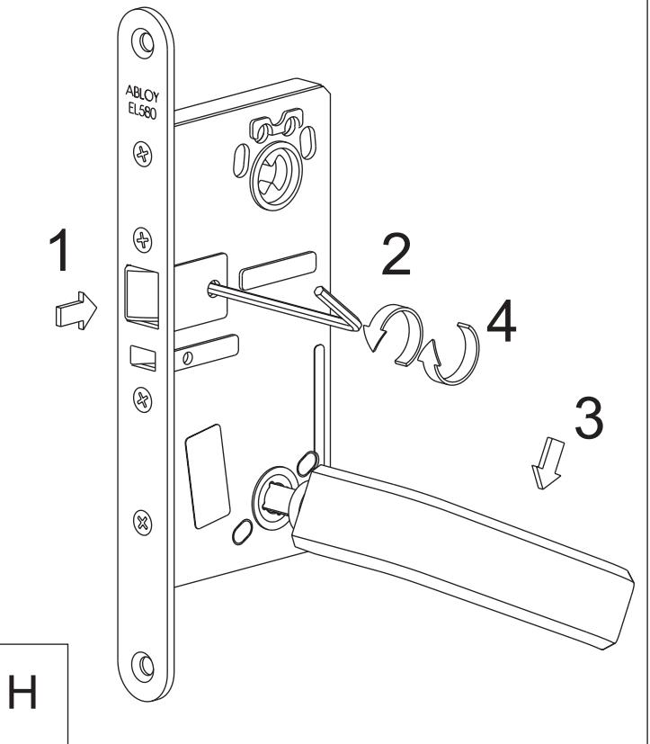

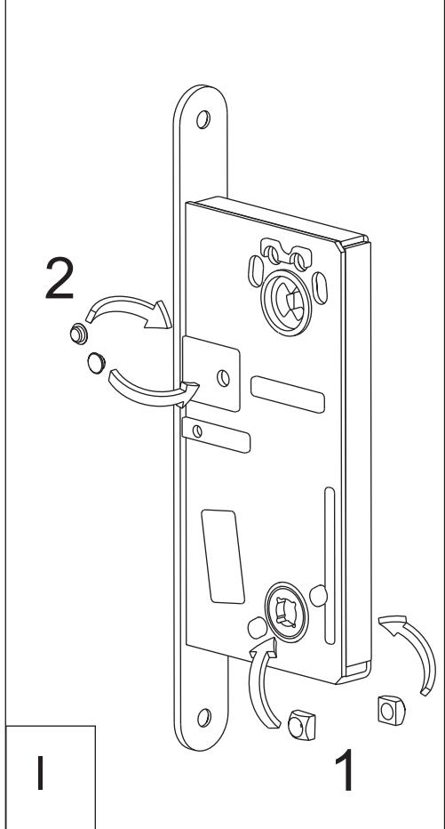

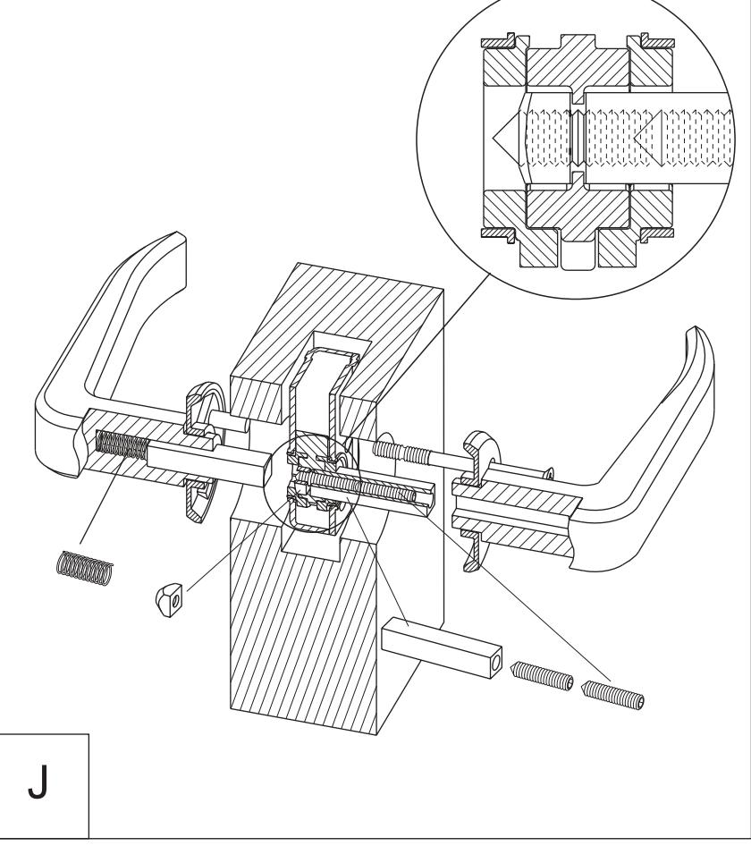