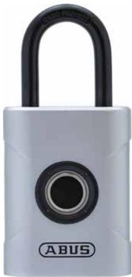

## ABUS Touch™ 57/45

Seite 1 von 2

#### PADLOCK RETHOUGHT

With the ABUS Touch™ 57, worrying about a lost key or forgetting an opening code are a thing of the past.

Make your life a little easier and secure your bike shed or locker with the ABUS Touch™ 57 weatherproof fingerprint lock. Just touch it and the lock opens. The 360°-capable sensor identifies up to 20 programmed-in fingerprints from any position - no matter how they are placed on it. Registering the fingerprints is super fast. As one of two administrators, simply place your own, already registered finger on the fingerprint sensor for three seconds and "Register mode" is activated. Keeping it there for ten seconds triggers the "Delete mode" setting. Accidentally deleting the prints is therefore virtually impossible. The lock is equipped with a replaceable CR2 battery. And the stored fingerprints are retained even after replacing the battery. With the hardened steel shackle and thanks to the double ball locking, your property is secured in the best possible way with a medium risk of theft. From now on, misplaced keys are a thing of the past.

### Technologies

- Lock body made of coated zinc die cast
- Hardened Nano Protect™ shackle
- CR2 battery
- Capacitive sensor with minutiae detection
- 20 fingerprints can be stored
- Double ball locking
- Automatic locking
- Spring-loaded shackle for automatic opening

# ABUS Touch™ 57/45

Seite 2 von 2

#### • IP certification

#### Usage

- For securing medium-value items when there is a medium risk of theft
- Use in clean areas with good fingerprint recognition
- Suitable for indoor and outdoor use

### Tips

- Before using the touch function, make sure that the sensor, as well as your finger, is clean.
- Please read the notes in the instructions carefully before use.
- Do not store fingerprints more than once. Otherwise this can revoke the function of the administrator.
- A carefully programmed finger is a well-functioning key

#### Variants

- Sizes: 57/45, 57/50

| Technical Data - ABUS Touch™ 57/45 |               |
|------------------------------------|---------------|
| Depth e                            | 23 mm         |
| Height f                           | 95 mm         |
| Horizontal clearance b             | 20 mm         |
| Security Level Home Security       | 6             |
| Shackle diameter d                 | 6,5 mm        |
| Vertical clearance c               | 30 mm         |
| Weight                             | 317 g         |
| Width a                            | 45 mm         |
| color                              | silver        |
| EAN                                | 4003318625756 |