# ACT 5e & ACT 5e prox

ACT 5e och ACT 5e prox är fristående passerkontrollprodukter som är enkla att använda och lätta att installera.

Knappsatserna har ett elegant polykarbonathölje med knappar i rostfritt stål och integrerad elektronik vilket gör det möjligt att använda dem både inomhus och utomhus.

#### ACT 5e digital knappsats

Grundläggande funktioner

- 10 användarkoder
- Knappsats med bakgrundsbelysning
- Lås vid inkorrekt kod
- 5 amp dörr relä utgång

#### ACT 5e prox Digital knappsats & beröringsfri läsare

Grundläggande funktioner

- 50 användare med unika PIN-koder och/eller ACTProx-kort.
- Driftslägena är
	- Beröringsfri
	- PIN
	- Beröringsfri eller PIN
	- Beröringsfri och beröringsfri
	- Beröringsfri och vilken PIN som helst
- Knappsats med bakgrundsbelysning
- Spärr vid inkorrekt kod
- Dörr relä utgång 5 amp
- Användare kan tas bort om ett kort försvinner eller om PIN-kod glöms bort

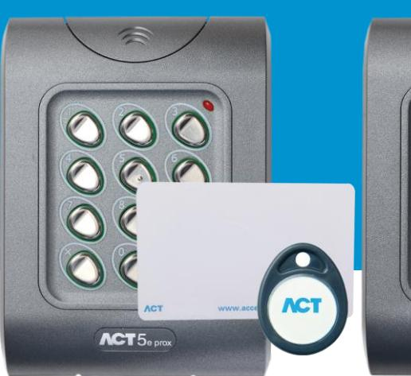

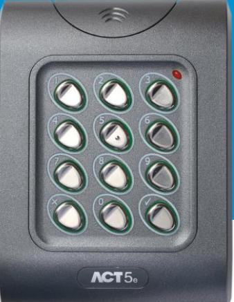

ACT 5e digital knappsats

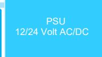

ACT 5e prox Digital knappsats & beröringsfri läsare

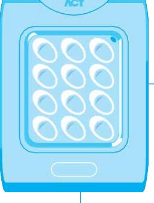

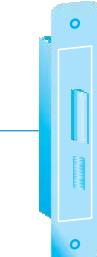

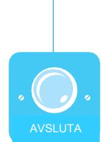

ACT 5e och ACT 5e prox Schema

## ACT 5e & ACT 5e prox Digitala knappsatser & beröringsfri läsare

#### Orderinformation

| Digital knappsats                                | ACT 5e        |
|--------------------------------------------------|---------------|
| Beröringsfri läsare & digital knappsats       | ACT 5e prox   |
| Kort till beröringsfri läsare                    | ACTProx ISO-B |
| Bricka till beröringsfri läsare                  | ACTProx Fob-B |
| Kort med halvt hölje till beröringsfri läsare | ACTProx HS-B  |
| Kort med magnetremsa & beröringsfri läsare    | ACTProx DUO-B |

### ACT 5e prox kort & brickor Produktjämförelse

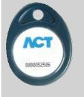

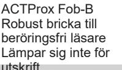

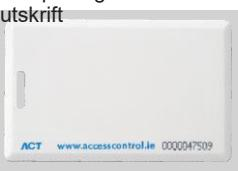

ACTProx HS-B Kort med halvt hölje till beröringsfri läsare Lämpar sig inte för utskrift ACTProx DUO-B Beröringsfri & magnetremsa Lämpar sig för utskrift

ACTProx ISO-B Kort till beröringsfri läsare Lämpar sig för utskrift

| Produktspecifikation              |                                    |                                   |  |  |
|-----------------------------------|------------------------------------|-----------------------------------|--|--|
|                                   | ACT 5e                             | ACT 5e prox                       |  |  |
| Driftspänning                     | 12 till 24 Volt AC eller DC        |                                   |  |  |
| Nuvarande strömförbrukning     | 30mA (nominell) 120 mA (max) | 60mA (nominell) 100mA (max) |  |  |
| Drifttemperatur                   | -10 till +50 C                     |                                   |  |  |
| Dörröppningstid                   | 0 - 255 sekunder                   |                                   |  |  |
| Relä kontakträckvidd 5A / 250 Vac |                                    |                                   |  |  |
| Vikt                              | 225 g                              |                                   |  |  |
| Storlek (H x B x D, mm)        | 94 x 130 x 25                      |                                   |  |  |
| Montering                         | Ytmonterad och infälld             |                                   |  |  |
| Installation                      | Inomhus/utomhus                    |                                   |  |  |
|                                   |                                    |                                   |  |  |

## iDigitala knappsatser &

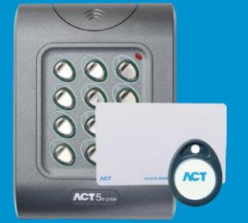

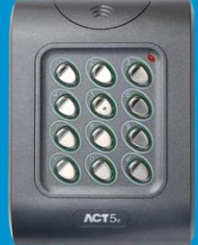

ACT 5e digital knappsats

ACT 5e prox Digital knappsats & beröringsfri läsare

närhetsläsare

|                                             | ACT 5e | ACT 5e prox | ACT 10 |  |
|---------------------------------------------|--------|-------------|--------|--|
| Dörrar                                      | 1      | 1           | 2      |  |
| Användare                                   | 10     | 50          | 10     |  |
| Användargrupper                             |        |             | 2      |  |
| Endast pin-kod                              |        |             |        |  |
| Pin & kort                                  |        |             |        |  |
| Pin eller kort                              |        |             |        |  |
| Endast kort                                 |        |             |        |  |
| Knappsats med bakgrundsbelysning         |        |             |        |  |
| Tryck för att avsluta                       |        |             |        |  |
| Dörrövervakning                             |        |             |        |  |
| Brandlarmsåsidosättning                     |        |             |        |  |
| Interlock                                   |        |             |        |  |
| Växlingsläge                                |        |             |        |  |
| Dörr relä utgångar                          | 5 amp  | 5 amp       | 5 amp  |  |
| Programmerbara ingångar                     |        |             | 2      |  |
| Programmerbara utgångar                     |        |             | 2      |  |
| Tryck för att frigöra knappens inmatning |        |             |        |  |
| Sabotage utgång                             |        |             |        |  |
| 12-24 Volt DC- eller AC ingång           |        |             |        |  |
| IP-räckvidd                                 | IP67   | IP67        | IP54   |  |
| Forcerad dörr/Dörr på glänt                 |        |             |        |  |
| Ändra relä timer                            |        |             |        |  |
| Tvångskod                                   |        |             |        |  |
| Riktlinjer för installation                 |        |             |        |  |

• 12 till 24 Volt AC eller DC krävs

• 5 amp lås utgång

- Kan installeras antingen inomhus eller utomhus (IP67)
• Drifttemperatur: -10 till +50 C

- Kan ytmonteras eller monteras infälld