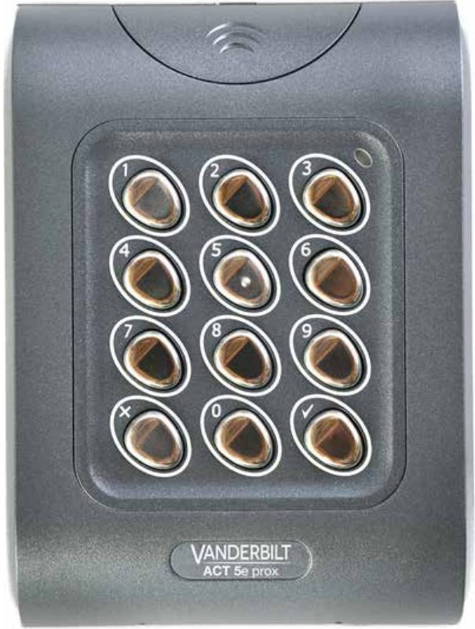
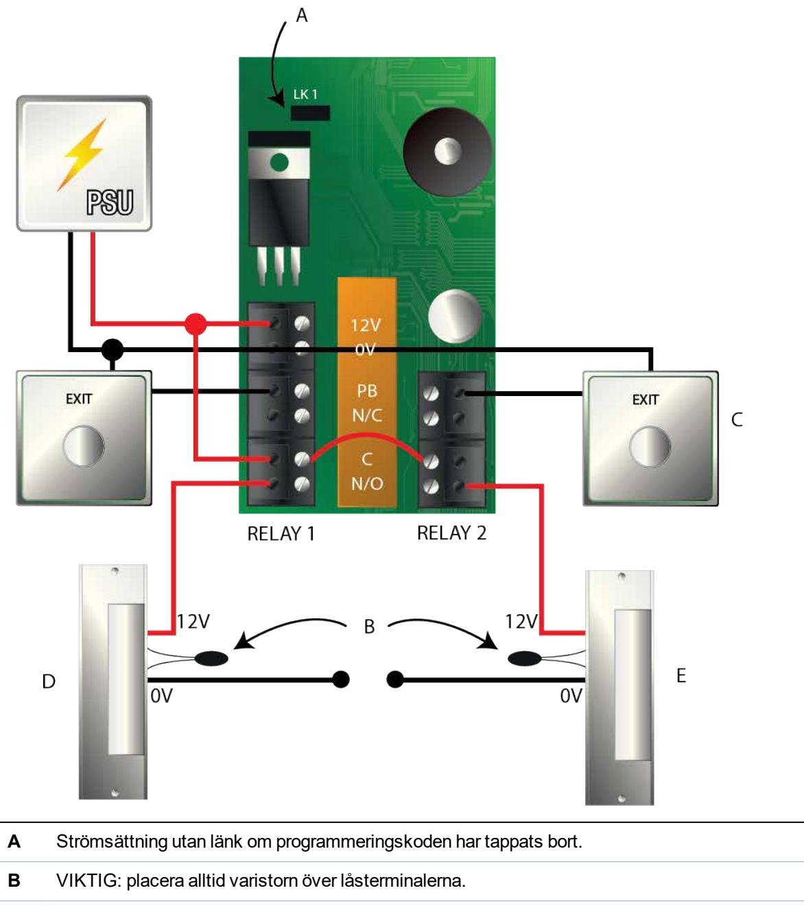
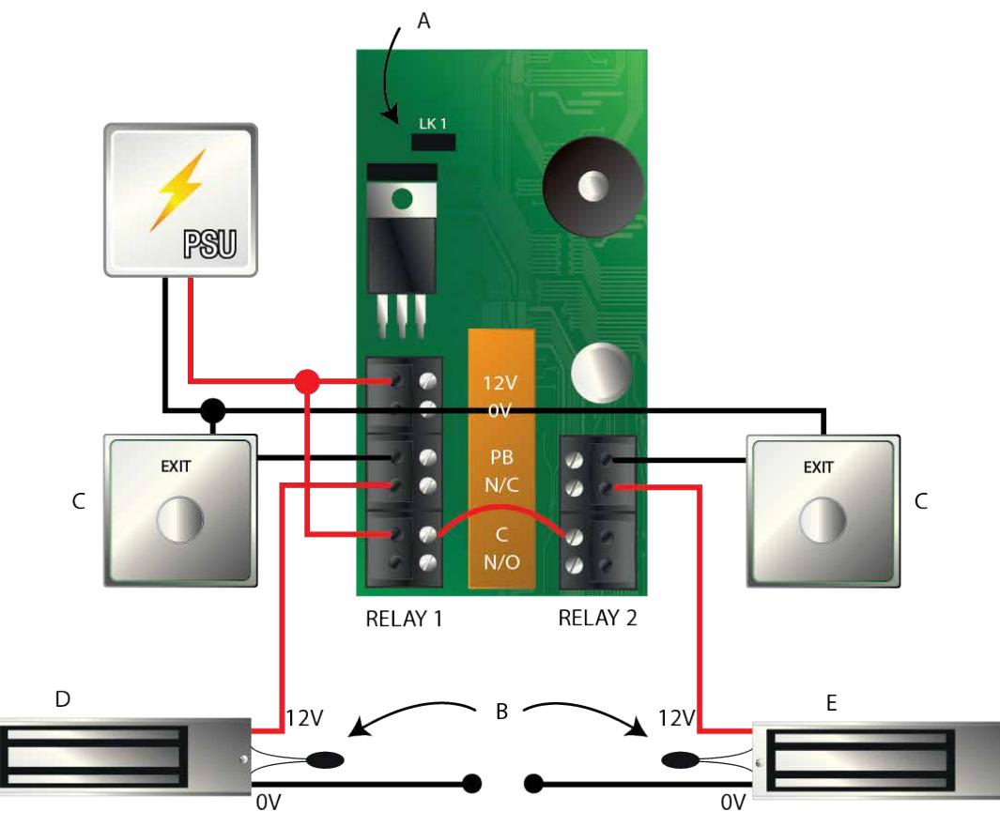
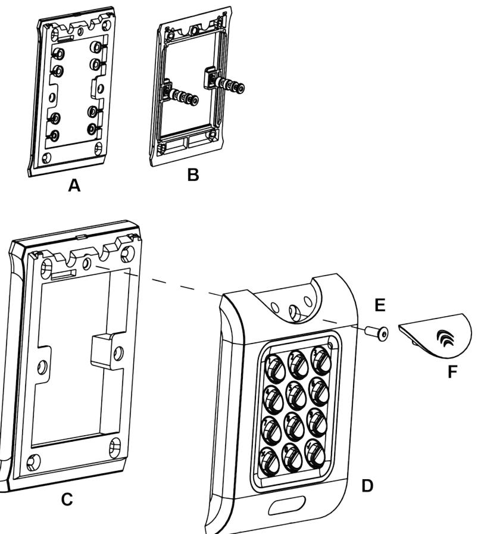
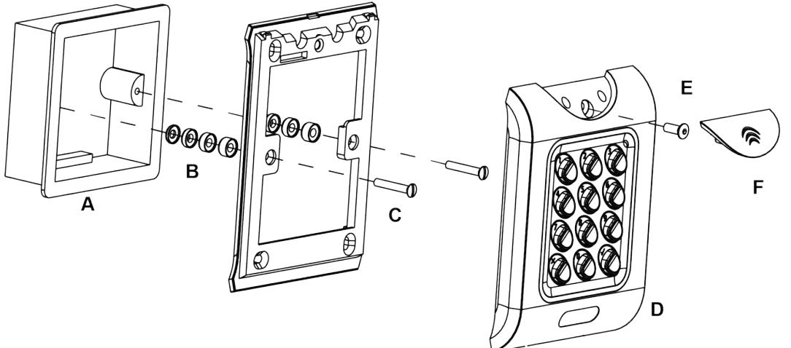

# ACT 5e prox

Installations- och driftsinstruktioner

Dokument-ID: A-100456-b Upplaga datum: 13.06.2018

Data og design kan blive ændret uden varsel. / Tilføj subjekt til tilgængelighed.

© 2018 Copyright by Vanderbilt International Ltd.

Vi forbeholder os alle rettigheder til dette dokument og dets indhold. Ved at acceptere dokumentet anerkender modtageren disse rettigheder og forpligter sig til ikke at offentliggøre dokumentet eller dets emne i sin helhed eller delvist eller at stille dem til rådighed for tredjemand uden forudgående udtrykkelig skriftlig tilladelse fra os eller at bruge det til andre formål end det, der var gældende, da det blev leveret til denne.

Härmed försäkrar Vanderbilt International (IRL) Ltd att denna typ av överensstämmer med alla relevanta EG-direktiv för CE-märkning.

- Direktiv 2014/53/EU (Direktiv om radioutrustning)
• Direktiv 2011/65/EG (Direktiv om begränsning av användning av vissa farliga ämnen)

Den fullständiga texten för EG-försäkran om överensstämmelse finns på http://van.fyi?Link=ACTcardReaders

**IT**

# **Innehållsförteckning**

| 1.1 Produktspecifikation 2 Installationsanteckningar 3 30-sekunders programmeringsguide 4 Programmeringssammanfattning 5 Programmering av ACT 5e prox digital knappsats 5.1 Ändra användarens PIN-koder | 4  |
|------------------------------------------------------------------------------------------------------------------------------------------------------------------------------------------------------------------------|----|
|                                                                                                                                                                                                                        | 4  |
|                                                                                                                                                                                                                        | 5  |
|                                                                                                                                                                                                                        | 6  |
|                                                                                                                                                                                                                        | 7  |
|                                                                                                                                                                                                                        | 8  |
|                                                                                                                                                                                                                        | 8  |
| 5.2 Lägg till kort                                                                                                                                                                                                     | 8  |
| 5.3 Ändra programmeringskod                                                                                                                                                                                            | 9  |
| 5.4 Ställ in dörrens relätid                                                                                                                                                                                           | 9  |
| 5.5 Ställ in reläkombinationer                                                                                                                                                                                         | 10 |
| 5.6 Radera användarkortet                                                                                                                                                                                              | 10 |
| 5.7 Radera kortnummer                                                                                                                                                                                                  | 10 |
| 5.8 Kontrollera om inte användaren har tilldelats en PIN-kod                                                                                                                                                           | 10 |
| 5.9 Kontrollera om användaren har tilldelats ett kort                                                                                                                                                                  | 11 |
| 5.10 Programmera ACT 5e prox-alternativ                                                                                                                                                                                | 11 |
| 5.11 Återställa standard fabriksinställningarna                                                                                                                                                                        | 12 |
| 6 Kopplings- och monteringsscheman                                                                                                                                                                                     | 13 |
| 6.1 ACT 5e prox kopplingsschema för låsning                                                                                                                                                                            | 13 |
| 6.2 ACT 5e prox kopplingsschema för mag lås                                                                                                                                                                            | 14 |
| 6.3 Monteringsanvisningar för ytmonterade enheter                                                                                                                                                                      | 15 |
| 6.4 Monteringsanvisningar för infälld montering av enheten                                                                                                                                                             | 16 |
| 7 Användarlista 17                                                                                                                                                                                                  |    |

# **1 Översikt**

ACT 5e prox är en enkel, lättanvänd styrenhet som kombinerar en digital knappsats med närhetsteknik. Enheten stöder upp till 50 användare, var och en med en unik PIN-kod ochnärhetskort/fob. Varje enhet sitter i ett slitstarkt polykarbonathölje med knappar i rostfritt stål och integrerad elektronik vilket gör det möjligt att använda dem både inomhus och utomhus. Knappsatsens bakgrundsbelysning förbättrar funktionen hos ACT 5e prox nattetid eller vid dålig belysning.

Programmeringen av enheten görs med knapparna, lysdioden och summern. Korten och PIN-koderna kan programmeras mycket snabbt i ACT 5e prox. Vanderbilt rekommenderar att användare med tillhörande PIN och kort registreras i användarlistan i slutet av denna handbok (se *Användarlista* på sidan 17). Kopiera detta blad och ange varje användares uppgifter på det. Det gör att användarna kan raderas senare, även om ett kort tappas bort eller en användare glömmer bort sin PIN-kod.

Ett giltigt kort eller PIN ger tillgång. För maximal säkerhet, kan enheten programmeras för att kräva att alla användare anger en PIN-kod efter att ha visat upp kortet.

| Antal användare      | 50 (50 PIN och 50 kort)                                                                 |  |
|----------------------|-----------------------------------------------------------------------------------------|--|
| Matningsspänning     | 12–24 V AC eller DC (linjär PSU)                                                        |  |
| Strömförbrukning     | 60 mA (nominell) 100 mA (max)                                                           |  |
| Driftstemperatur     | -40 till +50°C                                                                          |  |
| Dörröppningstid      | 0-255 s                                                                                 |  |
| Reläets kontaktklass | 5 A / 50 V AC                                                                           |  |
| Knappsatsens storlek | Infälld montering: 100 x 110 x 20 mm Ytmontering: 128 x 94 x 18,5 mm                 |  |
| Knappsatsens vikt    | 220 g                                                                                   |  |
| Vattenbeständighet   | Hög IP67                                                                                |  |
| Konstruktion         | Slitstarkt hus av polykarbonat med knappar av rostfritt stål och integrerad elektronik. |  |

### **1.1 Produktspecifikation**

# **2 Installationsanteckningar**

- l Kom ihåg att återställa ACT 5e prox till fabriksinställningarna före programmeringen.
- l Kom ihåg att placera varistorn som ingår över terminalerna på dörrspolen för att skydda reläkontakterna.
- l Montera inte ACT 5e prox-enheten nära RF-källor (t ex. mobiltelefoner, radiosändare osv) eller metallytor.
- l Använd aldrig det monterade reläet för att ställa om AC nätspänningen. Ett externt relä som är elektriskt isolerat från ACT 5e prox ska användas för detta syfte.
- l Kom ihåg att ändra programmeringskoden.
- l När du beställer nya kort eller fobl, specificera ACTRFID. (Obs! ACT 5e prox fungerar INTE med HID-kort eller fob.)

Som med alla passagekontrollsystem ska du alltid se till att det finns en alternativ flyktväg om enheten inte skulle fungera på grund av strömavbrott eller brand.

## **3 30-sekunders programmeringsguide**

Dessa instruktioner gäller för ett typiskt fristående system.

#### 1. **Öppna programmeringsläget**

På den digitala knappsatsen trycker du på . Ange programmeringskoden (standard är 9999). Lysdioden blinkar med orange.

#### 2. **Ändra användarkod 1**

På den digitala knappsatsen trycker du på **0**. Mata in **01** (för användare 01). Mata in den nya användarkoden 1 (4 siffror).

#### 3. **Lägg till kort för användare 1**

På den digitala knappsatsen trycker du på **5**. Mata in **01** (för användare 01). Presentera kortet för användare 01 två gånger.

#### 4. **Ändra programmeringskod**

På den digitala knappsatsen trycker du på **0**. Ange . Mata in den nya programmeringskoden (4 siffror).

#### 5. **Avsluta programmeringsläget**

På den digitala knappsatsen trycker du på . Lysdioden blir röd och programmeringsläget avslutas.

#### 6. **Registrera användarkod och kort**

Ange detaljerna för användarna och deras tillhörande koder och kortnummer på användarlistan bak i denna handbok.

ACT 5e prox är nu klar för normal användning.

ACT 5e prox kan återställas till fabriksinställningarna när som helst genom att öppna programmeringsläget och trycka på tre gånger.

# **Programmeringssammanfattning**

| Kod | Funktion                          | Standard                                     |
|-----|-----------------------------------|----------------------------------------------|
| 0   | Ändra PIN-kod                     | 1234 – Användare 1, 9999 – Programmeringskod |
| 1   | Reläkombinationer                 | AV (tidsstyrt relä)                          |
| 2   | Ställ in dörrens relätid          | 5 sekunder                                   |
| 5   | Lägg till användarkort            |                                              |
| 6   | Radera användarkort               |                                              |
| 7   | Radera kortnummer                 |                                              |
| 30  | Kort eller PIN-kod                | På                                           |
| 31  | Kort och PIN-kod                  | Av                                           |
| 32  | Kort och vilken PIN-kod som helst | Av                                           |
| 40  | Permanent bakgrundsbelysning      | På                                           |
| 41  | Automatisk bakgrundsbelysning     | Av                                           |
| 80  | Kontrollera PIN-användaren        |                                              |
| 81  | Kontrollera kortanvändaren        |                                              |

# **5 Programmering av ACT 5e prox digital knappsats**

För att öppna programmeringsläget: på den digitala knappsatsen trycker du på och matar in programmeringskoden (till en början 9999). Lysdioden blinkar med ett orange i programmeringsläget. För att avsluta programmeringsläget, tryck antingen på eller aktivera inte någon knapp i 30 sekunder.

- l Om lysdioden blinkar med grön under programmeringen, förväntas en presentation av kort.
- l Om lysdioden blinkar rött, förväntas en nedtryckning av en knapp.
- l Medan ACT 5e prox utför en uppgift (t.ex. standardminnet, tillägg av kort), tänds den gröna lysdioden och summern ljuder med en lång ljudsignal.

### **5.1 Ändra användarens PIN-koder**

Öppna programmeringsläget och tryck sedan på:

| Steg | Inmatning på knappsatsen | Åtgärd                                    |      | Exempel         |  |
|------|--------------------------|-------------------------------------------|------|-----------------|--|
| 1    | 0                        | Ändra PIN-koder                           | 0    | Ändra PIN-koder |  |
| 2    | 00 – 49                  | Ange det 2-siffriga användarnumret 00-49  | 07   | Användare 7     |  |
| 3    | 0000 – 9999              | 4-siffrig kod. 0000 raderar användare. | 7529 | PIN-kod         |  |

Kom ihåg att uppdatera användarlistanbak i denna handbok efter att ha lagt till en PIN-kod eller ett kort. (Se *Användarlista* på sidan 17.)

### **5.2 Lägg till kort**

Öppna programmeringsläget och tryck sedan på:

| Steg | Inmatning på knappsatsen | Åtgärd                                                                                  |
|------|-----------------------------|-----------------------------------------------------------------------------------------|
| 1    | 5                           | Lägg till kort                                                                          |
| 2    | 00 – 49                     | Första användare som ska tilldelas ett kort                                             |
| 3    | Presentera kortet           | Första kortet i partiet (kort med lägst nummer) tilldelat till den första användaren |
| 4    | Presentera kortet           | Sista kortet i partiet (kort med högsta nummer) tilldelat till den sista användaren  |

Korten får endast tilldelas användare som INTE har tilldelats ett kort. När du lägger till kort till ACT 5e prox, kontrollera vilka användare som redan har kort genom att använda alternativ 81 (se *Kontrollera om användaren har tilldelats ett kort* på sidan 11).

| Exempel 1: tilldela kort 0000200036 till användare 21 |                            | Exempel 2: tilldela kort 0000200036 till användare 21 med knappsatsen |                                 |  |
|----------------------------------------------------------|----------------------------|--------------------------------------------------------------------------|---------------------------------|--|
| Inmatning på knappsatsen                              | Åtgärd                     | Inmatning på knappsatsen                                                 | Åtgärd                          |  |
| 9999                                                     | Öppna programmering        | 9999                                                                     | Öppna programmering             |  |
| 5                                                        | 00-49                      | 5                                                                        | Lägg till kort                  |  |
| 21                                                       | 0000–9999                  | 21                                                                       | Användare 21                    |  |
| Presentera kortet                                        | Kortnummer 0000200036   | 0000200036                                                               | Ange det 10-siffriga kortnumret |  |
| Presentera kortet                                        | Kortnummer 0000200036   | 0000200036                                                               | Ange det 10-siffriga kortnumret |  |
|                                                          | Avsluta programmeringen |                                                                          | Avsluta programmeringen         |  |

### **5.3 Ändra programmeringskod**

Öppna programmeringsläget och tryck sedan på:

| Steg | Inmatning på knappsatsen Åtgärd            |  |
|------|-----------------------------------------------|--|
| 1    | 0 Ändra programmeringskod. (Standard 9999) |  |
| 2    |                                               |  |
| 3    | 0000–9999 Ny 4-siffrig programmeringskod.  |  |

### **5.4 Ställ in dörrens relätid**

Öppna programmeringsläget och tryck sedan på:

| Steg | Inmatning på knappsatsen | Åtgärd                                                                     |
|------|--------------------------|----------------------------------------------------------------------------|
| 1    | 2                        | Ställ in dörrens relätid. (Standard 5 sekunder, max. 255 sekunder)         |
|      |                          | 0 = Relä 1                                                                 |
| 2    | 0 / 1                    | 1 = Relä 2                                                                 |
|      |                          | Summern ljuder för att indikera tidsinställningen. Vänta den tid som krävs |
| 3    |                          | Avsluta inställningen av dörrens relätimer                                 |

### **5.5 Ställ in reläkombinationer**

| Steg | Inmatning på knappsatsen | Åtgärd                                                                                                       | Exempel: ställ in användare 12 för att växla relä när åtkomst ges |                        |
|------|-----------------------------|--------------------------------------------------------------------------------------------------------------|----------------------------------------------------------------------|------------------------|
| 1    | 1                           | Ställ in växlingsläget                                                                                       | 1                                                                    | Ställ in växlingsläget |
| 2    | 00 – 49                     | Ange det 2-siffriga användarnumret 00-49                                                                  | 12                                                                   | Användare 12           |
| 3    | 0 – 3                       | 0 = Reläväxling 1 = Relä 1 tidsinställd 2 = Relä 2 tidsinställd 1 = Relä 1 + Relä 2 tidsinställd | 0                                                                    | Reläväxling            |

Öppna programmeringsläget och tryck sedan på:

#### **5.6 Radera användarkortet**

Öppna programmeringsläget och tryck sedan på:

| Steg | Inmatning på knappsatsen | Åtgärd                               | Exempel: Radera kortet för användare 10 |                        |
|------|-----------------------------|--------------------------------------|--------------------------------------------|------------------------|
| 1    | 6                           | Radera användarkort                  | 6                                          | Radera användarkort |
| 2    | 00 – 49                     | Första användaren som ska raderas | 10                                         | Användare 10           |
| 3    | 00 – 49                     | Sista användaren som ska raderas  | 10                                         | Användare 10           |

#### **5.7 Radera kortnummer**

Öppna programmeringsläget och tryck sedan på:

| Steg | Inmatning på knappsatsen | Åtgärd                                       |
|------|--------------------------|----------------------------------------------|
| 1    | 7 Radera kortnummer   |                                              |
| 2    | 10-siffrigt kortnummer   | 10-siffrigt kortnummer med inledande nollor. |
|      |                          | T ex. för kort 54321, ange 0000054321.       |

#### **5.8 Kontrollera om inte användaren har tilldelats en PIN-kod**

| Steg | Inmatning på knappsatsen | Åtgärd                                                         |
|------|--------------------------------|----------------------------------------------------------------|
| 1    | 80                             | Kontrollera om inte användaren redan har tilldelats en PIN-kod |

Öppna programmeringsläget och tryck sedan på:

| Steg | Inmatning på knappsatsen | Åtgärd                                                                                                                                                                                       |
|------|--------------------------------|----------------------------------------------------------------------------------------------------------------------------------------------------------------------------------------------|
| 2    | 00 – 49                        | Användare 0 – 49                                                                                                                                                                             |
|      |                                | På knappsatsen blinkar den gröna lysdioden och ett högt ljud hörs om användaren INTE har tilldelats en PIN-kod. Om den blinkar rött och ett lågt ljud hörs, har användaren en PIN-kod. |

#### **5.9 Kontrollera om användaren har tilldelats ett kort**

Öppna programmeringsläget och tryck sedan på:

| Steg                             | Inmatning på knappsatsen | Åtgärd                                                                                                                                                                                |
|----------------------------------|-----------------------------|---------------------------------------------------------------------------------------------------------------------------------------------------------------------------------------|
| 1                                | 81                          | Kontrollera om användaren redan har tilldelats ett kort                                                                                                                               |
| 2 00 – 49 Användare 0 – 49 |                             |                                                                                                                                                                                       |
|                                  |                             | På knappsatsen blinkar den gröna lysdioden och ett högt ljud hörs om användaren INTE har tilldelats ett kort. Om den blinkar rött och ett lågt ljud hörs, har användaren ett kort. |

### **5.10 Programmera ACT 5e prox-alternativ**

Öppna programmeringsläget och tryck sedan på:

| Steg | Inmatning på knappsatsen | Åtgärd                     |  |
|------|--------------------------|----------------------------|--|
| 1    | 30, 31, 32, 40 eller 41  | 2-siffrigt valfritt nummer |  |
| 2    | 0 eller 1                | 0= Av, 1= På               |  |

Alternativen är de följande:

| Alternativ | Funktion                             | Standard | Åtgärd                                                                                                                                                                                                                                                                                                                     |
|------------|--------------------------------------|----------|----------------------------------------------------------------------------------------------------------------------------------------------------------------------------------------------------------------------------------------------------------------------------------------------------------------------------|
| 30         | Kort eller PIN-kod                   | På       | Efter inställningen, används ett giltigt kort eller PIN-kod för att öppna dörren.                                                                                                                                                                                                                                       |
| 31         | Kort och PIN-kod                     | Av       | När den är inställd, tillåts endast användare med både ett kort och en PIN-kod. Korten tilldelas till en särskild användare med funktionen Lägga till kort (funktion 5) och PIN-koderna tilldelas med funktionen Ändra PIN-koder (funktion 0).                                                                    |
| 32         | Kort och vilken PIN kod som helst | Av       | I detta läge, används ett giltigt kort eller PIN-kod för att öppna dörren. Detta läge gör att alla användare har en gemensam PIN-kod att använda med sina kort.                                                                                                                                                      |
| 40         | Permanent bakgrundsbelysning      | På       | Efter inställningen är knappsatsens belysning alltid på. Detta alternativ utesluter alternativ 41 (automatisk bakgrundsbelysning).                                                                                                                                                                                      |
| 41         | Automatisk bakgrundsbelysning     | Av       | När den är inställd är knappsatsbelysningen normalt avstängd, men sätts på som reaktion när en knapp trycks ner eller då ett kort presenteras eller i prorammeringsläget. Detta alternativ utesluter alternativ 40 (permanent bakgrundsbelysning). För att förhindra belysning, stäng av alternativ 40 och 41. |

### **5.11 Återställa standard fabriksinställningarna**

Ange programmeringskoden följt av . Detta återställer ACT 5e prox till standardinställningarna.

Om du har glömt programmeringskoden, ställ in den på 9999 enligt följande:

- 1. Stäng av strömförsörjningen till enheten.
- 2. Ta bort länken LK1 på baksidan av enheten.
- 3. Sätt på strömmen till enheten.
- 4. Sätt tillbaka länk LK1.
- 5. Programmeringskoden är nu inställd på 9999.

Knappsatsen fungerar inte korrekt om inte LK1 sitter på plats.

Standardminnet tar 3-4 sekunder. Under denna tid ljuder summern med en lång ton.

# **6 Kopplings- och monteringsscheman**

### **6.1 ACT 5e prox kopplingsschema för låsning**

#### **Anm:**

- l Denna illustration visar kopplingarna för normalt icke strömsatta lås. Om normalt strömsatta lås krävs, använd N/S reläkontakter.
- l ACT 5e prox kan strömsättas från 12 eller 24 V AC eller DC.

- **C** Dörrens upplåsningsknapp
- **D** Strike Lås 1
- **E** Strike Lås 2

### **6.2 ACT 5e prox kopplingsschema för mag lås**

#### **Anm:**

- l Denna illustration visar kopplingarna för normalt icke strömsatta lås. Om normalt strömsatta lås krävs, använd N/S reläkontakter.
- l ACT 5e prox kan strömsättas från 12 eller 24 V AC eller DC.

- **A** Strömsättning utan länk om programmeringskoden har tappats bort.
- **B** VIKTIG: placera alltid varistorn över låsterminalerna.
- **C** Dörrens upplåsningsknapp
- **D** Magnetlås 1
- **E** Magnetlås 2

### **6.3 Monteringsanvisningar för ytmonterade enheter**

Distanshållare kan lossas från huvudkomponenten när deet krävs av installatören för användningen.

- **A**  Avgör avståndet mellan kopplingsdosan och monteringsplattan genom att använda distansshållare etiketterade från 1 till 4 mm. En distanshållare av rätt längd monteras genom att stapla distanshållarna.
**B** Vy **A** visar monteringsplattan innan distanshållarna tas bort av installatören.

Vy **B** visar staplingen av distanshållare.

- **C** Ytmonterad enhet. Den ytmonterade flänsen monteras på väggen med fixeringssatsen som ingår i förpackningen.
**D** Placera läsaren/knappsatsen på den ytmonterade flänsen och kläm fast den.

**E** Använd säkerhetsskruven som ingår för att fästa enheten vid den ytmonterade flänsen.

- **F** Placera locket på enheten och tryck fast det ordentligt.
#### **6.4 Monteringsanvisningar för infälld montering av enheten**

| A      | Standard kopplingsdosa.                                                                                                                                                                       |
|--------|-----------------------------------------------------------------------------------------------------------------------------------------------------------------------------------------------|
| B C | Monteringsplattan är fäst med hjälp av de medföljande skruvarna (C).                                                                                                                          |
|        | Se till att rätt distanshållare (B) har använts för att överbrygga gapet mellan monteringsplattan och fixeringsvingarna på kopplingsdosan för att undvika att monteringsplattan blir sned. |
| D      | Placera läsaren/knappsatsen på den ytmonterade flänsen och kläm fast den.                                                                                                                     |
| E      | Använd säkerhetsskruven som ingår för att fästa enheten vid den integrerade flänsen.                                                                                                          |
| F      | Placera locket på enheten och tryck fast det ordentligt.                                                                                                                                      |
|        |                                                                                                                                                                                               |

# **Användarlista**

| Användare | Användarnamn | Kortnummer | PIN | Växla |
|-----------|--------------|------------|-----|-------|
| 00        |              |            |     |       |
| 01        |              |            |     |       |
| 02        |              |            |     |       |
| 03        |              |            |     |       |
| 04        |              |            |     |       |
| 05        |              |            |     |       |
| 06        |              |            |     |       |
| 07        |              |            |     |       |
| 08        |              |            |     |       |
| 09        |              |            |     |       |
| 10        |              |            |     |       |
| 11        |              |            |     |       |
| 12        |              |            |     |       |
| 13        |              |            |     |       |
| 14        |              |            |     |       |
| 15        |              |            |     |       |
| 16        |              |            |     |       |
| 17        |              |            |     |       |
| 18        |              |            |     |       |
| 19        |              |            |     |       |
| 20        |              |            |     |       |
| 21        |              |            |     |       |
| 22        |              |            |     |       |
| 23        |              |            |     |       |
| 24        |              |            |     |       |
| 25        |              |            |     |       |
| 26        |              |            |     |       |
| 27        |              |            |     |       |
| 28        |              |            |     |       |

| Användare | Användarnamn | Kortnummer | PIN | Växla |
|-----------|--------------|------------|-----|-------|
| 29        |              |            |     |       |
| 30        |              |            |     |       |
| 31        |              |            |     |       |
| 32        |              |            |     |       |
| 33        |              |            |     |       |
| 34        |              |            |     |       |
| 35        |              |            |     |       |
| 36        |              |            |     |       |
| 37        |              |            |     |       |
| 38        |              |            |     |       |
| 39        |              |            |     |       |
| 40        |              |            |     |       |
| 41        |              |            |     |       |
| 42        |              |            |     |       |
| 43        |              |            |     |       |
| 44        |              |            |     |       |
| 45        |              |            |     |       |
| 46        |              |            |     |       |
| 47        |              |            |     |       |
| 48        |              |            |     |       |
| 49        |              |            |     |       |

Exempel:

| Användare | Användarnamn | Kortnummer | PIN  | Växla |
|-----------|--------------|------------|------|-------|
| 12        | John Smith   | 0000200036 | 7529 | Nej   |

© Vanderbilt 2018 Data och konstruktion kan komma att ändras utan föregående meddelande. Levereras i mån av tillgång. Dokument-ID: A-100456-b Upplaga datum: 13.06.2018

**vanderbiltindustries.com**

@VanderbiltInd Vanderbilt Industries

Utgiven av **Vanderbilt International Ltd.** Clonshaugh Business and Technology Park Clonshaugh, Dublin D17 KV 84, Irland

vanderbiltindustries.com/contact