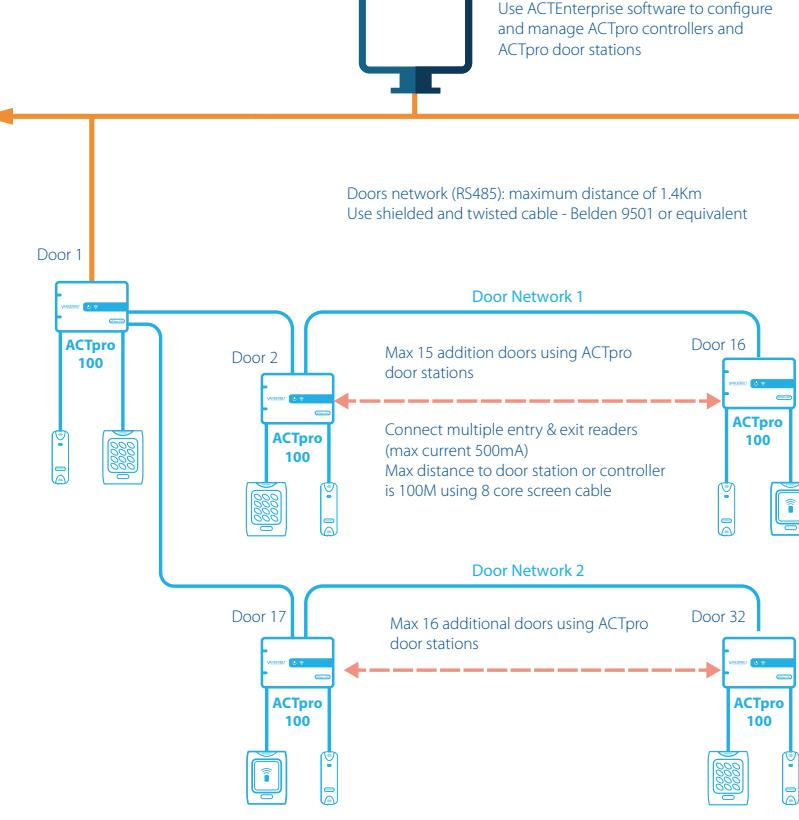

## **Introduction:**

The ACTpro 100 door station facilitates the expansion of additional doors on ACTpro controllers.

## **ACTpro 100 Schematic:**

## **Main Features - ACTpro 100:**

- Main Relay for door control (5A/50V AC/DC)
- AUX relay for alarm monitoring (1A/50V AC/DC)
- Supports all ACTpro readers including MIFARE Classic, DESFire EV1
- Supports Clock&Data or Wiegand readers
- Multiple entry & exit readers
- Reader short circuit protection
- Break Glass Monitoring
- Voltage Monitoring
- Request to exit
- Door monitoring
- Tamper and Mains present monitoring
- Status LED's
- Space in enclosure for cable management
- Interlock
- Anti passback

## **Installation Guideline ACTpro-100 & ACTpro-100 2A:**

- **•** For indoor use only
- **•** The ACTpro-100 door-stations are compatible with the ACTpro 1500 and 4000 family of controllers
- **•** The ACTpro-100 2A must be installed as a permanently connected piece of equipment by a licensed electrician in accordance with local / national codes
- **•** Mains power should be connected to the ACTpro-100 2A by a licensed electrician in accordance with local / national codes

| ACTpro 100          |
|---------------------|
| Single door station |

| Product/Technical Specification      | ACTpro-100                             | ACTpro-100 2A                                   |
|-----------------------------------------|----------------------------------------|-------------------------------------------------|
| Vanderbilt Material Number           | V54502-C120-A100                       | V54502-C121-A100                                |
| Input Voltage Range (Controller)     | 11-24V DC                              | 11-24V DC                                       |
| Current Consumption (Controller)     | 40 - 120 mA                            | 40 - 120 mA                                     |
| Operating Environment                   | Surface mounting, Internal Use only | Surface mounting, Internal Use only          |
| Environmental Temperature            | -10 to +50° C                          | -10 to +40 (operating) 75% RH non-condensing |
| Dimensions (H x W x D mm)            | 165 x 235 x 55                         | 275 x 330 x 80                                  |
| Weight (Kg)                             | 0.4 Kg                                 | 2.2Kg                                           |
| Enclosure Material                      | Polycarbonate                          | 1.2 mm steel white powder coated             |
| LED Status Indicators                   | Yes                                    | Yes                                             |
| PSU Fault Output                        | N/A                                    | Yes                                             |
| Lid opening tamper detection (front) | Yes                                    | Yes                                             |
| Rear tamper detection                   | No                                     | Yes                                             |

# **ACTpro 100** Single door station

| Electrical Specificaiton             | ACTpro-100 | ACTpro-100 2A                                                                                   |
|--------------------------------------|------------|-------------------------------------------------------------------------------------------------|
| Battery charging                     | N/A        | Yes                                                                                             |
| Standby Battery                      | N/A        | 12V 7Ah Battery                                                                                 |
| Battery Depp Discharge Protection | N/A        | No                                                                                              |
| Input: Voltage Rated                 | N/A        | 100-240V ac                                                                                     |
| Input: Voltage Operating             | N/A        | 90-264V ac                                                                                      |
| Input: Frequency                     | N/A        | 50-60Hz                                                                                         |
| Input: Max Current                   | N/A        | 1.0A (@ 90V ac)                                                                                 |
| Input: Mains input fuse              | N/A        | F20.0A                                                                                          |
| Input: Max standby power             | N/A        | 0.5W (no load and no battery connected)                                                      |
| Output: Voltage                      | N/A        | "13.4 - 14.2V dc (13.8V dc Nominal) on mains power 10.0 - 12.3V de on battery standby" |
| Output: Max load current             | N/A        | 2.0A                                                                                            |
| Output: Ripple                       | N/A        | 150mA pk-pk max                                                                                 |
| Output: Load output fuse             | N/A        | F200A                                                                                           |

## **Ordering Information**

ACTpro-100 Single door station

ACTpro-1002A Single door station with 12V DC 2Amp PSU

### **vanderbiltindustries.com**

@VanderbiltInd Vanderbilt Industries

## **Vanderbilt International Ltd.**

Clonshaugh Business and Technology Park Clonshaugh, Dublin D17 KV 84, Ireland +353 1 437 2560