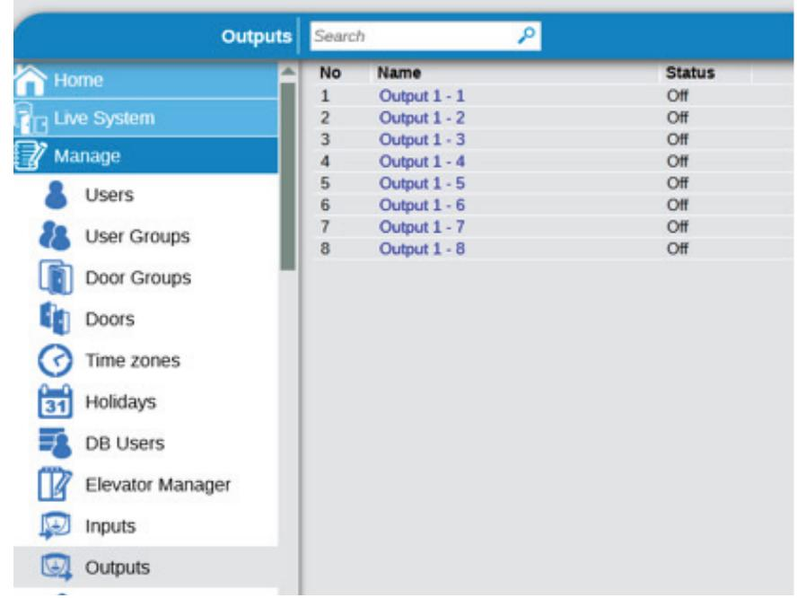
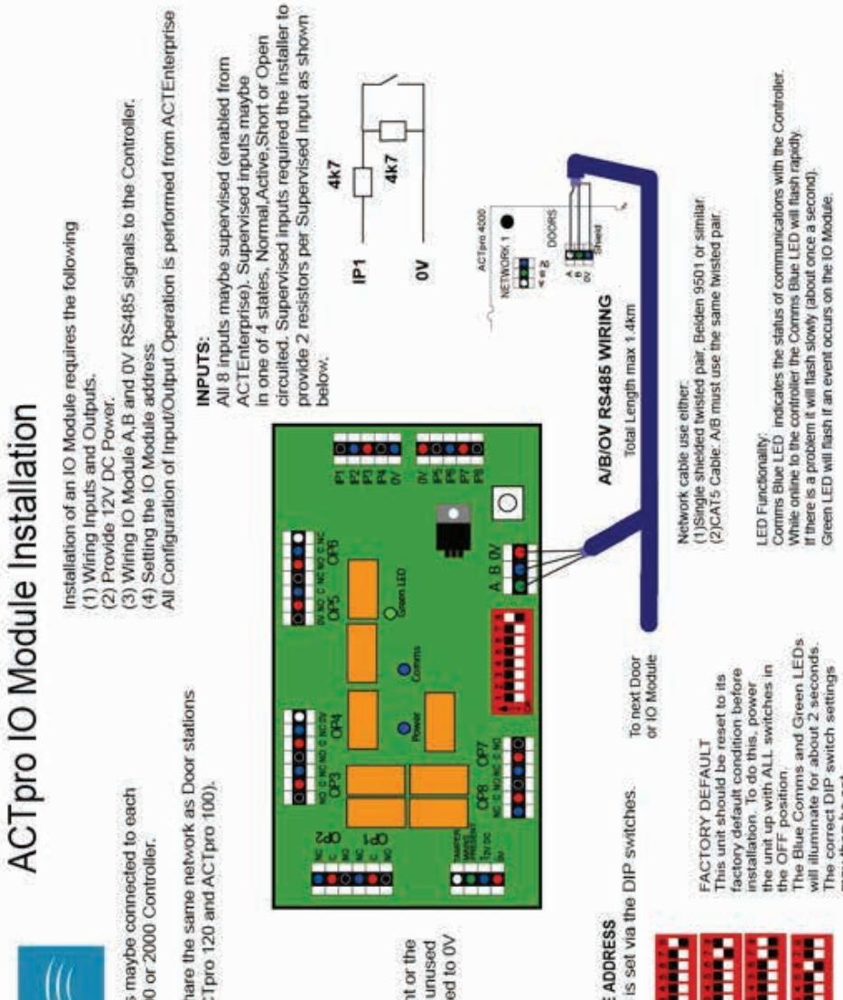

# ACTpro IOM INPUT/OUTPUT MODULE

# Installation and Configuration Instructions for the ACTpro IOM Input/Output Module

ACT Product Code: 18-00039

| Technical Specification 3                          |
|-------------------------------------------------------|
| Product Overview 3                                 |
| Features 3                                         |
| ACTEnterprise Support 3                            |
| Applications  4                                 |
| Installation 5                                     |
| Enabling IOM communications from the keypad.  5 |
| Configuration 6                                    |
| Step 1  6                                       |
| Step 2.  7                                      |
| Step 3  9                                       |
| Elevator Control 11                                |
| Step 1  11                                      |
| Step 2.  11                                     |
| Step 3  12                                      |
| Step 4  13                                      |
| Step 5  13                                      |
| Step 6  13                                      |
|                                                       |

# Technical Specification

| Voltage               | 12V DC                |
|-----------------------|-----------------------|
| Current Consumption   | 250mA                 |
|                       |                       |
| Operating Temperature | -10ºC to +50ºC        |
| Mounting              | Surface               |
| Installation          | Indoors               |
| Weight                | 500g                  |
|                       |                       |
| Construction          | Polycarbonate housing |

Communications RS485 to ACT2000/ACT4000 Dimensions 236mm wide, 165mm high, 55mm deep Construction Polycarbonate housing

## Product Overview

This product is an 8 Input/8 Output device that allows the ACT4000/ACT2000 to be used in applications where signalling to other equipment is required. Examples of this are elevator control, alarm systems, CCTV switching and general monitoring.

A maximum of 4 I/O modules may be connected to any single controller, giving control of up to 32 relays and 32 inputs per ACT4000/ACT2000.

# Features

- • 8 form C relays
- • 8 supervised inputs
- • Tamper protection
- • 3 status LEDs
- • Timer for each output
- • Input Timer
- • Output switched ON/OFF by log event, input or timezone
- • ACTEnterprise support

## ACTEnterprise Support

- • Named inputs and outputs
- • Inputs and outputs Logged
- • Normally open/closed.
- • Active on timezone
- • Active on event, user, door or user group
- • Active on input on/off
- • Active on output on/off

# Applications

#### Elevator control

In this application, a user presents a card to the proximity reader when he enters the cab. This enables the buttons for the floors the user has access to. The buttons stay on for a programmable amount of time (normally 5 seconds) and then switch off.

#### Alarm Systems

The unit can be programmed to fire a relay on alarm events such as tamper, door forced, mains fail etc. It can also monitor the status of certain inputs and switch an output when the input changes state. All changes are fully logged in ACTEnterprise, complete with timestamp.

#### Building Management

The IOM allows the ACT4000/ACT2000 to be used in building management applications. It can switch an output to turn on heating or lighting at certain times or only when someone is present. It can also switch off heating when the last person has left the room, saving on energy costs.

#### CCTV systems

Using an IO Module allows switching of CCTV cameras when someone enters a room or when access is denied.

# Configuration

All IOM Input/Output Module configurations are performed from ACTEnterprise.

#### *Step 1.*

The IOM configuration is available from ACTInstall, under Advanced Setup.

| I/O Modules                  |     |         |             |            |                  |        |        |  |
|------------------------------|-----|---------|-------------|------------|------------------|--------|--------|--|
|                              | No. | LPD Med | Lacal Bolde | Controller | Corveroller Name | Status | Labled |  |
| Quick Setup                  |     |         |             |            |                  |        |        |  |
| O Advanced Setup             |     |         |             |            |                  |        |        |  |
| Controllers/Hub Groups 12 |     |         |             |            |                  |        |        |  |
| Doors                        |     |         |             |            |                  |        |        |  |
| I/O Modules                  |     |         |             |            |                  |        |        |  |
| Card Configuration           |     |         |             |            |                  |        |        |  |
| ook                          |     |         |             |            |                  |        |        |  |
| Reports                      |     |         |             |            |                  |        |        |  |
| Settings                     |     |         |             |            |                  |        |        |  |
| Clients                      |     |         |             |            |                  |        |        |  |

Click on Add I/O Module on the top right.

| I/O Module Name:   | Cameras           |      |  |
|--------------------|-------------------|------|--|
| Controller:        | 1 - ACT4000-58005 | P    |  |
| Local Address:     | 1                 | ಕ್ಕಾ |  |
| Enabled            |                   |      |  |
| Mains Fault Report |                   |      |  |
|                    |                   |      |  |
|                    |                   |      |  |
|                    |                   |      |  |
|                    |                   |      |  |
|                    |                   |      |  |
|                    |                   |      |  |
|                    |                   |      |  |
|                    |                   |      |  |
|                    |                   |      |  |

Give the IOM a name and assign it a controller and the local I/O number. This number must be the same as the dipswitch setting on the IOM. Remember to tick the Enabled box. Finally, click the Save button on the bottom right. The IOM is now setup on the system.

# Installation

#### Please see the diagram on the last page for complete wiring.

The IOM Input/Output module is wired to the controller on the same RS-485 network as the DS100 Door stations. The IOMs are addressed using the DIP switches on the PCB. The IOMs are given any address in the range 1 to 4.

No configuration of the IOM is possible from the keypad. Configuration can only be performed from ACTEnterprise. However the IOM may be enabled from the keypad which allows the communications between the ACT2000/ACT4000 and the IOM to be tested without the need for ACTEnterprise.

#### *Enabling IOM communications from the keypad*

- 1. Enter the Installer menu by entering the installer code. The LCD on the controller will display "Installer Menu" on the top line and "System Settings" on the lower line.
- 2. Press the "0" key twice "Communications" will be displayed on the bottom line of the display.
- 3. Press the "4" key followed by the "0" five times, now "Communications IO Modules" will appear on the display.
- 4. Press the "4" and use the "0" key to select IOM address, now press the "4" to enable the communications.
- 5. If communications are established the Blue Comms LED on the IOM will flash rapidly, otherwise the LED will pulse once a second and the ACT2000/ACT4000 will display "IO Module X Offline".

The IOM is supported by ACT2000X 4.08 and ACT4000 1.00 and greater Firmware versions.

### *Step 2.*

Run ACTManage and go to the Inputs tab under Manage.

|                  | Inputs Search |             |        |
|------------------|------------------|-------------|--------|
| forne            | No               | Name        | Status |
|                  | 1                | Input 1 - 1 | Active |
| ive System       | 2                | Input 1 - 2 | Normal |
|                  | 3                | Input 1 - 3 | Normal |
| Manage           | 4                | Input 1 - 4 | Normal |
| Users            | 5                | Input 1 - 5 | Normal |
|                  | 6                | Input 1 - 6 | Normal |
| User Groups      | 7                | Input 1 - 7 | Active |
|                  | 8                | Input 1 - 8 | Active |
| Door Groups      |                  |             |        |
| Doors            |                  |             |        |
| Time zones       |                  |             |        |
| Holidays         |                  |             |        |
| DB Users         |                  |             |        |
| Elevator Manager |                  |             |        |
| Inputs           |                  |             |        |
| Outputs          |                  |             |        |
| Tenants          |                  |             |        |

Clicking on the input name goes to the input details.

| General            | Input Name: | Input 1 - 1   |    |
|--------------------|-------------|---------------|----|
| Enable Activate | Timer:      | 0             | 11 |
| Options Tenants | Controller: | ACT4000-58005 |    |

The input name may be edited from here. This is the name that will appear in the log when the input changes state.

The *Timer* option selects the amount of time the input must remain in a certain state before the change is reported. This prevents a momentary change in the input from causing a false alarm.

| General  |            |           |  |
|----------|------------|-----------|--|
| Enable   | Time Zone: | 24 Hours  |  |
| Activate | Output:    | No Output |  |
| Options  |            |           |  |

Inputs can be enabled by timezone and when an output is on. If any inputs are unused, simply set the *Time Zone* to Not Active and the *Output* to No Output. For example, you may want the input to be monitored only during the day or only when a particular output is on.

| Input 1 - 1        |         |           |      |
|--------------------|---------|-----------|------|
| General Enable  | Output: | No Output |      |
| Activate           | Door:   | No Door   | 1    |
| Options Tenants |         |           | Save |

The input may be set to activate an output or to open a door.

| Input 1 - 1                                         |                                             |      |
|-----------------------------------------------------|---------------------------------------------|------|
| General Enable Activate Options Tenants | Normally Open Supervised Log Alarm |      |
|                                                     |                                             | Save |

The *Normally Open* option allows the input to be in the normal state when the contact is open and active when the contact is closed.

If the *Supervised* option is checked, then two 4k7 resistors are required (see the wiring diagram at the end of the manual). This allows the IOM to check for tampers and shorts across the input contacts.

Installation and Configuration Instructions for the ACTpro IOM Input/Output Module

While the input is enabled, it can be logged (if the Log tick box is checked) or it can generate an *Alarm* when it goes active.

#### *Step 3.*

From ACTManage, go to the Outputs tab.

Click on an output name to edit it.

| General Options                             | Output Name:     | Output 1 . 1  |   |
|------------------------------------------------|------------------|---------------|---|
| Follow Door                                    | Timer:           | 0             | - |
| Output On Event Output Off Event Tenants | Active Timezone: | No Time zone  |   |
|                                                | Controller:      | ACT4000-58005 |   |

Each output can be assigned an individual name. The *Timer* value selects how long the relay fires for. By selecting a timezone from the *Active Timezone* drop-down box, the relay can be made activate during this timezone.

Installation and Configuration Instructions for the ACTpro IOM Input/Output Module

| Output 1 - 1                                       |                    |      |
|----------------------------------------------------|--------------------|------|
| General Options                                 | Log Normally On |      |
| Follow Door Output On Event Output Off Event | Elevator Floor     |      |
| Tenants                                            |                    | Save |

The *Options* section allows the input to be Logged as it changes state, to be Normally On or to act as an Elevator Floor.

| Output 1 - 1       |       |         |      |
|--------------------|-------|---------|------|
| General Options | Door. | No Door | ▼    |
| Follow Door        |       |         |      |
| Output On Event    |       |         | Save |
| Output Off Event   |       |         |      |
| Tenants            |       |         |      |

It may be programmed to *follow* the state of a door. For example as a door opens, the output will activate. When the door closes, the output will de-activate.

| General Options          | Event:     | No Event  |  |
|-----------------------------|------------|-----------|--|
| Follow Door                 | Door:      | No Door   |  |
| Output On Event             |            |           |  |
| Output Off Event Tenants | Area       | No Area   |  |
|                             | User Group | No groups |  |

*Output On Events / Output Off Events* section allows events occurring on a Door to turn the Output relay on or off. The available event groups are Access Granted, Access Denied, Door Alarm, Fire, Technical Fault, Door Armed, Door Disarmed. Access Granted event group consists of Access/Exit grant event including push button exit. Access Denied includes both Access and Exit denied event. The Door Alarm event group consists of the ajar, forced and duress events. Technical Faults event group consists of Tamper/Mains Fault and Offline events.

# Elevator Control

Elevator control is one particular application of the IOM. ACTEnterprise allows programming of users, permitting them access to different floors in an elevator lift shaft at different times.

The outputs on the IOM are wired into an elevator controller. Up to 32 floors maybe controlled from a single ACT4000/2000. However controllers may be networked giving control of more floors.

#### *Step 1.*

The first step is to select the Elevator Floor option for the output.

| Output 1 - 1                                         |                                        |
|------------------------------------------------------|----------------------------------------|
| General Options Follow Door Output On Event | Log Normally On V Elevator Floor |
| Output Off Event Tenants                          | Save                                   |

This means that this relay acts as an Elevator Floor.

### *Step 2.*

From ACTManage, select Elevator Manger, then select the Floor Groups tab.

| Elevator Manager            | Search                          | P                | Print |
|-----------------------------|---------------------------------|------------------|-------|
| 14 Carroo Live System | Elevator Groups Floor Groups | 0 149 Name |       |
| Manage                      |                                 |                  |       |
| Users                       |                                 |                  |       |
| User Groups                 |                                 |                  |       |
| Door Groups                 |                                 |                  |       |
| Doors                       |                                 |                  |       |
| Time 20105                  |                                 |                  |       |
| Holidays 55              |                                 |                  |       |
| DB Users                    |                                 |                  |       |
| Elevator Manager            |                                 |                  |       |
| Inputs 3                 |                                 |                  |       |

Click the Add Floor Group button on the top right to generate a new Floor Group in the database.

Installation and Configuration Instructions for the ACTpro IOM Input/Output Module

#### *Step 3.*

| General | Number:                                                                              | 1                                                         |                |
|---------|--------------------------------------------------------------------------------------|-----------------------------------------------------------|----------------|
| Tenants | Name:                                                                                | Smith & Co                                                |                |
|         | Cantroller                                                                           | ACT4000-58005                                             | P              |
|         | Available Floors                                                                     | Assigned Floors                                           |                |
|         | Name Cutput 1 - 4 Output 1 - 5 Output 1 - 6 Output 1 - 7 Output 1 - B | Name Output 1 - 1 Output 1 - 2 Output 1 - 3 4 |                |
|         |                                                                                      |                                                           | Delete Save |

Select a controller that the Floor Group will belong to and assign the Floor Group a name.

All the outputs that are assigned the Elevator Floor option AND belong to the selected controller will appear in the *Available Floors* box on the left. Select the desired floors and use the right arrow button to move the desired Floors into the group. Click the Save button on the bottom right.

#### *Step 4.*

The next step is to create an Elevator Group. Select the Elevator Groups tab. Click the Add Elevator Group button on the top right.

| General |    |                           |  |              |    |
|---------|----|---------------------------|--|--------------|----|
| Tenants |    | Number: 1                 |  |              |    |
|         |    | Name: Smith & Co Group |  |              |    |
|         |    | Floor Group               |  | Time Zone    |    |
|         | 1  | Smith & Co.               |  | 24 Hours     |    |
|         | 2  | No Floor Group            |  | No Time zone |    |
|         | 3  | No Floor Group            |  | No Time zone | レ  |
|         | 4  | No Floor Group            |  | No Time zone | レ  |
|         | ਦੇ | No Floar Group            |  | No Time zone | 14 |
|         | 6  | No Floar Group            |  | No Time zone | 1+ |
|         | 7  | No Floar Group            |  | No Time zone |    |
|         | 8  | No Floar Group            |  | No Time zone |    |

Assign the Elevator group a name. Set the floor permissions by selecting the floor group and the timezone when access is allowed.

### *Step 5.*

A User Group must be created and the Elevator group assigned. This means that any user with this user group is allowed access to the floors assigned in the Elevator Group.

### *Step 6.*

Finally a Door must be assigned to a Floor Group. This would be the Door that has the reader attached in the Elevator Cab. The Floor Group assigned would consist of all the possible floors that are available from the elevator. Go to the door details and assign a Floor Group.

| Door Details         | Door 1 - 1                        |              |            |      |
|----------------------|-----------------------------------|--------------|------------|------|
| Home Live System  | General Door Groups Actions | Floor Group: | Smith & Co | Save |
| Manage               | Reporting                         |              |            |      |
| Users User Groups | Floor Group Tenants            |              |            |      |
| Door Groups          |                                   |              |            |      |
| Doors                |                                   |              |            |      |
| A T                  |                                   |              |            |      |

Access Control Technology Ltd. reserve the right to change the contents of this manual and the system it applies to without prior notice.

While every effort has been taken by ACT to ensure the accuracy of the information contained within this document, ACT assumes no responsibility for any errors or omissions. No liability is assumed for damages resulting from the use of information contained within this document.

Ireland Office Unit C1, South City Business Centre, Tallaght, Dublin 24, Ireland

United Kingdom Office Birchwood 1, Dewhurst Road, Birchwood Warrington, WA3 7GB, UK

Ireland: +353 (0)1 466 2570 UK: +44 (0)161 236 9488 Email: info@act.eu www.act.eu www.actcloud.net

Copyright © 2016 Access Control Technology Ltd. Part No. 18-00039