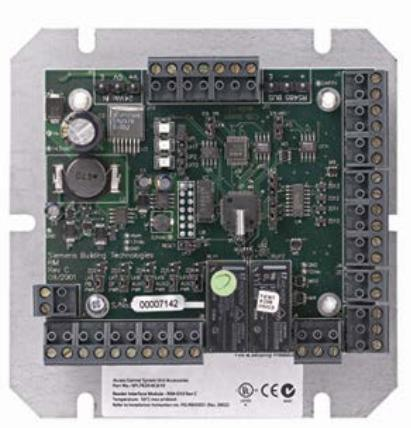
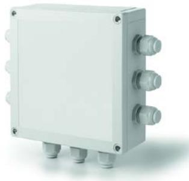

SiPass® integrated

## **ADD5100, ADD5110, ADD5160, ADD5190**

# **Dual Reader Interface (DRI)**

- **Interface module for up to two card readers**
- **Support for an entry reader and an exit reader to monitor and control a door from both sides**
- **Easy installation**
- **Four product variants in three different housings**

The ADD5100, ADD5110, ADD5160 and ADD5190 act as an interface between card readers and the advanced central controller (AC5100, AC5102 or AC5200). Each of them can support up to two card readers. When a cardholder presents an access card at an entry or exit reader the dual reader interface interprets the encoded information and sends this data to the controller. The controller then checks the validity of the cardholder' and if the appropriate permissions have been assigned' the controller sends a message back to the dual reader interface allowing it to unlock the door and provide passage. A dual reader interface can also report the status of the door (locked or unlocked) at any time.

- **Supports all popular reader technologies including, but not limited to:**
	- ARxxS-MF OSDP ASCII
	- ARxxS-MF OSDP BCD Packed
	- ARxxS-MF OSDP BCD Unpacked
	- ARxxS-MF OSDP Custom
	- ARxxS-MF OSDP Mifare Facility
	- ARxxS-MF OSDP Mifare GID
	- ARxxS-MF OSDP Mifare Numeric
	- ARxxS-MF OSDP Raw
	- ARxxS-MF OSDP Sector 7 26-bit
	- iClass OSDP
	- 3rd Party Reader Support
	- Biometric/Fingerprint Reader Support
- Supports all readers with SiPass reader protocol
- Support for numeric pinpad readers
- Support for an entry reader and an exit reader
- Auxiliary 12VDC power source
- Lock / door strike output (relay driven)
- Request-to-exit input
- Door contact input
- Three auxiliary inputs
- Auxiliary output (relay driven)
- Selectable supervision of input wires
- Communications status LED
- Activity status LED
- Power status LED
- Host system compatibility for configuration download via ACC
- 256 Access Levels in Offline mode

#### **Description**

ADD5100, ADD5110, ADD5160 and ADD5190 dual reader controllers (DRIs) secure doors or barriers by supporting one entry reader, one exit reader, a door strike to lock and unlock the door, and a door contact to detect the door's position (open or closed).

The on-board inputs of a DRI are individually supervised, which ensures that any wire tampering generates an alarm message in the system.

Each DRI has three programmable auxiliary input connections for the monitoring of system aspects such as cabinet doors, duress switches, or PIR motion sensors. A DRI also includes an auxiliary output which can be connected to a buzzer, strobe light or similar device and configured to trigger that device when security is breached.

The DRIs are fully updateable using the latest flash technology, and can be easily programmed via the host system to operate in their intended mode. This leading-edge technology allows the DRIs to be re-programmed or re-configured and used in conjunction with other Vanderbilt security products, providing a complete and fully expandable security system.

The DRIs have been carefully engineered so that they can be easily mounted in a variety of environments. Most commonly a DRI is either installed near the door which it controls, or centrally in the same cabinet as the advanced central controller.

The DRI is available in three different variants in addition to the basic module (DRI including base plate) shown on the first page of this data sheet.

### **ADD5110 – DRI including base plate and plastic housing**

**ADD5160** – **DRI in weatherproof housing**

#### **ADD5190 – DRI in a cabinet**

|                        | ADD5100, ADD5110, ADD5160, ADD5190                                                                                                                                                                                                                                                         |  |
|------------------------|-----------------------------------------------------------------------------------------------------------------------------------------------------------------------------------------------------------------------------------------------------------------------------------------------|--|
| Interface              | FLN connection to controller: RS485 To readers: One RS485 bus for up to two RS485 readers (CerPass protocol) OR two Wiegand/Clock&Data ports OR 2 OSDP-readers (2-wire RS-485, 2,400 to115,200 bps, asynchronous, half duplex, 1 start bit, 8 data bits, and 1 stop bit) |  |
| Operating voltage      | 24 VDC                                                                                                                                                                                                                                                                                        |  |
| Power output           | Reader: 300 mA Ancillary: 1 A                                                                                                                                                                                                                                                              |  |
| Power consumption      | 25 W                                                                                                                                                                                                                                                                                          |  |
| Outputs                | 1 x Lock output relay (30 VDC, 2 A) 1 x Auxiliary relay (30 VDC, 2 A)                                                                                                                                                                                                                      |  |
| Inputs                 | 1 x REX button 1 x Door contact 3 x Auxiliary All inputs unsupervised or supervised                                                                                                                                                                                                  |  |
| Tamper switch          | Optional, auxiliary input                                                                                                                                                                                                                                                                     |  |
| Firmware               | Flash upgradeable                                                                                                                                                                                                                                                                             |  |
| Indicators             | Power, Activity, Communication                                                                                                                                                                                                                                                                |  |
| Operating temperature  | 0 to +50 °C                                                                                                                                                                                                                                                                                   |  |
| IP rating              | ADD5110: IP56 ADD5160: IP66 ADD5190: IP20                                                                                                                                                                                                                                               |  |
| Housing                | ADD5110: ABS plastic ADD5160: ABS plastic ADD5190: Steel                                                                                                                                                                                                                                |  |
| Dimensions (W x H x D) | ADD5100: 125 x 125 x 34 mm ADD5110: 150 x 150 x 76 mm ADD5160: 180 x 180 x 60 mm ADD5190: 200 x 300 x 95 mm                                                                                                                                                                          |  |
| Approval               | ADD5100: CE' UL294' C-Tick ADD5110: CE ADD5160: CE ADD5190: CE                                                                                                                                                                                                                       |  |

#### **Details for ordering**

| Type     | Part no.      | Designation                                | Weight  |
|----------|---------------|--------------------------------------------|---------|
| ADD51001 | V6FL7820-     | Dual reader interface including base plate | 0.30 kg |
|          | 8CA10         |                                            |         |
| ADD51102 | V6FL7820-     | Dual reader interface including base plate | 0.65 kg |
|          | 8CA11         | and plastic housing                        |         |
| ADD5160  | V6FL7820-     | Dual reader interface in weatherproof      | 0.50 kg |
|          | 8CA16         | housing                                    |         |
| ADD5190  | V54505-C16-A1 | Dual reader interface in cabinet           | 2.8 kg  |

1 Replaces type designation RIM-010

2 Replaces type designation RIM-011

Issued by Vanderbilt International (IRL) Ltd. Clonshaugh Business and Technology Park Clonshaugh Dublin 17 Ireland

© 2021 Copyright by Vanderbilt International (IRL) Ltd.

Data and design subject to change without notice. Supply subject to availability.

#### www.vanderbiltindustries.com Document no. **A24205-A335-B115 Rev 1.3** Edition 11.2021