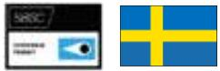
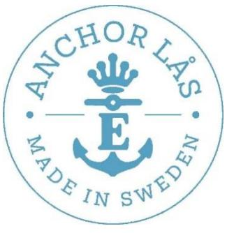
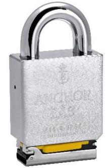
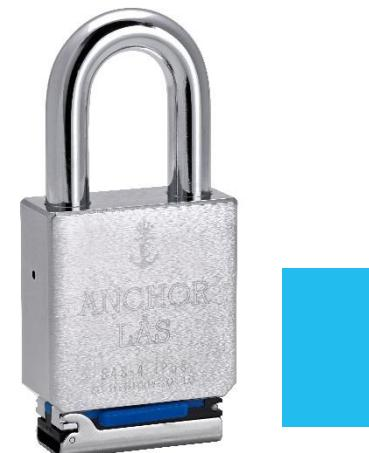
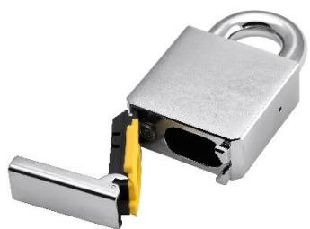
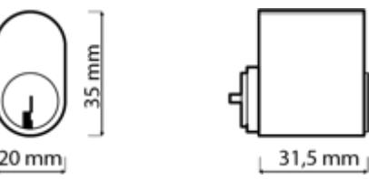
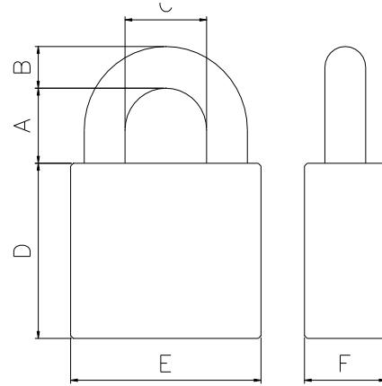

Ett kraftigt klass 4 hänglås för oval cylinder där cylindern är skyddad enligt IP68-standarden. Lämplig för låsning i tuffare miljöer, t.ex. containrar, lager, grindar och liknande. Hänglåset är konstruerat för montering av skandinavisk ovalcylindern och levereras med O-ringar i bygelhålen och med en tät, utfällbar lucka över cylindern. Hermetiskt försluten. Gummitätningen levereras i svart som standard, men finns i flera olika färger för att förenkla märkningen av t.ex. område, tillhörighet. Patenterad produkt.

| A     | B  | C  | D  | E  | F  |
|-------|----|----|----|----|----|
| 27/50 | 15 | 30 | 87 | 70 | 30 |

## > Hänglåskropp: 70mm härdat stål

- > Bygel: 15mm härdat stål
- > Ytbehandling: Krom
- 
- 
- 
- 

Grade 5 enligt EN 12320:2021

+ A1:1999 + A2:2013.

IP-class: IP68 Standard: EN 60529:1991 + A1:2000 + A2:2013. IEC 60529:1989

- > Cylindertyp: Oval
- > Bygelhöjder: 27 resp 50mm
- > Klassning: Klass 4 enligt SSF 014 utg 4.