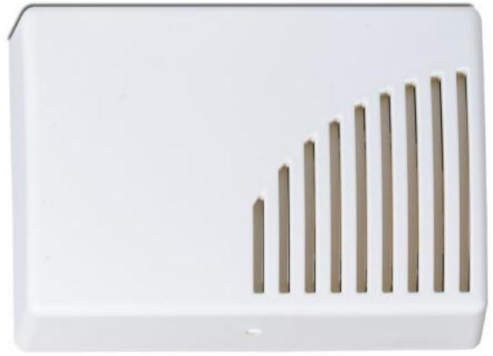

## AS210N-L

Produktblad

Inomhussiren, 1 ton, vit

### AS210N-L

AS210N-L är en inomhussiren som lämpar sig mycket bra för installation i hem- och industrimiljö. Sirenen har en modern design och är enkel att installera, kan monteras både vertikalt och horisontellt. AS210N-L har låg strömförbrukning och är sabotageskyddad.

#### Standardprestanda

- EEstetisk design
- ELåg strömförbrukning
- EHög ljudvolym 112dB
- EEnkel installation
- E Sabotageskyddad
- EVertikalt eller horisontellt montage
- ESBSC-intygad

# AS210N-L

Inomhussiren, 1 ton, vit

### Tekniska data

| Matningsspänning | 10 - 14 VDC     |
|------------------|-----------------|
| Frekvens         | 2500 - 3000 Hz  |
| Ljudtryck vid 1m | 112 dB          |
| Strömförbrukning | 130mA vid 12VDC |
| Mått             | 155x114x44 mm   |
| Temperaturområde | -10 ºC - +55 ºC |
| Material         | ABS             |
| Färg             | Vit             |
| IP-klass         | IP31            |
| Miljöklass       | II              |

Order data

Artikelnummer Beskrivning AS210N-L Inomhussiren, 1 ton, vit

