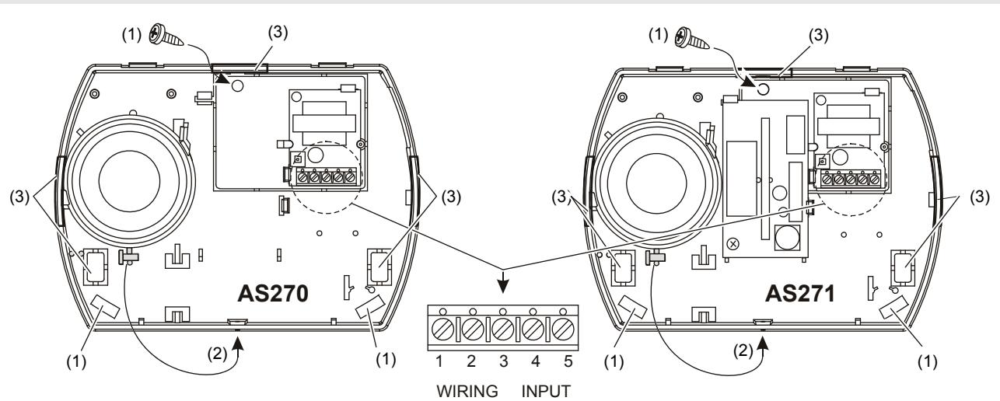

# AS270/AS271 Indoor Siren Installation Sheet

**EN** 

# **EN: Installation Sheet**

# **Description**

AS270 is a one-tone internal siren, ideal for use as an internal alarm sounder for residential and industrial alarm applications.

AS271 is a one-tone siren with a beacon, ideal for use as an internal alarm sounder for residential and industrial alarm applications.

**Caution:** Only use external current limited power supply. We recommend 5 A supply.

#### **Figure legend**

| Item | Description               |
|------|---------------------------|
| (1)  | 3 mounting screws         |
| (2)  | Siren cover closing screw |
| (3)  | 5 cable input options     |

#### **Connection**

| Terminal | Description |    | Terminal Description    |
|----------|-------------|----|-------------------------|
| 1, 2.    | Tamper      | 4. | 0 V speaker             |
| 3.       | +12 V       | 5. | 0 V beacon (AS271 only) |

**WARNING:** The beacon uses high voltage. To avoid personal injury or death from electrocution, do not touch bare wires and beacon electronics before the energy discharges.

## **Specifications**

| 9 to 14.2 V 130 mA at 12 V (typical) 104 dB at 1 m (typical) 2500 to 3000 Hz (typical) −25 to +55°C |
|-----------------------------------------------------------------------------------------------------------------|
|                                                                                                                 |
|                                                                                                                 |
|                                                                                                                 |
|                                                                                                                 |
| EN 50131: −10 to +55°C                                                                                          |
| EN 50131: 93% max.                                                                                              |
| 155 × 114 × 44 mm                                                                                               |
|                                                                                                                 |
| 13 to 14.2 V                                                                                                    |
| 110 mA                                                                                                          |
| 100 000 peak lumens                                                                                             |
|                                                                                                                 |
| Standard fitted                                                                                                 |
| IP315                                                                                                           |
|                                                                                                                 |

### **Regulatory information**

| Manufacturer  | UTC Fire & Security Americas Corporation, Inc. 1275 Red Fox Rd., Arden Hills, MN 55112-6943, USA                   |
|---------------|-----------------------------------------------------------------------------------------------------------------------|
|               | Authorized EU manufacturing representative: UTC Fire & Security B.V. Kelvinstraat 7, 6003 DH Weert, Netherlands |
| Certification |                                                                                                                       |

| EN 50131 | EN 50131-4, Security Grade 2, Environmental class II (Pry-off tamper is not certified for an EN 50131 Security Grade 2 applications.)                                                                                                                                                                                                                                |
|----------|----------------------------------------------------------------------------------------------------------------------------------------------------------------------------------------------------------------------------------------------------------------------------------------------------------------------------------------------------------------------------|
|          | Tested and certified by the Norwegian testing and certification body DNV.                                                                                                                                                                                                                                                                                               |
|          | 2002/96/EC (WEEE directive): Products marked with this symbol cannot be disposed of as unsorted municipal waste in the European Union. For proper recycling, return this product to your local supplier upon the purchase of equivalent new equipment, or dispose of it at designated collection points. For more information see: www.recyclethis.info. |

# **Contact information**

www.utcfireandsecurity.com or www.interlogix.com.

For customer support, see www.utcfssecurityproducts.eu