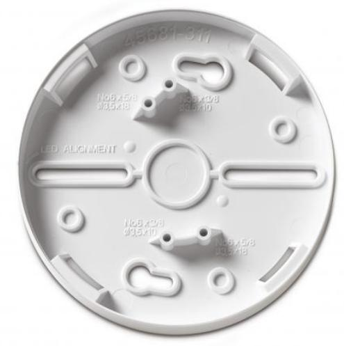

## AS961

Produktblad

Förhöjningsplatta till sockelsiren

### Allmänt

Förhöjningsplatta till sockelsiren gör det möjligt att ytmonterade kablar kan anslutas till sockelsiren.

#### Standardprestanda

- EEnkel att montera
- EIdealisk för användning vid betongtak
# AS961

Förhöjningsplatta till sockelsiren

#### Order data

|       | Artikelnummer |
|-------|---------------|
| AS961 |               |

 Förhöjningsplatta till sockelsiren

Beskrivning

