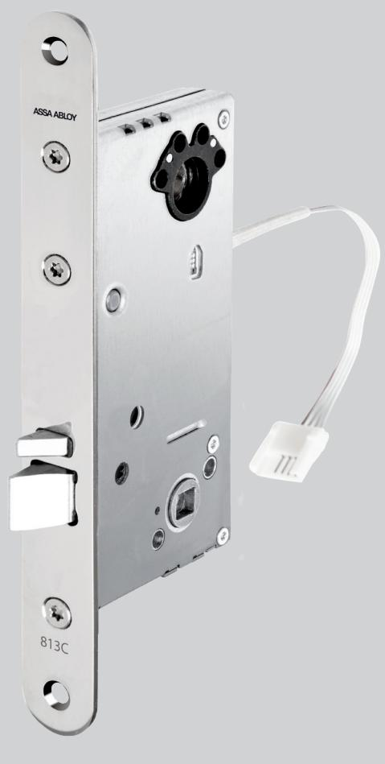
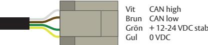
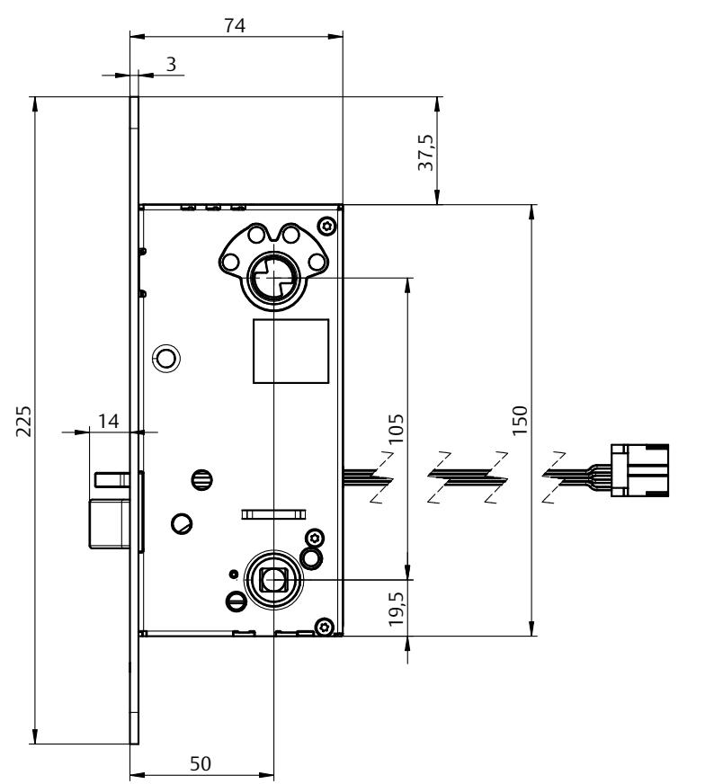
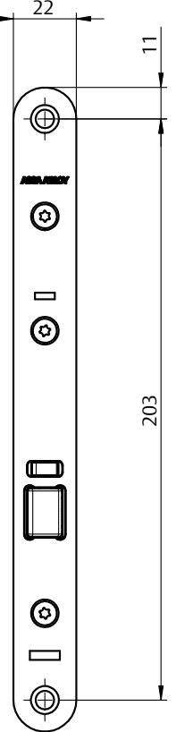

## ASSA ABLOY 813C-50

### Elektromekaniskt låshus med fallkolv i låsklass 1 SSF 3522-1093

#### **Användningsområde**

ASSA ABLOY Eltryckeslås är anpassade för högfrekventa dörrar med ASSA modul- eller Connecturtag. Passar bra som daglåsning och intern låsning inom handel, kontor och industri eller i entréer och allmänna utrymmen i flerfamiljshus. ASSA ABLOY Eltryckeslås är godkänt för montage i brandcellsgräns E/EI 120.

#### **Funktion**

Trycket aktiveras med elektrisk styrning från in- och utsidan, detta används sedan för att öppna dörren. ASSA ABLOY 813C-50 är en i familjen av multifunktionella Eltryckeslås med två huvudtyper och fem varianter:

• Trycket på in- och utsidan aktiveras elektriskt via en signal från Passersystem, kodlås eller liknande, alternativ kopplas aktivering av insidan trycke till en öppnarknapp. Låset är ställbart utifrån för höger/vänster dörr.

- Elektrisk styrd in- och utsida (fixed spindle)
ASSA 813C-50 är ett digitalt lås baserat på vår CAN-bus teknologi Hi-O. Hi-O innebär att enheterna har en inbyggd mikrodator och kommunicerar med varandra för plug-and-playinstallation, synkronisering av dörrdrift, övervakning av beteenden och för att skicka diagnostisk information.

En Hi-O-enhet ska anslutas till en Hi-O-buss via DAC 530/564, alternativt till ett analogt system via I/O BOX 350. I/O BOX 350 möjliggör en installation av ett digitalt Hi-O lås till en analog relästyrd anläggning.

#### **Egenskaper**

- Förreglad tryckesfall
- Låset kan alltid manövreras med nyckel/vred
- Brandgodkänt E/EI 120
- Certifierat enligt SSF 3522-1093, klass 1.
- Multifunktionellt
	- Enkelt omställbart rättvänd/omvänd funktion
	- Vändbar fallkolv
	- Multispänning 12-24V
- Statusindikering tillgänglig på Hi-O-bussen och via relä på I/O BOX 350
	- Förregling
	- Error
	- Dörr forcerad
	- Dörrlägesindikering

# ASSA ABLOY 813C-50

## Elektromekaniskt låshus med fallkolv i låsklass 1 SSF 3522-1093

#### **Inkoppling**

Inkoppling till Hi-O bussen sker med fyra kablar, två för spänning, två för kommunikation. Använd färdigkontakterad kabel EA226 (10 m) vid installation. Kabeln kopplas in på valfritt ställe på Hi-O bussen.

#### **Strömförbrukning**

Standby: 1W Inkoppling trycke: 2,64W under en cykel på 0,08sek

Watt / Spänning = Ström I = P / U Ström = Effekt / Spänning

| Lås     | Förregling | Hakregel | Split spindle | Fixed spindle | Auto Hook |
|---------|------------|----------|---------------|---------------|-----------|
| 813C-50 | Ja         | Nej      | Nej           | Ja            | Nej       |

ASSA ABLOY Opening Solutions Sweden P.O. Box 371 SE-631 05 Eskilstuna Sweden

Phone +46 (0)16 17 70 00 Fax +46 (0)16 17 70 49

Customer support: Phone intl. +46 (0)16 17 71 00 Phone nat. 0771-640 640 Fax +46 (0)16 17 73 72 e-mail: helpdesk.se.openingsolutions@assaabloy.com www.assaabloyopeningsolutions.se

