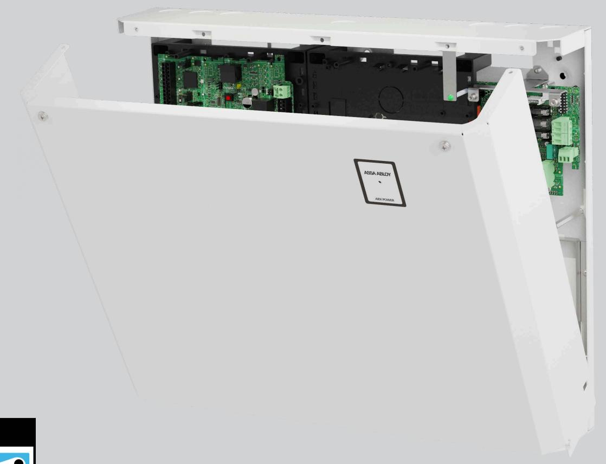
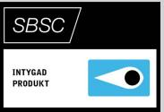

## ASSA ABLOY ARX Power9101S

ARX centralenhet med inbyggd batteribackup

ASSA ABLOY ARX Power 9101S är en kompakt allt-i-ett lösning för mindre sattelit installationer med ARX Säkerhetssystem. Enheten innehåller förutom batteribackup också en centralenhet 9101 för en trådbunden dörr, SIO6-4 för sex larmingångar samt stöd för virtuella larmsektioner. Inbyggd larmöverföring direkt från centralenhet upp till larmklass 2.

ARX Power 9101S har färdiga monteringsplatser för utökning av en stor mängd olika kort, DAC, SIO och LCU9101, ARX Power Fuse 05. Se sidan två för utförligare information.

Enheten har en diskret, stilren design med en passiv konstruktion som leder ut värme utan fläktar vilket gör den helt tyst. Stor designfokus har lagts på installationsvänlighet med exempelvis rymlig kapsling för enkel kabelhantering, VMC-snäppfästen för tillbehör och välplanerade kabelgenomföringar. Genom att kombinera ARX hårdvara och batteribackup i samma kapsling sparas utrymme, förenklar installation och ger en kostnadseffektiv lösning både till material och arbetsinsats.

ARX Power 9101S är larmgodkänd upp till larmklass 2 och uppfyller elsäkerhetsstandard EN 62368-1.

Fellarm från batteribackup kopplas från balanseringskort på strömförsörjning till valfri larmingång.

Extra tanke har också lagts på att designa enheten för att så enkelt som möjligt kunna ersätta befintliga föråldrade system.

ARX Power 9101S har skydd mot överlast, överspänning, övertemperatur, kortslutning och djupurladdning. Den rymmer upp till 2 st 20Ah batterier och kan vid behov kompletteras med en batteribox i samma formfaktor – ARX Power Box som rymmer ytterligare upp till 2 st 20Ah batterier.

Enheten monteras enkelt på vägg.

# ASSA ABLOY ARX Power 9101S

ARX centralenhet med inbyggd batteribackup

## **Data**

- Matningsspänning: 230V AC
- Inström: 1,7A vid 230V AC
- Egenförbrukning:
	- o Elnätsdrift: 261mA
	- o Batteridrift: 251mA
- Utgångsspänning: 27,3 V DC
- Kontinuerlig last 4A, 5A peak
- Godkänd medellast enligt SSF1014:
- o Larmklass 1/2: 1,35A
- 7 larmingångar
- 5 reläutgångar
- 1 ingång öppnaknapp
- 1 övervakad transistorutgång
- 1 dörr med in-/ut -läsare med larmstyrning
- 1 Hi-O kommunikationsport
- 1 CL-20 kommunikationsport
- 1 ethernetanslutning

## **Batteri**

- o UPLUS: 2st 7,2Ah 12V eller
- o UPLUS: 2st 20Ah 12V
- Temperaturområde +5°C till +40°C
- Relativ fuktighet 75%
- IP-klass 30 endast inomhus

## **Certifikat**

- LK 2, Security Grade 3, MK 1 Environment Class 1. EN50131-1-A1
- EN50136 Security Grade 3, SP4
- EN 62368-1 SE
- EN 50131-6
- SBSC intyg 16-130
- Kräver ARX version 4.7 eller högre

## **Mått och vikt**

- Bredd: 444mm
- Höjd: 366mm
- Djup: 108mm
- Vikt: 5,85kg utan batterier

ASSA ABLOY Opening Solutions Sweden P.O. Box 371 SE-631 05 Eskilstuna Sweden

Phone +46 (0)16 17 70 00 Fax +46 (0)16 17 70 49

Customer support: Phone intl. +46 (0)16 17 71 00 Phone nat. 0771-640 640 Fax +46 (0)16 17 73 72 e-mail: helpdesk.se.openingsolutions@assaabloy.com www.assaabloyopeningsolutions.se

## **Larmhändelser från balanseringsingång:**

- Balanseringsingång: Sabotage, Nätbortfall och Fel UPS (Säkringsfel, Laddfel överspänning, Laddfel underspänning, Ej anslutet batteri, Låg batterispänning)
## **Artikelnummer**

| • | ARX Power 9101S          | S55299101165S   | E58 014 96 |
|---|--------------------------|-----------------|------------|
|   | Tillbehör                |                 |            |
|   | • ARX Power Firmware Kit | S55299300100    | E58 014 97 |
|   | • ARX Power Box          | S5529X00B165    | E58 014 35 |
|   | • ARX Power Fuse 05      | S5529X00F160    | E58 014 36 |
|   | • LCU9101IV WOB          | S58910142085WOB | E58 014 99 |
|   | • SIO6-4                 | S5566512N160    | E58 703 81 |
|   | • DAC530III              | S5566503085     | E58 703 97 |
|   | • SIO12-3WOB             | S5890167N085WOB | E58 014 98 |
|   | • SIO2-16                | S5590169N085    | E58 703 65 |
|   |                          |                 |            |

## **Batteri**

| • • UPLUS 12V, 7,2Ah, 10-12 år S511107084 | E53 320 95 |
|-------------------------------------------|------------|
| • • UPLUS 12V, 20Ah, 10-12 år S511104084  | E53 320 97 |

# ARX Power 9101S

We reserve the right to correct any printing errors and update the information after printing.