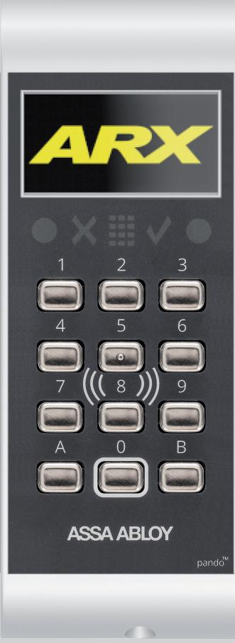
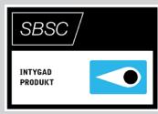
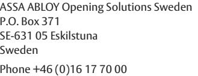

# ASSA ABLOY Pando™ Display Go

Generisk läsare med display och knappsats

### **Användningsområde**

ASSA ABLOY Pando™ Display Go är en beröringsfri generisk läsare för fysiska kort och taggar samt mobila kort. Läsaren används för passage och manövrering av ARX Larm vid dörr eller som manöverpanel.

ASSA ABLOY Pando™ Display Go kan även användas som uppdateringsläsare för offline med DESFire kort/taggar.

### **Funktion**

För enkelt handhavande har läsaren strategiskt placerade upplysta symboler och grafisk display för kommunikation med användaren. Knappsatsen är bakgrundsbelyst och knapparna är slittåliga av rostfritt stål.

Traditionell avläsning vid läsaren av fysiska identiteter lagrade på tagg eller kort samt digitala identiteter lagrad i din mobiltelefon. Rekommenderad avläsning med Mobile Access är Tap, vilket innebär att användaren visar sin mobil för läsaren likt traditionell avläsning med kort eller tag. På längre avstånd sker avläsning med BLE från din mobiltelefon där flera alternativ är möjliga. Aktivera läsning med knapptryckning på läsaren. Gester med mobiltelefon för Twist & go. Seamless, avläsning automatisk inom kommunikationsavstånd.

## **Egenskaper**

Anpassad för inomhus och utomhusmontage Pando Display Go stöder Hi-O™ samt SIO-kommunikation. Med hjälp av Hi-O kan varje enhet (läsare, lås, och så vidare) erbjuda intelligent driftövervakning i realtid.

Flera samtidiga kortteknologier hanteras av läsaren, vilket skapar möjlighet att succesivt migrera från en teknologi till en annan, utan att behöva dubbla passerkort.

Funktionsknappar används för en mängd övriga funktioner som till exempel uppställning av dörr, nedlåsning av dörr och larmmanövrering.

Mobile Access med krypterad SEOS. UID/Serienummeravläsning av kort/tag i grundutförande. Kan konfigureras för krypterad DESFire applikationsläsaning med High Secure Cards

# ASSA ABLOY Pando™ Display Go

# **Data**

- Spänningsmatning: 12 24V DC
- Strömförbrukning Min: 40mA, Max: 48mA
- Effektförbrukning: 1,5W
- Vikt: 324 g
- Mått (mm): B 70 x H 185 x D 23
- Temperaturområde: -25˚C till +55˚C
- Luftfuktighet: 5% 95%
- IP-klassning: IP54

### **Kommunikation**

- Lästeknologi: Generisk 13,56MHz (Mifare Classic, Mifare Ultralight (UID), Mifare DESFire EV1/EV2/EV3, NFC, iClass och SEOS)
- Lästeknologi BLE: SEOS
- 1 st CAN (Hi-O)
- 1 st RS-485 (SIO-kommunikation)
- Hi-O till DAC530/DAC630/DAC564 eller LCU9101
- SIO till tilläggskort på LCU9101 för DESFire uppdateringsläsare
- SIO för manöverpanel

### **Certifierad för**

- Kortförbikopplare SSF 1014, utgåva 5
- SBSC intyg 16-129
- LK 3/4 Security Grade 4, MK3

### **Material**

- ABS-NCS
- Kretskort halon-/halogenfri
- Gjuten bottenplatta
- OS: FreeRTOS (www.freertos.org)

### **Indikeringar**

- Symboler och ljud indikerar: PIN-kod, ogiltig, låst/olåst, status larmområde, knapptryckningar
- Display med anpassande typsnitt

Customer support: Phone intl. +46 (0)16 17 71 00 Phone nat. 0771-640 640 helpdesk.se.openingsolutions@assaabloy.com assaabloy.com

| 1 2 3 4 5 6 7 8 9 A 0 B |      |
|----------------------------------------------------------|------|
|                                                          |      |
| 69,7                                                     | 23,7 |

### **Övrigt**

186,2

- Inbyggda sabotagekontakter mot skal och vägg
- Belyst knappsats (valbart om knappsatsbelysningen, ska vara ständigt aktiv, eller följa kod/PIN-symbolen)
- Läsavstånd med mobil är beroende på modell, max ca 8m

### **Artikelnummer**

- ASSA ABLOY Pando Display Go, Vit S559886J085 E58 719 68
## **Tillbehör**

- ASSA ABLOY Pando Display skal i olika färger
- Key Setupkort, Mobile Access S5590495996