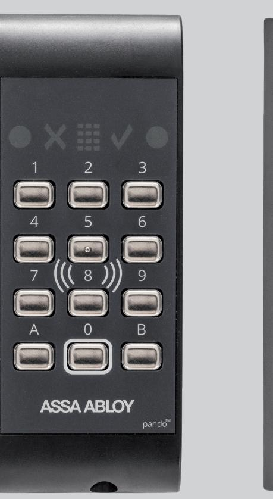
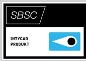
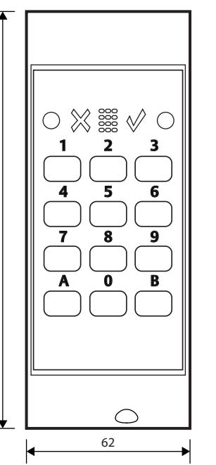
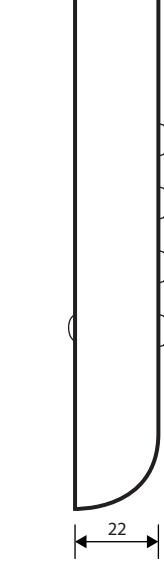

# ASSA ABLOY Pando™ Secure Go

# Generisk läsare med knappsats

## **Användningsområde**

ASSA ABLOY Pando™ Secure Go är en beröringsfri generisk läsare för fysiska kort och taggar samt mobila kort. Läsaren används för passage och manövrering av ARX Larm.

#### **Funktion**

För enkelt handhavande har läsaren strategiskt placerade upplysta symboler för kommunikation med användaren. Knappsatsen är bakgrundsbelyst och knapparna är slittåliga av rostfritt stål. Traditionell avläsning vid läsaren av fysiska identiteter lagrade på tagg eller kort samt digitala identiteter lagrad i din mobiltelefon.

Rekommenderad avläsning med Mobile Access är Tap, vilket innebär att användaren visar sin mobil för läsaren likt traditionell avläsning med kort eller tagg.

På längre avstånd sker avläsning med BLE från din mobiltelefon där flera alternativ är möjliga. Aktivera läsning med knapptryckning på läsaren. Gester med mobiltelefon för Twist & go. Seamless, avläsning automatisk inom kommunikationsavstånd.

## **Egenskaper**

Anpassad för inomhus och utomhusmontage Pando Secure Go stöder Hi-O™-kommunikation med dörrcentral.

Med hjälp av Hi-O kan varje enhet (läsare, lås, och så vidare) erbjuda intelligent driftövervakning i realtid.

Flera samtidiga kortteknologier hanteras av läsaren, vilket skapar möjlighet att succesivt migrera från en teknologi till en annan, utan att behöva dubbla passerkort.

Funktionsknappar används för en mängd övriga funktioner som till exempel uppställning av dörr, nedlåsning av dörr och larmmanövrering.

Mobile Access med krypterad SEOS. UID/Serienummeravläsning av kort/tagg i grundutförande. Kan konfigureras för krypterad DESFire-applikationsläsning med High Secure Cards.

# ASSA ABLOY Pando™ Secure Go

# Generisk läsare med knappsats

# **Data**

- Spänningsmatning: 12 24V DC
- Strömförbrukning Min: 30mA
- Effektförbrukning: 0,65W
- Vikt: 244 g
- Mått (mm): B 62 x H 157 x D 22
- Temperaturområde: -25°C till +40°C
- Luftfuktighet: 5% 95%
- IP-klassning: IP54
- Vandalskyddsklass med vandalskydd: IK8

# **Kommunikation**

- Lästeknologi: Generisk 13,56MHz (Mifare Classic, Mifare Ultralight (UID), Mifare DESFire EV1/EV2/EV3, NFC, iClass och SEOS)
- Lästeknologi BLE: SEOS
- 1 st CAN (Hi-O)
- Hi-O till DAC530/DAC564/DAC630 eller LCU9101

#### **Certifierad för**

- Kortförbikopplare SSF 1014, utgåva 5 SBSC intyg 16-127 LK 3/4 Security Grade 4, MK 3
#### **Material**

- ABS-NCS
- Kretskort halon-/halogenfri
- Gjuten bottenplatta
- OS: FreeRTOS (www.freertos.org)

### **Indikeringar**

- Symboler och ljud indikerar: PIN-kod, ogiltig, låst/olåst, status larmområde, knapptryckningar
### **Övrigt**

- Inbyggda sabotagekontakter mot skal och vägg
- Belyst knappsats (valbart om knappsatsbelysningen, ska vara ständigt aktiv, eller följa kod/PIN-symbolen)
- Läsavstånd med mobil är beroende på modell, max ca 8m

#### **Artikelnummer**

- ASSA ABLOY Pando Secure Go, Svart S559885J084, E58 719 67
# **Tillbehör**

157

- ASSA ABLOY Pando Secure skal i olika färger
- ASSA ABLOY Vandal protection S559 685 984, E58 707 98
- Key Setupkort, Mobile Access S5590495996

ASSA ABLOY Opening Solutions Sweden P.O. Box 371 SE-631 05 Eskilstuna Sweden Phone +46 (0)16 17 70 00 Customer support:

Phone intl. +46 (0)16 17 71 00 Phone nat. 0771-640 640 helpdesk.se.openingsolutions@assaabloy.com assaabloy.com