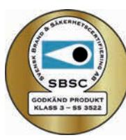
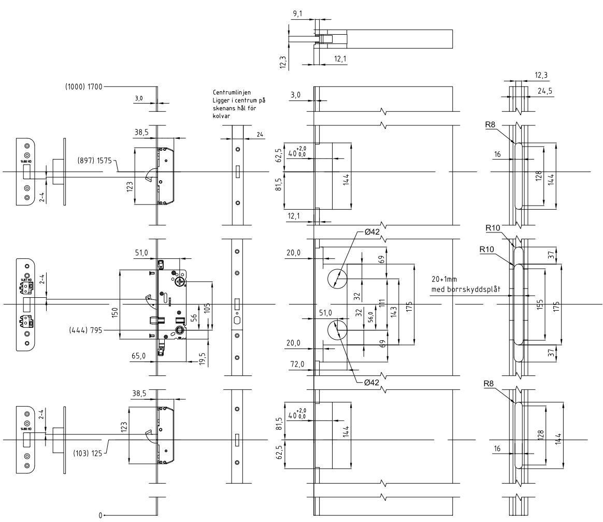

## ASSA Connect 510 MPL

### Flerpunktslås

ASSA ABLOY, the global leader in door opening solutions

ASSA Connect 510 MPL

### **Användningsområde**

Flerpunktslås för entrédörr och säkerhetsdörr inom bostadssektorn i villor, lägenheter, servicehus etc, där krav på godkänd låsenhet föreligger. ASSA Connect 510 MPL är avsett för slagdörrar.

### **Egenskaper**

- Uppfyller krav enligt SSF 3522, klass 5.
- Uppfyller krav enligt svensk och europeisk standard pr SS-EN 15685 för flerpunktslås.
- Ingår i av försäkringsbolag godkänd låsenhet i utförande med cylinder på insida och på utsida.
- Dorndjupsutförande: 50 mm.
- Låsdjup: 64 mm.
- Patenterad kapslad förregling i låshuset.
- Med tryckesfall och förstärkt hakregel.
- 2 extra hakreglar för ökad säkerhet.
- Härdade och tvångsstyrda hakreglar.
- Ger kopplande förband mellan dörr och karm.
- Vändbar tryckesfall för alternativ dörrhängning.
- Tryckesfall av härdat stål för brandklassade dörrar.
- Rostfri kantskena 24 x 3 mm.
- Levereras med borrskydd.
- Kan erhållas med extralås.
- Kan erhållas med inbyggd mikrobrytare.
- Tillverkas i längder från 1000 mm och uppåt, standardlängder är 1700 mm och 1000 mm.

#### **Funktion**

- För att låsa: lyft trycket för att låsa ut regeln och hakregeln, vrid runt nyckeln 360 grader för att föregla låshuset.
- För att låsa upp: vrid nyckeln 360 grader för att häva förreglingen och öppna dörren genom att trycka ned trycket som drar in fall, regel och kolvar.
- ASSA Connect MPL-serien är utvecklad för att klara de högsta säkerhets kraven där dubbla cylindrar är en del i specifikationen. Av den anledningen rekommenderar ASSA OEM att använda dubbelrundcylinder, godkänd enligt SSF 3522, klass 5.

### **Tillbehör**

- Använd ASSA säkerhetsslutbleck 1487, 1489, 1490 för central låsenhet och tex ASSA säkerhetsslutbleck 1488 för hakkolvarna.
- ASSA handtag med returfjäder.

# ASSA Connect 510 MPL

## Flerpunktslås

Måttritning ASSA Connect 510 MPL*

Urfräsningsritning ASSA Connect 510 MPL*

* Urfräsningsritning gäller ASSA Connect 510 MPL med 50 dorn. Avståndsmåtten gäller för standardlängd 1700 mm alternativt 1000 mm (inom parentes). För avståndsmått gällande extralås eller speciallängder, fråga din återförsäljare. Urfräsningsritning gäller för skenbredd 24 mm, vid smalare skena bör urfräsningen anpassas.

ASSA ABLOY, the global leader in door opening solutions, dedicated to satisfying end-user needs for security, safety and convenience

ASSA OEM AB P.O. Box 371 SE-631 05 Eskilstuna Sweden

phone +46 (0)16 17 70 00

ASSA OEM AB SE-436 33 Mölnlycke Sweden

phone +46 (0)31 704 40 40

www.assaoem.se

#### **Låsenhet Användningsområde Funktion utsida Funktion insida** ASSA Connect 510 MPL Låsenhet för ytter-, entré- och säkerhetsdörr. För att låsa upp vrid nyckeln 360° för att upphäva förreglingen. För att låsa upp vrid nyckeln 360° för att upphäva förreglingen.

### **Miljö**

Den här produkten är utvecklad för att under sin livscykel ge minsta möjliga påverkan på miljön. Produkten återvinns som metallskrot, eventuella mikrobrytare separeras och återvinns som elektronikavfall.

### **Entré- och skalskydd**

Låsenheter för entré-, skalskydds- och andra viktiga dörrar. Uppfyller krav enligt SSF 3522, klass 5. Ingår i av försäkringsbolag godkänd låsenhet i utförande med cylinder på insida och utsida.