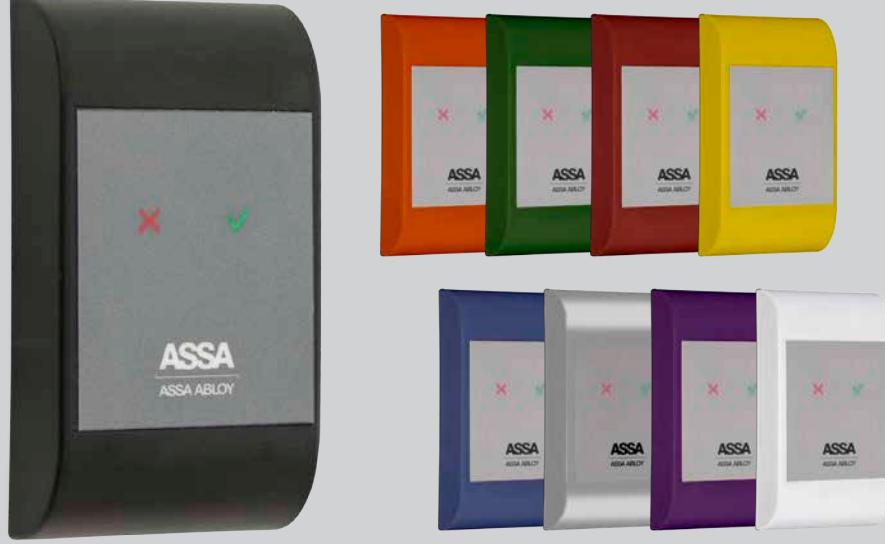
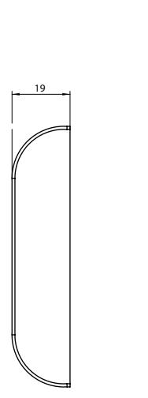
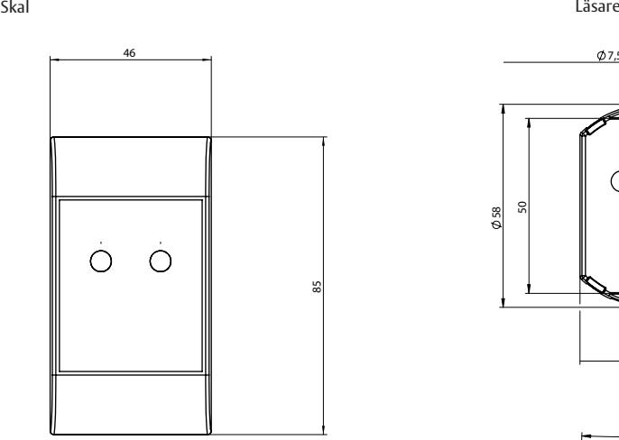
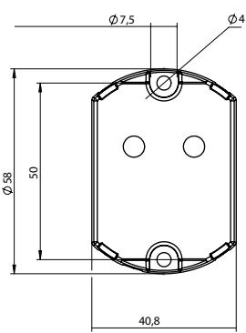
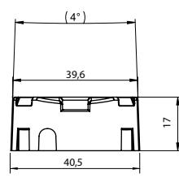

## ASSA Pando Mini

ASSA ABLOY, the global leader in door opening solutions

### Generisk läsare med pigtail och utan knappsats

ASSA Pando™ Mini är en beröringsfri generisk läsare utan knappsats som ingår i ASSA:s nya generation av läsare. Den präglas av en tidlös och ergonomisk design med utbytbara skal som medger olika färgval.

Pando Mini levereras med svart skal i grundutförande, som tillval finns ytterligare åtta färger.

Läsarna är anpassade för inomhus och utomhusbruk där inga krav på knappsats finns. Pando Mini är med sitt smalprofilsutförande anpassad för att exempelvis kunna monteras på en smal dörrkarm.

Pando Mini är en framtidssäker generisk läsare som hanterar 13,56 MHz teknologier: MIFARE Classic, MIFARE Plus (nivå 1 och 3), MIFARE DESFire EV1, iCLASS, samt SEOS. Läsaren har även stöd för att i framtiden kunna uppgraderas till kommande 13,56 MHz teknologier, vilket ger en optimal

möjlighet till en anpassad säkerhet för just ditt passersystem. Dessutom kan två samtidiga kortteknologier hanteras, vilket skapar möjlighet att succesivt migrera från exempelvis MIFARE Classic till MIFARE DESFire EV1, utan att behöva dubbla passerkort.

För enkelt handhavande har läsaren symboler för kommunikation med användaren, grön och röd indikering för giltigt och ogiltigt kort, samt olåst dörr.

Pando Mini är försedd med fem meter kabel. Läsaren kan konfigurerars till att vara antingen in- eller ut-läsare samt om läsaren skall avge kortavläsningspip eller inte.

Läsaren kan kopplas till ASSAs passersystem ARX eller RX WEB.

# ASSA Pando Mini

Generisk läsare med pigtail och utan knappsats

ASSA ABLOY, the global leader in door opening solutions

17

39,6

40,5

4

### **Indikeringar**

- Giltigt kort/tagg samt olåst
- Ogiltigt kort/tagg
- Kortavläsningspip, samt giltigt/ogiltigt dur och moll ljud (anpassad för personer med funktionsnedsättning)

#### **Data**

- IP klass 65
- Spänningsmatning: 12-24V DC
- Strömförbrukning mätt vid 12V: 58mA vid 27,6V 25mA
- Vikt: 180 g (inkl. pigtail)
- Anslutningskabel 5 m
- Temperaturområde läsare: -30ºC till +70ºC
- Lästeknologi: Generisk 13,56MHz (MIFARE Classic, MIFARE Plus (nivå 1 och 3), MIFARE DESFire EV1, iCLASS och SEOS)
- Kommunikation: Hi-O
- Kompatibel med: DAC530, DAC564 samt LCU9101
- OS: FreeRTOS (www.freertos.org)
- **Övrigt**
- Snabb avläsning
- Inbyggd lägessensor som agerar sabotagelarm om läsaren flyttar sig.
- Läsavstånd upp till 3 cm beroende på lästeknologi med av ASSA rekommenderade kort och taggar.

### **Artikelnummer**

- ASSA Pando Mini, svart S559 683 084
#### **Artikelnummer för tillbehör** 7,5

- ASSA Pando Mini skal, svart S559 683 184
- ASSA Pando Mini skal, silver S559 683 186
- ASSA Pando Mini skal, vit S559 683 185
- ASSA Pando Mini skal, blå S559 683 190
- ASSA Pando Mini skal, grön S559 683 191 50 58
- ASSA Pando Mini skal, gul S559 683 192
- ASSA Pando Mini skal, röd S559 683 193
- ASSA Pando Mini skal, orange S559 683 194
- ASSA Pando Mini skal, lila S559 683 195 40,8
- Av ASSA rekommenderade kort och taggar;
	- MIFARE-kort 1K med sektorprogrammering Artikelnummer: S556 592 001
	- MIFARE-kort 1K och EM 4200 kombikort med sektorprogrammering Artikelnummer: S556 594 001
	- MIFARE-tagg 1 K med sektorprogrammering Artikelnummer: S556 595 001
	- MIFARE-tagg 1K och EM4200 kombitagg med sektorprogrammering
		- Artikelnummer: S556 598 001
- MIFARE DESFire EV1 kort 2K Artikelnummer: S555 912 001

ASSA ABLOY is the global leader in door opening solutions, dedicated to satisfying end-user needs for security, safety and convenience

ASSA AB P.O. Box 371 SE-631 05 Eskilstuna Sweden Phone +46 (0)16 17 70 00

www.assa.se

Fax +46 (0)16 17 70 49 Customer support: phone intl. +46 (0)16 17 71 00 Phone nat. 0771-640 640 Fax +46 (0)16 17 73 72 e-mail: helpdesk.marknad@assaabloy.com

M3549.1510

We reserve the right to correct any printing errors and update the information after printing.