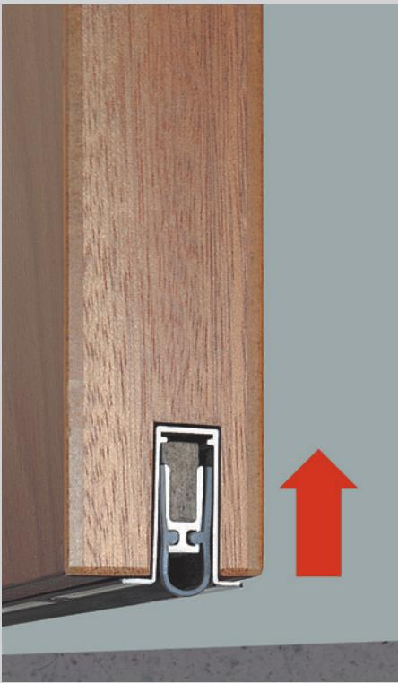
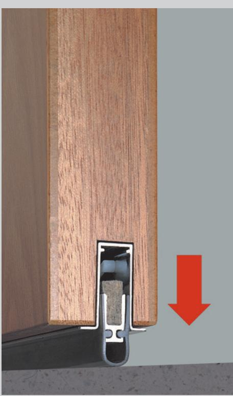
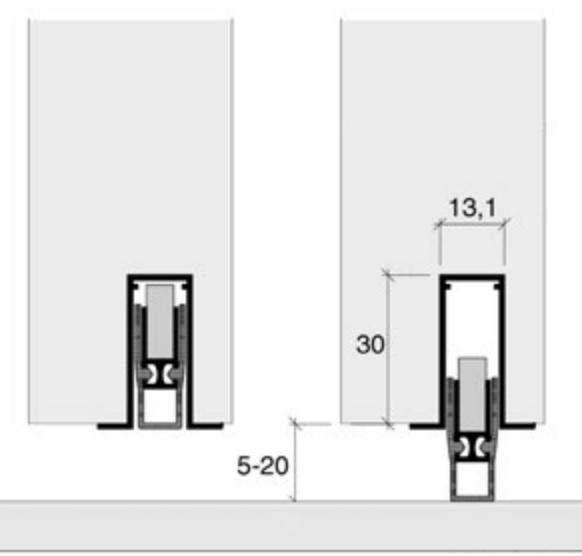
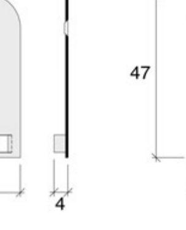
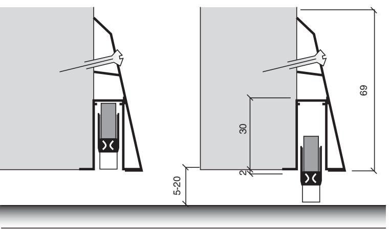

## **Användningsområde**

För brand- rök- och ljudtätning av slagdörrar av trä, där golvtröskel ej kan användas. T ex handikappanpassning, sjukhus, varuintag mm. Reducerar även drag och värmeförluster. Kan med fördel användas där golvet lutar i förhållande till dörrens underkant.

### **Egenskaper**

- **•**  För infälld montering i underkant av dörren. Eldhämmande tätningslist av högvärdig specialsilikon i U-profil ger mycket god rök- och ljudtätning.
- **•**  U-profilen minimerar även friktionen mot underlaget vid öppning och ger en tyst funktion.
- **•**  Inner- och ytterprofil av aluminium med mekanism av stål.
- **•**  5 års funktionsgaranti. Uppfyller minst 2 miljoner
- öppningscykler.
- **•**  Klarar 5-20 mm avstånd mellan dörrens underkant och golv. Finns som standard från 324 mm upp till 1324 mm i 100 mm intervaller. Kan vid behov enkelt kapas för finjustering till aktuellt dörrmått. Övriga längder på förfrågan.

# **Brandklass**

Typgodkänd för infällt montage i trädörrar med brandteknisk klass upp till EI 30. **OBS! Vid utanpåliggande montage medges ej brandklassning.**

#### **Ljudklass**

Typgodkänd för R´w 35 dB vid infällt montage i R´w 40 dB trädörr. **OBS! Vid utanpåliggande montage medges ej ljudklassning.**

### **Funktion**

- **•**  När tätningströskelns regeltapp möter dörrkarmen sänks tätningslisten snabbt och ljudlöst mot golvet. När dörren öppnas och regeltappen lämnar karmen lyfter mekanismen tätningslisten utan att den skrapar i golvet under öppningscykeln.
- **•**  Tätningslistens lyfthöjd är enkelt justerbar med den medföljande sexkantnyckeln. Tätningströskelns konstruktion medger automatiskt utjämnad tätning vid lutande golv och en mycket tyst funktion.
- **•**  Passar såväl höger som vänsterdörrar.
- **•**  Karmslutbleck för regeltappen medföljer.
- **•**  Som tillbehör finns täckplattor för tätningströskelns kortändar samt monteringslist för utanpåliggande dörrmontage.

**Mått- och urtagsritning** Mått i mm

**Tillbehör Täckplattor** Mått i mm

ASSA ABLOY, the global leader in door opening solutions, dedicated to satisfying end-user needs for security, safety and convenience.

ASSA AB P.O. Box 371 SE-631 05 Eskilstuna Sweden

phone +46 (0)16 17 70 00 fax +46 (0)16 17 70 49

Customer support: phone intl. +46 (0)16 17 71 00 phone nat. 0771-640 640 fax +46 (0)16 17 73 72 e-mail: helpdesk@assa.se

**Tillbehör Monteringslist** Mått i mm

**OBS! Vid utanpåliggande montage medges ej brand- och ljudklassning.**