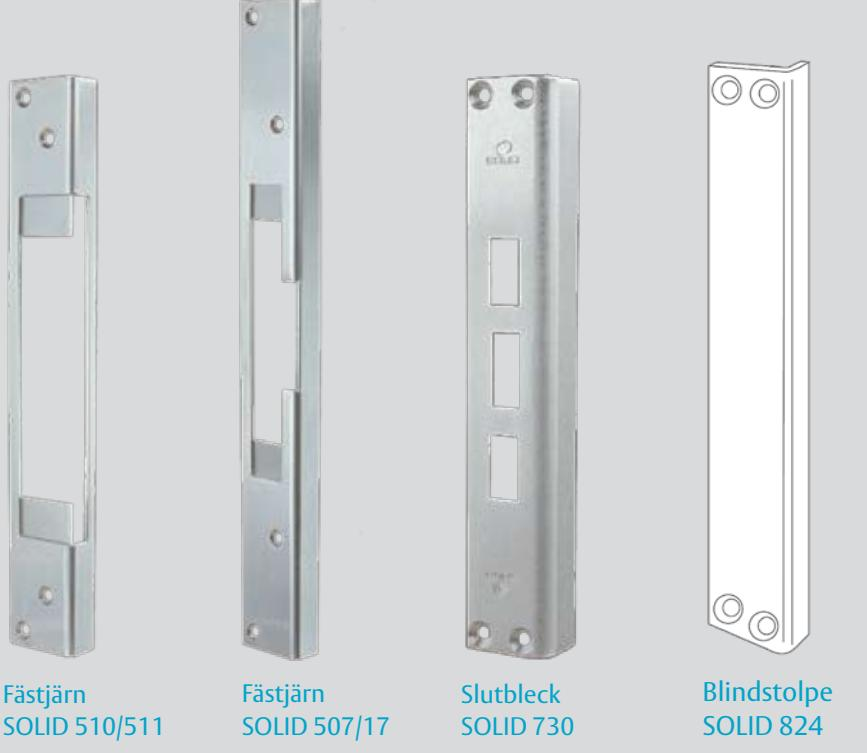
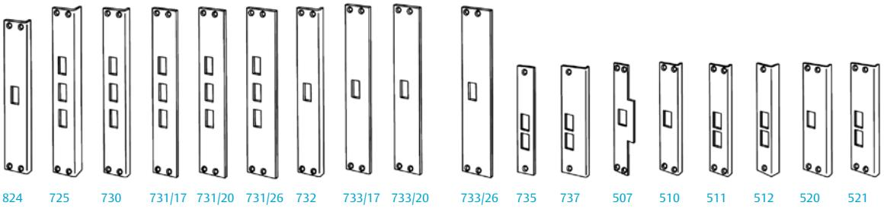
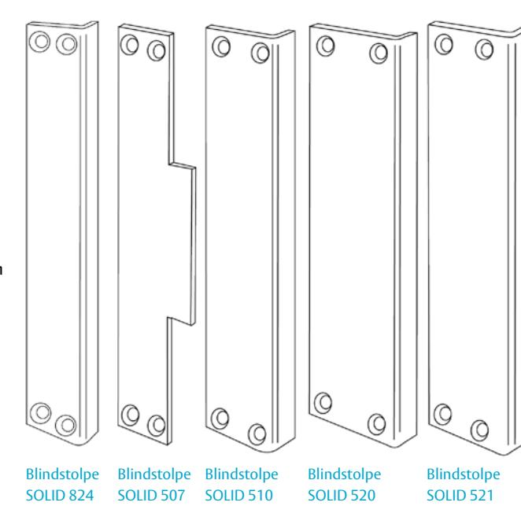

# ASSA tillbehör elslutbleck

SOLID fästjärn, slutbleck och blindstolpar Elektromekanisk låsning

### **Fästjärn SOLID 507/17, 507/22, 507/26, 510/511 Användningsområde**

SOLID fästjärn används t ex då karmen (oftast träkarmar) har skador som ska täckas. Fästjärn finns för monteringsstolpe 507, 510 och 511. För stolpe 510 och 511 används samma fästjärn. För stolpe 507 finns fästjärn som ger olika plösmått.

### **Slutbleck SOLID**

**Användningsområde**

Om dörrkarmen är förberedd för elslutbleck som ska monteras senare, kan SOLID slutbleck monteras och dörren kan låsas mekaniskt. Slutblecket har samma mått och benämning som monteringsstolpen för elslutblecket.

**För extrakraftiga elslutbleck:**

#### 824 **För standard elslutbleck:**

725, 730, 731/17, 731/20, 731/26, 732, 733/17, 733/20, 733/26, 735, 737 **För enkla elslutbleck:** 507, 510, 511, 512, 520, 521

## **Blindstolpar SOLID**

**Användningsområde**

SOLID blindstolpar används då dörrpartiet saknar såväl mekaniskt lås som elslutbleck, men karmen är förberedd för elslutbleck. Benämningen på stolparna, samt deras mått, är lika som monteringsstolpen för elslutbleck med samma namn.

**För extrakraftiga elslutbleck:** 824 **För enkla elslutbleck:** 507, 510, 520, 521

# ASSA tillbehör elslutbleck

# SOLID fästjärn, slutbleck och blindstolpar Elektromekanisk låsning

### **Fästjärn SOLID 507/17, 507/22, 507/26, 510/511**

| Benämning     | Längd (mm) | Bredd (mm) | Överfals (mm) | Plösmått (mm) |
|---------------|---------------|---------------|------------------|------------------|
| SOLID 507/17  | 400           | 45            | 20               | 17               |
| SOLID 507/22  | 400           | 50            | 20               | 22               |
| SOLID 507/26  | 400           | 55            | 20               | 26               |
| SOLID 510/511 | 300           | 43            | 20               | 14               |

### **Slutbleck SOLID**

#### **Blindstolpar SOLID**

ASSA ABLOY, the global leader in door opening solutions, dedicated to satisfying end-user needs for security, safety and convenience.

ASSA AB P.O. Box 371 SE-631 05 Eskilstuna Sweden

phone +46 (0)16 17 70 00 fax +46 (0)16 17 72 10

Customer support: phone +46 (0)771 640 640 fax +46 (0)16 17 73 72 e-mail: helpdesk@assa.se

Artnr 702516