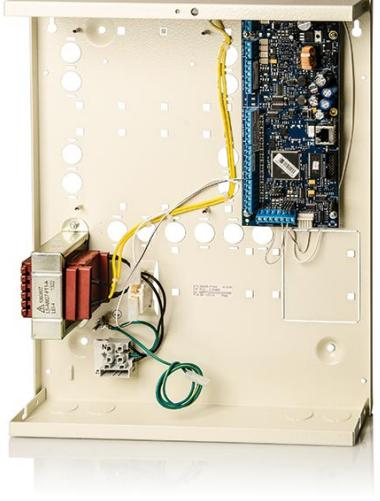

# ATS1500A-MM

Advanced IP panel, EN grade 3, 8 - 32 zones, 4 areas, medium metal

#### Intrusion Alarm System

Produktblad

The Adisor Advanced product line is the latest offspring from he Advisor CD and Advisor Master product lines. Its heritage

consists of appreciated and well-known functions and features. Communications traditionally based on PSTN networks are moving towards IP or wireless communications while PSTN

etworks start to be discontinued. Flexibility in different communication options allows for long-term flexibility, reliability and availability. For that reason, local configuration of the Advisor Advanced products is possible through an onboard USB port.

Based on the Advisor CD user interface, it allows for a quick ransition while at the same time being able to use new features

in a familiar way. The quick menu browsing has returned to provide quick access to menus. Those unfamiliar have full menu browsing at their disposal. A built-in Hint key provides hint on options to reduce the time to become familiar with the menu structure.

Approvals in Europe start to converge to one standard: EN50131. The new Advisor Advanced product line is designed and meets the EN50131 compliancy.

Using existing ATS accessories as listed on the ATS Poster overview (keypads, readers, expanders) it delivers a reliable system and a large range of options to extend the functionality of the system.

The ATS3500A-IP has an integrated 10/100mb ethernet connection supporting IP reporting to OH-NETREC receiver and U/D functionality to ATS85x0.

#### Advisor Advanced product line

The Advisor Advanced product range is a family of products that has evolved from the long-running and successful Advisor CD and Advisor Master ranges, which offered well-known and appreciated products. The Advisor Advanced range captures the strongest assets from both these ranges and brings them together into a new, future-proof platform that enables ease of use, flexibility and reliability. It allows growth today as well as tomorrow. The range consists of different products such as the ATS1000A, ATS2000A, ATS1500A, ATS3500A and ATS4500A in a variety of configurations, all with the same basic methods for interacting with users or capabilities.

#### Ease of use

mind. The Advisor Advanced range offers easy menu access and menu browsing as well as quick-access to menu items for

hose already familiar with the menu structure. Hints are available at the press of a button to provide tips during configuration.

## Standardprestanda

- E8 onboard zone inputs
- E Max 32 zones: wired, wireless or mixed
- EEconomic input and output plug-in expansion
- EUp to 16 shock sensor inputs
- E4 areas

- E Up to 50 users
- EEN50131 Security grade 3 (when ATS-MM-TK added) / Environmental class 2
- EUSB port for local configuration
- EPlug-on PSTN dialler for reporting or configuration
- EMultilingual: each user his own language
- EIntergated 10/100Mb Ethernet connection
- EIP Alarm reporting to OH-NETREC receiver - Optional GPRS
- EU/D over IP / GPRS
- EIP Diagnostics
- EDynamic/Static IP & DNS support
- EAuto Arming - Schedules - Times Outputs

# ATS1500A-MM

### Advanced IP panel, EN grade 3, 8 - 32 zones, 4 areas, medium metal

The use of regular functions, such as set and unset, are designed to be intuitive to end-users.

#### Wireless and Wired sensor support

The Advisor Advanced system is a full hybrid system. It allows for connection of any combination of wired and wireless devices. Each input can be assigned to a zone. For example, the system could be set up to have 32 wired zones, 32 wireless zones or a combination such as 24 wireless zones + 8 wired zones and vice versa. Inputs and outputs can be expanded by using Data Gathering Panels. However, it is also possible to expand the system by using an economic plug-in expansion that fits on top of the main control panel thus reducing the space required in a housing. Inputs can be used in a variety of ways, including combined tamper and alarm or combined tamper, alarm and anti-mask to support EN Grade 3 applications.

The Advisor Advanced system also allows for all inputs on the Main Control Panel and plug-in expansions to be shock sensor zones, reducing the need for external shock sensor analyzers.

### Alarm Reporting

An intrusion control system depends on alarm reporting to deliver any alarm or failure as quickly as possible. The Advisor Advanced system offers different methods to do so, varying from normal alarm reporting to Alarm Receiving Centres, as well as reporting to end-users through voice reporting and SMS. Different physical paths can be used: analogue PSTN but also via IP, GSM or GPRS. Via the ATS7310 GSM module the Advisor Advanced supports analogue voice reporting, SMS reporting to any mobile device or GPRS communication to the OH Netrec receiver.

#### Remote Connectivity and Mobile Control

More and more alarm system users connect their system to a professional alarm monitoring system. Alarm monitoring companies typically monitor alarm systems on a 24/7 basis, and may also provide other services, such as performing health check and remote servicing. The Advisor Advanced remote service software is built to equip monitoring operators with the ools to service multiple events and panels, and to help

them

improve service levels for professional customers.

#### Tekniska data

#### Zones

| 32 |
|----|
| 32 |
| 32 |
| 8  |
|    |
| 4  |
|    |
| 1  |
| 8  |
|    |
| 50 |
|    |

| Max nbr of user groups            | 16                                    |
|-----------------------------------|---------------------------------------|
| Max nbr of cards                  | 50                                    |
| Max nbr of PIN codes              | 50                                    |
| Power Supply                      |                                       |
| Mains power                       | 230 VAC +10%, -15%, 50 Hz             |
| Main board current consumption | 150 mA                                |
| Max system current                | 950 mA at 13.8 V ±0.2 V               |
| Max aux power current             | 840mA (depends on backup power needs) |
| Fuses                             |                                       |
| Auto-reset                        | 5                                     |
| Glass break                       | 1 (mains power)                       |
| Data bus                          |                                       |
| Type                              | RS485                                 |
| Recommended cable                 | WCAT52/WCAT54 or equivalent           |
| Environmental                     |                                       |
| Class                             | Class II, indoor                      |
| Operating temperature             | -10 to +55°C                          |
| Relative humidity                 | 95% non-condensing                    |
| IP rating                         | 30                                    |
| Dimensions                        |                                       |
| ATS1000A-SM                       | 250 x 250 x 86 mm                     |
| ATS1500A-MM                       | 315 x 388 x 85 mm                     |

#### Order data

#### Artikelnummer Beskrivning

ATS1500A-MM Advanced IP panel, EN grade 3, 8 - 32 zones, 4 areas, medium metal housing

Reservationer för produktförändringar. För uppdatering av produktdata, gå in på www. utcfssecurityproducts.se eller kontakta din lokala UTC Fire & Security återförsäljare. ATS1500A-MM-2017-04-3 02:32:51 Released :18-OCT-16