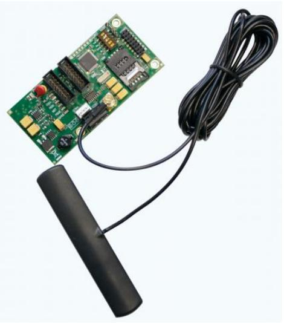

# ATS7320

Produktblad

GSM Module for Reporting and U/D

### Communication devices

The ATS Master and Advisor Advanced features a true communication centre offering multiple reporting connections to multiple central stations. Control panels having an IP, PSTN communicator on board and optional ISDN, GSM, IP communication modules, where the ATS7320 can be used as a backup or primary reporting channel. It is scalable with back-up reporting options according your needs.

#### Product Overview

The ATS7320 GSM module is directly connected to the ATS Master and Advisor Advanced panel and fully enables alarm reporting and up- and downloading to ATS85XX via GPRS. All reporting formats available through PSTN are available via GSM, including voice reporting or audio listen-in. The GSM module can be used for primary reporting as well as back-up reporting (using multiple central stations).

### Up / Downloading

Besides the very good reporting facilities, the ATS7320 can establish a GPRS connection for up- and downloading when connected to the Advisor Advanced. Dual band 900 / 1800 MHz is standard available. Especially for densely populated areas like big cities where many small cells are used with shorter receiving distances you will have the benefit of the 1800 MHz band. For convenience 4 status LED's are permanently indicating: - Communication between the panel, - Status of the audio & GPRS information transmitted to the central station - Field strength or signal strength found by the GSM module - General status of the GSM module (network presence, power etc.)

### SMS Reporting & Command/Control

The ATS7320 support SMS functionality when connected to the Advisor Advanced panels. When connected together the system can send localized SMS messages to any mobile phone configured in the panel. Besides receiving an SMS the end user can send SMS messages back to the Advisor Advanced as a command. He can check the status of the system, trigger and output and much more.

#### Standardprestanda

- EFull alarm reporting via GSM
- EAll popular reporting formats available, including voice reporting and audio listen-in
- EPerfectly suitable for primary reporting in case a PSTN or ISDN line or IP connection is not available
- EBack-up reporting easily configurable via multiple central stations
- E Data connection for Up/Download when connected to Advisor Advanced
- EUnique 4800 Baud data connection for U/D
- E Dual Band 900 / 1800 MHz
- ESix status LED's for Diagnostics
- EGSM Antenna included
- E SMS Reporting on Advisor Advanced
- ESMS Command & Control on Advisor Advanced

# ATS7320

GSM Module for Reporting and U/D

## Tekniska data

| Power supply                           |                    |
|----------------------------------------|--------------------|
| Via ribbon cable from control panel | 10 - 15 VDC        |
| Current Consumption                    | (at 13.8 VDC ± 5%) |
| MI Bus                                 | 20 mA              |
| GSM Online Max.                        | 0.3 A              |
| Dimensions                             | 104 mm x 50 mm     |
| Weight                                 | 44 gr.             |

|  | Order data |  |  |
|--|------------|--|--|
|  |            |  |  |

Artikelnummer ATS7320

Beskrivning GSM Module for Reporting and U/D

