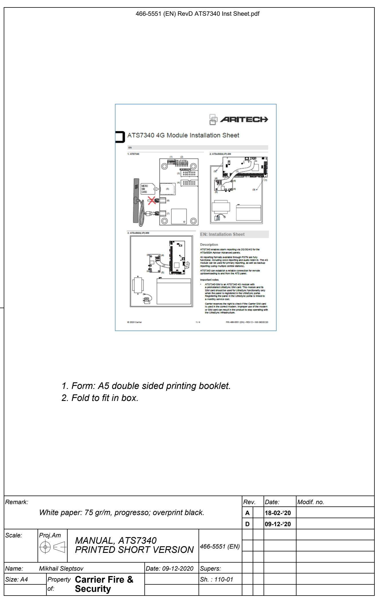
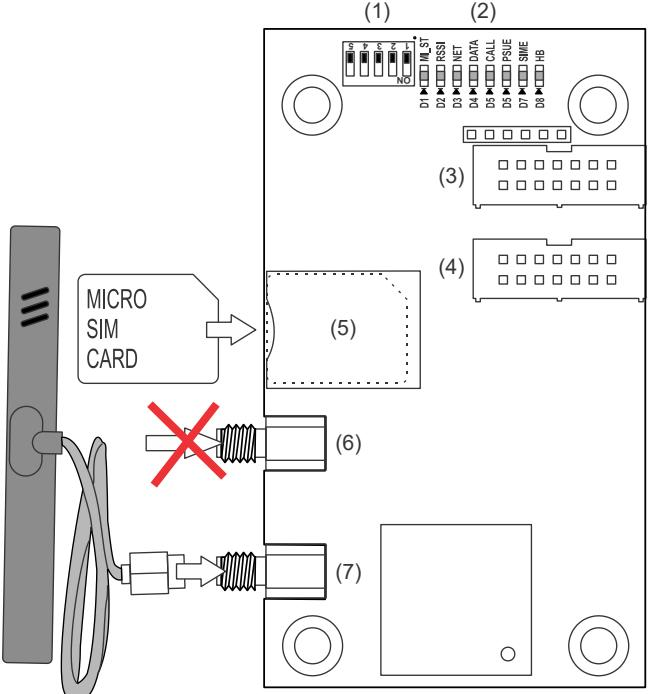
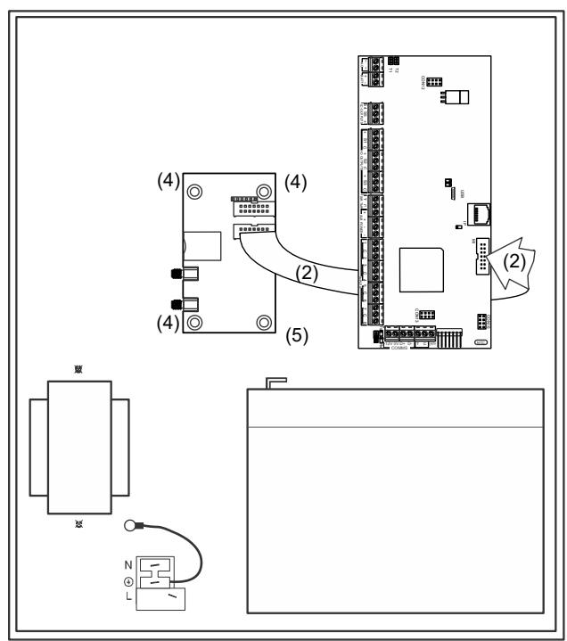
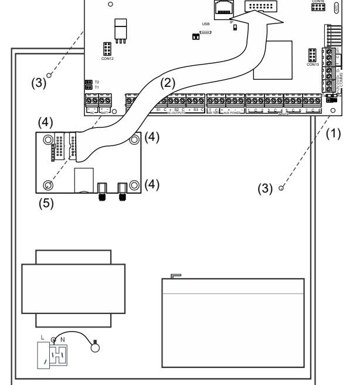

# ATS7340 4G Module Installation Sheet

#### **EN**

**1: ATS7340 2: ATSx500A(-IP)-SM**

# **3: ATSx500A(-IP)-MM EN: Installation Sheet**

# **Description**

ATS7340 enables alarm reporting via 2G/3G/4G for the ATSx500A Advisor Advanced panels.

All reporting formats available through PSTN are fully functional, including voice reporting and audio listen-in. The 4G module can be used for primary reporting, as well as backup reporting (using multiple central stations).

ATS7340 can establish a reliable connection for remote up/downloading to and from the ATS panel.

#### **Important notes**

- ATS7340-SIM is an ATS7340 4G module with a preinstalled UltraSync SIM card. This module and its SIM card should be used for UltraSync functionality only when the panel is registered in the UltraSync portal. Registering the panel in the UltraSync portal is linked to a monthly service cost.
Carrier reserves the right to check if the Carrier SIM card is used in the correct modem. Improper use of the modem or SIM card can result in the product to stop operating with the UltraSync infrastructure.

- Disable the PIN code request on your SIM card (via any mobile telephone).
- The product must be used only with the supplied antenna.
- Make sure the antenna itself is placed outside of the control panel.
- The antenna must be mounted on an appropriate distance from people, e.g. more than 200 mm.
- For up/downloading via the 4G module use a SIM card that has data enabled.
- ATS7340 cannot be connected remotely using the ATS7072 expander kit.
- This device can be installed only by a qualified electrician or other suitable trained and qualified person.

**Caution:** Ensure that there is only one GSM/GPRS dialler (ATS7320, ATS7340, TDA7400, TDA7400NG, or ATS7500) installed on the MI bus, to avoid any configuration conflicts.

# **Mounting location**

ATS7340 must be mounted inside an ATS panel housing.

#### **WARNINGS**

- Disconnect the mains power before opening the cabinet. Disconnect the AC mains plug from the AC mains wall socket, or disconnect the mains using the dedicated circuit breaker.
- Disconnect the battery (when applicable).

# **Mounting the unit**

#### **Figures 2 and 3**

- (1) Screws
- (2) Flat cable
- (3) Extension pillars with the plastic rings on existing pillars
- (4) Screws on clips
- (5) Screws on extension pillars

#### **Mounting ATS7340 into ATSx500A-SM control panels**

See Figure 2.

- 1. Remove the screws (item 1) and lift off the control panel PCB.
- 2. Place the extension pillars with the plastic rings on top of the existing pillars (item 3).
- 3. Place the clips in the square holes (item 4).
- 4. Mount ATS7340 using the screws and extension pillars (item 5).
- 5. Place the ATS control panel PCB back into its original position.

#### **Mounting ATS7340 into ATSx500A-MM control panels**

#### See Figure 3.

- 1. Place the clips in the square holes (item 4). Use metal pillars when available.
- 2. Mount ATS7340 using screws.

# **Connecting the 4G module**

**WARNING:** Disconnect the AC mains plug from the AC mains wall socket.

- 1. Connect the flat cable (item 2 in Figures 2 and 3) between the control panel (MI connector) and ATS7340 (connector CON2 or CON3).
- 2. Connect the antenna to the 4G module.

**Note:** Use the antenna provided with the module to get the best signal strength.

- 3. Insert the SIM module into the SIM socket (SIM).
- 4. Apply power to the control panel and to the 4G module.
- 5. Check the field strength (RSSI LED). When required, move the antenna in order to get the best signal.

# **Operating instructions**

Refer to *ATSx500A Advisor Advanced Installation and Programming Manual* for details on:

- Operating instructions for all functionalities
- Available keys, codes, and related details
- User programmable functions

# **Testing the 4G module**

To check the correct reporting to the Central Station, we recommend you to create an event (for example, a test call, an opening, or a closing event), and to ensure that the Central Station receives this event successfully.

# **Description of the ATS7340**

#### **Figure 1**

| Item     | Description | Function                                                |
|----------|-------------|---------------------------------------------------------|
| (1)      | DIP switch  | See Table 1 below.                                      |
| (2)      | LEDs        | Status LEDs.                                            |
| (3), (4) | CON3, CON2  | MI bus, system connector. Connects to the ATS panel. |
| (5)      | SIM         | SIM socket. Holds GSM micro-SIM card.                   |
| (6)      | ANT2        | Do not use.                                             |
| (7)      | ANT1        | SMA antenna connector.                                  |

# **DIP switch**

The DIP switch provides the functionality described in Table 1 below.

#### **Table 1: DIP switch description**

| No. | Name | Function               | Default value |
|-----|------|------------------------|---------------|
| 1.  | TEST | Factory test mode      | Off           |
| 2.  |      | Reserved               | Off           |
| 3.  | FU   | Firmware upgrade       | Off           |
| 4.  | MFU  | Modem firmware upgrade | Off           |
| 5.  |      | Reserved               | Off           |

# **LEDs**

In the following LED descriptions, a flash is defined as 250 ms on and 250 ms off. Groups of flashes are separated by 1 s off.

### **MI_ST (D1)**

The MI_ST LED (green) displays the status of the communication interface to the panel.

#### **Table 2: MI_ST LED status**

| Duty cycle | Rate (±10%) | Description                                               |
|------------|-------------|-----------------------------------------------------------|
| 100%       | —           | Power on (in case none of the cases below are valid)   |
| 0%         | —           | No power or power failure                                 |
| 25%        | 1 s         | Initialization OK, waiting for communication           |
| 50%        | 1 s         | Everything OK, communication running                      |
| 75%        | 500 ms      | Hardware failure                                          |
| 50%        | 250 ms      | Failure in communication, waiting for reinitialization |

#### **RSSI (D2)**

The RSSI LED (green) indicates the field strength or signal strength found by the 4G module. The number of flashes indicates the level.

#### **Table 3: RSSI LED status**

| Flashes | Description                                              |
|---------|----------------------------------------------------------|
| Off     | No field strength (no network detected)                  |
| 1 to 5  | Field strength indication from poor (1) to excellent (5) |

#### **NET (D3)**

The NET LED (green) indicates the status of the network. The meaning of the number of flashes is described in Table 4 below.

#### **Table 4: NET LED status**

| Flashes | Description                   |
|---------|-------------------------------|
| Off     | Not registered                |
| On      | Registered to home network    |
| 1       | Registered to roaming network |
| 2       | Searching network             |
| 3       | Denied                        |
| 4       | Unknown                       |

#### **DATA (D4)**

The DATA LED (green) indicates the status of the GPRS/LTE communication.

#### **Table 5: DATA LED status**

| State | Description                                                 |
|-------|-------------------------------------------------------------|
| Off   | GPRS/LTE is not available                                   |
| On    | GPRS/LTE is available, connection established               |
| Blink | GPRS/LTE is available, connection established, sending data |
| Flash | GPRS/LTE is available, connection not established           |

### **CALL (D5)**

The CALL LED (yellow) indicates status of the audio information transmitted to the central station.

#### **Table 6: CALL LED status**

| Duty cycle | Rate (±10%) | Description     |
|------------|-------------|-----------------|
| 100%       | —           | Connected       |
| 0%         | —           | Offline         |
| 10%        | 1 s         | Connecting      |
| 50%        | 1 s         | Ringing present |
|            |             |                 |

### **PSUE (D6)**

The PSUE LED (red) indicates the status of the power supply.

#### **Table 7: PSUE LED status**

| Duty cycle | Rate (±10%) | Description          |
|------------|-------------|----------------------|
| Off        | —           | Power supply okay    |
| 50%        | 1 s         | MI bus voltage low   |
| On         | —           | Power supply problem |

### **SIME (D7)**

The SIME LED (red) indicates the status of the SIM card. The meaning of the number of flashes is indicated in Table 8 below.

#### **Table 8: SIME LED status**

| Flashes | Description              |
|---------|--------------------------|
| Off     | Ready                    |
| 1       | PIN error                |
| 2       | PUK error                |
| 3       | PIN 2 error              |
| 4       | PUK 2 error              |
| 5       | SIM blocked from network |
| On      | SIM not present          |
|         |                          |

#### **HB (D8)**

The HB LED (red) indicates that the device is running.

#### **Table 9: HB LED status**

| Duty cycle | Rate (±10%) | Description                |
|------------|-------------|----------------------------|
| Off        | —           | ATS7340 is not operational |
| 50%        | 1 s         | ATS7340 is running         |
| On         | —           | ATS7340 is not operational |

# **Alarm transmission requirements**

All 4G module faults are logged in the control panel and indicated by the fault LED and corresponding fault messages on the keypad display.

The transmission between appropriate central stations and the 4G module is constantly monitored by sending presence (heartbeat) messages to central station receivers.

#### **Advisor Advanced ATSx500A**

To program the required polling time in Advisor Advanced ATSx500A, go to menu "Heartbeat time" and set a value from every second (00:00'01) to every day (23:59'59).

In case of the dual path reporting, if the primary CS communication fails, the backup CS heartbeat time is switched from normal to frequent according to a value configured in the menu "Frequent HB time".

For programming details, see Advisor Advanced Installation and Programming Manual. The required settings for each ATS category are listed in Chapter "Regulations", section "Transmitter polling interval requirements".

#### **Substitution and information security**

- Triple-DES, Symmetric encryption algorithms are used with key length 192 bits.
- In case hash functions are used, they give a minimum of 128 bits output.
- Regular automatic key changes are used with machine generated randomized keys.

## **Specifications**

| Compatibility                                                 | ATSx500A Advisor Advanced control panel with firmware version MR4.4 or later                                                                |
|---------------------------------------------------------------|---------------------------------------------------------------------------------------------------------------------------------------------------|
| Power supply (via ribbon cable from control panel          | 9 to 14 V                                                                                                                                        |
| Current consumption (at 13.8 V ±5%):                         |                                                                                                                                                   |
| MI bus (standby)                                              | <100 mA                                                                                                                                           |
| MI bus (GSM online)                                           | 120 mA                                                                                                                                            |
| MI bus (2G/3G/4G max.) 200 mA                                 |                                                                                                                                                   |
| Wireless operating frequency                                  | 703–748 MHz (B28) 832–862 MHz (B20) 880–915 MHz (B8, E-GSM 900) 1710–1785 MHz (B3, DCS 1800) 1920–1980 MHz (B1) 2500–2570 MHz (B7) |
| Maximum power output:                                         |                                                                                                                                                   |
| 703–748 MHz, 832–862 MHz, 1920–1980 MHz, 2500– 2570 MHz | Class 3bis (23 dBm)                                                                                                                               |
| 1710–1785 MHz                                                 | Class 1 (30 dBm)                                                                                                                                  |
| 880–915 MHz                                                   | Class 4 (33 dBm)                                                                                                                                  |
| Dimensions                                                    | 86.5 x 50.0 mm                                                                                                                                    |
| Battery type and max. capacity                             | See the appropriate control panel installation manual                                                                                          |
| Weight                                                        | 35 g                                                                                                                                              |
| Temperature                                                   | −10 to +55°C                                                                                                                                      |
| Relative humidity                                             | <95% noncondensing                                                                                                                                |
| Serviceable parts                                             | There are no serviceable parts in ATS7340                                                                                                      |
| SPT type                                                      | EN 50131-10:2014 Type Y                                                                                                                           |

# **Regulatory information**

| Manufacturer | Carrier Fire & Security Americas Corporation, Inc. 13995 Pasteur Blvd |
|--------------|--------------------------------------------------------------------------|
|              | Palm Beach Gardens, FL 33418, USA                                        |
|              | Authorized EU manufacturing representative:                              |
|              | Carrier Fire & Security B.V.                                             |
|              | Kelvinstraat 7, 6003 DH Weert, Netherlands                               |

Product warnings and disclaimers

THESE PRODUCTS ARE INTENDED FOR SALE TO AND INSTALLATION BY QUALIFIED PROFESSIONALS. CARRIER FIRE & SECURITY CANNOT PROVIDE ANY ASSURANCE THAT ANY PERSON OR ENTITY BUYING ITS PRODUCTS, INCLUDING ANY "AUTHORIZED DEALER" OR "AUTHORIZED RESELLER", IS PROPERLY TRAINED OR EXPERIENCED TO CORRECTLY INSTALL FIRE AND SECURITY RELATED PRODUCTS.

For more information on warranty disclaimers and product safety information, please check [https://firesecurityproducts.com/policy/product](https://firesecurityproducts.com/policy/product-warning/)[warning/](https://firesecurityproducts.com/policy/product-warning/) or scan the QR code.

Certification

|                          |          | This product was tested and certified to EN 50136-2:2013 for Alarm transmission system performance SP3 for reporting over GPRS to the OH Receiver.                                                                                                                                                                                                              |
|--------------------------|----------|--------------------------------------------------------------------------------------------------------------------------------------------------------------------------------------------------------------------------------------------------------------------------------------------------------------------------------------------------------------------------|
|                          |          | This product was tested and certified to EN 50136-2:2013 for Alarm transmission system performance SP4 for reporting over GPRS to the OH Receiver.                                                                                                                                                                                                              |
|                          |          | This product was tested and certified to EN 50136-2:2013 for Alarm transmission system performance DP2 for backup reporting over GPRS to the OH Receiver.                                                                                                                                                                                                       |
|                          |          | This product was tested and certified to EN 50136-2:2013 for Alarm transmission system performance DP3 for backup reporting over GPRS to the OH Receiver.                                                                                                                                                                                                       |
|                          |          | Tested and certified by Telefication B.V.                                                                                                                                                                                                                                                                                                                                |
|                          | mode.    | Alarm transmission class: Pass-through operation                                                                                                                                                                                                                                                                                                                         |
|                          |          | Carrier Fire & Security hereby declares that this device is in compliance with the applicable requirements and provisions of all applicable rules and regulations, including but not limited to the Directive 2014/53/EU. For more information see: firesecurityproducts.com                                                                              |
| REACH                    |          | Product may contain substances that are also Candidate List substances in a concentration above 0.1% w/w, per the most recently published Candidate List found at ECHA Web site.                                                                                                                                                                                |
|                          | on-intro | Safe use information can be found at https://firesecurityproducts.com/en/content/intrusi                                                                                                                                                                                                                                                                              |
|                          |          | 2012/19/EU (WEEE directive): Products marked with this symbol cannot be disposed of as unsorted municipal waste in the European Union. For proper recycling, return this product to your local supplier upon the purchase of equivalent new equipment, or dispose of it at designated collection points. For more information see: recyclethis.info |
| Product documentation |          | Please consult the following web link to retrieve the electronic version of the product documentation.                                                                                                                                                                                                                                                             |
|                          |          | This link will guide you to the EMEA regional contact page. On this page you can request your login to the secured web portal where all manuals are stored.                                                                                                                                                                                                     |
|                          |          | https://firesecurityproducts.com/en/contact                                                                                                                                                                                                                                                                                                                              |

# **Contact information**

firesecurityproducts.com or www.aritech.com