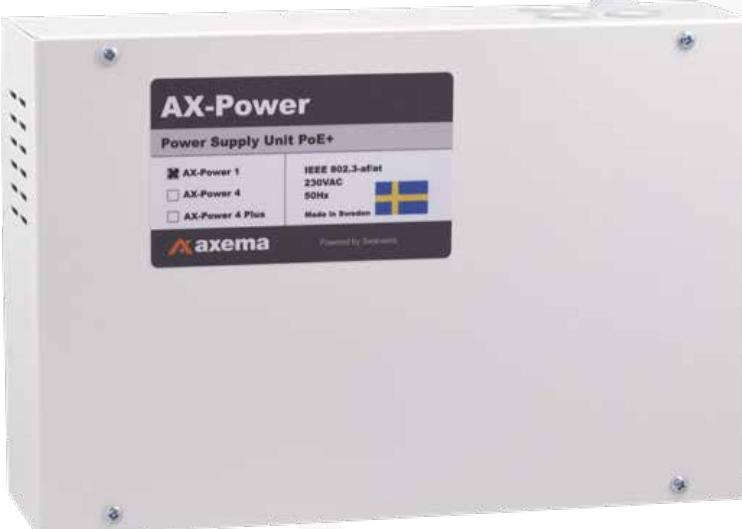
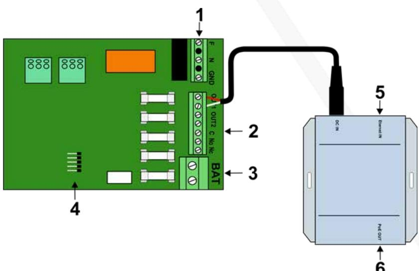
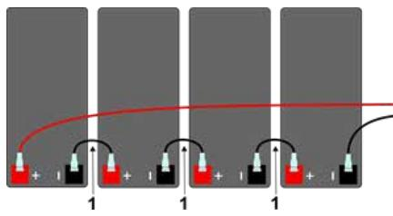

#### Manual

Updated 11/23/2020

# **AX-Power 1**

Power supply unit with PoE injector and batteries for uninterrupted power supply.

### Introduction

AX-Power 1 is a power supply unit (injector) PoE (Power over Ethernet) according to the standard IEEE 802.3at, with uninterruptible power as the unit includes 2 pcs. batteries (12V 1.3 Ah). One ethernet cable is all that is needed for communication and powering of the door environment. AX-Power 1 has a PoE port, which supplies the door environment in the Axema VAKA access control system with up to 30W.

AX-Power 1 is protected against overload, short circuits and deep discharge of the batteries. Mains, loads and batteries are protected by fuses.

### Security

#### This instruction must be read in its entirety by all operating personnel. In

case of doubt about the unit's structure, function, components or safety, Axema must be contacted.

Only a qualified electrician may install and maintain this unit. Only insulated tools should be used when working with the unit. Note that dangerous voltages and currents can occur in the unit regardless of whether the internal fuses are switched on or off.

Check that the circuit boards are permanently mounted and that the unit is not damaged during transport.

If batteries are used, they are always electrochemically active. Do not short-circuit the battery terminals.

### Connections

- 1. Mains voltage, 230 VAC
- 2. Out 1 and Out 2 are voltage outputs
- C, NO, NC is alarm output for mains fault
- 3. Battery connection, note + and-
- 4. Space for alarm card P100
- 5. RJ45 in
- 6. RJ45 out

# Connection of 230 VAC

- 1. Install the unit with at least 100 mm of free air around the unit.
- 2. Connect the 230 VAC through any of the upper cable glands. The LED for mains voltage lights up. If not, check mains voltage and its fuse.
- 3. Before connecting the batteries to the battery connection on the main board, make sure that the batteries are connected in serial with the supplied cables.
- 4. Connect the batteries to the battery connector on the main board.

Tip: If the battery fuse triggers, check connections and connected equipment.

# Batteries connected in serial

The batteries in the power supply units are to be connected in serial to achieve the operational voltage. AX-Power 1 has two batteries, all other PoEswitches from Axema runs with four batteries.

- 1. Connection cable
- 2. Connect to battery connector of the PoE-switch (red +, black -)

# Approximate battery times

A door environment with a reading terminal with an inactive electric lock normally corresponds to a load of less than 6W.

| PoE-Ports | Batteries  |        | 30W / output. 15W / output. 6W / output. |         |
|-----------|------------|--------|------------------------------------------|---------|
| 1         | 4 * 7.2 Ah | 5 hrs. | 11 hrs.                                  | 28 hrs. |

# Technical data and performance

| Attribute         | AX-Power 1                          |
|-------------------|-------------------------------------|
| Power supply      | 88-265VAC +/- 15%, 1 phase 50-60 Hz |
| Built in switch   | Yes                                 |
| Built in firewall | No                                  |
| PoE-support       | Yes                                 |
| IP-rating         | IP20                                |
| IP rating         | IK06                                |
| Temperature range | -10° to +30°C                       |