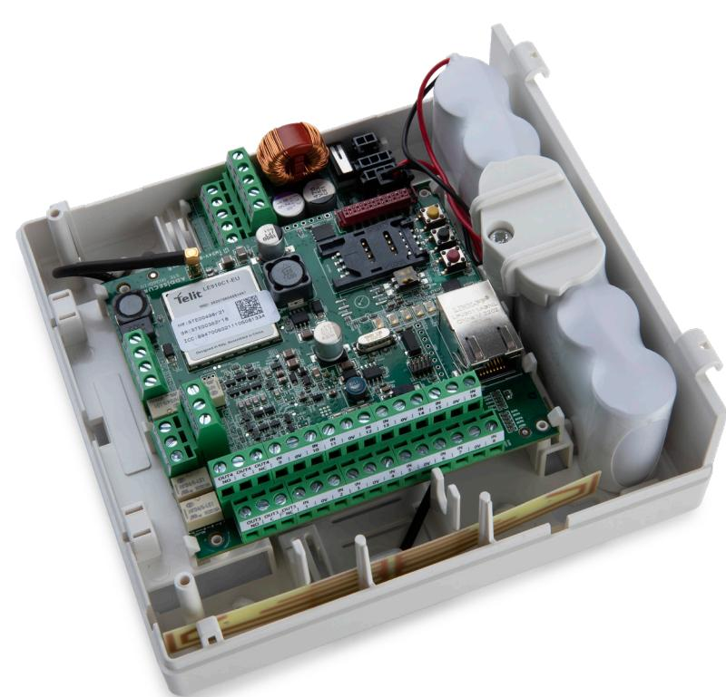

# **AddSecure Airborne DC Dual**

En larmsändare med två kommunikationsvägar och många gränssnitt för inkopplingar. För montering i centralapparat eller egen kapsling.

Airborne DC Dual är en larmsändare för dig med krav på eller behov av larmkommunikation via två av varandra oberoende larmöverföringsvägar. Den rekommenderas till platser där det ställs extra höga krav på tillgänglighet.

### **Fördelar**

- y Enkel att montera, väldigt hög uppetid, många funktioner.
- y Maximal tillgänglighet och säkerhet.
- y Flexibel Sändarens mjukvara uppdateras vid behov av vår support.
- y Ökad säkerhet och övervakning för digital eller analog larmöverföring.
- y Snabb och enkel installation med automatisk konfigurering.

### **Egenskaper**

- y Kommunikationen kontrolleras kontinuerligt via två av varandra oberoende överföringsvägar .
- y Certifierad Larmklass 1-3/4 enligt SSF114:2.
- y Larm- och driftmeddelanden kan enkelt styras till önskad larmcentral eller kundens egen mobiltelefon, e-post eller AddView.
- y Airborne DC Dual väljer det mobilnät som är tillgängligt och ser till att larmet alltid överförs till valda mottagare.
- y 16 ingångar och fyra reläutgångar.
- y Dialer Capture.
- y Airborne DC Dual stödjer fjärrprogrammering av mer än 80 olika centralapparater.

## **Specifikationer**

| Användningsområden                                                  |                                                                                                                                                                                                                                                                                |
|---------------------------------------------------------------------|--------------------------------------------------------------------------------------------------------------------------------------------------------------------------------------------------------------------------------------------------------------------------------|
|                                                                     | Speciellt anpassad överföring av larm från anläggningar med högre krav. Brand- och inbrottslarm från t.ex. hotell, sjukhus och industri.                                                                                                                                 |
|                                                                     | Airborne DC Dual används också till överföring av temperatur och fuktlarm från t.ex. datarum, kylrum eller pumpstationer. Givare kopplas direkt till sändarens ingångar och presenteras iform av SMS, e-post och/eller i SafeView som en del av tjänsten Response. |
|                                                                     | De fyra reläutgångarna kan dessutom styra dörrlås, sirener, bommar, motorer och liknande.                                                                                                                                                                                   |
| Anslutningar på kretskortet                                         | – Simulerad PSTN (40V) – 16 ingångar – 4 reläutgångar (NO/C/NC) – Seriellt gränssnitt – Strömförsörjning – Antennkontakt – Ethernet                                                                                                                          |
| Strömförsörjning Normal strömförbrukning Max strömförbrukning | 7,2 - 28 VDC matas från centralapparat 145 mA vid 15 VDC, 700 mA i korta intervaller (<1 sek.)                                                                                                                                                                           |
| Miljövariabler Temperaturområde Fukt                          | -10 till + 50 °C 10- 90 % RH                                                                                                                                                                                                                                                |
| Storlek BxHxD                                                    | Airborne DC Dual: 96x105x23 mm Airborne DC Dual E-medium: 170x160x60 mm                                                                                                                                                                                                     |
| Antenn                                                              | Inbyggd antenn (2G/4G) 900 MHz/1800 MHz/2100 MHz                                                                                                                                                                                                                            |
| Tilläggsutrustning                                                  | Kan vid behov kompletteras med antennförlängning, antenn för utomhusbruk, riktantenn mm. Installationsmanual finns att ladda ner på addsecure.se                                                                                                                         |
| Produktnummer & E-nummer                                            | Airborne DC Dual: STC00309 E-nummer : 63 903 49                                                                                                                                                                                                                             |
|                                                                     | Airborne DC Dual E-Medium (med kapsling): STC-00341 E-nummer: 6390538                                                                                                                                                                                                       |

## **Certifiering**

0434-CP R-F0003

EN 54-21:2006 Type 1 EN 50136-1-2:2012 ATS: DP3 EN 50136-2:2013 EN 50131-1:2006/A1:2009 Gr4 EC II UMTS: ATS5 - Ethernet: ATS5 EN 50131-6:2008 EN 50130-4:2011 EN 50130-5:2011 SBF110:8 SSF114:2 Larmklass 3/4