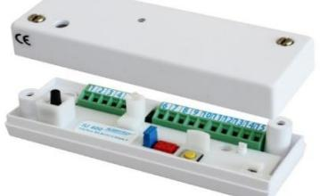
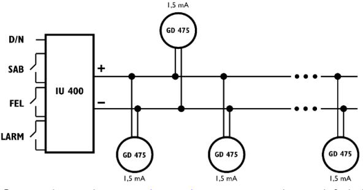

# **Datablad och Installationsmanual IU 400**

#### **ANVÄNDNINGSOMRÅDE**

**IU 400** är en analysator för glaskrossdetektor GD 475 och ansluts till inbrottslarmsanäggningar. Den har tre reläer, ett för larm, ett för fel och ett för öppning av locket eller bortbrytning av enheten. Max 15 st. GD 475 kan anslutas till en IU 400.

**IU 400 tillsammans med en eller flera GD 475 är testad och godkänd enligt SBSC larmklass 3 och EN 50131-2-7-2: 2013, Grad 3, Miljöklass II.**

#### **FUNKTION**

IU 400 mäter strömmen i en balanserad slinga utan ändresistans vilket förenklar inkopplingen av detektorerna. Man behöver inte hålla reda på en slingas slut. Det är detektorerna tillsammans som utgör en balans under kontroll av IU 400:s processor. En ändresistans på 2,2kohm behövs bara om antalet detektorer är 3 eller färre. Vid en ändring av strömmen i slingan på +/- 0,8 mA under minst 200 ms. öppnar larmreläet i IU 400 under 2-3 sek i (AUT mode) alternativt förblir öppet (Latch mode) tills det återställs, beroende på hur den har programmerats.

Slingan i IU 400 arbetar iströmområdet 3 mA till 30 mA motsvarande ca 260 ohm till ca 2600 ohm. Utanför detta område blinker LED och larmreläet och felreläet är öppet och enheten går inte att återställa eller programmeras.

Återställning kan ske på 3 sätt:

- Med tryckknappen på enheten
- Avbrott av matningsspänningen fjärrstyrt från centralapparaten
- Ändring från DAG- till NATT-koppling på plint nr 5 eller nr 15

DAG- och NATT styrning av detektorerna sker genom att ändra spänningen på slingan och bestäms av anslutningsplint 5 eller 15. Vid DAG har slingan 8V och vid NATT har den 6V oavsett matningsspänning till IU 400 (8-30V DC).

IU 400 har två sabotagekontakter, en för öppning av locket och en för bortbrytning av IU 400 från infästningen.

För att säkerställa detektorns funktion övervakar den spänningen på slingan och signalerar FEL om slingspänningen överstiger eller understiger den programmerade spänningen.

#### **ANSLUTNING AV DETEKTORERNA**

GD 475 är oberoende av polariteten på spänningen och dess kabel har endast 2 ledare. Bilden visar hur detektorerna ansluts till den balanserade slingan. Vid 3 eller färre detektorer måste en ändresistans på 2,2 kohm anslutas, vid fler detektorer är den inte nödvändig.

© 2018 Alarmtech – www.alarmtech.se Alarmtech förbehåller sig rätten till ändringar Rev. IU400 1804se

#### **BESKRIVNING AV SKRUVTERMINALERNA**

- 1. 0 VDC
- 2. + 10-30 VDC
- 3. (-) slinga
- 4. (+) slinga
- 5. DAG/NATT/Återställning. DAG= 0V eller öppen.
- 6. Larmrelä NC
- 7. Larmrelä NC
- 8. Reserv
- 9. Felrelä NC.
- 10. Felrelä NC
- 11. Reserv
- 12. Sabotagerelä NC.
- 13. Sabotagerelä NC.
- 14. Reserv
- 15. DAG/NATT/Återställning. DAG = Vin eller öppen.

#### **PROGRAMMERING AV SLINGAN**

Programmering av slingströmmen sker i två steg efter att detektorerna och strömmatning har anslutits:

- 1. Först ställs strömmen in i normalläge
- 2. Därefter programmeras detektorns relä-mode

IU 400 har bara en bygel för programmering av viloström och relä-mode. Viloströmmen beror på antalet anslutna detektorer och på ändresistansen som vi rekommenderar skall vara 2,2 kohm (behövs endast vid 3 eller färre detektorer).

Vid kortvarig ändring av bygel från Öppen->Sluten->Öppen mäter processorn slingströmmen och kommer sedan ihåg den som gällande viloström. Efter det kan larmreläet programmeras som automatiskt återställande med isatt bygel (AUTO) eller utan bygel då det förblir öppet vid/efter larm (LATCH). Efter programmeringen kommer processorn ihåg de programmerade värdena, och om matningsspänningen bryts behövs ingen omprogrammering när spänningen återkommer.

| S1 | Öppen Sluten Öppen | Programmerar den vilström som skall gälla genom att kortvarigt ändra bygel från Öppen till Sluten till Öppen.                                                              |
|----|--------------------------|----------------------------------------------------------------------------------------------------------------------------------------------------------------------------------|
| S1 | Öppen                    | Om S1 förblir Öppen så kommer larmreläet att vara öppet vid larm tills det återställs (LATCH mode).                                                                           |
| S1 | Sluten                   | OM S1 förblir Sluten så kommer larmreläet att öppnas i 2-3 sek och därefter slutas igen (AUTO mode). LED lyser dock tills enheten manuellt eller fjärrstyrt återställs. |

**Anmärkning: Den lilla röda Mikro-Match contakten används bara vid fabriksprogrammering och med Alarmtech IU-LINK program**

#### **MONTERING**

- 1. IU 400 placeras inom skyddat område där detektorerna monterats så att behörig person skall gå dit och återställa enheten och samtidigt inspektera området.
- 2. Anslut alla detektorerna till slingan och avsluta den med en ändresistans på 2,2 kohm (vid 3 eller färre GD 475).
- 3. Gör anslutningarna så som figuren visar.
- 4. Efter spänningssättningen av IU 400, vänta 20-30s. och
- programmera sedan vilströmmen med S1 Öppen->Sluten->Öppen 5. Välj om larmreläet skall automatiskt återställas S1=Sluten eller förbli öppen vid larm S1=Öppen
- 6. Använd GVT 500 eller GVT 5000 för att kontrollera att varje detektor är rätt inkopplad och kan lösa larm.

## **IU 400 RELÄFUNKTION OCH LED INDIKERINGAR**

| Händelse                                  | LED     | Larmrelä | Felrelä | Sabotagerelä |
|-------------------------------------------|---------|----------|---------|--------------|
| Normalläge vid matningsspänning 10-30V    | Släckt  | Sluten   | Sluten  | Sluten       |
| Larm i DAG-läge (DAY)                     | Lyser   | Öppen    | Sluten  | Sluten       |
| Larm i NATT-läge ( NIGHT)                 | Släckt  | Öppen    | Sluten  | Sluten       |
| Låg spänning på slingan i läge DAG <7,5V  | Blinkar | Sluten   | Öppen   | Sluten       |
| Låg spänning på slingan i läge NATT <5,5V |         |          |         |              |
| Sabotage på slingan i läge DAG            | Blinkar | Öppen    | Öppen   | Sluten       |
| Sabotage på slingan i läge NATT           | Släckt  | Öppen    | Öppen   | Sluten       |
| IU fel på egenkontrollen i läge DAG       | Blinkar | Sluten   | Öppen   | Sluten       |
| IU fel på egenkontrollen i läge NATT      | Släckt  | Sluten   | Öppen   | Sluten       |
| GD fel på egenkontrollen i läge DAG       | Blinkar | Sluten   | Öppen   | Sluten       |
| GD fel på egenkontrollen i läge NATT      | Släckt  | Sluten   | Öppen   | Sluten       |

### **TEKNISKA DATA**

| Max. rippel 1 Vpp at 12 V Stabiliseringstid 10 sec Normalt funktionsområde på slingan 2600ohm/ 3mA till 260 ohm/30mA Felindikering vid låg spänning < 7,5V vid DAG, < 5,5V vid NATT Strömförbrukning i vila vid 12V DC in med 2,2k EOLR Typ. 28,6mA+nx1,2mA (n=antal detektorer) Strömförbrukning i larm vid 12V DC in med 2,2k EOLR Typ. 24,5 mA+nx1,2mA (n=antal detektorer) Larmutgång Relä, 23 ohm i serie, max 100mA Spänning på slingan i läge DAG Typ. 8,0 VDC Spänning på slingan i läge NATT Typ. 6,0 VDC Felutgång Relä, 23 ohm i serie, max 100mA Sabotageutgång Relä, 23 ohm i serie, max 100mA Larmslinga 2,2 kΩ, 1% EOLR Ger larm vid strömändring på > +/- 0,8mA Varaktighet för att lösa larm >200 ms Återställningstid >200 ms Miljöklass Class II (EN50130-5:2011) Temperaturområde -10°C to +55°C Fuktighet max. 93% RH Material i lådan ABS vit plast Mått 91x31x23 mm Testad enligt normen EN 50131-1 och EN 50131-2-7-2:2012+A1:2013 Larmklass Larmklass 3 samt EN Grade 3 | Spänningsområde | 10– 30 VDC |  |  |
|-----------------------------------------------------------------------------------------------------------------------------------------------------------------------------------------------------------------------------------------------------------------------------------------------------------------------------------------------------------------------------------------------------------------------------------------------------------------------------------------------------------------------------------------------------------------------------------------------------------------------------------------------------------------------------------------------------------------------------------------------------------------------------------------------------------------------------------------------------------------------------------------------------------------------------------------------------------------------------------------------------------------------------------------------------------------------------------------------------------------------------------|-----------------|------------|--|--|
|                                                                                                                                                                                                                                                                                                                                                                                                                                                                                                                                                                                                                                                                                                                                                                                                                                                                                                                                                                                                                                                                                                                                   |                 |            |  |  |
|                                                                                                                                                                                                                                                                                                                                                                                                                                                                                                                                                                                                                                                                                                                                                                                                                                                                                                                                                                                                                                                                                                                                   |                 |            |  |  |
|                                                                                                                                                                                                                                                                                                                                                                                                                                                                                                                                                                                                                                                                                                                                                                                                                                                                                                                                                                                                                                                                                                                                   |                 |            |  |  |
|                                                                                                                                                                                                                                                                                                                                                                                                                                                                                                                                                                                                                                                                                                                                                                                                                                                                                                                                                                                                                                                                                                                                   |                 |            |  |  |
|                                                                                                                                                                                                                                                                                                                                                                                                                                                                                                                                                                                                                                                                                                                                                                                                                                                                                                                                                                                                                                                                                                                                   |                 |            |  |  |
|                                                                                                                                                                                                                                                                                                                                                                                                                                                                                                                                                                                                                                                                                                                                                                                                                                                                                                                                                                                                                                                                                                                                   |                 |            |  |  |
|                                                                                                                                                                                                                                                                                                                                                                                                                                                                                                                                                                                                                                                                                                                                                                                                                                                                                                                                                                                                                                                                                                                                   |                 |            |  |  |
|                                                                                                                                                                                                                                                                                                                                                                                                                                                                                                                                                                                                                                                                                                                                                                                                                                                                                                                                                                                                                                                                                                                                   |                 |            |  |  |
|                                                                                                                                                                                                                                                                                                                                                                                                                                                                                                                                                                                                                                                                                                                                                                                                                                                                                                                                                                                                                                                                                                                                   |                 |            |  |  |
|                                                                                                                                                                                                                                                                                                                                                                                                                                                                                                                                                                                                                                                                                                                                                                                                                                                                                                                                                                                                                                                                                                                                   |                 |            |  |  |
|                                                                                                                                                                                                                                                                                                                                                                                                                                                                                                                                                                                                                                                                                                                                                                                                                                                                                                                                                                                                                                                                                                                                   |                 |            |  |  |
|                                                                                                                                                                                                                                                                                                                                                                                                                                                                                                                                                                                                                                                                                                                                                                                                                                                                                                                                                                                                                                                                                                                                   |                 |            |  |  |
|                                                                                                                                                                                                                                                                                                                                                                                                                                                                                                                                                                                                                                                                                                                                                                                                                                                                                                                                                                                                                                                                                                                                   |                 |            |  |  |
|                                                                                                                                                                                                                                                                                                                                                                                                                                                                                                                                                                                                                                                                                                                                                                                                                                                                                                                                                                                                                                                                                                                                   |                 |            |  |  |
|                                                                                                                                                                                                                                                                                                                                                                                                                                                                                                                                                                                                                                                                                                                                                                                                                                                                                                                                                                                                                                                                                                                                   |                 |            |  |  |
|                                                                                                                                                                                                                                                                                                                                                                                                                                                                                                                                                                                                                                                                                                                                                                                                                                                                                                                                                                                                                                                                                                                                   |                 |            |  |  |
|                                                                                                                                                                                                                                                                                                                                                                                                                                                                                                                                                                                                                                                                                                                                                                                                                                                                                                                                                                                                                                                                                                                                   |                 |            |  |  |
|                                                                                                                                                                                                                                                                                                                                                                                                                                                                                                                                                                                                                                                                                                                                                                                                                                                                                                                                                                                                                                                                                                                                   |                 |            |  |  |
|                                                                                                                                                                                                                                                                                                                                                                                                                                                                                                                                                                                                                                                                                                                                                                                                                                                                                                                                                                                                                                                                                                                                   |                 |            |  |  |
|                                                                                                                                                                                                                                                                                                                                                                                                                                                                                                                                                                                                                                                                                                                                                                                                                                                                                                                                                                                                                                                                                                                                   |                 |            |  |  |
|                                                                                                                                                                                                                                                                                                                                                                                                                                                                                                                                                                                                                                                                                                                                                                                                                                                                                                                                                                                                                                                                                                                                   |                 |            |  |  |
|                                                                                                                                                                                                                                                                                                                                                                                                                                                                                                                                                                                                                                                                                                                                                                                                                                                                                                                                                                                                                                                                                                                                   |                 |            |  |  |
|                                                                                                                                                                                                                                                                                                                                                                                                                                                                                                                                                                                                                                                                                                                                                                                                                                                                                                                                                                                                                                                                                                                                   |                 |            |  |  |
| Certifierad SBSC, EN                                                                                                                                                                                                                                                                                                                                                                                                                                                                                                                                                                                                                                                                                                                                                                                                                                                                                                                                                                                                                                                                                                           |                 |            |  |  |

#### **NÅGRA TYPISKA DRIFTSFÖRHÅLLANDEN FÖR IU 400 ANSLUTEN TILL ETT ANTAL GD 475**

#### **1.Normaltillstånd i läge DAG, larmreläet programmerad till kvarhållande (LATCH):**

- GD ger larm => IU larmrelä öppnar och förblir öppet. IU LED och GD LED lyser till de blir återställda.
- Återställning kan ske på tre sätt:
- 1. Med tryckknappen på IU 400
- 2. Omkoppling från DAG till NATT
- 3. Bryta spänningen till IU 400
- **2.Normaltillstånd i läge NATT, larmreläet programmerad till kvarhållande (LATCH):**
- GD ger larm => IU larmrelä öppnar och förblir öppet. IU och GD LED är båda släckta.
- Återställning kan först ske när IU är programmerad till DAG.
- I dagläge lyser då GD och IU LED.
- Återställning kan nu göras på tre sätt. Se punkt 1.
- **3.Normaltillstånd i läge DAG, larmreläet programmerad till automatisk återställning (AUTO):**
- GD ger larm => IU Larmrelä i IU öppnar under 2-3 sek. LED på IU och GD lyser tills de blir återställda.
- Automatisk återställning gäller endast för larmreläet.
- Ett nytt larm gör att larmreläet återigen öppnar under 2-3 sek.
- Återställning av LED på GD och IU kan nu göras på tre sätt. Se punkt 1. **4.Normaltillstånd i läge NATT, larmreläet programmerad till automatisk återställning (AUTO):**
- GD ger larm => Larmreläet på IU öppnar under 2-3 sek. LED på IU och GD lyser inte.
- Automatisk återställning sker endast för larmreläet.
- Ett nytt larm gör att larmreläet öppnar under 2-3 sek.
- Återställning kan inte göras I läge NATT
- Vid omkoppling till DAG lyser larmande GD och IU.
- Återställning kan nu göras på tre sätt. Se punkt 1.
- **5. FEL-indikering på IU programmerad för DAG och reläet för kvarhållande.**
- Vid FEL på slingan öppnar både larmreläet och felreläet och är öppet tills enheten återställs. LED blinker på IU. Det gäller om:
	- 1. Slingströmmen är <3mA eller > 30mA eller
	- 2. Spänningen är < 7,5V vid DAG eller <5,5V vid NATT
- Återställning av IU kan endast ske om felet har reparerats och då på 3

sätt enligt punkt 1.

**6.FEL-indikering på IU programmerad för NATT och reläet för kvarhållande.** 

- Larmrelä och Felrelä förblir öppet tills felet reparerats.
- Ingen LED-indikering på IU.
- Återställning av IU kan endast ske I läge DAG efter att felet reparerats.
- Vid FEL är funktionen DAG=>NATT bortkopplad. Återställning kan endast ske när felet reparerats.
- Vid ändring till DAG lyser LED blinkande.

**7.FEL-indikering på IU programmerad för DAG och reläet till automatisk återställning:**

- Larmrelä och Felrelä förblir öppet tills felet reparerats.
- Återställning av IU kan endast ske i läge DAG, och då med knappen på IU eller genom att spänningen bryts efter att felet reparerats.
- Vid FEL är funktionen DAG=>NATT bortkopplad. Återställning kan endast ske när felet reparerats.
- **8.FEL-indikering på IU programmerad för NATT och reläet till automatisk återställning:**
- Larmrelä och Felrelä är öppet och förblir så.
- Ingen indikering av LED på IU.
- Återställning av IU kan endast ske i läge DAG, och då med knappen på IU eller genom att bryta spänningen när felet har reparerats.
- Vid FEL är funktionen DAG => NATT bortkopplad.
- Vid ändring till DAG blinker LED på IU.
- **9.Programmering av slingströmmen.**
- När alla detektorer har monterats rätt och ingen felindikering finns på på IU (vänta 30s efter strömsättning) skall slingströmmen programmeras.
- Det sker genom att bygel S1 ändras från Öppen=>Sluten=>Öppen under en kort tid. (0,5sek).
- Efter programmering av slingströmmen kan programmering av reläerna ske:
	- 1. Bygeln isatt = Automatisk återställning av larmrelä (AUTO).
	- 2. Bygeln öppen = Larmreläet kvarhållande (LATCH).