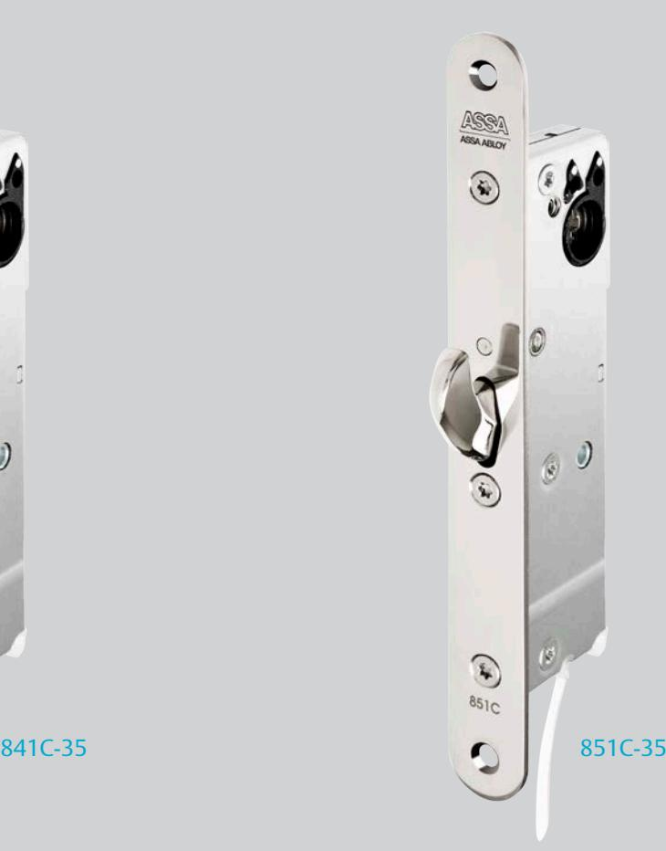
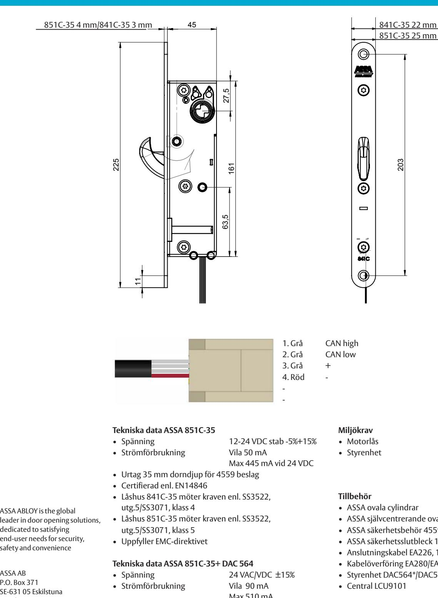

# ASSA motorlås – smalprofil 841C-35, 851C-35

### **Användningsområde**

ASSA motorlås 851C-35 är anpassat för dörrar med ASSA smalprofilurtag.

Det passar bra som natt- och säkerhetslåsning i dörrar med höga säkerhetskrav inom handel, kontor och industri. Daglåsta eller högfrekventa dörrar bör kompletteras med ett daglås t. ex. elslutbleck ASSA 585.

### **Funktion**

Hakregeln drivs av den inbyggda motorn. ASSA motorlås 851C-35 kan användas i dörrar med dörrautomatik. ASSA 851C-35 är en Hi-O-enhet som ansluts till en DAC564 eller till en DAC530.

Hi-O innebär att enheterna har en inbyggd mikrodator och kommunicerar med varandra för plug-and-playinstallation, synkronisering av dörrdrift, övervakning av beteenden och för att skicka diagnostisk information.

### **Egenskaper**

- Öppningshastighet ca 0,2 sekunder
- Ny hakregel och tryckesfall för ökad styrka och listtryck
- LED och brytare för initiering/status mot DAC
- Låset kan alltid öppnas med nyckel/vred
- Dorndjup 35 mm
- Inbyggd dold dörrlägesgivare (magnet i slutbleck)
- Kan kombineras med andra Hi-O-enheter utan styrenhet, t. ex. daglås, dörrautomatik, kortläsare Styrenheten DAC564:
- Fungerar som gränssnitt mot omvärlden, mot system utan Hi-O-buss, t. ex. passer- eller larmsystem
- Kommunicerar med motorlåset via Hi-O-buss
- Kräver styrsignaler från överordnat system för att manövrera motorlåset
- Ger indikeringar till överordnat system som talar om låsets och dörrens status
- Möjliggör komplettering med extern dörrlägesgivare (magnetkontakt)
- Styr även kompletterande daglås så att en komplett dag/ natt kombination bildas
- Aktiverar larmutgång vid funktionsstörning
- Ansluts till spänningsmatning
- Ska installeras inomhus på den skyddade sidan av dörren inom 10 m från motorlåset
- Om DAC564/DAC530 integreras med ARX passersystem skapas en totalintegrerad lösning med stor flexibilitet

# ASSA motorlås – smalprofil 841C-35, 851C-35

## Elektromekanisk låsning

ASSA ABLOY, the global leader in door opening solutions

#### **Tekniska data ASSA 851C-35+ DAC 564** 2014-04-03 LaJe 1:5 (A4)

• Dörrspringa Max 6 mm

- Spänning 24 VAC/VDC ±15% • Strömförbrukning Vila 90 mA Max 510 mA • Reläer i DAC564 Enpoligt växlande Max 50 VDC vid 1 A • Anslutningskabel EA226 10 m, avstånd mellan Hi-O-komponenter max 10 m ASSA AB Part/assy:D000102802-001 SHEET 1 OF 1 Electromechanical lock Deadlock, Subassembly 841C -35 FrPä
- 
- 
- Motorlås Temp 20 °C + 70 °C • Styrenhet Temp + 5 °C – + 40 °C, 20 – 90 % relativ luftfuktighet, icke kondenserande

V1_2011-12-15

V1_2011-12-13

- ASSA ovala cylindrar
203

851C-35 25 mm

- ASSA självcentrerande oval vredcylinder
- ASSA säkerhetsbehör 4559
- ASSA säkerhetsslutbleck 1487-8 med integrerad magnet* ISO 2768-mH
- Anslutningskabel EA226, 10 m* Volume: Weight: Surface area: created: designed by: changed by: Scale: Projection:
	- Kabelöverföring EA280/EA281*
	- Styrenhet DAC564*/DAC530 Alternate ID
	- Central LCU9101 Document ID Rev.:
	- * ingår i satsförpackning Configuration:Default **D000102802-001 1**

# M3299.1404

## www.assa.se

ASSA AB P.O. Box 371 SE-631 05 Eskilstuna

Sweden

Phone +46 (0)16 17 70 00 Fax +46 (0)16 17 70 49 Customer support: phone intl. +46 (0)16 17 71 00 Phone nat. 0771-640 640 Fax +46 (0)16 17 73 72 e-mail: helpdesk@assa.se

dedicated to satisfying

safety and convenience

-