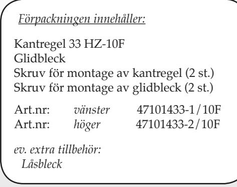
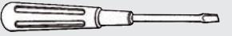
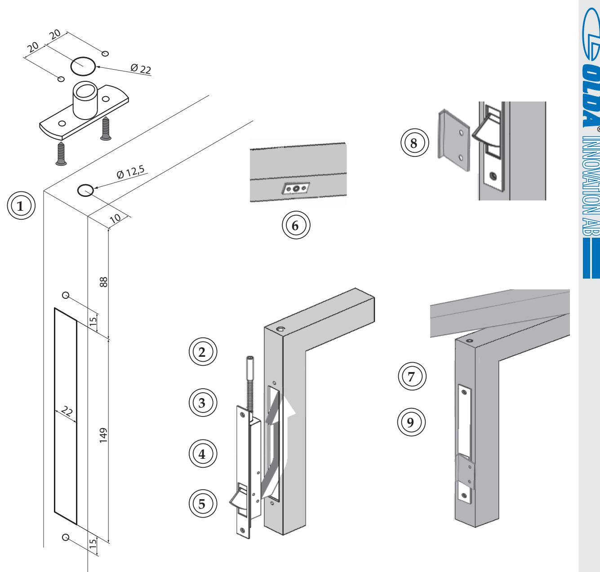
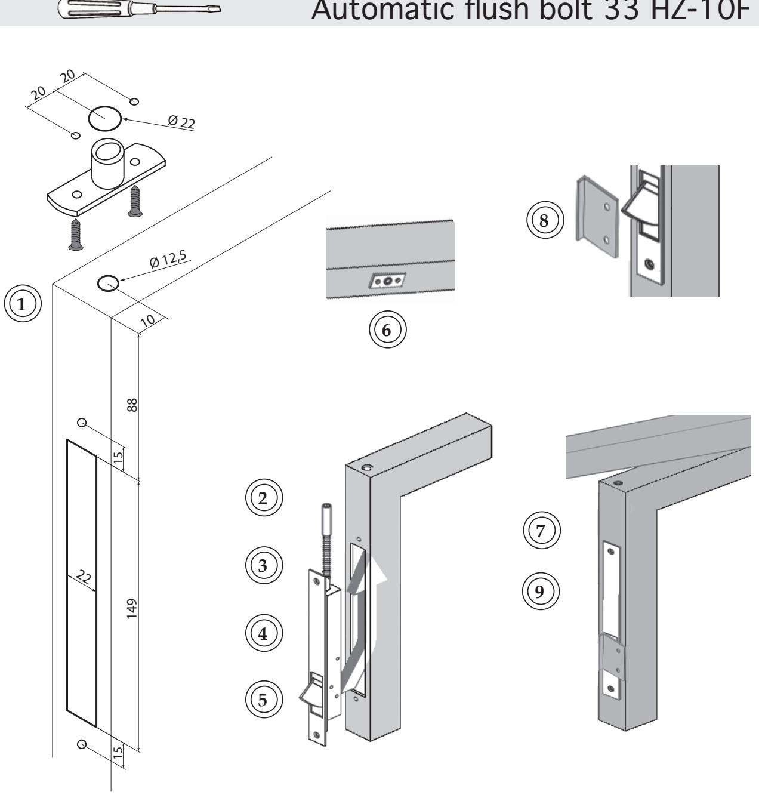

## *®* INNOVATION AB

## *Monteringsanvisning 33 HZ-10F*

- **1. Gör urtag upptill och/eller nertill i passivt dörrblad för kantregel samt borra för regel Ø12,5.**
- **2. För in kantregel i urtag och markera för infästning (2x).**
- **3. Tag ur kantregel och förborra för montage enligt gjord markering.**
- **4. Vid behov, justera regelns höjd.**
- **5. Montera kantregel. Dra skruvar.**
- *6. Märk ut placering för ev. låsbleck samt dess skruvhål i karm/tröskel (2x). Borra Ø22 mm. för låsbleck samt förborra för infästning (2x). Montera låsbleck. Dra skruvar.*
- **7. Kontrollera kantregelns funktion** *i samverkan med låsbleck.*
- **8. Märk ut placering för glidbleck på aktivt dörrblad mitt för kantregelns fallkolv samt förborra för infästning (2x). Montera glidbleck. Dra skruvar.**
- **9. Kontrollera systemets funktion.**

## Automatisk kantregel 33 HZ-10F

*®*

OLDA Innovation AB, Vagnmakaregatan 14, 415 07 Göteborg tel: 031-26 68 92 fax: 031-26 68 67 e-post: info@olda.com webb: www.olda.com

## *®* INNOVATION AB

*Mounting instructions 33 HZ-10F :*

- **1. Make the cut-out at the top and/or the bottom in the passive door leaf for the flush bolt and drill for bolt Ø12,5.**
- **2. Insert the flush bolt in the cut-out and mark the attachment points (2x).**
- **3. Remove the flush bolt and pre-drill for mounting according to the marks.**
- **4. When necessary adjust the height of the bolt.**
- **5. Mount the flush bolt. Tighten the screws.**
- *6. Mark the placement of the lock tube and its screw-holes in frame/sill (2x). Drill for lock tube Ø22 mm. and pre-drill for mounting (2x). Mount the lock tube. Tighten the screws.*
- **7. Check the function of the flush bolt** *together with the lock tube.*
- **8. Mark the placement of the strike plate on the active door leaf, in level with the latch of the flush bolt and pre-drill for screws (2x). Mount the strike plate. Tighten the screws.**
- **9. Check the function of the system.**

| Package contains:                    |                                                                                            |
|--------------------------------------|--------------------------------------------------------------------------------------------|
| Flush bolt 33 HZ-10F Strike plate | Screws for mounting of flush bolt (2 pcs.) Screws for mounting of strike plate (2 pcs.) |
| Art.No: left Art.No: right  | 47101433-1/10F 47101433-2/10F                                                           |
| additional accessory: Lock tube   |                                                                                            |

*®*

INNOVATION AB

OLDA Innovation AB, Vagnmakaregatan 14, SE-415 07 Göteborg, Sweden tel: +46 (0)31-26 68 92 fax: +46 (0)31-26 68 67 e-mail: info@olda.com web: www.olda.com